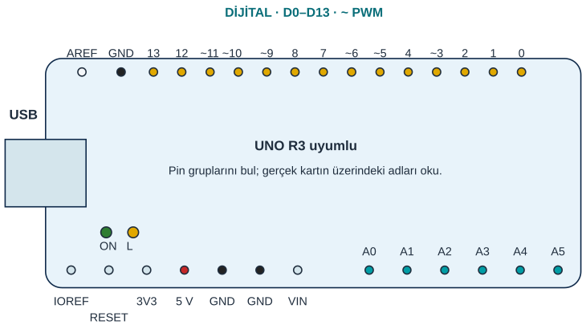
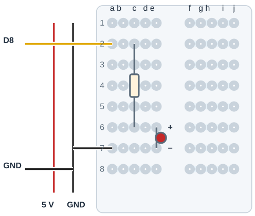

## Malzemeyi projeyle eşleştir

| Set parçası | Kullandığın projeler |
|---|---|
| UNO kartı | Tüm çalışmalar |
| USB veri kablosu | Tüm çalışmalar |
| breadboard | Tüm çalışmalar |
| Erkek-erkek jumper | Tüm çalışmalar |
| Kırmızı, yeşil ve sarı LED | [1](proje:1), [4](proje:4), [5](proje:5), [7](proje:7), [13](proje:13), [14](proje:14), [15](proje:15), [16](proje:16), [17](proje:17), [18](proje:18), [19](proje:19), [21](proje:21) |
| RGB LED | [6](proje:6) |
| Direnç seti | [1](proje:1), [4](proje:4), [5](proje:5), [6](proje:6), [7](proje:7), [12](proje:12), [13](proje:13), [14](proje:14), [15](proje:15), [16](proje:16), [17](proje:17), [18](proje:18), [19](proje:19), [20](proje:20), [21](proje:21), [23](proje:23) |
| buton | [4](proje:4), [12](proje:12), [21](proje:21) |
| 10 kΩ potansiyometre | [5](proje:5), [11](proje:11) |
| aktif buzzer | [2](proje:2), [14](proje:14), [15](proje:15), [18](proje:18) |
| pasif buzzer | [2](proje:2), [3](proje:3), [24](proje:24) |
| LDR | [7](proje:7) |
| termistör | [20](proje:20) |
| LM35 | [8](proje:8), [20](proje:20) |
| DHT11 | [19](proje:19) |
| eğim anahtarı | [14](proje:14) |
| Tek haneli 7 segment | [23](proje:23) |
| su seviye sensörü | [18](proje:18) |
| ses sensörü | [17](proje:17) |
| toprak nem sensörü | [16](proje:16) |
| IR engel sensörü | [13](proje:13) |
| SG90 servo | [10](proje:10), [11](proje:11), [22](proje:22) |
| HC-SR04 | [9](proje:9), [22](proje:22), [23](proje:23), [24](proje:24) |
| HC-SR501 PIR | [15](proje:15) |

- Erkek başlıklı modül breadboard’a takılır. Erkek-erkek jumper, UNO ile modülün ayrı satır grubunu birleştirir.
- SG90’ın dişi konnektörü breadboard deliği değildir. Jumper, kitapta belirtilen UNO pini ile uygun dişi yuvayı doğrudan birleştirir.
- RGB LED, DHT11, 7 segment ve sensörlerin pinleri modele bağlıdır. Görünüş, pin sırasını veya ortak uç türünü kanıtlamaz.

:::bilgi[Dirençlerini kontrol et]{renk=mavi}
Sette en az 7 × 220 Ω ve 2 × 10 kΩ direnç bulunmalı. Değeri aşağıdaki renk bandı tablosuyla oku; emin değilsen iki direnci yan yana karşılaştır.
:::

:::bilgi[Sınıf araçları]{renk=yesil}
Cetvel, referans termometre, küçük düz tornavida, bardak ve su, saksı ve toprak, karton ve çubuk, yapışkan etiket. Bunlar elektronik set parçalarının yerine geçmez.
:::

### Benzer parçaları ayır

| Karışabilen parçalar | Nasıl ayırırsın? |
|---|---|
| Aktif ve pasif buzzer | Aktif buzzer’ın altı çoğunlukla kapalıdır; pasifte devre kartı görünür. Kesin karar için [Proje 2](proje:2)’deki testi yap. |
| LM35 ve transistör | İkisi de üç bacaklı yarım ay gövdedir. Düz yüzdeki yazıyı oku; LM35 yazmıyorsa kullanma. |
| LDR ve NTC | LDR’nin yüzünde kıvrımlı bir iz vardır. NTC küçük, damla biçimli bir gövdedir. |
| IR engel ve PIR modülü | IR modülünde yan yana iki küçük göz vardır. PIR modülünde beyaz, yarım küre bir kapak vardır. |

### Direnç renk bandı tablosu

| Renk | Rakam | Çarpan | Renk | Rakam | Çarpan |
|---|---|---|---|---|---|
| Siyah | 0 | × 1 | Mavi | 6 | × 1 000 000 |
| Kahverengi | 1 | × 10 | Mor | 7 | — |
| Kırmızı | 2 | × 100 | Gri | 8 | — |
| Turuncu | 3 | × 1 000 | Beyaz | 9 | — |
| Sarı | 4 | × 10 000 | Altın | — | tolerans ±%5 |
| Yeşil | 5 | × 100 000 | Gümüş | — | tolerans ±%10 |

_Örnek: kırmızı-kırmızı-kahverengi = 22 × 10 = 220 Ω; kahverengi-siyah-turuncu = 10 × 1 000 = 10 kΩ._

## UNO kartını tanı

**D0–D13:** Dijital giriş ve çıkış pinleridir. D0/D1 haberleşmede kullanılır; kitap devrelerinin sinyal yolları ayrı pinlerde tutulur.

**PWM pinleri:** D3, D5, D6, D9, D10 ve D11 üzerinde ~ işareti vardır. PWM görev döngüsünü değiştirir; gerçek analog gerilim üretmez.

**A0–A5:** Analog girişlerdir. Kitapta ilk analog sensör A0’a, ikinci analog sensör A1’e gider.

**5 V ve üç GND:** UNO’da bir 5 V ve üç GND ucu vardır. Çoklu bağlantı breadboard rayından dağıtılır; aynı UNO pinine birkaç jumper sıkıştırılmaz.

**USB, ON ve L:** USB veri ve güç bağlantısıdır. ON güç göstergesidir; L, D13 ile ilişkilidir. Kart göstergesi dış LED bağlantısını kanıtlamaz.

### Sinyal pinleri hangi projede?

| Pin | Projeler |
|---|---|
| A0 | [5](proje:5), [7](proje:7), [8](proje:8), [11](proje:11), [16](proje:16), [17](proje:17), [18](proje:18), [20](proje:20) |
| A1 | [20](proje:20) |
| D2 | [4](proje:4), [12](proje:12), [13](proje:13), [14](proje:14), [15](proje:15), [19](proje:19), [21](proje:21), [23](proje:23) |
| D3 | [22](proje:22), [23](proje:23) |
| D4 | [23](proje:23) |
| D5 | [23](proje:23) |
| D6 | [23](proje:23) |
| D7 | [23](proje:23) |
| D8 | [1](proje:1), [2](proje:2), [3](proje:3), [4](proje:4), [14](proje:14), [15](proje:15), [18](proje:18), [21](proje:21), [23](proje:23), [24](proje:24) |
| D9 | [5](proje:5), [6](proje:6), [7](proje:7), [9](proje:9), [10](proje:10), [11](proje:11), [13](proje:13), [14](proje:14), [15](proje:15), [16](proje:16), [17](proje:17), [18](proje:18), [19](proje:19), [21](proje:21), [22](proje:22), [23](proje:23), [24](proje:24) |
| D10 | [6](proje:6), [9](proje:9), [16](proje:16), [18](proje:18), [21](proje:21), [22](proje:22), [23](proje:23), [24](proje:24) |
| D11 | [6](proje:6), [18](proje:18), [21](proje:21) |
| D12 | [21](proje:21) |

## Breadboard gruplarını tanı

- **Aynı grup:** c6 ve e6 ayrı delik, aynı ağ.
- **Ayrı satır:** e6 ve e7 iki ayrı ağ.
- **Seri direnç:** 220 Ω: c2–c6
- **LED yönü:** Anot e6 / katot e7
- **Orta kanal:** a–e ile f–j ayrıdır.
- **GND rayı:** Tek UNO GND dağıtılır.

**Beşli gruplar:** Her satırın a–e delikleri birbiriyle bağlıdır. Aynı satırın f–j delikleri ayrı bir gruptur; satırlar birbirine bağlanmaz.

**Orta kanal:** Kanal sol ve sağ grubu ayırır. Bu kitabın çizimlerinde yalnız buton ve uygun 7 segment paketi kanalı aşar.

**Raylar:** Güç rayının sürekliliğini gerçek tahtanda doğrula; bazı raylar ortadan kesiktir. 5 V rayı ile GND rayı birbirine bağlanmaz.

**Modülü tak:** Erkek başlıklı modül, kitapta gösterilen ayrı satır gruplarına takılır. Gerçek uç sırası doğrulanır; farklı uçlar aynı beşli gruba yanlışlıkla girmez.

**Bir delik, bir uç:** Direnç ucu, LED bacağı ve jumper ayrı deliklere girer. Aynı gruptaki ayrı delikler elektriksel olarak birleşir.

### Standart LED yolu

1. USB’yi çıkar. D8 jumper’ını a2’ye tak.
2. 220 Ω direnci c2 ile c6 arasına tak.
3. LED’in uzun bacağını (anot) e6’ya, kısa bacağını (katot) e7’ye tak.
4. a7’den GND rayına jumper tak; UNO GND’yi aynı raya bağla. Kontrolden sonra USB’yi tak.
