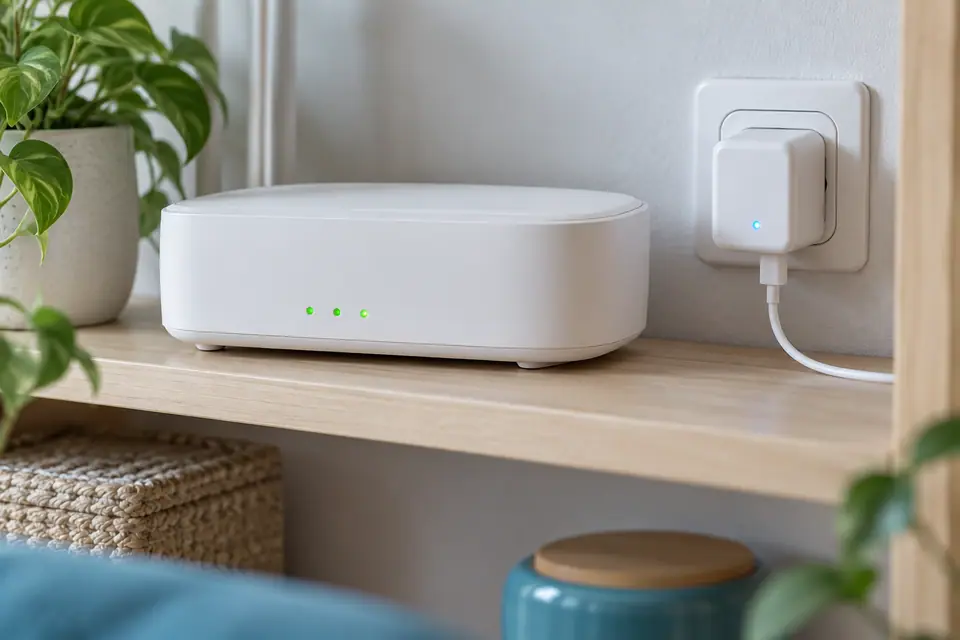
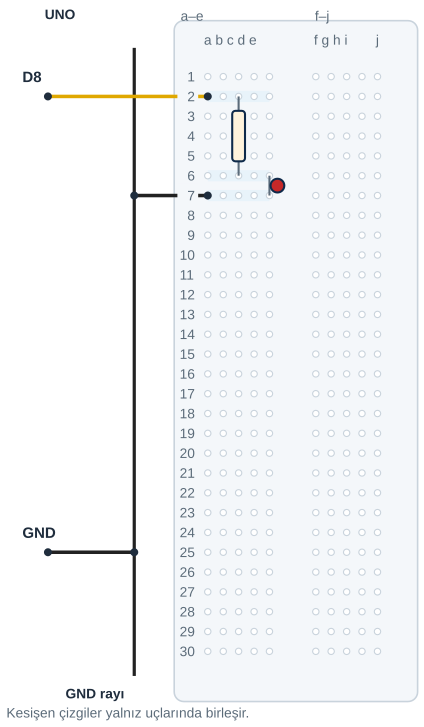

## Tanı • Tahmin et

### Günlük teknolojide

Modemin küçük ışıkları cihazın durumunu gösterir. Şarj cihazındaki ışık da sana bilgi verir. Bu ışıklara durum göstergesi denir. Sen de bir LED’i programla yöneteceksin.



### Sistemin yolu

**Girdi:** Yazdığın program → **İşlem:** Arduino komutu uygular → **Çıktı:** LED’in durumu değişir

:::bilgi[Önce düşün]{renk=sari}
Aynı LED ile iki farklı cihaz durumunu nasıl ayırt edebilirsin? İki ışık düzeni öner.
:::

::yaz[Tahminim]{satir=2}

### Parçayı tanı

- LED, elektrikle ışık veren küçük bir parçadır. İki bacağının yönünü ayırt et.
- Anot, LED’in artı yönündeki bacağıdır. Kesilmemiş bacaklarda genellikle daha uzundur.
- Katot, dönüş yönündeki bacaktır. Kısa bacak ve gövdedeki düz kenar katot için ipucudur.
- Direnç, akımı sınırlar. Direncin iki yönü de kullanılabilir.
- Breadboard, parçaları lehimsiz bağlar. Aynı satırdaki a–e delikleri kendi içinde bağlıdır; f–j de ayrı bir gruptur.

:::bilgi[Parçanı doğrula · direnç ve LED]{renk=gri}
220 Ω direnci renk bandı tablosuyla oku: kırmızı-kırmızı-kahverengi. LED’in uzun bacağını ve gövdedeki düz kenarı bul; düz kenar katot tarafıdır (*Parçanı doğrula* sayfası).

::yaz[bantlar … · anot … · katot …]{satir=1}
:::

## Pinleri eşleştir, devreyi kur

İlk yükleme için karttaki L ışığıyla Blink’i dene. Dış LED’in bu projedeki bağlantısı D8’dir.

| UNO pini | Bağlantı yolu |
|---|---|
| **D8** | 220 Ω → LED anot (+) |
| **GND** | GND rayı → LED katot (−) |

_Kırmızı: 5 V / güç · Siyah: GND · Sarı: dijital · Turkuaz: analog_

_Renk değil pin adı belirleyicidir. GND rayı, ortak referansı tek UNO bağlantısından dağıtır._

### Adım adım kur

1. USB kablosunu çıkar.
2. 220 Ω direncin uçlarını c2 ve c6 deliklerine tak.
3. LED’in anot bacağını e6, katot bacağını e7 deliğine tak.
4. Sinyal jumper’ını UNO D8 ile a2 arasına bağla.
5. a7 deliğini GND rayına bağla. UNO GND’den aynı raya bir jumper tak.
6. Pinleri, LED yönünü ve delikleri kontrol et; sonra USB’yi tak.

:::dikkat{renk=kirmizi}
LED’i dirençsiz bağlama. Aynı deliğe iki uç sokma. Bağlantıyı değiştirmeden önce USB kablosunu çıkar.
:::

### Kendi deliklerin

Kurduktan sonra her ucun gerçekte hangi deliğe girdiğini yaz ve çizimle karşılaştır. Farklı bir delik kullandıysan aynı beşli grupta mı, kontrol et.

| Uç | Çizimdeki delik | Benim deliğim |
|---|---|---|
| Direnç ucu 1 | c2 |   |
| Direnç ucu 2 | c6 |   |
| LED anot (uzun bacak) | e6 |   |
| LED katot | e7 |   |
| D8 jumper’ı | a2 |   |
| GND jumper’ı | a7 → GND rayı |   |

:::bilgi[Akımı hesapla]{renk=mavi}
Kırmızı LED’de yaklaşık 2 V düşerse:

I = (5 V − 2 V) / 220 Ω ≈ 14 mA.

Bu bir tahmindir; LED modeli sonucu değiştirir. Bu kitapta UNO pini için 20 mA üst sınır kabul edilir; daha düşük akım tercih edilir.
:::

## Her ucu ayrı deliğe yerleştir



- **Sinyal:** D8 → a2
- **Direnç:** 220 Ω: c2 → c6
- **LED:** Anot e6 / katot e7
- **Dönüş:** a7 → GND rayı
- **Ortak referans:** UNO GND → GND rayı
- **Orta kanal:** Sol ve sağ grup ayrıdır.

**Sen çiz (defterine):** D8, direnç, LED ve GND yolunu kendi yerleşiminle çiz; delik adlarını yaz.

Direnç c6 ile LED anot e6 ayrı deliklerde, aynı beşli gruptadır. LED katodu e7, bir sonraki satırdadır. Orta kanalı hiçbir parça aşmaz.

Rayın kesintisiz olduğunu kontrol et. Tahtan farklıysa çizimdeki grupları kendi tahtanla karşılaştır.

## Işığın ritmini programla

```cpp title="TAM PROGRAM • D8 LED çıkışı" start=1 dosya=p01_ilk_led_im
const byte ledPini = 8;
const unsigned int yanmaMs = 1000;
const unsigned int sonmeMs = 1000;

void setup() {
  pinMode(ledPini, OUTPUT);
}

void loop() {
  digitalWrite(ledPini, HIGH);
  delay(yanmaMs);
  digitalWrite(ledPini, LOW);
  delay(sonmeMs);
}
```

Arduino Uno ve portu seç. Doğrula düğmesi kodu derler; Yükle düğmesi programı karta gönderir. 1000 ms, 1 saniyedir.

### Kodun mantığı

1. ledPini = 8, dış LED’in D8 bağlantısını adlandırır.
2. yanmaMs ve sonmeMs, iki bekleme süresini milisaniye ile tutar.
3. setup() bir kez çalışır. pinMode, ledPini çıkışını hazırlar.
4. loop() içinde HIGH, LED’i yakar. delay(yanmaMs), bu durumu bekletir.
5. LOW, LED’i söndürür. delay(sonmeMs), sonraki turdan önce bekler.

### Hata avcısı

| Belirti | Olası neden | Ne yap? |
|---|---|---|
| LED hiç yanmıyor | LED ters takılmış olabilir | USB’yi çıkar; anot ve katodu çizimle karşılaştır. |
| Karttaki L yanıyor; dış LED sönük | Kod başka pini kullanıyor olabilir | ledPini değerini ve D8 jumper’ını karşılaştır. |
| Dokununca ışık değişiyor | Bir jumper gevşek olabilir | USB’yi çıkar; uçları ayrı deliklere sağlamca tak. |

### Programı izle

Program başladıktan sonraki her bir saniyede LED’in ne yaptığını tahmin et. Sonra gözlemini yaz.

| Zaman | Tahminim (yanık / sönük) | Gözlemim |
|---|---|---|
| 0–1000 ms |   |   |
| 1000–2000 ms |   |   |
| 2000–3000 ms |   |   |
| 3000–4000 ms |   |   |

## Deneyini ölç, fikrini geliştir

Önce tahminini yaz. Sonra ışığı gözle; ölçümünü Gözlemim sütununa kaydet.

| Deneme | Tahminim | Gözlemim |
|---|---|---|
| LED ilk yandığında kronometreyi başlat: 10 saniyede kaç yeni yanma başladı? |   |   |
| Yalnız yanmaMs = 200: ışığı ve süreyi gözle. |   |   |
| yanmaMs = 1000 değerine dön; aynı ölçümü tekrarla. |   |   |

:::bilgi[Bir değişiklik yap]{renk=mavi}
Yalnız yanmaMs değerini 1000’den 200’e değiştir. Devreye dokunma. Önce tahminini yaz; sonra programı yükle; LED ilk yandığında başlayıp 10 saniye say.
:::

::yaz[Tahminim ve gözlemim]{satir=3}

### Kendini kontrol et

**1.** Direncin LED devresindeki görevi nedir?

::yaz[Cevabım]{satir=2}

**2.** LED’in iki bacağı aynı beşli gruptaysa neden çalışmaz?

::yaz[Cevabım]{satir=2}

**3.** D8 kablosunu D13’e taşırsan kodda hangi değeri değiştirmelisin?

::yaz[Cevabım]{satir=2}

**Sen çiz (defterine):** kendi durum ışığının iki durumunu göster.

**Evde devam et:** Evde iki cihazın durum ışıklarını gözle. Hangi bilgiyi verdiklerini bir yetişkinle konuş. Devreyi eve götürmen gerekmez.

**Şimdi sıra sende:** Bir oyun için durum ışığı tasarla. İki duruma ad ver; ışık düzenlerini çiz ve seçimini açıkla.

::yaz[Fikrim]{satir=3}

**Kendimi değerlendiriyorum:** Yardımla yaptım · Biraz yardımla · Tek başıma · Başkasına anlatabilirim

::yaz[Bu projeyi nasıl yaptım? Neden?]{satir=1}

:::bilgi[Biliyor muydun?]{renk=sari}
UNO R3’ün L ışığı D13 ile ilişkilidir. Karttaki bu ışık, bir bağlantı denemesinde sana ipucu verebilir.
:::
