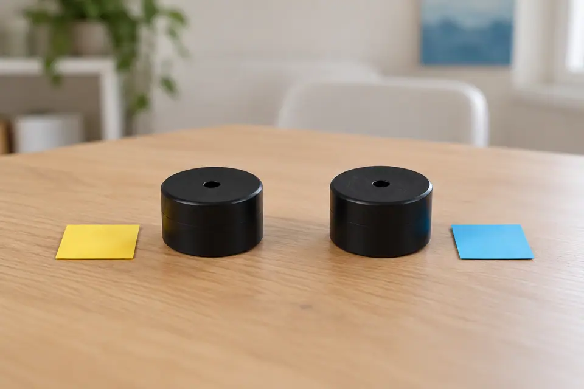
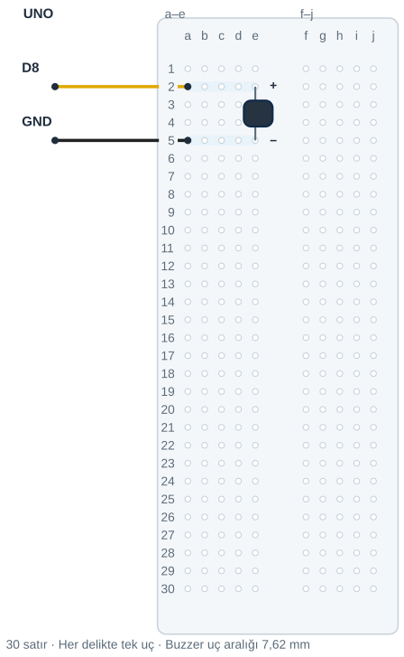

## Tanı • Tahmin et

### Günlük teknolojide

Saat, oyuncak ve mutfak zamanlayıcısı sesle bilgi verir. Kısa bir uyarı dikkatimizi çeker. Sen iki ses parçasını görünüşe bakmadan, aynı koşullarda deneyeceksin.



### Sistemin yolu

**Girdi:** A veya B buzzer’ı → **İşlem:** Aynı program uygulanır → **Çıktı:** Ses gözlemi kaydedilir

:::bilgi[Önce düşün]{renk=sari}
A ve B aynı programla çalışınca aynı sesi verir mi? Gerekçeni ve tahminini yaz.
:::

::yaz[Tahminim]{satir=2}

### Parçayı tanı

- Buzzer, elektrik sinyalini sese dönüştüren parçadır. Bu çalışmada iki bacaklı modelleri kullan.
- Gövde rengi, bacak uzunluğu ve üstteki delik türü tek başına kanıtlamaz.
- Artı ve eksi uçlarını parçanın üstündeki işaretten ya da model bilgisinden bul.
- Modelin 5 V’a uygun olduğunu ve akımının en çok 20 mA olduğunu öğretmeninle doğrula.
- Parçalara A ve B etiketi koy. Bir seferde yalnız birini devreye tak.

## Aynı devreyi, aynı kodla dene

### Adım adım kur

1. USB kablosunu çıkar.
2. Buzzer + → e2; − → e5.
3. D8 → a2.
4. UNO GND → a5.
5. Yönleri ve ayrı satırları kontrol et.
6. Kontrolden sonra USB’yi tak.

:::dikkat{renk=kirmizi}
5 V ve en çok 20 mA bilgilerini doğrula. Bilgi belirsizse devreye bağlama. Buzzer’ı kulağına yaklaştırma.
:::

### Kodun mantığı

buzzerPini, D8’i adlandırır.

setup(), pini çıkış yapar.

HIGH ve LOW sırayla uygulanır.

beklemeMs, her durumun süresidir.

```cpp title="TAM PROGRAM · D8" start=1 dosya=p02_aktif_mi_pasif_mi
const byte buzzerPini = 8;
const unsigned int beklemeMs = 1000;

void setup() {
  pinMode(buzzerPini, OUTPUT);
}

void loop() {
  digitalWrite(buzzerPini, HIGH);
  delay(beklemeMs);
  digitalWrite(buzzerPini, LOW);
  delay(beklemeMs);
}
```

_Kırmızı: 5 V · Siyah: GND_

_Sarı: dijital · Turkuaz: analog · Pin adı belirleyicidir._

| UNO pini | Bağlantı yolu |
|---|---|
| **D8** | Buzzer + · e2 |
| **GND** | Buzzer − · e5 |

- **Sinyal jumper’ı:** D8 → a2
- **Dönüş jumper’ı:** a5 → UNO GND



- **Ayrı delikler:** a2 ile e2 aynı gruptadır.
- **Ayrı satırlar:** a5 ile e5 aynı gruptadır.
- **Orta kanal:** a–e ile f–j bağlanmaz.

## Gözlemle, sonra türü doğrula

:::bilgi[Karar kuralı]{renk=sari}
HIGH süresince ses sürüyorsa → **aktif adayı**; etiket veya model bilgisiyle doğrula. Yalnız geçişlerde tık ya da hiç ses yoksa → **pasif adayı**; onu ses komutuyla sınayacaksın.
:::

| Deneme | Tahminim | Gözlemim |
|---|---|---|
| A buzzer’ı: sabit programla dinle. |   |   |
| USB’yi çıkar; B’yi tak; aynı kodla dinle. |   |   |
| Öten parça ile beklemeMs = 250 dene. |   |   |

::yaz[Sonuç: A = … / B = … (aktif / pasif adayı)]{satir=1}

:::bilgi[Bir değişiklik yap]{renk=mavi}
Öten parça aynı kalsın. Yalnız beklemeMs değerini 1000’den 250’ye değiştir. Tahminini yaz; sesin açık ve kapalı kaldığı süreleri karşılaştır.
:::

::yaz[Tahminim ve gözlemim]{satir=3}

### Kendini kontrol et

**1.** Buzzer’ı değiştirmeden önce hangi kabloyu çıkarmalısın?

::yaz[Cevabım]{satir=2}

**2.** İki parçayı neden aynı programla denedik?

::yaz[Cevabım]{satir=2}

**3.** B hiç ses vermediyse türüne karar vermeden hangi iki bilgiyi kontrol edersin?

::yaz[Cevabım]{satir=2}

### Hata avcısı

| Belirti | Olası neden | Ne yap? |
|---|---|---|
| Ses duymadın | Pasif adayı veya bağlantı | Parça pasif adayı olabilir. USB’yi çıkar; uçları ve D8 yolunu kontrol et. |
| Ses kesilmiyor | Artı uç yanlış pine bağlı | USB’yi çıkar; artı ucun D8’e gittiğini kontrol et. |
| Parça ısınıyor | Model veya besleme uygun değil | USB’yi çıkar; akım uygunluğu doğrulanmadan yeniden deneme. |

**Evde devam et:** İki cihazın uyarı sesini dinle. Hangi olayda ses verdiklerini yaz; cihazı açma.

**Şimdi sıra sende:** Gözlemlerini karar kuralıyla karşılaştır. A ve B etiketlerine aktif ya da pasif adayı yaz; pasif adayını ses komutuyla sınayınca etiketi güncelle.

::yaz[Fikrim]{satir=3}

**Kendimi değerlendiriyorum:** Yardımla yaptım · Biraz yardımla · Tek başıma · Başkasına anlatabilirim

::yaz[Bu projeyi nasıl yaptım? Neden?]{satir=1}

:::bilgi[Biliyor muydun?]{renk=sari}
Aktif buzzer’da ses üreten devre içeridedir, sabit besleme yeter. Pasif piezo değişen sinyal ister.
:::
