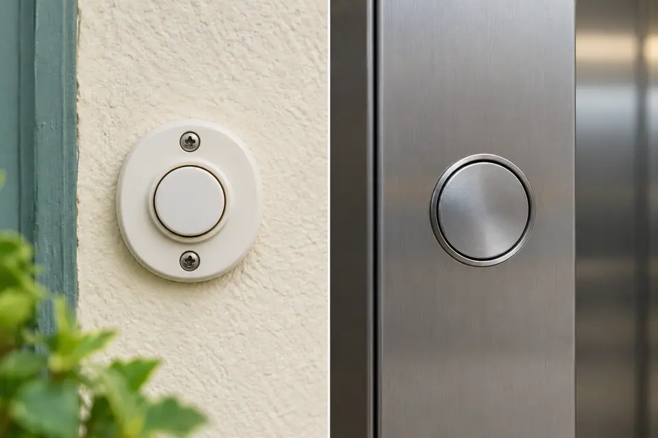
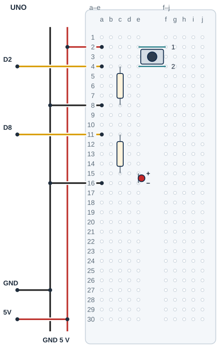

## Tanı • Tahmin et

### Günlük teknolojide

Kapı zili ve asansör çağrı butonu bir isteği sisteme iletir. Sistem bu girişi okuyup bir iş yapar. Oyun kumandasında da tuşlar istek taşır. Sen butonun bilgisini okuyacak ve programla bir ışığı yöneteceksin.



### Sistemin yolu

**Girdi:** Butonun durumu → **Karar:** Program koşulu denetler → **Çıktı:** LED’e komut gider

:::bilgi[Önce düşün]{renk=sari}
Butonu basılı tutunca ışık açık kalır mı, yoksa yalnız bir kez mi yanar? Gerekçeni yaz.
:::

::yaz[Tahminim]{satir=2}

### Parçayı tanı

- Dört bacaklı butonda iki ayrı uç grubu vardır. Basınca bu gruplar birleşir.
- Gövdeye bakıp çiftleri kesin sayma.
- 10 kΩ pull-down direnci, buton bırakıldığında girişi GND’ye bağlı tutar. Böylece giriş boşta kalmaz.
- 220 Ω direnç LED’i korur. İki direncin görevleri farklıdır; değerlerini karıştırma.
- [Proje 1](proje:1) içindeki LED yönünü hatırla. Buton burada LED’in güç anahtarı değildir; bilgisi Arduino’ya gider.

:::bilgi[Parçanı doğrula · buton uçları]{renk=gri}
Dört bacaklı butonda iki bacak her zaman bağlıdır; anahtarlanan çifti uç bulucuyla bul (yöntem A, *Parçanı doğrula* sayfası). LED yalnız basınca yanıyorsa doğru çifti seçtin.

::yaz[her zaman bağlı çift … / … · anahtarlanan çift … / …]{satir=1}
:::

## Buton ve LED pinlerini eşleştir

| UNO pini | Bağlantı yolu |
|---|---|
| **GND** | GND rayı → LED / 10 kΩ dönüşü |
| **5V** | 5 V rayı → buton grup 1 |
| **D2** | Buton grup 2 / 10 kΩ giriş düğümü |
| **D8** | 220 Ω → LED anot |

_Kırmızı: 5 V / güç · Siyah: GND · Sarı: dijital · Turkuaz: analog_

_Renk değil pin adı belirleyicidir. Rayların sürekliliğini kontrol et; kesik rayı tek parça sanma._

### Adım adım kur

1. USB kablosunu çıkar; direnç değerlerini ve buton çiftlerini doğrula.
2. UNO 5 V’u 5 V rayına, GND’yi GND rayına bağla.
3. Buton çiftlerini e2/f2 ve e4/f4’e tak. a2’yi 5 V rayına, a4’ü D2’ye bağla.
4. 10 kΩ direnci c4–c8’e tak; a8’i GND rayına bağla.
5. D8’i a11’e bağla. 220 Ω c11–c15; LED anot e15, katot e16; a16 GND rayına gider.
6. Bağlantıları ve ray sürekliliğini kontrol et; sonra USB’yi tak.

:::dikkat{renk=kirmizi}
5 V ile GND’yi doğrudan birleştirme. D2 girişini GND’ye 10 kΩ üzerinden bağla. Kabloyu veya buton yönünü değiştirirken önce USB’yi çıkar.
:::

:::bilgi[İki direnç, iki görev]{renk=mavi}
Butona basılıyken 10 kΩ yolunda yaklaşık akım:

I = 5 V / 10 000 Ω = 0,5 mA.

LED’in 220 Ω direnci ayrı çıkış yolundadır.
:::

### Kendi deliklerin

Kurduktan sonra her ucun gerçekte hangi deliğe girdiğini yaz ve çizimle karşılaştır. Butonun iki çifti kanalın iki yanında kalmalı.

| Uç | Çizimdeki delik | Benim deliğim |
|---|---|---|
| Buton üst çift | e2 / f2 |   |
| Buton alt çift | e4 / f4 |   |
| 10 kΩ direnç | c4 → c8 |   |
| 220 Ω direnç | c11 → c15 |   |
| LED anot / katot | e15 / e16 |   |
| D2 / D8 jumper’ı | a4 / a11 |   |
| 5 V / GND jumper’ları | a2 / a8, a16 |   |

## Butonu kanalın iki yanına yerleştir



- **Buton çiftleri:** e2/f2 · e4/f4
- **Pull-down:** 10 kΩ: c4 → c8
- **LED direnci:** 220 Ω: c11 → c15
- **LED yönü:** Anot e15 · katot e16
- **Ortak referans:** a8 ve a16 → GND rayı
- **Raylar:** 5 V ile GND ayrıdır.
- **Orta kanal:** Yalnız buton kanalı aşar.

_Kesişen çizgiler yalnız uçlarında birleşir. Her delikte tek uç vardır._

**Sen çiz (defterine):** kendi parçanın uçlarını, delik adlarını ve iki güç yolunu göster.

Buton üst grubu e2/f2, alt grubu e4/f4’tür. LED anot e15 ile direnç c15 aynı grupta, ayrı deliklerdedir. Katot e16 bir sonraki satırdadır.

## Basışı oku, LED’i yönet

```cpp title="TAM PROGRAM · P04" start=1 dosya=p04_butonla_led_kontrolu
const byte ledPini = 8;
const byte butonPini = 2;

void setup() {
  pinMode(ledPini, OUTPUT);
  pinMode(butonPini, INPUT);
}

void loop() {
  int butonDurumu = digitalRead(butonPini);
  if (butonDurumu == HIGH) {
    digitalWrite(ledPini, HIGH);
  } else {
    digitalWrite(ledPini, LOW);
  }
}
```

### Kodun mantığı

1. ledPini D8’i, butonPini D2’yi seçer.
2. setup(), LED’i OUTPUT; butonu INPUT yapar.
3. digitalRead(butonPini), HIGH veya LOW okur; butonDurumu bu bilgiyi tutar.
4. if (butonDurumu == HIGH), eşitliği sınar. == karşılaştırır; = değer atar.
5. Koşul doğruysa LED’e HIGH gider. else, diğer durumda LOW gönderir.
6. loop(), durumu tekrar okur. Buton bırakılınca yeni okuma kararı değiştirir.

### Hata avcısı

| Belirti | Olası neden | Ne yap? |
|---|---|---|
| LED hep yanıyor | Buton çiftleri yanlış yerleştirilmiş | USB’yi çıkar; çiftleri doğrula. Gerekirse butonu 90° çevirip yeniden eşleştir. |
| Basınca hiç tepki yok | D2 veya ortak referans eksik | USB’yi çıkar; D2–a4 yolunu, 10 kΩ’u ve GND rayını kontrol et. |
| Bırakınca ışık kararsız | 10 kΩ bağlantısı kopuk olabilir | USB’yi çıkar; c4–c8 direncini ve a8–GND yolunu karşılaştır. |

### Kodu izle

Programı kâğıtta çalıştır: her durumda digitalRead’in vereceği değeri ve çalışacak dalı yaz. Sonra test tablosunda gerçek davranışla karşılaştır.

| Buton durumu | D2 okuması (HIGH / LOW) | Çalışan dal (if / else) |
|---|---|---|
| Buton bırakılmış |   |   |
| Buton basılı |   |   |

## Basış ile ışığı karşılaştır

Önce tahminini yaz. Denemeden sonra gözlemini boş hücreye kaydet.

| Deneme | Tahminim | Gözlemim |
|---|---|---|
| Butona dokunma; LED’i gözle. |   |   |
| Butonu kısa basıp bırak. |   |   |
| Butonu 3 saniye basılı tut; sonra bırak. |   |   |

:::bilgi[Bir değişiklik yap]{renk=mavi}
İlk programda yalnız if koşulundaki HIGH sözcüğünü LOW yap. Devre aynı kalsın. Tahminini yazıp davranışı gözle; sonra ilk koşula dön.
:::

::yaz[Tahminim ve gözlemim]{satir=3}

### Değişiklik sürümleri

“Bir değişiklik yap” sürümleri; ana programla yan yana açıp farkı bul.

```cpp title="Değişiklik sürümü · p04_pin_d3" start=1 dosya=p04_pin_d3
const byte ledPini = 8;
const byte butonPini = 3;

void setup() {
  pinMode(ledPini, OUTPUT);
  pinMode(butonPini, INPUT);
}

void loop() {
  int butonDurumu = digitalRead(butonPini);
  if (butonDurumu == HIGH) {
    digitalWrite(ledPini, HIGH);
  } else {
    digitalWrite(ledPini, LOW);
  }
}
```

:::bilgi[Pin değişikliği deneyi]{renk=mavi}
İlk koda dön. USB’yi çıkar; D2 jumper’ını D3’e taşı. USB’yi takıp gözle. Sonra yalnız butonPini değerini 3 yap ve yükle. Deney sonunda USB’yi çıkar; jumper’ı D2’ye geri bağla. USB’yi tak; ilk programı yükle.
:::

### Kendini kontrol et

**1.** Buton bırakılınca girişi GND’ye hangi direnç bağlar?

::yaz[Cevabım]{satir=2}

**2.** Butonun iki grubu sürekli bağlıysa neden basmak fark yaratmaz?

::yaz[Cevabım]{satir=2}

**3.** Buton kablosunu D3’e taşırsan hangi sabiti değiştirirsin?

::yaz[Cevabım]{satir=2}

**Sen çiz (defterine):** tasarladığın iki durumun girişini ve LED davranışını göster.

**Evde devam et:** Bir zil veya oyun tuşunu gözle. Basılı tutmak ile kısa basmak nasıl farklı işler başlatıyor? Cihazı açma.

**Şimdi sıra sende:** Bir oyunda basılıyken başka anlam taşıyan durum ışığı tasarla. İki durumu adlandır ve davranışı çiz.

::yaz[Fikrim]{satir=3}

**Kendimi değerlendiriyorum:** Yardımla yaptım · Biraz yardımla · Tek başıma · Başkasına anlatabilirim

::yaz[Bu projeyi nasıl yaptım? Neden?]{satir=1}

:::bilgi[Biliyor muydun?]{renk=sari}
Boşta kalan dijital giriş, bağlı olmayan bir anten gibi çevreden etkilenebilir. Pull-down direnci girişin bırakılmış durumunu belirginleştirir.
:::
