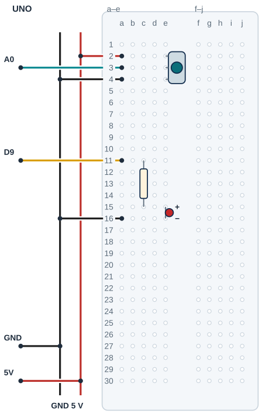

## Tanı • Tahmin et

### Günlük teknolojide

Masa lambasındaki döner düğme ışığın seviyesini ayarlar. Araç gösterge ışıklarında da benzer bir kontrol bulunur. Düğmenin konumu sisteme bir ayar taşır. Sen bu ayarı okuyacak ve bir LED’de deneyeceksin.


### Sistemin yolu

**Girdi:** Pot konumu → **Hesap:** Okuma aralığı dönüştürülür → **Çıktı:** PWM, LED’i sürer

:::bilgi[Önce düşün]{renk=sari}
PWM ayarını iki katına çıkarırsan ışık gözünde tam iki kat parlak görünür mü? Tahminini yaz.
:::

::yaz[Tahminim]{satir=2}

### Parçayı tanı

- Potansiyometre (pot), üç uçlu ayarlanabilir bir dirençtir. Burada gerilim bölücü olarak kullanılır; orta sürgü ucundan değişen gerilim okunur.
- İki dış uç direnç yolunun uçlarıdır; sürgü bu yol üzerinde hareket eder.
- UNO R3’te analogRead, 0–1023 aralığında tam sayı okur. Bu projede sürgü A0’a gider.
- PWM, çıkışı hızla açıp kapatır; açık kaldığı paya görev döngüsü denir. UNO R3’te gerçek, sürekli analog gerilim üretmez.
- D9, PWM çıkışıdır. analogWrite, 0–255 ayarı alır; map iki sayı aralığını eşleştirir.

:::bilgi[Parçanı doğrula · pot uçları]{renk=gri}
Potun orta ucu sürgüdür ve A0’a gider. İki dış ucu ters bağlamak zarar vermez; yalnız çevirme yönünü tersine çevirir. Test gerekmez; uç sırasını gözle doğrula.

::yaz[soldan sağa uçlar … / … / …]{satir=1}
:::

## Pot ve LED pinlerini eşleştir

| UNO pini | Bağlantı yolu |
|---|---|
| **GND** | GND rayı → pot dış uç / LED katot |
| **5V** | 5 V rayı → pot dış uç |
| **A0** | Pot sürgüsü |
| **D9** | 220 Ω → LED anot |

_Kırmızı: 5 V / güç · Siyah: GND · Sarı: dijital · Turkuaz: analog_

_Renk değil pin adı belirleyicidir. Rayların sürekliliğini kontrol et; kesik rayı tek parça sanma._

### Adım adım kur

1. USB kablosunu çıkar; potun sürgü ve dış uçlarını doğrula.
2. UNO 5 V’u 5 V rayına, GND’yi GND rayına bağla.
3. Doğrulanan pot uçlarını e2/e3/e4’e tak: dış uç, sürgü, dış uç. Çizim bu sırayı kullanır.
4. a2 → 5 V rayı; a3 → A0; a4 → GND rayı bağlantılarını yap.
5. D9 → a11; 220 Ω c11–c15; LED anot e15, katot e16; a16 → GND rayı.
6. Uçları, dirençli LED yolunu ve rayları kontrol et; sonra USB’yi tak.

:::dikkat{renk=kirmizi}
Potun sürgüsünü tahmin ederek bağlama. Fiziksel uç aralığı bu çizime uymuyorsa bacakları zorlama; yerleşimi kendi modeline göre eşleştir. Kablo değişikliğinden önce USB’yi çıkar.
:::

:::bilgi[Pin değişikliği deneyi]{renk=mavi}
İlk koda dön. USB’yi çıkar; LED’in sinyal jumper’ını D9’dan D10’a taşı. USB’yi takıp gözle; sonra yalnız ledPini değerini 10 yapıp yükle. Deney sonunda USB’yi çıkar; jumper’ı D9’a geri bağla. USB’yi tak; ilk kodu yükle.
:::

### Kendi deliklerin

Kurduktan sonra her ucun gerçekte hangi deliğe girdiğini yaz ve çizimle karşılaştır.

| Uç | Çizimdeki delik | Benim deliğim |
|---|---|---|
| Pot dış uç 1 | e2 |   |
| Pot sürgü | e3 |   |
| Pot dış uç 2 | e4 |   |
| 220 Ω direnç | c11 → c15 |   |
| LED anot / katot | e15 / e16 |   |
| A0 / D9 jumper’ı | a3 / a11 |   |
| 5 V / GND jumper’ları | a2 / a4, a16 |   |

## Potun üç ucunu ayrı satırlara yerleştir



- **Pot uçları:** Dış e2 · sürgü e3 · dış e4
- **Analog giriş:** A0 → a3
- **LED direnci:** 220 Ω: c11 → c15
- **LED yönü:** Anot e15 · katot e16
- **Ortak referans:** a4 ve a16 → GND rayı
- **Model kontrolü:** Uç sırası doğrulanmalıdır.
- **Orta kanal:** Hiçbir parça kanalı aşmaz.

_Kesişen çizgiler yalnız uçlarında birleşir. Her delikte tek uç vardır._

**Sen çiz (defterine):** kendi parçanın uçlarını, delik adlarını ve iki güç yolunu göster.

Bu çizimde pot dış uçları e2/e4, sürgü e3’tür. Modelinin sırası ve aralığı farklıysa kendi modeline göre yeni yerleşimi çiz; uçları zorlama.

## Pot okumasını parlaklığa çevir

```cpp title="TAM PROGRAM · P05" start=1 dosya=p05_potansiyometreyle_parlaklik
const byte potPini = A0;
const byte ledPini = 9;
const int okumaEnAz = 0;
const int okumaEnCok = 1023;
const byte parlaklikEnAz = 0;
const byte parlaklikEnCok = 255;
const byte beklemeMs = 10;

void setup() {
  pinMode(ledPini, OUTPUT);
}

void loop() {
  int okuma = analogRead(potPini);
  int parlaklik = map(okuma, okumaEnAz, okumaEnCok,
    parlaklikEnAz, parlaklikEnCok);
  analogWrite(ledPini, parlaklik);
  delay(beklemeMs);
}
```

### Kodun mantığı

1. potPini A0’ı, ledPini PWM çıkışı D9’u seçer.
2. okumaEnAz/okumaEnCok ve parlaklikEnAz/parlaklikEnCok, iki aralığın uçlarını adlandırır.
3. setup(), ledPini çıkışını hazırlar. analogRead(potPini), okuma değerini alır.
4. map, 0–1023 okumasını 0–255 parlaklik ayarına dönüştürür. Sonuç tam sayıdır.
5. analogWrite(ledPini, parlaklik), PWM ayarını uygular. Bu çağrı sürekli analog gerilim vermez.
6. delay(beklemeMs), 10 ms bekler; loop(), ayarı yeniden okur.

### Hata avcısı

| Belirti | Olası neden | Ne yap? |
|---|---|---|
| Düğme etkisiz | Sürgü A0’a bağlı değil | USB’yi çıkar; sürgü ucunu doğrula ve A0–a3 yolunu kontrol et. |
| Yalnız açık/kapalı gibi | LED PWM olmayan pine taşınmış | USB’yi çıkar; kablo ve ledPini değerini PWM destekleyen D9 veya D10 ile eşleştir. |
| Çevirme yönü ters | Dış uçların yönü farklı | Bu tek başına arıza değildir. Yönü kaydet; değiştireceksen USB kablosu çıkarılmışken yalnız dış uçları yer değiştir. |

### Kodu izle

map, okumayı 0–1023’ten 0–255 parlaklığa taşır; kâğıtta hesapla, sonra gözleminle karşılaştır.

| Pot konumu | analogRead | map sonucu |
|---|---|---|
| Bir uçta | ≈ 0 |   |
| Ortada | ≈ 512 |   |
| Öbür uçta | ≈ 1023 |   |

## Parlaklık değişimini ölç ve geliştir

Önce tahminini yaz. Denemeden sonra gözlemini boş hücreye kaydet.

| Deneme | Tahminim | Gözlemim |
|---|---|---|
| Pot bir uçta; sonra orta konumda; sonra öbür uçta. |   |   |
| Potu sabit tut; yalnız PWM 64 değerini dene. |   |   |
| Aynı konumda yalnız PWM 128; 64 ile karşılaştır. |   |   |

:::bilgi[Bir değişiklik yap]{renk=mavi}
Pot ve devre sabit kalsın. Yalnız analogWrite satırındaki parlaklik yerine önce 64, sonra 128 yaz. Tahminlerini kaydet; gözle karşılaştır. Sonra parlaklik adına dön. Bu deneyde 64 ve 128, seçtiğin PWM test ayarlarıdır.
:::

::yaz[Tahminim ve gözlemim]{satir=3}

### Değişiklik sürümleri

“Bir değişiklik yap” sürümleri; ana programla yan yana açıp farkı bul.

```cpp title="Değişiklik sürümü · p05_pin_d10" start=1 dosya=p05_pin_d10
const byte potPini = A0;
const byte ledPini = 10;
const int okumaEnAz = 0;
const int okumaEnCok = 1023;
const byte parlaklikEnAz = 0;
const byte parlaklikEnCok = 255;
const byte beklemeMs = 10;

void setup() {
  pinMode(ledPini, OUTPUT);
}

void loop() {
  int okuma = analogRead(potPini);
  int parlaklik = map(okuma, okumaEnAz, okumaEnCok,
    parlaklikEnAz, parlaklikEnCok);
  analogWrite(ledPini, parlaklik);
  delay(beklemeMs);
}
```

```cpp title="Değişiklik sürümü · p05_ters_parlaklik" start=1 dosya=p05_ters_parlaklik
const byte potPini = A0;
const byte ledPini = 9;
const int okumaEnAz = 0;
const int okumaEnCok = 1023;
const byte parlaklikEnAz = 0;
const byte parlaklikEnCok = 255;
const byte beklemeMs = 10;

void setup() {
  pinMode(ledPini, OUTPUT);
}

void loop() {
  int okuma = analogRead(potPini);
  int parlaklik = map(okuma, okumaEnAz, okumaEnCok,
    parlaklikEnAz, parlaklikEnCok);
  analogWrite(ledPini, parlaklikEnCok - parlaklik);
  delay(beklemeMs);
}
```

### Kendini kontrol et

**1.** Potun hangi ucu A0’a gider?

::yaz[Cevabım]{satir=2}

**2.** 0–1023 okumasını neden başka aralığa dönüştürüyoruz?

::yaz[Cevabım]{satir=2}

**3.** Düğmenin yönüne göre parlaklık değişimi ters olsun diye çıkış satırını nasıl değiştirirsin?

::yaz[Cevabım]{satir=2}

**Sen çiz (defterine):** pot konumu ile ışık seviyesi arasındaki ilişkiyi göster.

**Evde devam et:** Bir ayar düğmesinin en küçük, orta ve en büyük konumunu gözle. Hangi çıktı değişiyor? Cihazı sökme.

**Şimdi sıra sende:** Önce ters yön deneyini yap. Ardından [Proje 3](proje:3) içindeki bir sesin frekansını potla ayarlama fikrini kâğıtta planla; bu ses şiddeti ayarı değildir.

::yaz[Fikrim]{satir=3}

**Kendimi değerlendiriyorum:** Yardımla yaptım · Biraz yardımla · Tek başıma · Başkasına anlatabilirim

::yaz[Bu projeyi nasıl yaptım? Neden?]{satir=1}

:::bilgi[Biliyor muydun?]{renk=sari}
map, tam sayı hesabı yapar; kesirli kısmı atar. Bu nedenle bazı komşu analog okumalar aynı PWM ayarına dönüşür.
:::
