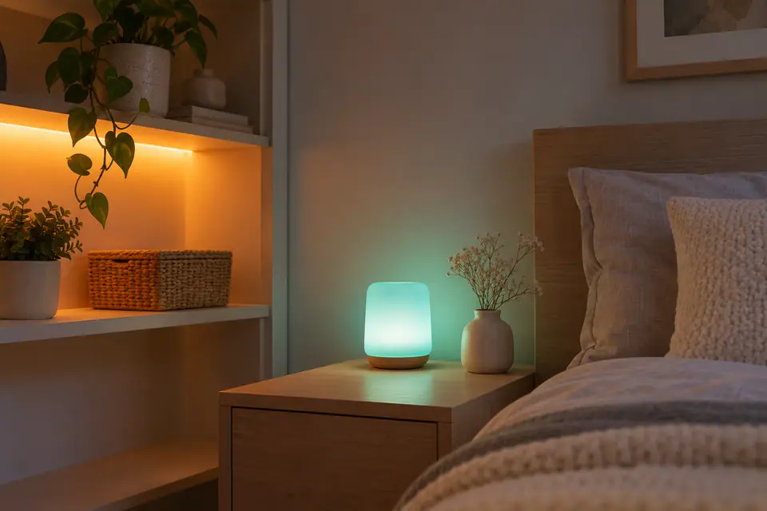
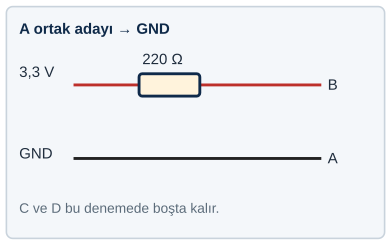
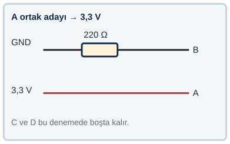
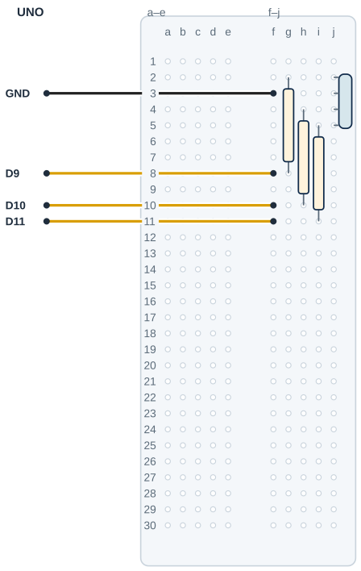

## Tanı • Tahmin et

### Günlük teknolojide

Gece lambaları ve renkli durum ışıkları farklı renkler gösterebilir. Bir gövdenin içinde birden çok ışık kaynağı bulunabilir. Program bu kaynakları ayrı ayrı yönetir. Sen üç kanalı deneyecek ve kendi durum rengini tasarlayacaksın.



### Sistemin yolu

**Girdi:** Üç PWM ayarı → **İşlem:** Modeline uygun çıkışlar → **Çıktı:** RGB LED’in ışığı

:::bilgi[Önce düşün]{renk=sari}
Aynı PWM değeri üç renk kanalında gözünde aynı parlaklıkta mı görünür? Gerekçeni yaz.
:::

::yaz[Tahminim]{satir=2}

### Parçayı tanı

- RGB, kırmızı, yeşil ve mavi ışık kanallarını adlandırır. Dört bacaklı modelde bir ortak uç vardır.
- Uzun bacak yalnız ipucudur; ortak ucu ve R/G/B sırasını kesin sayma. Bacakları RGB bacak taramasıyla bul (*Parçanı doğrula* sayfası).
- Ortak katot GND’ye, ortak anot 5 V’a bağlanır. Kablolama ve ortakAnot seçimi aynı türü göstermelidir.
- Her renk kanalının ayrı 220 Ω direnci vardır. Ortak uca tek direnç koyma.
- [Proje 5](proje:5) içindeki PWM’i üç kanalda kullanacaksın. D9, D10 ve D11 bu çıkışı destekler.

## Ortak ucu ve renk uçlarını bul

Veri sayfası olmadan uçları gözlemle bulabilirsin. Testi USB çıkarılmışken kur; her denemede tek bacak dene. A, B, C, D yalnız senin verdiğin geçici uç adlarıdır.

:::dikkat[Test sınırı]{renk=kirmizi}
Bu test yalnız standart dört bacaklı RGB LED içindir. Yalnız UNO 3,3 V ve seri 220 Ω kullan. Her bağlantı değişikliğinde USB’yi çıkar; kontrol sonrası tak. Bilinmeyen uca 5 V uygulama.
:::

### Aday ortak ucu sırayla dene

1. USB’yi çıkar. Dört bacağı aynı yarıda ayrı satırlara tak; çiziminde A–D diye adlandır.
2. Bir ucu aday seç. Adayı GND’ye, başka bir ucu 220 Ω üzerinden 3,3 V’a bağla; diğer iki uç boş kalsın.
3. Kontrol sonrası USB’yi tak, kısa gözle; sonra çıkar. Aday dışındaki üç ucu tek tek aynı dirençle dene.
4. Üç renk görülmediyse aday ortak ucu 3,3 V’a, test ucunu 220 Ω üzerinden GND’ye bağlayan ikinci yönü dene.
5. Gerekirse başka ortak adayla tekrarla. Bir aday üç farklı uçta üç rengi verdiğinde ortak türünü ve R/G/B’yi kaydet.





Aday ortak GND yönünde üç rengi verirse katot; 3,3 V yönünde verirse anot modelidir. Işık yoksa bağlantı, model veya ileri gerilim etkili olabilir. Bu sonuç tek başına türü çürütmez; gerilimi artırma.

| Geçici uç | Bulduğum işlev / renk |
|---|---|
| A |   |
| B |   |
| C |   |
| D |   |

::yaz[Ortak türüm: … Test gözlemim: …]{satir=1}

## Üç renk kanalını eşleştir

| UNO pini | Bağlantı yolu |
|---|---|
| **D9** | 220 Ω → R; örnekte j2 |
| **D10** | 220 Ω → G; örnekte j4 |
| **D11** | 220 Ω → B; örnekte j5 |
| **GND** | RGB ortak katot; örnekte j3 |

_Kırmızı: 5 V / güç · Siyah: GND · Sarı: dijital · Turkuaz: analog_

_Renk değil pin adı belirleyicidir. RGB’de R/G/B kanal adları, jumper’ın rengini belirlemez._

### Adım adım kur

1. USB kablosunu çıkar; ortak ucu ve R/G/B uçlarını önceki testle doğrula.
2. Bu örnekte R j2, ortak j3, G j4, B j5’tir. Sıran farklıysa çizimi kendi modeline uyarla; bacakları zorlama.
3. Üç ayrı 220 Ω direnci g2–g8, h4–h10 ve i5–i11’e tak.
4. D9 → f8; D10 → f10; D11 → f11 bağlantılarını yap.
5. Katotta f3 → GND ve ortakAnot = false kullan. Anotta f3 → 5 V ve ortakAnot = true kullan; ikisini birlikte değiştirmeden deneme.
6. Tek ortak besleme yolunu, üç direnci ve model eşleşmesini kontrol et; sonra USB’yi tak.

:::dikkat{renk=kirmizi}
Ortak uç yalnız tek besleme hattına bağlanır; 5 V ile GND’yi birleştirme. Her kanalda ayrı direnç kullan. Tür veya uçlar belirsizse ana devreye geçme.
:::

Bu pin haritası katot örneğidir. Anot modelinde yalnız ortak dönüş hattı GND yerine 5 V’a gider; kod seçimi de true olur.

### Kendi deliklerin

Bacak testinde bulduğun sırayla yerleştirdikten sonra her ucun gerçek deliğini yaz.

| Uç | Çizimdeki delik | Benim deliğim |
|---|---|---|
| R bacağı | j2 |   |
| Ortak bacak | j3 |   |
| G bacağı | j4 |   |
| B bacağı | j5 |   |
| 220 Ω (R / G / B) | g2–g8 · h4–h10 · i5–i11 |   |
| D9 / D10 / D11 | f8 / f10 / f11 |   |
| GND jumper’ı (ortak) | f3 |   |

## RGB bacaklarını ayrı deliklere yerleştir



- **Örnek uç sırası:** R j2 · ortak j3 · G j4 · B j5
- **Kırmızı kanalı:** D9 → f8; R\_R g8 → g2
- **Yeşil kanalı:** D10 → f10; R\_G h10 → h4
- **Mavi kanalı:** D11 → f11; R\_B i11 → i5
- **Her kanalda:** Ayrı 220 Ω direnç
- **Ortak katot örneği:** f3 → GND; ortakAnot false
- **Orta kanal:** Hiçbir parça kanalı aşmaz.

_Kesişen çizgiler yalnız uçlarında birleşir. Her delikte tek uç vardır._

**Sen çiz (defterine):** kendi parçanın uçlarını, delik adlarını ve iki güç yolunu göster.

Bu örnek, doğrulanmış R–ortak–G–B sırasındaki ortak katot içindir. Modelinde sıra farklıysa bu delik adlarını aynen kullanma; yerleşimi kendi modeline göre uyarla. Ortak anotta f3, GND yerine 5 V’a gider.

## Üç kanalla renk karıştır

```cpp title="TAM PROGRAM · P06" start=1 dosya=p06_rgb_led_ile_renk_uret
const byte kirmiziPini = 9;
const byte yesilPini = 10;
const byte maviPini = 11;
const bool ortakAnot = false;
const byte parlaklikEnCok = 255;
const byte kirmiziDegeri = 128;
const byte yesilDegeri = 0;
const byte maviDegeri = 0;

void setup() {
  pinMode(kirmiziPini, OUTPUT);
  pinMode(yesilPini, OUTPUT);
  pinMode(maviPini, OUTPUT);
}

void loop() {
  byte kirmiziCikis = kirmiziDegeri;
  byte yesilCikis = yesilDegeri;
  byte maviCikis = maviDegeri;
  if (ortakAnot) {
    kirmiziCikis = parlaklikEnCok - kirmiziDegeri;
    yesilCikis = parlaklikEnCok - yesilDegeri;
    maviCikis = parlaklikEnCok - maviDegeri;
  }
  analogWrite(kirmiziPini, kirmiziCikis);
  analogWrite(yesilPini, yesilCikis);
  analogWrite(maviPini, maviCikis);
}
```

### Kodun mantığı

1. kirmiziPini, yesilPini ve maviPini; D9, D10, D11’i seçer.
2. ortakAnot için false katot modelidir; true anot modelidir. Bağlantıyla eşleştir.
3. kirmiziDegeri, yesilDegeri ve maviDegeri istenen 0–255 ayarlarıdır. setup(), üç pini OUTPUT yapar.
4. loop(), ayarları kirmiziCikis, yesilCikis ve maviCikis değişkenlerine alır.
5. if (ortakAnot), anot modelinde parlaklikEnCok değerinden her ayarı çıkarır; katotta ilk değerler kalır.
6. Üç analogWrite çağrısı, hesaplanan çıkışları ayrı pinlere uygular.

### Hata avcısı

| Belirti | Olası neden | Ne yap? |
|---|---|---|
| Hiçbir kanal yanmıyor | Ortak uç veya tür belirsiz | USB’yi çıkar; bacak testini ve GND/5 V ile ortakAnot eşleşmesini kontrol et. |
| Renkler yer değiştirmiş | R/G/B yolları yanlış | USB’yi çıkar; doğruladığın uç etiketlerini D9/D10/D11 ve üç dirençle eşleştir. |
| Bir kanal etkisiz | Direnç veya jumper kopuk | USB’yi çıkar; o kanalın 220 Ω direncini ve sinyal yolunu karşılaştır. |

## Renk karışımlarını karşılaştır

Önce tahminini yaz. Denemeden sonra gözlemini boş hücreye kaydet.

| Deneme | Tahminim | Gözlemim |
|---|---|---|
| İlk ayar: R 128, G 0, B 0. |   |   |
| Yalnız G: R 0, G 128, B 0. |   |   |
| Yalnız B: R 0, G 0, B 128. |   |   |
| R 128, G 0, B 128; karışımı gözle. |   |   |
| Karışımda yalnız R’yi 64 yap. |   |   |

:::bilgi[Bir değişiklik yap]{renk=mavi}
İlk ayarlara dön. Yalnız maviDegeri değerini 0’dan 128’e değiştir; diğerleri aynı kalsın. Gözlemini yaz. Sonra yalnız kirmiziDegeri değerini 128’den 64’e indir ve farkı kaydet.
:::

::yaz[Tahminim ve gözlemim]{satir=3}

### Değişiklik sürümleri

“Bir değişiklik yap” sürümleri; ana programla yan yana açıp farkı bul.

```cpp title="Değişiklik sürümü · p06_ortak_anot" start=1 dosya=p06_ortak_anot
const byte kirmiziPini = 9;
const byte yesilPini = 10;
const byte maviPini = 11;
const bool ortakAnot = true;
const byte parlaklikEnCok = 255;
const byte kirmiziDegeri = 128;
const byte yesilDegeri = 0;
const byte maviDegeri = 0;

void setup() {
  pinMode(kirmiziPini, OUTPUT);
  pinMode(yesilPini, OUTPUT);
  pinMode(maviPini, OUTPUT);
}

void loop() {
  byte kirmiziCikis = kirmiziDegeri;
  byte yesilCikis = yesilDegeri;
  byte maviCikis = maviDegeri;
  if (ortakAnot) {
    kirmiziCikis = parlaklikEnCok - kirmiziDegeri;
    yesilCikis = parlaklikEnCok - yesilDegeri;
    maviCikis = parlaklikEnCok - maviDegeri;
  }
  analogWrite(kirmiziPini, kirmiziCikis);
  analogWrite(yesilPini, yesilCikis);
  analogWrite(maviPini, maviCikis);
}
```

### Kendini kontrol et

**1.** Üç renk için kaç ayrı seri direnç gerekir?

::yaz[Cevabım]{satir=2}

**2.** Ortak anot modelinde neden 255 - değer hesabı yapıyoruz?

::yaz[Cevabım]{satir=2}

**3.** Mavi aynı kalsın, kırmızı azalsın diye hangi ayarı değiştirirsin?

::yaz[Cevabım]{satir=2}

**Sen çiz (defterine):** iki durumun renklerini ve seçtiğin R/G/B ayarlarını göster.

**Evde devam et:** Bir renkli durum göstergesini gözle. Her rengin anlamını nereden anlıyorsun? Cihazı açma.

**Şimdi sıra sende:** İki durum için iki renk tasarla. Her denemede tek kanalın ayarını değiştir; seçimini bir arkadaşına açıkla.

::yaz[Fikrim]{satir=3}

**Kendimi değerlendiriyorum:** Yardımla yaptım · Biraz yardımla · Tek başıma · Başkasına anlatabilirim

::yaz[Bu projeyi nasıl yaptım? Neden?]{satir=1}

:::bilgi[Biliyor muydun?]{renk=sari}
RGB LED’de üç renk kanalı aynı gövdede bulunur. Ortak uç, bu üç kanalın aynı tür uçlarını birleştirir.
:::
