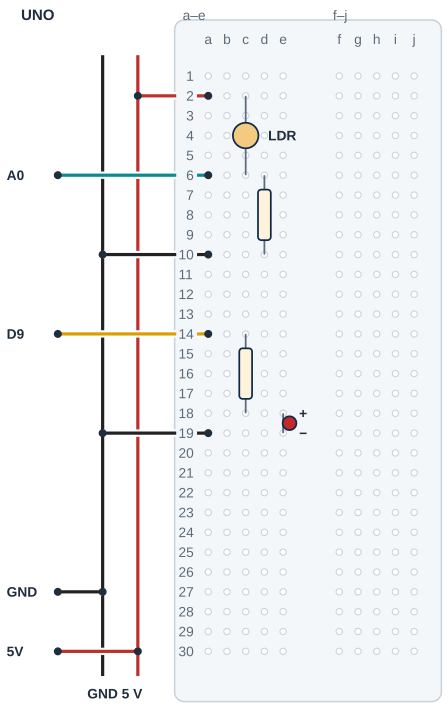

## Tanı • Tahmin et

### Günlük teknolojide

Sokak lambaları ve bazı gece lambaları çevrenin ışığını algılar. Telefonlar da ekran parlaklığını ortam bilgisine göre ayarlayabilir. Sensör ölçüm yapar; program bu bilgiyi kullanır. Sen ışık okumalarını karşılaştıracak ve bir LED için karar vereceksin.


### Sistemin yolu

**Girdi:** LDR’nin ışığa tepkisi → **Karar:** Ölçüm eşikle karşılaştırılır → **Çıktı:** LED’e komut gider

:::bilgi[Önce düşün]{renk=sari}
LDR’ye gölge yaptığında A0 okuması artar mı, azalır mı? Bağlantıyı düşün ve tahminini yaz.
:::

::yaz[Tahminim]{satir=2}

### Parçayı tanı

- LDR, ışığa bağlı bir dirençtir. İki ucu vardır; LED gibi anot ve katot seçmezsin.
- Gerilim bölücüde LDR ile 10 kΩ direnç birlikte kullanılır. A0, ikisinin birleştiği noktayı okur.
- [Proje 5](proje:5) içindeki analogRead burada da 0–1023 aralığında sayı verir. Sayı tek başına ışığın birimi değildir.
- Seri Monitör, Arduino’nun gönderdiği bilgiyi bilgisayarda gösterir. Böylece kararın dayandığı okumayı görürsün.
- Eşik, iki durum arasında seçtiğin karşılaştırma değeridir. 500 bir başlangıç örneğidir; kendi ortamında ölçerek seç.

:::bilgi[Parçanı doğrula · dirençler ve LED]{renk=gri}
İki direnci [renk bandı tablosuyla](genel:setini-tani) ayır ([Parçanı doğrula](genel:parcani-dogrula) sayfası): 10 kΩ kahverengi-siyah-turuncu, 220 Ω kırmızı-kırmızı-kahverengidir. LED’in uzun bacağı anottur.

::yaz[bölücü direnci … · LED direnci … · anot …]{satir=1}
:::

## LDR bölücüsünü A0’a bağla

| UNO pini | Bağlantı yolu |
|---|---|
| **GND** | GND rayı → bölücü / LED dönüşü |
| **5V** | 5 V rayı → LDR üst kol |
| **A0** | Bölücünün ortak ölçüm noktası |
| **D9** | 220 Ω → LED anot |

_Kırmızı: 5 V · Siyah: GND · Sarı: dijital · Turkuaz: analog_

_Pin adı belirleyicidir. Ray sürekliliğini doğrula; kesik rayı tek parça sanma._

### Adım adım kur

1. USB kablosunu çıkar; LDR’yi ve iki direnç değerini kontrol et.
2. UNO 5 V → 5 V rayı; UNO GND → GND rayı bağlantılarını yap.
3. LDR uçlarını c2 ve c6’ya tak; a2’yi 5 V rayına bağla.
4. 10 kΩ direnci d6–d10’a tak. a6 → A0; a10 → GND rayı bağlantılarını yap.
5. D9 → a14; 220 Ω c14–c18; LED anot e18, katot e19; a19 → GND rayı.
6. A0 birleşimini, LED yönünü ve rayları kontrol et; sonra USB’yi tak.

:::dikkat{renk=kirmizi}
A0’a 5 V’tan büyük gerilim verme. 10 kΩ ile 220 Ω’u karıştırma. Her bağlantı değişikliğinden önce USB’yi çıkar.
:::

:::bilgi[Seri Monitör’ü aç]{renk=mavi}
UNO kartını ve portunu seç; programı yükle. IDE’de sağ üstteki Seri Monitör düğmesini aç ve hızını 9600 baud seç. Baud, veri aktarım hızının ayarıdır. Yeni satırlardaki ışık okumasını gözlemle.
:::

### Kendi deliklerin

Kurduktan sonra her ucun gerçekte hangi deliğe girdiğini yaz ve çizimle karşılaştır. LDR’nin alt ucu, 10 kΩ’un üst ucu ve A0 aynı satırda buluşmalı.

| Uç | Çizimdeki delik | Benim deliğim |
|---|---|---|
| LDR | c2 → c6 |   |
| 10 kΩ direnç | d6 → d10 |   |
| A0 jumper’ı | a6 |   |
| 220 Ω direnç | c14 → c18 |   |
| LED anot / katot | e18 / e19 |   |
| D9 jumper’ı | a14 |   |

## LDR’yi ve direnci yerleştir



- **Bölücünün üst kolu:** LDR: c2 → c6
- **Sabit alt kol:** 10 kΩ: d6 → d10
- **Ölçüm noktası:** A0 → a6; ortak satır 6
- **LED seri direnci:** 220 Ω: c14 → c18
- **LED yönü:** Anot e18 · katot e19
- **Ortak dönüş:** a10 ve a19 → GND rayı
- **Orta kanal:** Hiçbir parça kanalı aşmaz.

_Kesişen çizgiler yalnız uçlarında birleşir. Her delikte tek uç vardır._

**Sen çiz (defterine):** kendi modelinin uç adlarını ve delik bağlantılarını göster.

LDR’nin alt ucu c6, 10 kΩ direncin üst ucu d6 ve A0 jumper’ı a6 aynı satır grubundadır. Uçlar ayrı deliklerde buluşur. LED anot e18, katot e19’dur.

## Işık okumasını eşikle işle

```cpp title="TAM PROGRAM · P07" start=1 dosya=p07_karanlikta_yanan_lamba
const byte ldrPini = A0;
const byte ledPini = 9;
const int esikDegeri = 500;
const unsigned long haberlesmeHizi = 9600;
const byte beklemeMs = 100;

void setup() {
  pinMode(ledPini, OUTPUT);
  Serial.begin(haberlesmeHizi);
}

void loop() {
  int okuma = analogRead(ldrPini);
  Serial.println(okuma);
  if (okuma < esikDegeri) {
    digitalWrite(ledPini, HIGH);
  } else {
    digitalWrite(ledPini, LOW);
  }
  delay(beklemeMs);
}
```

### Kodun mantığı

1. ldrPini A0’ı, ledPini D9’u seçer. esikDegeri 500, ölçümle değiştirilecek örnektir.
2. setup(), LED’i OUTPUT yapar. Serial.begin, 9600 baud haberleşmeyi başlatır.
3. analogRead, A0 gerilimini okuma sayısına çevirir; Serial.println bu sayıyı yeni satırda gösterir.
4. Bu bölücüde ışık azalınca okuma genellikle azalır. if, okuma eşikten küçükken LED’e HIGH gönderir.
5. Eşiğe eşit veya daha büyük okumada else çalışır; LED’e LOW gider.
6. delay, iki okuma arasında 100 ms bekler. Eşiği aydınlık ve gölge okumaların arasından seç.

### Hata avcısı

| Belirti | Olası neden | Ne yap? |
|---|---|---|
| Seri Monitör boş veya bozuk | Port, yükleme veya hız uyuşmuyor | Doğru portu ve yüklenen programı kontrol et. Seri Monitör’ü 9600 baud aç. |
| A0 değişmiyor | Bölücü veya ölçüm noktası yanlış | USB’yi çıkar; LDR c2–c6, 10 kΩ d6–d10 ve A0–a6 yollarını karşılaştır. |
| LED ters davranıyor ya da titreşiyor | Eşik veya bölücü sırası uygun değil | Önce okumaları kaydet. USB’yi çıkarıp bağlantıyı doğrula; sonra yalnız eşiği ölçümlerin arasında seç. |

Aydınlık ve gölge okumalarının aralıklarını yaz. Aralıklar ayrılıyorsa aralarında bir eşik seç. Örtüşüyorsa ortamı sabitle ve yeniden ölç; sayı uydurma.

## Karanlık eşiğini karşılaştır

Önce tahminini yaz. Denemeden sonra gerçek gözlemini boş hücreye kaydet.

| Deneme | Tahmin / seçtiğim eşik | A0 / LED gözlemim |
|---|---|---|
| Aydınlıkta üç okuma al; aralığı ve LED’i kaydet. |   |   |
| LDR’ye elinle gölge yap; üç okuma ve LED’i kaydet. |   |   |
| İki aralık arasında kendi eşiğini seç ve yükle. |   |   |
| Eşiğe yakın gölgede sayı ve LED’i birlikte izle. |   |   |

:::bilgi[Bir değişiklik yap]{renk=mavi}
Devreyi ve ışığı sabit tut. Yalnız esikDegeri değerini kendi seçtiğin sayıya değiştir. Tahminini gözle sınayıp kaydet. 700 de yazılım deneyi için bir örnektir; her sınıfta uygun eşik olmaz.
:::

::yaz[Tahminim ve gözlemim]{satir=3}

### Değişiklik sürümleri

“Bir değişiklik yap” sürümleri; ana programla yan yana açıp farkı bul.

```cpp title="Değişiklik sürümü · p07_esik_700" start=1 dosya=p07_esik_700
const byte ldrPini = A0;
const byte ledPini = 9;
const int esikDegeri = 700;
const unsigned long haberlesmeHizi = 9600;
const byte beklemeMs = 100;

void setup() {
  pinMode(ledPini, OUTPUT);
  Serial.begin(haberlesmeHizi);
}

void loop() {
  int okuma = analogRead(ldrPini);
  Serial.println(okuma);
  if (okuma < esikDegeri) {
    digitalWrite(ledPini, HIGH);
  } else {
    digitalWrite(ledPini, LOW);
  }
  delay(beklemeMs);
}
```

### Kendini kontrol et

**1.** Seri Monitör bu kod için kaç baud olmalı?

::yaz[Cevabım]{satir=2}

**2.** 500 neden her odada aynı ışık durumunu göstermez?

::yaz[Cevabım]{satir=2}

**3.** Aydınlık ve gölge aralıkların ayrılıyorsa eşiği nereden seçersin?

::yaz[Cevabım]{satir=2}

**Sen çiz (defterine):** ışık okumasını, seçtiğin eşiği ve LED kararını göster.

**Evde devam et:** Bir gece lambasının ışığa tepkisini gözle. Sensöre gölge yapmak ile oda ışığını azaltmak aynı tepkiyi veriyor mu? Cihazı açma.

**Şimdi sıra sende:** [Proje 5](proje:5) içindeki LED’i düşün. Bu projede ışık değişimini fark eden bir masa lambası fikrini çiz; kendi eşik seçimini açıkla.

::yaz[Fikrim]{satir=3}

**Kendimi değerlendiriyorum:** Yardımla yaptım · Biraz yardımla · Tek başıma · Başkasına anlatabilirim

::yaz[Bu projeyi nasıl yaptım? Neden?]{satir=1}

:::bilgi[Biliyor muydun?]{renk=sari}
LDR ve sabit dirençli bu devrede A0, ışık düzeyini doğrusal ölçmez. İki farklı LDR aynı ışıkta farklı sayılar verebilir.
:::
