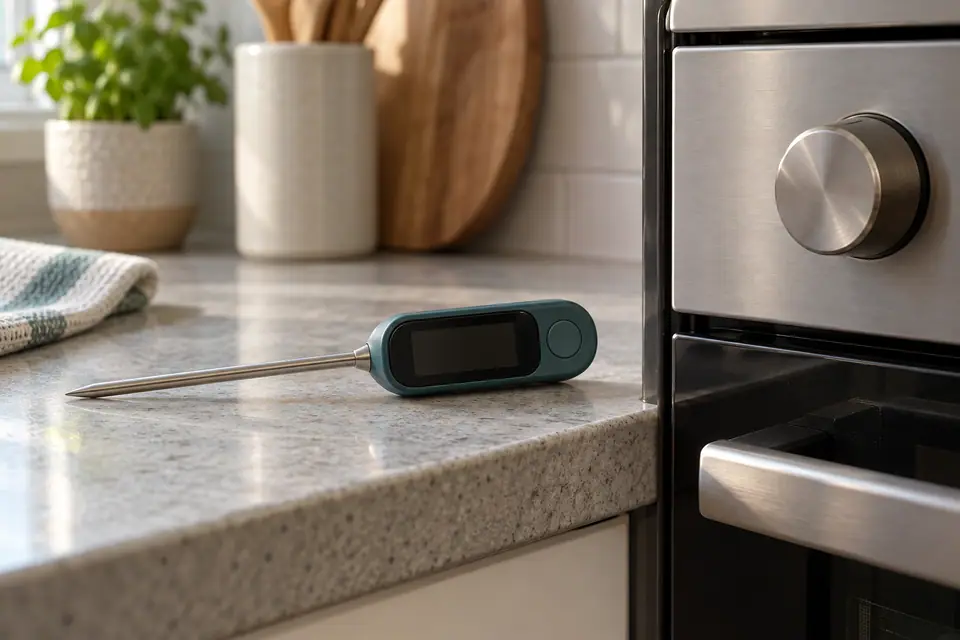
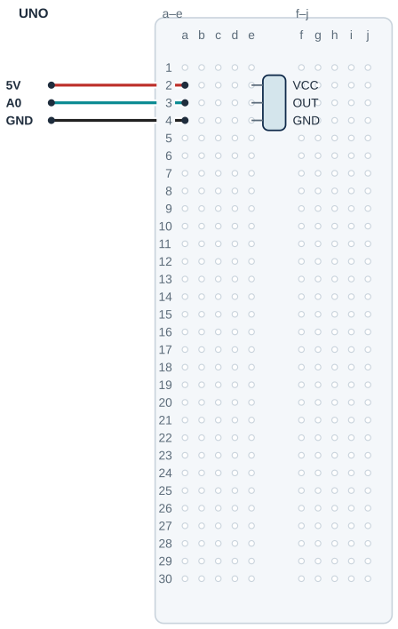

## Tanı • Tahmin et

### Günlük teknolojide

Oda termometresi sıcaklığı gösterir. Termostat ise ölçümle bir hedefi karşılaştırır. Gösterilen sayı ile seçilen hedef farklı görevler taşır. Sen bir sensörün gerilimini dereceye çevirecek ve başka bir termometreyle karşılaştıracaksın.



### Sistemin yolu

**Girdi:** LM35 çıkış gerilimi → **Hesap:** Derece hesabı ve örnek eşik → **Çıktı:** Seri Monitör’de bilgi

:::bilgi[Önce düşün]{renk=sari}
Ekranda daha çok ondalık basamak göstermek ölçümü daha doğru yapar mı? Gerekçeni yaz.
:::

::yaz[Tahminim]{satir=2}

### Parçayı tanı

- LM35 sıcaklığa bağlı bir çıkış gerilimi üretir. Gövde yazısından modeli ve paketini belirle.
- VCC besleme, OUT çıkış, GND ortak referanstır. Üretici çiziminin üstten mi, alttan mı baktığını kontrol et.
- LM35 çıkışı her 1 °C için 10 mV değişir. OUT, A0’a bağlanır; sensörün ölçtüğü sıcaklık kendi gövdesininkidir.
- float, ondalıklı sayılarla hesap yapar. 5,0 V referans varsayımıyla okuma önce gerilime çevrilir.
- 30 °C programın örnek eşiğidir. Bu eğitim deneyi cihaz yönetmez; sayıyı gözlemine göre seçebilirsin.

:::bilgi[Parçanı doğrula · LM35 yönü]{renk=gri}
LM35’in düz yüzü sana bakarken ve bacaklar aşağıdayken veri sayfasındaki sıra soldan sağa +VS, VOUT, GND’dir; çizimde bunlar VCC, OUT, GND diye geçer. Gövde yazısını oku ve çizimle karşılaştır ([Parçanı doğrula](genel:parcani-dogrula) sayfası).

::yaz[gövde yazısı … · soldan sağa … / … / …]{satir=1}
:::

## LM35 çıkışını A0’a bağla

| UNO pini | Bağlantı yolu |
|---|---|
| **5V** | Doğrulanmış VCC → e2 / a2 |
| **A0** | LM35 OUT → e3 / a3 |
| **GND** | LM35 GND → e4 / a4 |

_Kırmızı: 5 V · Siyah: GND · Sarı: dijital · Turkuaz: analog_

_Pin adı belirleyicidir. Parçanın uç sırasını ve bakış yönünü doğrula._

### Adım adım kur

1. USB kablosunu çıkar; gövde yazısını ve üretici paket çizimini karşılaştır.
2. Örnekte doğrulanmış sıra VCC e2, OUT e3, GND e4’tür. Modelin farklıysa yerleşimi kendi modeline göre uyarla.
3. UNO 5 V’u a2’ye bağla; böylece doğrulanan VCC’ye ulaşır.
4. UNO A0’ı a3’e bağla; OUT satırını başka uca birleştirme.
5. UNO GND’yi a4’e bağla. Üç uç ayrı satırlarda, aynı yarıda kalır.
6. Modeli, bakış yönünü ve üç yolu yeniden kontrol et; sonra USB’yi tak.

:::dikkat{renk=kirmizi}
Bilinmeyen uç sırasını enerjili deneyle bulma. Ters besleme ısınma ve hasar yapabilir. Sensörü suya, aleve veya sıcak yüzeye yaklaştırma; her kablo değişikliğinde USB’yi çıkar.
:::

:::bilgi[Ölçümü izle]{renk=mavi}
Programı yükle; Seri Monitör’ü 9600 baud aç. Referans termometreyle aynı ortamı karşılaştır.
:::

:::bilgi[Gerilimden dereceye geç]{renk=mavi}
ADC, analog gerilimi sayıya çeviren devredir.

Gerilim = okuma × 5,0 / 1023,0; sıcaklık = gerilim × 100.

Bir okuma adımı yaklaşık 5 / 1023 × 100 = 0,49 °C’dir. Bu, toplam doğruluk değildir; referans gerilimi ve sensör hatası da sonucu etkiler.
:::

### Kendi deliklerin

Kurduktan sonra her ucun gerçekte hangi deliğe girdiğini yaz ve çizimle karşılaştır.

| Uç | Çizimdeki delik | Benim deliğim |
|---|---|---|
| LM35 VCC | e2 |   |
| LM35 OUT | e3 |   |
| LM35 GND | e4 |   |
| 5 V / A0 / GND jumper’ı | a2 / a3 / a4 |   |

## LM35’i doğru yönde yerleştir



- **Örnek pin sırası:** VCC e2 · OUT e3 · GND e4
- **Besleme:** UNO 5 V → a2
- **Analog ölçüm:** A0 → a3; OUT ile aynı grup
- **Dönüş:** a4 → UNO GND
- **Model kontrolü:** Paket ve bakış yönü doğrulanır.
- **Ayrı uçlar:** Her delikte yalnız tek uç.
- **Orta kanal:** Gövde kanal üstünde, uçlar e’de.

_Kesişen çizgiler yalnız uçlarında birleşir. Her delikte tek uç vardır._

**Sen çiz (defterine):** kendi modelinin uç adlarını ve delik bağlantılarını göster.

Bu çizim yalnız doğrulanmış VCC-OUT-GND sırası içindir. Modelinin paketini ve bakış yönünü üretici şemasından doğrula. Sıra veya aralık farklıysa yerleşimi kendi modeline göre uyarla; uçları zorlama.

## Gerilimi dereceye çevir

```cpp title="TAM PROGRAM · P08" start=1 dosya=p08_lm35_ile_sicaklik_olc
const byte sicaklikPini = A0;
const float referansGerilimi = 5.0;
const float adcEnBuyuk = 1023.0;
const float dereceCarpani = 100.0;
const float sicaklikEsigi = 30.0;
const unsigned long haberlesmeHizi = 9600;
const unsigned int beklemeMs = 500;
const byte ondalikBasamak = 1;

void setup() {
  Serial.begin(haberlesmeHizi);
}

void loop() {
  int okuma = analogRead(sicaklikPini);
  float gerilim = okuma * referansGerilimi / adcEnBuyuk;
  float sicaklik = gerilim * dereceCarpani;
  Serial.println(sicaklik, ondalikBasamak);
  if (sicaklik > sicaklikEsigi) {
    Serial.println("SICAK");
  } else {
    Serial.println("NORMAL");
  }
  delay(beklemeMs);
}
```

### Kodun mantığı

1. sicaklikPini A0’dır. referansGerilimi 5,0 V varsayımını, adcEnBuyuk 1023,0 uç değerini tutar.
2. setup(), 9600 baud haberleşmeyi başlatır. Seri Monitör’de de 9600 baud seç.
3. analogRead okumayı alır. float gerilim, 5,0 / 1023,0 ile gerilimi hesaplar; float sicaklik bunu 100 ile dereceye çevirir.
4. Serial.println, sıcaklığı bir ondalık basamakla yazar; bu basamak ölçümün doğruluğunu artırmaz.
5. sicaklik \> sicaklikEsigi koşulunda SICAK yazılır; eşit veya daha küçük değerde NORMAL yazılır.
6. delay, okumalar arasında 500 ms bekler. float ondalıklı sayıları tutar; kodda ondalık ayırıcı noktadır.

### Hata avcısı

| Belirti | Olası neden | Ne yap? |
|---|---|---|
| Çok yüksek veya anlamsız sayı | Model, OUT veya GND yolu yanlış | USB’yi çıkar; üretici paket çizimini ve A0–OUT yolunu kontrol et. Uçları rastgele değiştirerek deneme. |
| Sensör ısınıyor | Ters besleme ya da hasar olabilir | Hemen USB’yi çıkar. Öğretmenin model ve pin sırasını doğrulaması bitmeden tekrar enerji verme. |
| Referanstan farklı okuyor | Konum, bekleme veya referans varsayımı farklı | İki sensörü aynı ortamda tut; kararlı okumaları karşılaştır. Farkı kaydet; basamak sayısını artırarak düzeltmeye çalışma. |

## Sıcaklık ölçümlerini karşılaştır

Önce tahminini yaz. Denemeden sonra gerçek gözlemini boş hücreye kaydet.

| Deneme | Tahminim | LM35 / referans / mesaj |
|---|---|---|
| Sınıf ortamında kararlı okuma; referansla karşılaştır. |   |   |
| Elini temas etmeden yakına getir; değişimi izle. |   |   |
| Elini uzaklaştır; ilk ortamda yeniden bekle. |   |   |
| Aynı ortamda yalnız örnek eşiği değiştir. |   |   |

:::bilgi[Bir değişiklik yap]{renk=mavi}
Ortam ve bağlantı aynı kalsın. Yalnız sicaklikEsigi değerini 30’dan 25’e değiştir. Mesajı tahmin edip gözle. Sonra 30’a dön; sensörü ısıtma.
:::

::yaz[Tahminim ve gözlemim]{satir=3}

### Değişiklik sürümleri

“Bir değişiklik yap” sürümleri; ana programla yan yana açıp farkı bul.

```cpp title="Değişiklik sürümü · p08_esik_25" start=1 dosya=p08_esik_25
const byte sicaklikPini = A0;
const float referansGerilimi = 5.0;
const float adcEnBuyuk = 1023.0;
const float dereceCarpani = 100.0;
const float sicaklikEsigi = 25.0;
const unsigned long haberlesmeHizi = 9600;
const unsigned int beklemeMs = 500;
const byte ondalikBasamak = 1;

void setup() {
  Serial.begin(haberlesmeHizi);
}

void loop() {
  int okuma = analogRead(sicaklikPini);
  float gerilim = okuma * referansGerilimi / adcEnBuyuk;
  float sicaklik = gerilim * dereceCarpani;
  Serial.println(sicaklik, ondalikBasamak);
  if (sicaklik > sicaklikEsigi) {
    Serial.println("SICAK");
  } else {
    Serial.println("NORMAL");
  }
  delay(beklemeMs);
}
```

### Kendini kontrol et

**1.** LM35’in hangi ucu A0’a gider?

::yaz[Cevabım]{satir=2}

**2.** 0,49 °C adımı neden toplam doğrulukla aynı değildir?

::yaz[Cevabım]{satir=2}

**3.** Örnek eşik 30 °C iken tam 30,0 °C hangi dala girer?

::yaz[Cevabım]{satir=2}

**Sen çiz (defterine):** sensör okumasından sıcaklığa giden hesabı göster.

**Evde devam et:** Bir termostatın gösterdiği ölçüm ile seçilen hedefi gözle. Bu iki sayı hangi işleri yapıyor? Cihazı açma.

**Şimdi sıra sende:** [Proje 7](proje:7) içindeki ölçümle eşik seçimini hatırla. Referansla karşılaştırdığın sıcaklık aralığı için bir ekran mesajı öner.

::yaz[Fikrim]{satir=3}

**Kendimi değerlendiriyorum:** Yardımla yaptım · Biraz yardımla · Tek başıma · Başkasına anlatabilirim

::yaz[Bu projeyi nasıl yaptım? Neden?]{satir=1}

:::bilgi[Biliyor muydun?]{renk=sari}
LM35’in kendi sıcaklığı çıkışa yansır. Bu yüzden bir ortam değişince sensörün yeni sıcaklığa ulaşmasını beklemek gerekir.
:::
