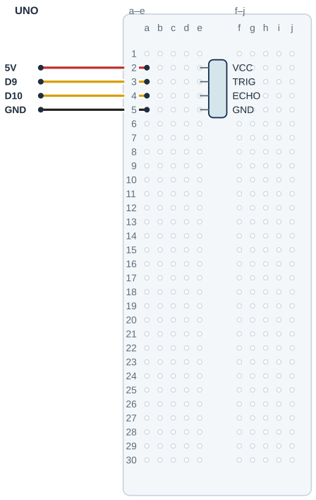

## Tanı • Tahmin et

### Günlük teknolojide

Bazı araç park sensörleri sesin yansımasını kullanır. Sensör süre ölçer; program bu bilgiden uzaklık hesaplar. Sürücüye verilen uyarı da bu ölçümle seçilir. Sen düz bir hedefin mesafesini ölçecek ve cetvelle karşılaştıracaksın.


### Sistemin yolu

**Girdi:** Hedeften dönen yankı → **Hesap:** Süre ölçülür ve hesaplanır → **Çıktı:** Seri Monitör’de bilgi

:::bilgi[Önce düşün]{renk=sari}
Düz hedefi iki kat uzağa götürürsen yankı süresi nasıl değişir? Tahminini ve gerekçeni yaz.
:::

::yaz[Tahminim]{satir=2}

### Parçayı tanı

- HC-SR04, duyma aralığının üstünde ses kullanır. Bir başlık gönderir, diğeri yankıyı algılar.
- VCC ve GND beslemeye gider. TRIG, başlatma girişidir; ECHO, süre bilgisini taşıyan çıkıştır.
- D9, TRIG’e komut gönderir. D10, ECHO’yu okur; iki sinyal aynı şey değildir.
- Dört başlık ucu breadboard’a ayrı satırlarda takılır. Üzerindeki VCC/TRIG/ECHO/GND yazısını doğrula.
- Düz ve sert hedef kullan. Yumuşak veya açılı yüzey güvenilir yankı vermeyebilir.

:::bilgi[Parçanı doğrula · modül etiketi]{renk=gri}
HC-SR04’ün başlığındaki yazıları soldan sağa oku: VCC, Trig, Echo, GND. Sırayı çizimle karşılaştır; farklıysa yerleşimi modülün yazısına göre değiştir (*Parçanı doğrula* sayfası).

::yaz[soldan sağa … / … / … / …]{satir=1}
:::

## TRIG ve ECHO yollarını bağla

| UNO pini | Bağlantı yolu |
|---|---|
| **5V** | HC-SR04 VCC → e2 / a2 |
| **D9** | TRIG → gönderilen darbe |
| **D10** | ECHO → dönüş süresi |
| **GND** | HC-SR04 GND → e5 / a5 |

_Kırmızı: 5 V · Siyah: GND · Sarı: dijital · Turkuaz: analog_

_Pin adı belirleyicidir. Parçanın uç sırasını ve bakış yönünü doğrula._

### Adım adım kur

1. USB kablosunu çıkar; HC-SR04 başlığındaki uç yazılarını kontrol et.
2. Doğrulanmış örnekte VCC e2, TRIG e3, ECHO e4, GND e5’tir. Sıra farklıysa yerleşimi modülün yazısına göre uyarla.
3. UNO 5 V → a2 ve UNO GND → a5 bağlantılarını yap.
4. UNO D9’u a3’e bağla; bu yol TRIG’e gider.
5. UNO D10’u a4’e bağla; bu yol ECHO’ya gider.
6. Dört ayrı yolu ve model yazılarını kontrol et; sonra USB’yi tak.

:::dikkat{renk=kirmizi}
Modül uçlarını tek seri zincir gibi birleştirme. D9 ve D10 farklı görevler taşır. Her bağlantı değişikliğinden önce USB’yi çıkar; sensörün metal başlıklarını zorlama.
:::

:::bilgi[Ölçümü izle]{renk=mavi}
Programı yükle; Seri Monitör’ü 9600 baud aç. Düz ve sert hedefi karşıda tut. Satırda süre us (µs), mesafe cm ile gösterilir.
:::

### Kendi deliklerin

Kurduktan sonra her ucun gerçekte hangi deliğe girdiğini yaz ve çizimle karşılaştır.

| Uç | Çizimdeki delik | Benim deliğim |
|---|---|---|
| VCC | e2 |   |
| TRIG | e3 |   |
| ECHO | e4 |   |
| GND | e5 |   |
| D9 / D10 jumper’ı | a3 / a4 |   |
| 5 V / GND jumper’ı | a2 / a5 |   |

## HC-SR04’ü yerleştir



- **Örnek başlık sırası:** VCC e2 · TRIG e3
- **Örnek başlık (devam):** ECHO e4 · GND e5
- **Gönderilen darbe:** D9 → a3; TRIG ile aynı grup
- **Dönüş süresi:** D10 → a4; ECHO ile aynı grup
- **Besleme ve dönüş:** UNO 5 V → a2; a5 → UNO GND
- **Model kontrolü:** Başlık sırası / aralık doğrulanır.
- **Orta kanal:** Gövde kanal üstünde, uçlar e’de.

_Kesişen çizgiler yalnız uçlarında birleşir. Her delikte tek uç vardır._

**Sen çiz (defterine):** kendi modelinin uç adlarını ve delik bağlantılarını göster.

Bu çizim VCC-TRIG-ECHO-GND başlık sırasını kullanır. Modülünün yazılarını, sıra ve aralığı doğrula. Başlık breadboarda takılır; jumper’lar ayrı deliklerden aynı satır gruplarına ulaşır.

## Yankı süresini mesafeye çevir

```cpp title="TAM PROGRAM · P09" start=1 dosya=p09_ultrasonik_sensorle_mesafe
const byte trigPini = 9;
const byte echoPini = 10;
const byte darbeHazirlikUs = 2;
const byte tetiklemeUs = 10;
const unsigned long zamanAsimiUs = 30000UL;
const unsigned long haberlesmeHizi = 9600;
const byte beklemeMs = 100;
const float sesHiziCmUs = 0.0343;
const float yakinEsigiCm = 10.0;
const byte ondalikBasamak = 1;

unsigned long yankiyiOlc() {
  digitalWrite(trigPini, LOW);
  delayMicroseconds(darbeHazirlikUs);
  digitalWrite(trigPini, HIGH);
  delayMicroseconds(tetiklemeUs);
  digitalWrite(trigPini, LOW);
  return pulseIn(echoPini, HIGH, zamanAsimiUs);
}

void setup() {
  pinMode(trigPini, OUTPUT);
  pinMode(echoPini, INPUT);
  Serial.begin(haberlesmeHizi);
}

void loop() {
  unsigned long sureUs = yankiyiOlc();
  if (sureUs == 0) {
    Serial.println("Olcum yok");
  } else {
    float mesafeCm = sureUs * sesHiziCmUs / 2; // 2: ses gider ve döner
    Serial.print(sureUs);
    Serial.print(" us: ");
    Serial.print(mesafeCm, ondalikBasamak);
    Serial.println(" cm");
    if (mesafeCm < yakinEsigiCm) Serial.println("Cok yakin!");
  }
  delay(beklemeMs);
}
```

### Kodun mantığı

1. yankiyiOlc(), TRIG’i LOW ile hazırlar; sonra 10 µs HIGH darbesi gönderir.
2. return pulseIn(...), ECHO’nun HIGH süresini veya zaman aşımında 0’ı çağrıldığı yere verir.
3. setup(), TRIG’i OUTPUT, ECHO’yu INPUT yapar; 9600 baud haberleşmeyi başlatır.
4. loop(), sureUs sonucunu alır. 0 ise yalnız Olcum yok yazar; mesafe hesabına girmez.
5. float mesafeCm, süreyi ses hızıyla çarpıp ikiye böler.
6. Süre us (µs), mesafe cm ile yazılır. 10 cm örnek eşiğinin altında Cok yakin! çıkar; 100 ms sonra yeniden ölçülür.

## Yankı yoksa ölçüm üretme

### Hata avcısı

| Belirti | Olası neden | Ne yap? |
|---|---|---|
| Hep Olcum yok | Hedef veya sinyal yolları uygun değil | Düz, sert hedefi dene. Düzelmezse USB’yi çıkar; TRIG–D9, ECHO–D10, besleme ve GND yollarını kontrol et. |
| Cetvel ile fark var | Ölçüm başlangıcı veya yüzey farklı | Cetvelin sıfırını sensör başlıklarının ön yüzünden al. Aynı düz hedefi karşıda tut; birkaç okumayı kaydet. |
| Uyarı sınırda değişiyor | Yaklaşık ölçüm eşik çevresinde dalgalanıyor | Hedefi sabitle; okuma aralığını ve mesajları birlikte kaydet. Tek ölçümü kesin uzaklık sayma. |

:::bilgi[Bir işi adlandır]{renk=mavi}
Fonksiyon, bir işi adlandıran kod bölümüdür. yankiyiOlc() çağrısı tetiklemeyi yapar ve return ile süreyi geri verir. unsigned long, pulseIn sonucunu mikrosaniye cinsinden tutar.
:::

:::bilgi[Gidiş ve dönüşü ayır]{renk=mavi}
Yaklaşık 20 °C için:

mesafe = süre × 0,0343 cm/µs / 2.

Süre gidiş ve dönüşü içerir. 2’ye bölmek tek yönü verir. Sesin hızı sıcaklığa göre değişir.
:::

:::bilgi[Zaman aşımını yorumla]{renk=sari}
pulseIn 0 döndürürse zaman aşımı dalı çalışır. Bu durumda santimetre hesabı yapılmaz. “Olcum yok” uzaklık değeri değildir; boş ölçümü 0 cm diye tabloya yazma.
:::

### Ölç ve karşılaştır

Düz bir hedefi cetvelle ölçtüğün uzaklığa koy. Seri Monitör’deki süreyi ve hesaplanan mesafeyi yaz; farkı bul.

| Cetvelle | Süre (µs) | Hesaplanan cm | Fark (hesap − cetvel) |
|---|---|---|---|
| 15 cm |   |   |   |
| 25 cm |   |   |   |
| 35 cm |   |   |   |
| 45 cm |   |   |   |

## Mesafe ölçümlerini karşılaştır

Önce tahminini yaz. Denemeden sonra gerçek gözlemini boş hücreye kaydet.

| Deneme | Tahminim | Süre / cm / mesaj |
|---|---|---|
| Düz hedef: cetvelde 10 cm; süre ve cm için üç okuma al. |   |   |
| Aynı hedef: cetvelde 20 cm; süre ve cm için üç okuma al. |   |   |
| Hedefi açılandır; okumayı veya Olcum yok mesajını kaydet. |   |   |
| Hedef sabitken yalnız yakınlık eşiğini değiştir. |   |   |

:::bilgi[Bir değişiklik yap]{renk=mavi}
Düz hedefi sabit tut. Yalnız yakinEsigiCm değerini 10’dan 20’ye değiştir. Mesafeyi ve uyarı mesajını karşılaştır; sonra 10’a dön.
:::

::yaz[Tahminim ve gözlemim]{satir=3}

### Değişiklik sürümleri

“Bir değişiklik yap” sürümleri; ana programla yan yana açıp farkı bul.

```cpp title="Değişiklik sürümü · p09_esik_20" start=1 dosya=p09_esik_20
const byte trigPini = 9;
const byte echoPini = 10;
const byte darbeHazirlikUs = 2;
const byte tetiklemeUs = 10;
const unsigned long zamanAsimiUs = 30000UL;
const unsigned long haberlesmeHizi = 9600;
const byte beklemeMs = 100;
const float sesHiziCmUs = 0.0343;
const float yakinEsigiCm = 20.0;
const byte ondalikBasamak = 1;

unsigned long yankiyiOlc() {
  digitalWrite(trigPini, LOW);
  delayMicroseconds(darbeHazirlikUs);
  digitalWrite(trigPini, HIGH);
  delayMicroseconds(tetiklemeUs);
  digitalWrite(trigPini, LOW);
  return pulseIn(echoPini, HIGH, zamanAsimiUs);
}

void setup() {
  pinMode(trigPini, OUTPUT);
  pinMode(echoPini, INPUT);
  Serial.begin(haberlesmeHizi);
}

void loop() {
  unsigned long sureUs = yankiyiOlc();
  if (sureUs == 0) {
    Serial.println("Olcum yok");
  } else {
    float mesafeCm = sureUs * sesHiziCmUs / 2; // 2: ses gider ve döner
    Serial.print(sureUs);
    Serial.print(" us: ");
    Serial.print(mesafeCm, ondalikBasamak);
    Serial.println(" cm");
    if (mesafeCm < yakinEsigiCm) Serial.println("Cok yakin!");
  }
  delay(beklemeMs);
}
```

### Kendini kontrol et

**1.** D9 TRIG’e mi, ECHO’ya mı gider?

::yaz[Cevabım]{satir=2}

**2.** Süreyi ses hızıyla çarptıktan sonra neden ikiye böleriz?

::yaz[Cevabım]{satir=2}

**3.** pulseIn 0 döndürürse hangi mesajı seçersin; neden cm yazmazsın?

::yaz[Cevabım]{satir=2}

**Sen çiz (defterine):** hedef uzaklığı, yankı süresi ve ölçüm yok durumunu göster.

**Evde devam et:** Bir park sensörünün uyarısını yetişkinle gözle. Mesafe değişimiyle uyarının değişimini ayır; çalışan aracın arkasında durma.

**Şimdi sıra sende:** [Proje 7](proje:7) içindeki eşik fikrini kullan. Sabit bir hedef için iki yakınlık mesajı öner; her denemede yalnız eşiği değiştir.

::yaz[Fikrim]{satir=3}

**Kendimi değerlendiriyorum:** Yardımla yaptım · Biraz yardımla · Tek başıma · Başkasına anlatabilirim

::yaz[Bu projeyi nasıl yaptım? Neden?]{satir=1}

:::bilgi[Biliyor muydun?]{renk=sari}
HC-SR04 tetiklemeden sonra bir ultrasonik ses paketi gönderir. ECHO’nun süre bilgisi, hedefe gidiş ve dönüşü birlikte taşır.
:::
