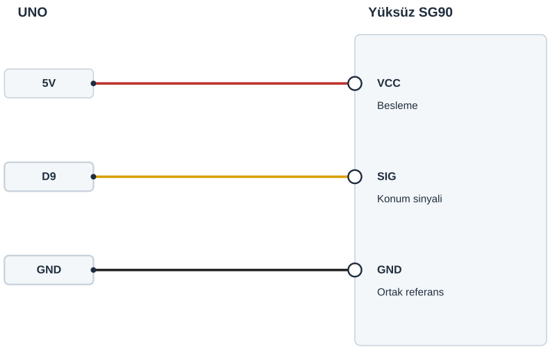

## Tanı • Tahmin et

### Günlük teknolojide

Otopark bariyeri ve robot kol eklemi kontrollü hareket kullanır. Konum komutu, mekanizmanın bir yere gitmesini ister. Sen küçük bir servonun kolunu üç komutla gözleyeceksin. Bu sınıf deneyi, gerçek bir bariyeri sürmek için tasarlanmadı.


### Sistemin yolu

**Girdi:** Programdaki konum komutu → **İşlem:** Servo sinyali üretilir → **Çıktı:** Kol hareket eder

:::bilgi[Önce düşün]{renk=sari}
Bekleme süresini 1000 ms’den 500 ms’ye indirirsen üç farklı komutun sayısı değişir mi? Gerekçeni yaz.
:::

::yaz[Tahminim]{satir=2}

### Parçayı tanı

- Servo, verilen konuma gitmeye çalışan bir motordur. SG90’ın besleme, GND ve sinyal olmak üzere üç ucu vardır.
- Sık görülen kablo renkleri kırmızı, kahverengi ve turuncudur. Renk tek başına kanıt değildir; modelin uç adlarını doğrula.
- Servo.h, servo sinyali üretmek için hazır kod sağlar. Bu hazır kod grubuna kütüphane denir.
- Servo motor; satırı motor adında bir denetim nesnesi oluşturur. motor.attach ve motor.write bu nesneye bağlı komutlardır.
- Sinyal, kısa darbelerle konum bilgisini taşır; motorun gücü besleme ucundan gelir. D9 motorun güç kaynağı değildir.

## Servonun üç yolunu ayır

| UNO pini | Bağlantı yolu |
|---|---|
| **5V** | SG90 VCC · doğrulanmış dişi yuva |
| **D9** | SG90 SIG · dişi sinyal yuvası |
| **GND** | SG90 GND · dişi dönüş yuvası |

_Kırmızı: 5 V · Siyah: GND · Sarı: dijital · Turkuaz: analog_

_Renk değil pin adı belirleyicidir. Dişi servo yuvalarını modelinden doğrula._

### Adım adım kur

1. USB’yi çıkar. Yüksüz motoru sabitle; yalnız kendi kolu takılı olsun.
2. Kablo renklerini ve VCC, SIG, GND yuvalarını model belgesinden oku; sık görülen düzen kahverengi GND, kırmızı VCC, turuncu SIG’dir.
3. Bir erkek jumper ucunu SIG dişi yuvasına, diğerini UNO D9’a tak.
4. VCC dişi yuvasını bir jumper ile UNO 5 V’a bağla.
5. GND dişi yuvasını bir jumper ile UNO GND’ye bağla.
6. Üç ayrı yolu ve besleme uygunluğunu kontrol et; sonra USB’yi tak.

:::dikkat{renk=kirmizi}
Yalnız yüksüz, 5 V besleme ve akım uygunluğu öğretmence doğrulanmış tek SG90 kullan; yük, kapak veya robot kol bağlama. Reset, güçlü titreme, ısınma ya da sıkışmada USB’yi çıkar; yük gerekiyorsa ayrı regüle 5 V ve ortak GND gerekir. Uygunluk belirsizse enerji verme.
:::

:::bilgi[Kütüphaneyi tanı]{renk=mavi}
Servo.h bu programın kütüphanesidir. Programı önce derle; hatasızsa yükle. Servo.h bulunamazsa Arduino’nun Servo kütüphanesini Kütüphane Yöneticisi’nden kur.
:::

### Kendi bağlantıların

Bağladıktan sonra her dişi yuvanın gerçekte hangi UNO pinine gittiğini yaz ve şemayla karşılaştır.

| Yuva | Şemadaki pin | Benim pinim |
|---|---|---|
| SG90 VCC yuvası | UNO 5 V |   |
| SG90 SIG yuvası | UNO D9 |   |
| SG90 GND yuvası | UNO GND |   |

## SG90 konnektörünü şemayla eşleştir



Erkek jumper uçları, doğrulanmış dişi yuvalara ayrı ayrı girer.

Şema işlevleri gösterir; fiziksel konnektör sırasını modelinden doğrula.

P10’da breadboard kullanılmaz. Sinyal motoru beslemez.

_Kesişen çizgiler yalnız uçlarında birleşir._

**Sen çiz (defterine):** gerçek modelinin uç adlarını ve doğruladığın bağlantıları göster.

Şema, üç dişi yuvayı işlev adıyla gösterir; evrensel fiziksel sıra iddiası değildir. Erkek jumper uçları doğrudan UNO’ya gider.

:::bilgi[Model ve komut aralığı]{renk=mavi}
Konum denetimli SG90 gerekir; sürekli dönen model bu programa uygun değildir. 45–135 komut aralığı, kütüphanenin varsayılan sinyal ayarıyla kullanılır. Bu komutlar her servoda kesin fiziksel derece veya güvenlik garantisi değildir. Kolu elle zorlama.
:::

## Üç konum komutunu programla

```cpp title="TAM PROGRAM · P10" start=1 dosya=p10_servo_motoru_kontrol_et
#include <Servo.h>
Servo motor;
const byte servoPini = 9;
const byte ilkAci = 45;
const byte ortaAci = 90;
const byte sonAci = 135;
const unsigned int beklemeMs = 1000;

void setup() {
  motor.attach(servoPini);
  motor.write(ortaAci);
  delay(beklemeMs);
}

void loop() {
  motor.write(ilkAci);
  delay(beklemeMs);
  motor.write(ortaAci);
  delay(beklemeMs);
  motor.write(sonAci);
  delay(beklemeMs);
}
```

### Kodun mantığı

1. #include, Servo.h kütüphanesini programa dahil eder; Servo motor, denetim nesnesidir.
2. attach, D9’u servo sinyal pini yapar. Sinyal ayarı kütüphanenin varsayılanıdır; programda ek sayı yoktur.
3. setup(), ilk olarak 90 komutunu verir. loop(), 45, 90 ve 135 komutlarını sırayla tekrarlar.
4. write bir konum komutudur; gerçek açıyı ölçmez. delay, komutlar arasında bekler; varışı doğrulamaz.

### Hata avcısı

| Belirti | Olası neden | Ne yap? |
|---|---|---|
| Servo.h bulunamadı | Servo kütüphanesi ortamda yok | Arduino IDE Kütüphane Yöneticisi’nde Arduino’nun Servo kütüphanesini kur; tekrar derle. |
| Reset, titreme veya ısınma | Besleme, bağlantı veya mekanik sorun | USB’yi çıkar. Uçları ve yük olmadığını kontrol et; düzelmeden deneme. |
| Kol beklediğim yöne bakmıyor | Kolun montajı veya model farklı | Komut ile gözlenen yönü ayrı kaydet. Hareketli kolu elle tutma; montajı USB çıkarılmışken kontrol et. |

### Kodu izle

Her saniyede servoya giden komutu kâğıtta yaz; sonra kolun yönünü gözle.

| Zaman | Komut (derece) | Kolun yönü (gözlem) |
|---|---|---|
| loop 1. saniye |   |   |
| loop 2. saniye |   |   |
| loop 3. saniye |   |   |

## Konum komutunu ve hareketi kaydet

Önce tahminini yaz. Gerçek gözlemini boş hücreye kaydet; programın komutu ölçülmüş açı değildir.

| Deneme | Tahminim | Komut / yön / süre |
|---|---|---|
| 45, 90, 135 sırasını izle; üç tur kaydet. |   |   |
| Yalnız sonAci: 135 → 110. Diğerlerini koru. |   |   |
| 135’e dön; yalnız beklemeMs: 1000 → 500. |   |   |
| 1000’e dön; ilk sıra ve süreyi tekrar kontrol et. |   |   |

:::bilgi[Bir değişiklik yap]{renk=mavi}
Her turda yalnız tek sabiti değiştir. 110 deneyi sonrası sonAci 135’e, 500 ms deneyi sonrası beklemeMs 1000’e dönsün. Kabloları koru.
:::

::yaz[Tahminim ve gözlemim]{satir=3}

### Değişiklik sürümleri

“Bir değişiklik yap” sürümleri; ana programla yan yana açıp farkı bul.

```cpp title="Değişiklik sürümü · p10_bekleme_500" start=1 dosya=p10_bekleme_500
#include <Servo.h>
Servo motor;
const byte servoPini = 9;
const byte ilkAci = 45;
const byte ortaAci = 90;
const byte sonAci = 135;
const unsigned int beklemeMs = 500;

void setup() {
  motor.attach(servoPini);
  motor.write(ortaAci);
  delay(beklemeMs);
}

void loop() {
  motor.write(ilkAci);
  delay(beklemeMs);
  motor.write(ortaAci);
  delay(beklemeMs);
  motor.write(sonAci);
  delay(beklemeMs);
}
```

```cpp title="Değişiklik sürümü · p10_son_110" start=1 dosya=p10_son_110
#include <Servo.h>
Servo motor;
const byte servoPini = 9;
const byte ilkAci = 45;
const byte ortaAci = 90;
const byte sonAci = 110;
const unsigned int beklemeMs = 1000;

void setup() {
  motor.attach(servoPini);
  motor.write(ortaAci);
  delay(beklemeMs);
}

void loop() {
  motor.write(ilkAci);
  delay(beklemeMs);
  motor.write(ortaAci);
  delay(beklemeMs);
  motor.write(sonAci);
  delay(beklemeMs);
}
```

### Kendini kontrol et

**1.** D9 sinyal mi, motor gücü mü taşır?

::yaz[Cevabım]{satir=2}

**2.** write(90) neden ölçülmüş 90° sonucu değildir?

::yaz[Cevabım]{satir=2}

**3.** Bir konumdaki süreyi değiştirirken hangi sabiti seçersin?

::yaz[Cevabım]{satir=2}

**Sen çiz (defterine):** üç komutu ve gördüğün kol yönlerini ayrı ayrı göster.

**Evde devam et:** Bir bariyerin hareketini uzaktan ve yetişkinle gözle. Hareket eden kolun altına girme; yalnız kontrol fikrini çiz.

**Şimdi sıra sende:** Aynı üç komut için bir hareket planı yaz. Denemeden önce süresini tahmin et; her turda yalnız bir değeri değiştir.

::yaz[Fikrim]{satir=3}

**Kendimi değerlendiriyorum:** Yardımla yaptım · Biraz yardımla · Tek başıma · Başkasına anlatabilirim

::yaz[Bu projeyi nasıl yaptım? Neden?]{satir=1}

:::bilgi[Biliyor muydun?]{renk=sari}
Servo kütüphanesi darbeleri zamanlayıcıyla üretir. delay sırasında da sinyal sürer. Beklemek, motora güç vermekle veya konum ölçmekle aynı işlem değildir.
:::
