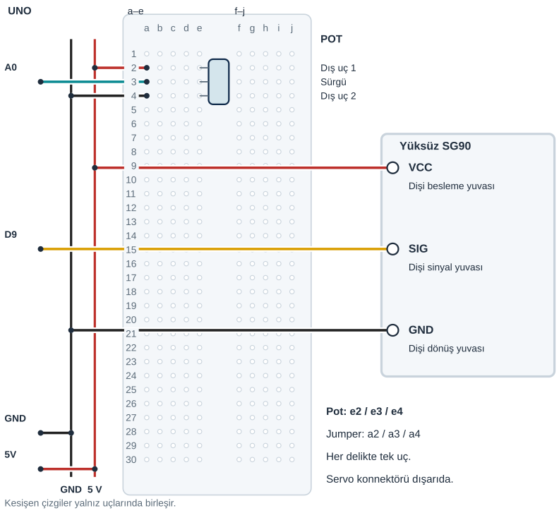

## Tanı • Tahmin et

### Günlük teknolojide

Radyonun düğmesi bir ayarı değiştirir. Model uçaktaki bir mekanizma ise konum değiştirebilir. Bu iki fikir aynı sistemde birleşebilir: giriş okunur, komut hesaplanır ve motor hareket eder. Sen bir potu çevirerek servoya konum komutu göndereceksin.


### Sistemin yolu

**Girdi:** Pot okuması → **Hesap:** map ile komut hesabı → **Çıktı:** Servo hareketi

:::bilgi[Önce düşün]{renk=sari}
Potu aynı yerde tutup üst komutu 135’ten 105’e indirirsen komut değeri nasıl değişir? Tahminini yaz.
:::

::yaz[Tahminim]{satir=2}

### Parçayı tanı

- [Proje 5](proje:5) içindeki potu kullanırsın. İki dış uç beslemeye, sürgü A0’a gider; uçları modelinden doğrula.
- Pot, motorun gücünü doğrudan ayarlamaz. Arduino pot gerilimini okur ve bir komut hesaplar.
- map, 0–1023 okuma aralığını seçilen komut aralığına taşır. Tam sayı hesabını [Proje 5](proje:5) içinde kullandın.
- [Proje 10](proje:10) içindeki yüksüz servo ve attach ayarı korunur. Mekanik yük eklenmez.
- Seri Monitör’deki derece komutu, programın istediği konumdur. Bu devrede gerçek kol açısını ölçen ayrı sensör yoktur.

## Pot ve servo beslemesini raydan dağıt

| UNO pini | Bağlantı yolu |
|---|---|
| **GND** | GND rayı → pot dış uç 2 + SG90 GND |
| **5V** | 5 V rayı → pot dış uç 1 + SG90 VCC |
| **A0** | a3 / e3 · pot sürgüsü |
| **D9** | SG90 SIG · dişi sinyal yuvası |

_Kırmızı: 5 V · Siyah: GND · Sarı: dijital · Turkuaz: analog_

_Renk değil pin adı belirleyicidir. Dişi servo yuvalarını modelinden doğrula._

### Adım adım kur

1. USB’yi çıkar. Pot uçlarını, servo yuvalarını ve ray sürekliliğini doğrula.
2. Örnekte pot dış uç 1 e2, sürgü e3, dış uç 2 e4. Model farklıysa yerleşimi kendi potuna göre uyarla.
3. UNO 5 V’u kırmızı raya, UNO GND’yi siyah raya birer jumper ile bağla.
4. Kırmızı raydan a2’ye, siyah raydan a4’e jumper tak. A0’ı a3’e bağla.
5. Servo VCC dişi yuvasını kırmızı raya; GND dişi yuvasını siyah raya bağla.
6. Servo SIG dişi yuvasını D9’a bağla. Servo gövdesi breadboard’a takılmaz.
7. Ayrı yolları ve güç uygunluğunu kontrol et; sonra USB’yi tak.

:::dikkat{renk=kirmizi}
Yalnız yüksüz, 5 V besleme ve akım uygunluğu öğretmence doğrulanmış tek SG90 kullan; yük, kapak veya robot kol bağlama. Reset, güçlü titreme, ısınma ya da sıkışmada USB’yi çıkar; yük gerekiyorsa ayrı regüle 5 V ve ortak GND gerekir. Uygunluk belirsizse enerji verme.
:::

:::bilgi[Komutu izle]{renk=mavi}
Programı yükle. IDE’de sağ üst Seri Monitör düğmesini aç; 9600 baud seç. Okuma → derece komutu satırını gözle. Motorun gerçek yönünü ayrıca kaydet.
:::

### Kendi deliklerin

Kurduktan sonra her ucun gerçek deliğini ya da pinini yaz ve şemayla karşılaştır.

| Uç | Çizimdeki delik | Benim deliğim |
|---|---|---|
| Pot dış uç 1 / sürgü / dış uç 2 | e2 / e3 / e4 |   |
| 5 V / A0 / GND jumper’ı | a2 / a3 / a4 |   |
| SG90 VCC / GND yuvası | 5 V rayı / GND rayı |   |
| SG90 SIG yuvası | UNO D9 |   |

## Pot ve servoyu şemayla eşleştir



**Sen çiz (defterine):** gerçek modelinin uç adlarını ve doğruladığın bağlantıları göster.

Şema, üç dişi yuvayı işlev adıyla gösterir; evrensel fiziksel sıra iddiası değildir. Pot breadboard’dadır; servo dışarıdadır. Tek UNO 5 V bağlantısı raydan iki parçaya dağıtılır.

:::bilgi[Model ve komut aralığı]{renk=mavi}
Konum denetimli SG90 gerekir; sürekli dönen model bu programa uygun değildir. 45–135 komut aralığı, kütüphanenin varsayılan sinyal ayarıyla kullanılır. Bu komutlar her servoda kesin fiziksel derece veya güvenlik garantisi değildir. Kolu elle zorlama.
:::

## Pot okumasını açı komutuna çevir

```cpp title="TAM PROGRAM · P11" start=1 dosya=p11_potansiyometreyle_servo
#include <Servo.h>
Servo motor;
const byte potPini = A0;
const byte servoPini = 9;
const int adcAlt = 0;
const int adcUst = 1023;
const byte aciAlt = 45;
const byte aciUst = 135;
const byte ortaAci = 90;
const unsigned long haberlesmeHizi = 9600;
const byte beklemeMs = 50;

void setup() {
  motor.attach(servoPini);
  motor.write(ortaAci);
  Serial.begin(haberlesmeHizi);
}

void loop() {
  int okuma = analogRead(potPini);
  int aci = map(okuma, adcAlt, adcUst, aciAlt, aciUst);
  motor.write(aci);
  Serial.print(okuma);
  Serial.print(" -> ");
  Serial.print(aci);
  Serial.println(" derece komutu");
  delay(beklemeMs);
}
```

### Kodun mantığı

1. attach ve ilk 90 komutu, [Proje 10](proje:10) içindeki ayarı kullanır; Serial.begin 9600 baud açar.
2. analogRead, A0 okumasını alır. map, okuma aralığını 45–135 komut aralığına taşır.
3. motor.write, hesaplanan komutu gönderir. Ekran okuma ve derece komutu yazar; gerçek açı ölçmez.
4. 50 ms bekleme döngüyü yavaşlatır. Pot sabitken küçük okuma değişimleri komutu da değiştirebilir.

### Hata avcısı

| Belirti | Olası neden | Ne yap? |
|---|---|---|
| Hep aynı komut | Sürgü veya analog yol yanlış | USB’yi çıkar; sürgü e3 / A0 a3 yolunu ve ayrı dış uçları kontrol et. Uçları görünüşten tahmin etme. |
| Sabit potta titreme veya reset | Okuma, güç veya mekanik sorun | Komut ve hareketi ayır. Reset veya güçlü titremede USB’yi çıkar; kablo, model ve beslemeyi kontrol et. |
| Ekranda bozuk yazı | Seri Monitör hızı farklı | Doğru portu ve yüklenen programı kontrol et; Seri Monitör’ü 9600 baud seç. |

### Kodu izle

map, okumayı 0–1023’ten 45–135 komutuna taşır. Kâğıtta hesapla: 0 → … · 512 → … · 1023 → … derece. Sonra Seri Monitör ile karşılaştır.

::yaz[Cevaplarım]{satir=2}

## Pot, komut ve hareketi kaydet

Önce tahminini yaz. Gerçek gözlemini boş hücreye kaydet; programın komutu ölçülmüş açı değildir.

| Deneme | Tahminim | Okuma / komut / yön |
|---|---|---|
| Potu bir uca yavaşça getir; okuma ve komutu kaydet. |   |   |
| Orta yerde ve diğer uçta okuma / komut / yönü kaydet. |   |   |
| Aynı pot yerinde yalnız aciUst: 135 → 105. |   |   |
| 135’e dön; pot sabitken beş okuma ve komut kaydet. |   |   |

:::bilgi[Bir değişiklik yap]{renk=mavi}
Yalnız aciUst değerini 135’ten 105’e indir; potun yerini koru. Eski ve yeni komutu karşılaştır, sonra 135’e dön. Kablolar değişmesin.
:::

::yaz[Tahminim ve gözlemim]{satir=3}

### Değişiklik sürümleri

“Bir değişiklik yap” sürümleri; ana programla yan yana açıp farkı bul.

```cpp title="Değişiklik sürümü · p11_ust_105" start=1 dosya=p11_ust_105
#include <Servo.h>
Servo motor;
const byte potPini = A0;
const byte servoPini = 9;
const int adcAlt = 0;
const int adcUst = 1023;
const byte aciAlt = 45;
const byte aciUst = 105;
const byte ortaAci = 90;
const unsigned long haberlesmeHizi = 9600;
const byte beklemeMs = 50;

void setup() {
  motor.attach(servoPini);
  motor.write(ortaAci);
  Serial.begin(haberlesmeHizi);
}

void loop() {
  int okuma = analogRead(potPini);
  int aci = map(okuma, adcAlt, adcUst, aciAlt, aciUst);
  motor.write(aci);
  Serial.print(okuma);
  Serial.print(" -> ");
  Serial.print(aci);
  Serial.println(" derece komutu");
  delay(beklemeMs);
}
```

### Kendini kontrol et

**1.** Potun sürgüsü hangi UNO pinine gider?

::yaz[Cevabım]{satir=2}

**2.** Ekrandaki komut neden gerçek açı ölçümü değildir?

::yaz[Cevabım]{satir=2}

**3.** Okuma 512 ise 45–135 aralığında map hangi komutu üretir?

::yaz[Cevabım]{satir=2}

**Sen çiz (defterine):** pot okuması, hesaplanan komut ve gördüğün hareketi ayır.

**Evde devam et:** Bir döner ayar düğmesinin değiştirdiği bilgiyi düşün. Giriş, hesap ve hareketi üç ayrı kutuda çiz.

**Şimdi sıra sende:** [Proje 5](proje:5) içindeki LED ayarıyla bu devreyi karşılaştır. Aynı pot okumasının iki farklı çıkışa nasıl dönüştüğünü anlat.

::yaz[Fikrim]{satir=3}

**Kendimi değerlendiriyorum:** Yardımla yaptım · Biraz yardımla · Tek başıma · Başkasına anlatabilirim

::yaz[Bu projeyi nasıl yaptım? Neden?]{satir=1}

:::bilgi[Biliyor muydun?]{renk=sari}
Servo sinyali için analogWrite kullanmazsın. Servo.h kendi darbelerini üretir; bir konum komutu, LED parlaklığındaki görev döngüsüyle aynı şey değildir.
:::
