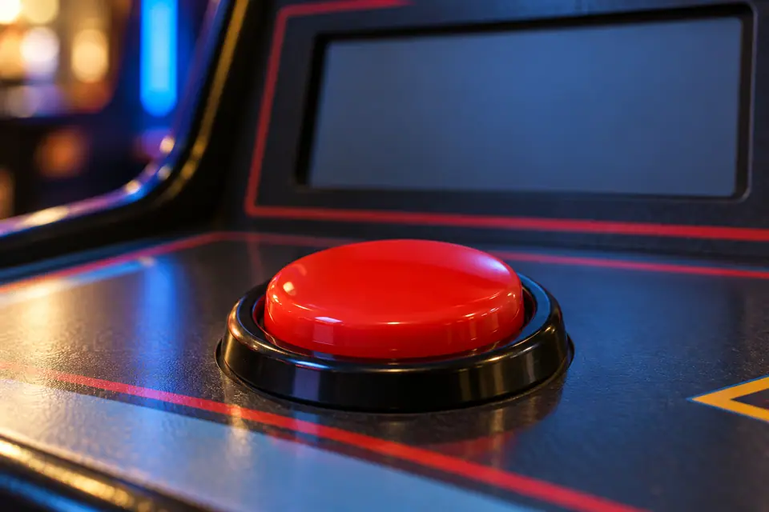
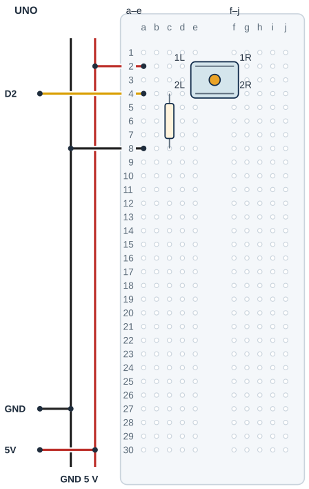

## Tanı • Tahmin et

### Günlük teknolojide

Bir oyun butonu bir olayı başlatır. Turnike ve deney sayaçları da olayları sayıya çevirir. Sen bir değişkende skor tutacak ve sonucu Seri Monitör’de izleyeceksin. Butonun fiziksel davranışıyla programın kabul ettiği olayı karşılaştıracaksın.



### Sistemin yolu

**Girdi:** Butonun durumu → **Karar:** Kararlı basış olayı → **Çıktı:** Ekrandaki skor

:::bilgi[Önce düşün]{renk=sari}
Artış 5 olarak kalsın. Yalnız hedefi 20’den 30’a çıkarırsan hedef için gereken basış sayısı nasıl değişir? Gerekçeni yaz.
:::

::yaz[Tahminim]{satir=2}

### Parçayı tanı

- [Proje 4](proje:4) içindeki 10 kΩ pull-down bağlantısını kullanırsın. Bırakılmış buton LOW, basılı buton HIGH okunur.
- Kontak sıçraması (bounce), metal uçların kısa süreli açılıp kapanmasıdır. Kodda ham değişkeni o anki okumayı, kararli değişkeni ise kabul edilen durumu tutar.
- millis(), programın başlamasından beri geçen milisaniyeyi sayar. unsigned long uzun bir zaman sayısını saklar.
- Kenar algılama, kabul edilmiş durumun değişimini bulur. Sayaç, kararlı bırakılmış durumdan basılı duruma geçişte güncellenir.
- Bekleme değeri yazılımın ayarıdır; her buton için kusursuz sayım garantisi değildir. Çok kısa basış veya bırakış kabul edilmeyebilir.

## Buton girişini kur

| UNO pini | Bağlantı yolu |
|---|---|
| **GND** | GND rayı → 10 kΩ dönüşü |
| **5V** | 5 V rayı → buton grup 1 |
| **D2** | a4 → buton grup 2 + 10 kΩ |

_Kırmızı: 5 V · Siyah: GND · Sarı: dijital · Pin adı belirleyicidir._

### Adım adım kur

1. USB’yi çıkar. Butonun iç çiftlerini uç bulucuyla bul (yöntem A, *Parçanı doğrula* sayfası).
2. Örnekte butonu kanal üstüne e2/f2 ve e4/f4 uçlarıyla tak. Gerçek aralık farklıysa uyarla.
3. UNO 5 V’u kırmızı raya, GND’yi siyah raya birer jumper ile bağla.
4. Kırmızı rayı a2’ye; D2’yi a4’e bağla. Buton ve jumper ayrı deliklerde olsun.
5. 10 kΩ direnci c4–c8 arasına tak; a8’i GND rayına bağla.
6. Bırakılmış ve basılı durumda yolları kontrol et; butonu bırak, sonra USB’yi tak.

:::dikkat{renk=kirmizi}
Basıldığında 5 V ve GND dirençsiz birleşmemeli; harici 10 kΩ pull-down korunur ve giriş INPUT kalır. Uçları değiştirmeden önce USB’yi çıkar. Bu devre yalnız USB 5 V içindir.
:::

_Kart ve portu seç; programı önce derle, sonra yükle. Seri Monitör’ü 9600 baud aç._

:::bilgi[Parçanı doğrula · buton uçları]{renk=gri}
Dört bacaklı butonda iki bacak her zaman bağlıdır. Anahtarlanan çifti uç bulucuyla bul (yöntem A, *Parçanı doğrula* sayfası); uç bulucu programındaki LED yalnız basınca yanıyorsa çift doğrudur.

::yaz[her zaman bağlı çift … / … · anahtarlanan çift … / …]{satir=1}
:::

### Kendi deliklerin

Kurduktan sonra her ucun gerçekte hangi deliğe girdiğini yaz ve çizimle karşılaştır. Butonun iki çifti kanalın iki yanında kalmalı.

| Uç | Çizimdeki delik | Benim deliğim |
|---|---|---|
| Buton üst çift | e2 / f2 |   |
| Buton alt çift | e4 / f4 |   |
| 10 kΩ direnç | c4 → c8 |   |
| 5 V / D2 jumper’ı | a2 / a4 |   |
| GND jumper’ı | a8 |   |

## Butonu breadboard’a yerleştir



- **Buton uçları:** e2/f2 ve e4/f4
- **İç çiftler:** Aynı numaralı uçlar bağlı.
- **Basınca:** İki ayrı grup birleşir.
- **D2 girişi:** a4: buton ve direnç düğümü
- **Pull-down:** 10 kΩ: c4-c8
- **Güç ve dönüş:** 5 V a2; GND a8
- **Gerçek model:** Çiftleri ve aralığı doğrula.

_Kesişen çizgiler yalnız uçlarında birleşir. Her delikte tek uç vardır._

**Sen çiz (defterine):** gerçek modelinin uçlarını ve doğruladığın satırları göster.

Butonun iç çiftleri örnekte e2–f2 ve e4–f4’tür. Basınca bu iki grup birleşir. D2 a4, buton e4 ve direnç c4 aynı grupta, ayrı deliklerdedir. İç çiftleri ve aralığı gerçek modelinde doğrula.

:::bilgi[Modelini eşleştir]{renk=mavi}
Uç aralığı veya sıra farklıysa yerleşimi kendi modeline göre uyarla; bacakları zorlama. Çizim, elindeki parçanın model kimliğini veya güç uygunluğunu kanıtlamaz.
:::

## Kararlı basışla skoru say

```cpp title="TAM PROGRAM · P12" start=1 dosya=p12_butonla_skor_oyunu
const byte butonPini = 2;
const int artis = 5;
const int hedef = 20;
const unsigned long beklemeMs = 30;
const unsigned long haberlesmeHizi = 9600;
int skor = 0;
int sonHam;
int kararli;
unsigned long degisimZamani = 0;

void setup() {
  pinMode(butonPini, INPUT);
  sonHam = digitalRead(butonPini);
  kararli = sonHam;
  Serial.begin(haberlesmeHizi);
  Serial.println("Skor: 0");
}

void loop() {
  int ham = digitalRead(butonPini);
  unsigned long simdi = millis();
  if (ham != sonHam) {
    degisimZamani = simdi;
    sonHam = ham;
  }
  if (simdi - degisimZamani >= beklemeMs && ham != kararli) {
    kararli = ham;
    if (kararli == HIGH) {
      skor += artis;
      Serial.print("Skor: ");
      Serial.println(skor);
      if (skor >= hedef) {
        Serial.println("HEDEF!");
        skor = 0;
        Serial.println("Skor: 0");
      }
    }
  }
}
```

### Kodun mantığı

1. setup, ilk okumayı sonHam ve kararli içine alır; açılışta basılı giriş yeni basış sayılmaz.
2. ham değişirse degisimZamani yenilenir. simdi - degisimZamani, geçen süreyi verir.
3. En az 30 ms değişmeyen yeni durum kabul edilir. && iki koşulun da doğru olmasını ister.
4. Yeni HIGH skoru artis kadar artırır. Hedefe ulaşınca HEDEF! yazılır; skor sıfırlanır ve ekrana yazılır.

### Kodu izle

artis 5, hedef 20’dir. Kâğıtta bul: 1. kabul edilmiş basıştan sonra Seri Monitör … yazar. 4. basıştan sonra sırayla …, … ve … yazar.

::yaz[Cevaplarım]{satir=2}

## Skor hatalarını ayıkla

### Hata avcısı

| Belirti | Olası neden | Ne yap? |
|---|---|---|
| Skor hiç artmıyor | Giriş yolu veya kısa basış | 9600 baud ve programı doğrula. USB’yi çıkar; D2/a4, buton çiftleri ve 10 kΩ yolunu kontrol et. |
| Bir basış birkaç kez sayılıyor | Kontak sıçraması veya kararsız bırakış | Basış ve bırakışları ayır; beklemeMs ayarını tek değişiklikle test et. Her butonda aynı süre yeterli olmayabilir. |
| Ekranda sürekli 0 | Hedefe ulaşma veya reset | HEDEF! mesajını ara. Kart reset oluyorsa USB’yi çıkar; kısa devre ve bağlantıları kontrol et. |

:::bilgi[Zamanı beklerken okumayı sürdür]{renk=mavi}
millis bir zaman sayısı verir. simdi - degisimZamani geçen süreyi bulur. Örneğin son değişim 100 ms ise 129 ms’de yalnız 29 ms geçmiştir. 30 ms ayarı için en az 130 ms’ye ulaşmak gerekir. Program her turda girişi okumayı sürdürür.
:::

:::bilgi[Tek basış ile tutulan seviye]{renk=mavi}
Kabul edilmiş durum değişmedikçe ham != kararli koşulu sağlanmaz. Yeni bir basış için bırakışın da yeterince uzun ve kararlı olması gerekir. += artis, skora artis değerini ekler. &&, iki koşulun birlikte doğru olmasını ister.
:::

### Zaman çizgisi

Kâğıtta dene: başlangıçta buton bırakılmış, kabul edilen durum LOW’dur; beklemeMs 30’dur. Her satırda son değişimden geçen süreyi hesapla; hangi yeni durum kabul edilir?

| t (ms) | Ham okuma | Geçen süre (ms) | Kabul edilen durum |
|---|---|---|---|
| 10 | HIGH |   |   |
| 14 | LOW |   |   |
| 20 | HIGH |   |   |
| 49 | HIGH |   |   |
| 50 | HIGH |   |   |

## Hedefi ve artışı değiştir; skoru kaydet

Önce tahminini yaz. Denemeden sonra gördüğün sayı veya tepkiyi boş alana kaydet.

| Deneme | Tahminim | Gözlemim |
|---|---|---|
| Bırakılmış butonla başlat; bir kez basıp bırak. |   |   |
| Bir basıştan sonra iki saniye basılı tut. |   |   |
| Dört ayrı basış yap; aralarda tamamen bırak. |   |   |
| Yalnız hedef 30; sonra geri dön, yalnız artis 1. |   |   |

:::bilgi[Bir değişiklik yap]{renk=mavi}
Önce yalnız hedefi 20’den 30’a çıkar. Her basış ve bırakışı ayır; basış sayısını kaydet. Hedefi 20’ye döndür. Sonra yalnız artis değerini 5’ten 1’e indir; yeni basış sayısını ölç. İki değişikliği birlikte yapma.
:::

::yaz[Tahminim ve gözlemim]{satir=3}

### Değişiklik sürümleri

“Bir değişiklik yap” sürümleri; ana programla yan yana açıp farkı bul.

```cpp title="Değişiklik sürümü · p12_artis_1" start=1 dosya=p12_artis_1
const byte butonPini = 2;
const int artis = 1;
const int hedef = 20;
const unsigned long beklemeMs = 30;
const unsigned long haberlesmeHizi = 9600;
int skor = 0;
int sonHam;
int kararli;
unsigned long degisimZamani = 0;

void setup() {
  pinMode(butonPini, INPUT);
  sonHam = digitalRead(butonPini);
  kararli = sonHam;
  Serial.begin(haberlesmeHizi);
  Serial.println("Skor: 0");
}

void loop() {
  int ham = digitalRead(butonPini);
  unsigned long simdi = millis();
  if (ham != sonHam) {
    degisimZamani = simdi;
    sonHam = ham;
  }
  if (simdi - degisimZamani >= beklemeMs && ham != kararli) {
    kararli = ham;
    if (kararli == HIGH) {
      skor += artis;
      Serial.print("Skor: ");
      Serial.println(skor);
      if (skor >= hedef) {
        Serial.println("HEDEF!");
        skor = 0;
        Serial.println("Skor: 0");
      }
    }
  }
}
```

```cpp title="Değişiklik sürümü · p12_hedef_30" start=1 dosya=p12_hedef_30
const byte butonPini = 2;
const int artis = 5;
const int hedef = 30;
const unsigned long beklemeMs = 30;
const unsigned long haberlesmeHizi = 9600;
int skor = 0;
int sonHam;
int kararli;
unsigned long degisimZamani = 0;

void setup() {
  pinMode(butonPini, INPUT);
  sonHam = digitalRead(butonPini);
  kararli = sonHam;
  Serial.begin(haberlesmeHizi);
  Serial.println("Skor: 0");
}

void loop() {
  int ham = digitalRead(butonPini);
  unsigned long simdi = millis();
  if (ham != sonHam) {
    degisimZamani = simdi;
    sonHam = ham;
  }
  if (simdi - degisimZamani >= beklemeMs && ham != kararli) {
    kararli = ham;
    if (kararli == HIGH) {
      skor += artis;
      Serial.print("Skor: ");
      Serial.println(skor);
      if (skor >= hedef) {
        Serial.println("HEDEF!");
        skor = 0;
        Serial.println("Skor: 0");
      }
    }
  }
}
```

### Kendini kontrol et

**1.** Pull-down direncinin değeri ve buton giriş pini nedir?

::yaz[Cevabım]{satir=2}

**2.** ham ile kararli neden iki ayrı değişkendir?

::yaz[Cevabım]{satir=2}

**3.** Bir basış uzun sürünce tekrar sayımı engelleyen koşulu kodda göster.

::yaz[Cevabım]{satir=2}

**Sen çiz (defterine):** giriş, süre ve çıkış için üç ayrı kutu oluştur.

**Evde devam et:** Bir oyun veya turnike sayacı düşün. Sayılan olayı ve ekranda tuttuğu bilgiyi kâğıtta göster.

**Şimdi sıra sende:** Hedefe ulaşıldığını ses yerine bir ekran mesajıyla anlatan yeni bir oyun kuralını kâğıtta tasarla.

::yaz[Fikrim]{satir=3}

**Kendimi değerlendiriyorum:** Yardımla yaptım · Biraz yardımla · Tek başıma · Başkasına anlatabilirim

::yaz[Bu projeyi nasıl yaptım? Neden?]{satir=1}

:::bilgi[Biliyor muydun?]{renk=sari}
Mekanik bir butonun tek basışı birden fazla kısa elektriksel değişim oluşturabilir. Yazılım bu değişimleri süzebilir; ayar yine gerçek butonla sınanır.
:::
