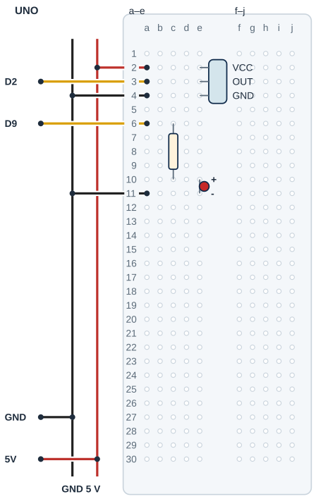

## Tanı • Tahmin et

### Günlük teknolojide

Bir banttaki kutular optik algılayıcıların önünden geçer. Program, sensörün verdiği bilgiyle sayım yapar. Sen masada küçük bir cismi yaklaştırıp uzaklaştıracak; gerçek geçişlerle ekrandaki sayıyı karşılaştıracaksın. Sınıf devresi bir fabrika güvenlik sistemi değildir.


### Sistemin yolu

**Girdi:** IR çıkış seviyesi → **Karar:** Yeni kararlı algılama → **Çıktı:** Sayaç ve LED

:::bilgi[Önce düşün]{renk=sari}
Yalnız beklemeMs değerini 40’tan 5’e indir. Aynı cismi yavaşça yaklaştırırken sayaçta ne değişebilir? Tahminini yaz.
:::

::yaz[Tahminim]{satir=2}

### Parçayı tanı

- Bu örnek, 5 V’a uygun üç uçlu dijital IR engel modülü içindir. VCC, OUT ve GND sırasını modelinden doğrula.
- Modül kızılötesi ışık gönderir ve geri yansımayı algılar. Bir uzaklık sayısı vermez; çıkış iki seviyelidir. Tek IR sensörü geçiş yönünü belirlemez; yalnız yeni algılamaları sayar.
- Örnekte engel varken OUT LOW kabul edilir. Ekrandaki Durum satırıyla boş alan ve cisim durumunu kendi modelinde test et.
- Yüzey rengi, açı ve ortam ışığı algılamayı etkiler. Mesafe vidası santimetre ölçeği değildir; evrensel menzil varsayma.
- [Proje 12](proje:12) içindeki kararlı durum fikri kullanılır. Açılıştaki durum başlangıç alınır; mevcut cisim yeni geçiş sayılmaz.

## IR çıkışını ve LED’i ayır

| UNO pini | Bağlantı yolu |
|---|---|
| **GND** | GND rayı → IR / LED dönüşü |
| **5V** | 5 V rayı → IR VCC a2 / e2 |
| **D2** | IR OUT a3 / e3 |
| **D9** | a6 → 220 Ω → LED anot |

_Kırmızı: 5 V · Siyah: GND · Sarı: dijital · Pin adı belirleyicidir._

### Adım adım kur

1. USB’yi çıkar; VCC/OUT/GND ve 5 V uygunluğunu doğrula.
2. Örnek modülü e2/e3/e4 satırlarına tak. Erkek başlık breadboard’a girer; uçlar ayrı satırda kalır.
3. UNO 5 V ve GND’yi ayrı raylara birer jumper ile bağla. Raydan a2’ye 5 V, a4’e GND götür.
4. OUT e3 ile aynı gruptaki a3’ü D2’ye bağla.
5. 220 Ω direnci c6–c10 arasına; LED anotunu e10, katodunu e11’e tak. D9 a6’ya, a11 GND rayına gider.
6. Yön, ray ve ayrı delikleri kontrol et; sensörün önü boşken USB’yi tak.

:::dikkat{renk=kirmizi}
Bilinmeyen uca enerji verme; LED’in 220 Ω seri direnci korunur. OUT bir giriş sinyalidir; motor veya yük beslemez. Ayar ve bağlantıda USB’yi çıkar, modülü doğrudan güneşten koru.
:::

_Kart ve portu seç; programı önce derle, sonra yükle. Seri Monitör’ü 9600 baud aç._

:::bilgi[Parçanı doğrula · modül etiketi]{renk=gri}
IR modülünün pin yazısını soldan sağa oku: VCC, OUT, GND (OUT bazen S ya da DO yazar). Sırayı çizimle karşılaştır; farklıysa yerleşimi modülün yazısına göre değiştir ([Parçanı doğrula](genel:parcani-dogrula) sayfası).

::yaz[soldan sağa … / … / …]{satir=1}
:::

### Kendi deliklerin

Kurduktan sonra her ucun gerçekte hangi deliğe girdiğini yaz ve çizimle karşılaştır.

| Uç | Çizimdeki delik | Benim deliğim |
|---|---|---|
| IR VCC / OUT / GND | e2 / e3 / e4 |   |
| 5 V / D2 / GND jumper’ı | a2 / a3 / a4 |   |
| 220 Ω direnç | c6 → c10 |   |
| LED anot / katot | e10 / e11 |   |
| D9 / GND jumper’ı | a6 / a11 |   |

## IR modülünü ve LED’i yerleştir



- **Örnek modül sırası:** VCC e2 · OUT e3 · GND e4
- **Jumper delikleri:** 5 V a2 · D2 a3 · GND a4
- **LED seri direnci:** 220 Ω: c6-c10
- **LED uçları:** Anot e10 · katot e11
- **LED sinyal / dönüş:** D9 a6 · GND a11
- **Modül gövdesi:** Başlık ayrı satırlara girer.
- **Gerçek model:** Pin sırası ve aralık doğrulanır.

_Kesişen çizgiler yalnız uçlarında birleşir. Her delikte tek uç vardır._

**Sen çiz (defterine):** gerçek modelinin uçlarını ve doğruladığın satırları göster.

Örnekte VCC-OUT-GND başlık sırası kullanılır. Gerçek modülün yazısını ve aralığını doğrula. Erkek başlık ayrı satırlara takılır; jumper’lar aynı gruplarda farklı deliklere gider.

:::bilgi[Modelini eşleştir]{renk=mavi}
Uç aralığı veya sıra farklıysa yerleşimi kendi modeline göre uyarla; bacakları zorlama. Çizim, elindeki parçanın model kimliğini veya güç uygunluğunu kanıtlamaz.
:::

## Engel geçişlerini say

```cpp title="TAM PROGRAM · P13 · 1/2 (tanımlar)" start=1 dosya=p13_gecis_sayaci
const byte irPini = 2;
const byte ledPini = 9;
const int engelDegeri = LOW;
const int sayacSiniri = 999;
const unsigned long beklemeMs = 40;
const unsigned long haberlesmeHizi = 9600;
int sayac = 0;
int sonHam;
int kararli;
unsigned long degisimZamani = 0;
```

```cpp title="TAM PROGRAM · P13 · 2/2 (setup ve loop)" start=12 dosya=p13_gecis_sayaci
void setup() {
  pinMode(irPini, INPUT);
  pinMode(ledPini, OUTPUT);
  sonHam = digitalRead(irPini);
  kararli = sonHam;
  Serial.begin(haberlesmeHizi);
  Serial.println("Sayac: 0");
  Serial.print("Ham: ");
  Serial.println(sonHam);
}

void loop() {
  int ham = digitalRead(irPini);
  unsigned long simdi = millis();
  if (ham != sonHam) {
    degisimZamani = simdi;
    sonHam = ham;
  }
  if (simdi - degisimZamani >= beklemeMs && ham != kararli) {
    kararli = ham;
    Serial.print("Durum: ");
    Serial.println(kararli);
    if (kararli == engelDegeri) {
      if (sayac < sayacSiniri) sayac++;
      Serial.print("Sayac: ");
      Serial.println(sayac);
    }
  }
  if (kararli == engelDegeri) {
    digitalWrite(ledPini, HIGH);
  } else {
    digitalWrite(ledPini, LOW);
  }
}
```

### Kodun mantığı

1. setup ilk çıkışı başlangıç alır; Ham satırı bu okumayı gösterir. Sayac: 0 ile sayım başlar.
2. En az 40 ms kararlı yeni durum kabul edilince Durum satırı yazılır.
3. Yeni durum engelDegeri ise sayaç artar. 999’da durur; yeni sayı taşmaz. Reset sayacı sıfırlar.
4. LED kabul edilmiş engel durumunu gösterir. Yeni olay için kararlı boş durum da görülmelidir.

## Sayaç hatalarını ayıkla

### Hata avcısı

| Belirti | Olası neden | Ne yap? |
|---|---|---|
| Sayaç hiç artmıyor | OUT yolu veya çıkış seviyesi | 9600 baud Durum satırını izle. Boş/cisim seviyesini karşılaştır; USB’yi çıkarıp OUT/D2 yolunu kontrol et. |
| Bir cisim iki kez sayılıyor | Algılama sınırında kararsızlık | Aynı yüzey, açı ve ışığı koru. Cismin yerini sabitle; bir değişiklikle bekleme ayarını test et. |
| Hep engel görünüyor | Model, ayar veya ortam ışığı | Çıkış seviyesini doğrula. USB’yi çıkar; ayar vidasını küçük adımlarla çevir, sonra tekrar dene. |

:::bilgi[Çıkış seviyesini modelinde bul]{renk=mavi}
Önce boş alan, sonra aynı cisim için Durum satırını kaydet. Örnekte 0 LOW, 1 HIGH’tır. Engel halinde HIGH veren doğrulanmış modelde yalnız engelDegeri HIGH seçilir. Pin sırası bu yazılım seçimiyle değişmez. Sadece modül ışığına bakarak çıkışı varsayma.
:::

:::bilgi[Geçiş ile sensör olayı aynı olmayabilir]{renk=sari}
Yeni sayım için arada kararlı boş durum gerekir. Çok hızlı iki geçiş tek olay gibi kalabilir. Algılama sınırında bir cisim birkaç olay oluşturabilir. 999 sayaç sınırıdır; sensör menzili değildir. Yeniden başlatınca sayaç sıfırlanır.
:::

### Zaman çizgisi

Kâğıtta dene: 40 ms ayarında her aralığın kabul edilip edilmediğini ve sayacı yaz. Aradaki kısa boş durum kabul edilir mi? Son iki satıra kendi durum çizgini yaz.

| Aralık (ms) | Ham seviye | Süre (ms) | Kabul / sayaç |
|---|---|---|---|
| 0–60 | LOW | 60 |   |
| 60–70 | HIGH | 10 |   |
| 70–130 | LOW | 60 |   |
| Kendi örneğin |   |   |   |
| Kendi örneğin |   |   |   |

## Bekleme ve engel ayarını dene

Önce tahminini yaz. Denemeden sonra gördüğün sayı veya tepkiyi boş alana kaydet.

| Deneme | Tahminim | Gözlemim |
|---|---|---|
| Boş alan ve cisim için Durum seviyelerini kaydet. |   |   |
| Bir geçiş; ardından cismi üç saniye sabit tut. |   |   |
| Üç ayrı geçiş; aralarda alanı kararlı boş bırak. |   |   |
| Yalnız bekleme 5; sonra 40’a dön ve aynı cismi dene. |   |   |

:::bilgi[Bir değişiklik yap]{renk=mavi}
Yalnız beklemeMs 40’tan 5’e insin. Aynı cisim, açı ve ortam ışığında tekrar dene. Fazladan sayım olup olmadığını gözle; olacağını varsayma. Sonra 40’a dön. Model engelde HIGH veriyorsa yalnız engelDegeri ayarını HIGH yap.
:::

::yaz[Tahminim ve gözlemim]{satir=3}

### Değişiklik sürümleri

“Bir değişiklik yap” sürümleri; ana programla yan yana açıp farkı bul.

```cpp title="Değişiklik sürümü · p13_bekleme_5" start=1 dosya=p13_bekleme_5
const byte irPini = 2;
const byte ledPini = 9;
const int engelDegeri = LOW;
const int sayacSiniri = 999;
const unsigned long beklemeMs = 5;
const unsigned long haberlesmeHizi = 9600;
int sayac = 0;
int sonHam;
int kararli;
unsigned long degisimZamani = 0;

void setup() {
  pinMode(irPini, INPUT);
  pinMode(ledPini, OUTPUT);
  sonHam = digitalRead(irPini);
  kararli = sonHam;
  Serial.begin(haberlesmeHizi);
  Serial.println("Sayac: 0");
  Serial.print("Ham: ");
  Serial.println(sonHam);
}

void loop() {
  int ham = digitalRead(irPini);
  unsigned long simdi = millis();
  if (ham != sonHam) {
    degisimZamani = simdi;
    sonHam = ham;
  }
  if (simdi - degisimZamani >= beklemeMs && ham != kararli) {
    kararli = ham;
    Serial.print("Durum: ");
    Serial.println(kararli);
    if (kararli == engelDegeri) {
      if (sayac < sayacSiniri) sayac++;
      Serial.print("Sayac: ");
      Serial.println(sayac);
    }
  }
  if (kararli == engelDegeri) {
    digitalWrite(ledPini, HIGH);
  } else {
    digitalWrite(ledPini, LOW);
  }
}
```

```cpp title="Değişiklik sürümü · p13_engel_high" start=1 dosya=p13_engel_high
const byte irPini = 2;
const byte ledPini = 9;
const int engelDegeri = HIGH;
const int sayacSiniri = 999;
const unsigned long beklemeMs = 40;
const unsigned long haberlesmeHizi = 9600;
int sayac = 0;
int sonHam;
int kararli;
unsigned long degisimZamani = 0;

void setup() {
  pinMode(irPini, INPUT);
  pinMode(ledPini, OUTPUT);
  sonHam = digitalRead(irPini);
  kararli = sonHam;
  Serial.begin(haberlesmeHizi);
  Serial.println("Sayac: 0");
  Serial.print("Ham: ");
  Serial.println(sonHam);
}

void loop() {
  int ham = digitalRead(irPini);
  unsigned long simdi = millis();
  if (ham != sonHam) {
    degisimZamani = simdi;
    sonHam = ham;
  }
  if (simdi - degisimZamani >= beklemeMs && ham != kararli) {
    kararli = ham;
    Serial.print("Durum: ");
    Serial.println(kararli);
    if (kararli == engelDegeri) {
      if (sayac < sayacSiniri) sayac++;
      Serial.print("Sayac: ");
      Serial.println(sayac);
    }
  }
  if (kararli == engelDegeri) {
    digitalWrite(ledPini, HIGH);
  } else {
    digitalWrite(ledPini, LOW);
  }
}
```

### Kendini kontrol et

**1.** OUT hangi UNO pinine, LED hangi pine gider?

::yaz[Cevabım]{satir=2}

**2.** Cisim sensör önünde kalınca neden yeni sayım yapılmayabilir?

::yaz[Cevabım]{satir=2}

**3.** İki geçiş arasındaki boş aralık 40 ms’den kısaysa hangi durum kabul edilmeyebilir?

::yaz[Cevabım]{satir=2}

**Sen çiz (defterine):** giriş, süre ve çıkış için üç ayrı kutu oluştur.

**Evde devam et:** Bir kutu sayma düzeni düşün; tek cisimle yapılan sayımın iki yan yana cisimde neden değişebileceğini çiz.

**Şimdi sıra sende:** [Proje 12](proje:12) buton olayıyla IR olayını karşılaştır. Aynı ham giriş çizgisinde hangi yeni durumun sayıldığını işaretle.

::yaz[Fikrim]{satir=3}

**Kendimi değerlendiriyorum:** Yardımla yaptım · Biraz yardımla · Tek başıma · Başkasına anlatabilirim

::yaz[Bu projeyi nasıl yaptım? Neden?]{satir=1}

:::bilgi[Biliyor muydun?]{renk=sari}
Yansımalı IR engel modülü cisimden geri gelen ışığa bakar. Çıkışın değişmesi kesin bir santimetre ölçümü değildir.
:::
