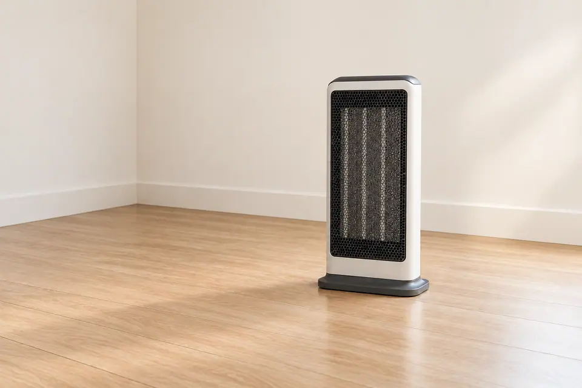
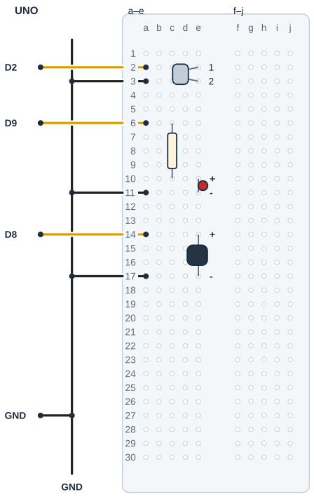

## Tanı • Tahmin et

### Günlük teknolojide

Bazı cihazlar devrilince bir güvenlik anahtarıyla kapanır. Sen bu fikri küçük bir eğim anahtarıyla inceleyeceksin. Sınıf devren yalnız bir LED ve buzzer uyarısı üretir. Fotoğraftaki cihazın elektriğini yönetmez; güvenlik aygıtı yerine kullanılmaz.



### Sistemin yolu

**Girdi:** Anahtarın açık / kapalı durumu → **Karar:** Kararlı konumu kabul et → **Çıktı:** LED ve aktif buzzer

:::bilgi[Önce düşün]{renk=sari}
Yalnız beklemeMs değerini 300’den 50’ye indir. Aynı kısa sallama sırasında uyarı nasıl değişebilir? Tahminini ve nedenini yaz.
:::

::yaz[Tahminim]{satir=2}

### Parçayı tanı

- Bu çizim iki bacaklı mekanik eğim anahtarı içindir. İçindeki metal top yön değişince iki ucu birleştirebilir veya ayırabilir.
- INPUT\_PULLUP, UNO içindeki direnci açar. Anahtar açıkken D2 HIGH, GND’ye kapalıyken LOW okunur.
- [Proje 4](proje:4) içindeki harici pull-down bağlantısından farklıdır: bu girişte 5 V jumper’ı ve 10 kΩ direnç yoktur.
- Bu anahtar kesin eğim derecesi ölçmez. Hangi yerleşimin LOW verdiğini Seri Monitör’de kendin bulursun.
- [Proje 12](proje:12) içindeki zamanla süzme kullanılır. 300 ms bir başlangıç ayarıdır; gerçek anahtarın davranışı deneyle kontrol edilir.

## Eğim girişini ve uyarıyı ayır

| UNO pini | Bağlantı yolu |
|---|---|
| **GND** | GND rayı → anahtar / LED / buzzer |
| **D2** | a2 / e2 → iki uçlu anahtar |
| **D9** | a6 → 220 Ω → LED anot |
| **D8** | a14 / e14 → uygun aktif buzzer + |

_Kırmızı: 5 V · Siyah: GND · Sarı: dijital · Pin adı belirleyicidir._

### Adım adım kur

1. USB’yi çıkar; iki bacaklı anahtarı ve aktif buzzer’ın uygunluğunu doğrula.
2. Örnek eğim anahtarı e2–e3’tedir. D2’yi a2’ye, a3’ü GND rayına bağla; anahtara 5 V bağlama.
3. UNO GND’yi tek jumper ile siyah raya bağla; üç parçanın dönüşü bu raydadır.
4. 220 Ω direnci c6–c10 arasına; LED anotunu e10, katodunu e11’e tak. D9 a6’ya, a11 GND rayına gider.
5. Buzzer + e14, − e17 olsun. D8 a14’e, a17 GND rayına gider; gerçek uç aralığı farklıysa uyarla.
6. Yön, ayrı delikler ve ortak dönüşü kontrol et; sonra USB’yi tak.

:::dikkat{renk=kirmizi}
Yalnız 5 V’ta UNO pinine uygun, en çok 20 mA çeken aktif buzzer kullan; tür, kutup ve akım belirsizse enerji verme, öğretmeninle doğrula. Buzzer’ı kulağa yaklaştırma. Bağlantıda USB çıkarılmış olsun; şebeke elektriği kullanılmaz.
:::

_Kart ve portu seç; programı önce derle, sonra yükle. Seri Monitör’ü 9600 baud aç._

:::bilgi[Parçanı doğrula · eğim anahtarı]{renk=gri}
Eğim anahtarını uç bulucuyla sına (yöntem B, [Parçanı doğrula](genel:parcani-dogrula) sayfası): bir bacak D2’ye, öbürü GND’ye. Bir konumda 1, öbür konumda 0 görmelisin. Buzzer’ın + bacağını gövde yazısından doğrula.

::yaz[düzken … · yatıkken … · buzzer + bacağı …]{satir=1}
:::

### Kendi deliklerin

Kurduktan sonra her ucun gerçekte hangi deliğe girdiğini yaz ve çizimle karşılaştır.

| Uç | Çizimdeki delik | Benim deliğim |
|---|---|---|
| Eğim anahtarı | e2 / e3 |   |
| D2 / GND jumper’ı | a2 / a3 |   |
| 220 Ω · LED anot / katot | c6 → c10 · e10 / e11 |   |
| Buzzer + / − | e14 / e17 |   |
| D9 / D8 / GND jumper’ları | a6 / a14 / a11, a17 |   |

## Eğim anahtarını ve buzzer’ı yerleştir



- **Eğim anahtarı:** İki bacak: e2-e3
- **Giriş ve dönüş:** D2 a2 · GND a3
- **LED seri direnci:** 220 Ω: c6-c10
- **LED uçları:** Anot e10 · katot e11
- **Aktif buzzer:** + e14 · − e17
- **Buzzer sinyal / dönüş:** D8 a14 · GND a17
- **Üç dönüş:** Tek UNO GND raydan dağıtılır.

_Kesişen çizgiler yalnız uçlarında birleşir. Her delikte tek uç vardır._

**Sen çiz (defterine):** gerçek modelinin uçlarını ve doğruladığın satırları göster.

Bu çizim iki bacaklı mekanik anahtar içindir. Gerçek uç aralığını ve buzzer kutuplarını doğrula. Anahtar, LED ve buzzer GND rayını paylaşır; anahtara 5 V bağlanmaz.

:::bilgi[Modelini eşleştir]{renk=mavi}
Uç aralığı veya sıra farklıysa yerleşimi kendi modeline göre uyarla; bacakları zorlama. Çizim, elindeki parçanın model kimliğini veya güç uygunluğunu kanıtlamaz.
:::

## Eğimi kararlı okumayla algıla

```cpp title="TAM PROGRAM · P14 · 1/2 (tanımlar)" start=1 dosya=p14_egim_alarmi
const byte egimPini = 2;
const byte ledPini = 9;
const byte buzzerPini = 8;
const int egikDegeri = LOW;
const unsigned long beklemeMs = 300;
const unsigned long haberlesmeHizi = 9600;
int sonHam;
int kararli = HIGH;
unsigned long degisimZamani = 0;
```

```cpp title="TAM PROGRAM · P14 · 2/2 (setup ve loop)" start=11 dosya=p14_egim_alarmi
void setup() {
  pinMode(egimPini, INPUT_PULLUP);
  pinMode(ledPini, OUTPUT);
  pinMode(buzzerPini, OUTPUT);
  if (egikDegeri == HIGH) kararli = LOW;
  sonHam = digitalRead(egimPini);
  degisimZamani = millis();
  Serial.begin(haberlesmeHizi);
  Serial.print("Ilk ham: ");
  Serial.println(sonHam);
}

void loop() {
  int ham = digitalRead(egimPini);
  unsigned long simdi = millis();
  if (ham != sonHam) {
    degisimZamani = simdi;
    sonHam = ham;
  }
  if (simdi - degisimZamani >= beklemeMs && ham != kararli) {
    kararli = ham;
    Serial.print("Durum: ");
    Serial.println(kararli);
  }
  if (kararli == egikDegeri) {
    digitalWrite(ledPini, HIGH);
    digitalWrite(buzzerPini, HIGH);
  } else {
    digitalWrite(ledPini, LOW);
    digitalWrite(buzzerPini, LOW);
  }
}
```

### Kodun mantığı

1. INPUT\_PULLUP, açık anahtarı HIGH okur. İlk ham seviye yazılır; başlangıçta alarm dışı durum seçilir.
2. Ham seviye değişince süre yeniden başlar. En az 300 ms sonra yeni durum kabul edilir.
3. Durum satırı kabul edilmiş 0/1 seviyesini yazar. egikDegeri, alarm için seçtiğin seviyedir.
4. Kararlı seviye bu değere eşitse LED ve aktif buzzer açılır; değilse ikisi de kapanır.

## Eğim alarmı hatalarını ayıkla

### Hata avcısı

| Belirti | Olası neden | Ne yap? |
|---|---|---|
| İstenen yönde alarm yok | Model veya alarm seviyesi farklı | Durum satırını düz ve yatık konumda kaydet. Yalnız egikDegeri seçimini değiştir; kabloyu rastgele tersleme. |
| Hep aynı durum | İki uç aynı satırda veya dönüş eksik | USB’yi çıkar; e2/e3 ayrı gruplarını, a2/D2 ve a3/GND yolunu kontrol et. |
| LED var, ses yok | Buzzer türü, yönü veya uygunluğu | USB’yi çıkar; +/− ve aktif türü doğrula. Akım belirsizse doğrudan sürmeyi deneme. |

:::bilgi[İç direnç neyi değiştirir?]{renk=mavi}
Açık anahtarın girişini UNO içindeki direnç HIGH tarafında tutar. Anahtar kapanınca giriş GND’ye iner. Bu yüzden anahtara ayrıca 5 V jumper’ı bağlanmaz. LED’in 220 Ω direnci yine gereklidir; INPUT\_PULLUP LED direncinin yerine geçmez.
:::

:::bilgi[Alarm konumunu bul]{renk=sari}
Düz ve yatık konumda anahtarı sabit tut; kabul edilmiş 0/1 seviyesini kaydet. Alarm olmasını istediğin konumun seviyesini egikDegeri yap. LOW/HIGH seçimi fiziksel derecenin ölçümü değildir. Üç uçlu modülü bu iki bacaklı şemaya otomatik uygulama.
:::

### Zaman çizgisi

Kâğıtta dene: 300 ms ayarında son değişim t=200 ms’de oldu. Her satırda geçen süreyi hesapla; karar sınırını göster.

| t (ms) | Geçen süre (ms) | 300 ms doldu mu? | Kabul edilen durum |
|---|---|---|---|
| 200 |   |   |   |
| 350 |   |   |   |
| 499 |   |   |   |
| 500 |   |   |   |
| Kendi örneğin |   |   |   |

## Bekleme süresini değiştir; alarmı kaydet

Önce tahminini yaz. Denemeden sonra gördüğün sayı veya tepkiyi boş alana kaydet.

| Deneme | Tahminim | Gözlemim |
|---|---|---|
| İki sabit konumun Durum seviyesini kaydet. |   |   |
| Alarm sayılan konumu tut; ışık ve sesi kaydet. |   |   |
| Kısa sallama; sonra aynı konumda sabit tut. |   |   |
| Yalnız bekleme 50; aynı hareketten sonra 300’e dön. |   |   |

:::bilgi[Bir değişiklik yap]{renk=mavi}
Yalnız beklemeMs değerini 300’den 50’ye indir. Aynı hareket ve montaj yönünde kısa sallamayı karşılaştır; sonra 300’e dön. Düz ve yatık sonuçlar istediğin alarm yönüne uymuyorsa yalnız egikDegeri LOW/HIGH seçimini değiştir.
:::

::yaz[Tahminim ve gözlemim]{satir=3}

### Değişiklik sürümleri

“Bir değişiklik yap” sürümleri; ana programla yan yana açıp farkı bul.

```cpp title="Değişiklik sürümü · p14_bekleme_50" start=1 dosya=p14_bekleme_50
const byte egimPini = 2;
const byte ledPini = 9;
const byte buzzerPini = 8;
const int egikDegeri = LOW;
const unsigned long beklemeMs = 50;
const unsigned long haberlesmeHizi = 9600;
int sonHam;
int kararli = HIGH;
unsigned long degisimZamani = 0;

void setup() {
  pinMode(egimPini, INPUT_PULLUP);
  pinMode(ledPini, OUTPUT);
  pinMode(buzzerPini, OUTPUT);
  if (egikDegeri == HIGH) kararli = LOW;
  sonHam = digitalRead(egimPini);
  degisimZamani = millis();
  Serial.begin(haberlesmeHizi);
  Serial.print("Ilk ham: ");
  Serial.println(sonHam);
}

void loop() {
  int ham = digitalRead(egimPini);
  unsigned long simdi = millis();
  if (ham != sonHam) {
    degisimZamani = simdi;
    sonHam = ham;
  }
  if (simdi - degisimZamani >= beklemeMs && ham != kararli) {
    kararli = ham;
    Serial.print("Durum: ");
    Serial.println(kararli);
  }
  if (kararli == egikDegeri) {
    digitalWrite(ledPini, HIGH);
    digitalWrite(buzzerPini, HIGH);
  } else {
    digitalWrite(ledPini, LOW);
    digitalWrite(buzzerPini, LOW);
  }
}
```

```cpp title="Değişiklik sürümü · p14_egik_high" start=1 dosya=p14_egik_high
const byte egimPini = 2;
const byte ledPini = 9;
const byte buzzerPini = 8;
const int egikDegeri = HIGH;
const unsigned long beklemeMs = 300;
const unsigned long haberlesmeHizi = 9600;
int sonHam;
int kararli = HIGH;
unsigned long degisimZamani = 0;

void setup() {
  pinMode(egimPini, INPUT_PULLUP);
  pinMode(ledPini, OUTPUT);
  pinMode(buzzerPini, OUTPUT);
  if (egikDegeri == HIGH) kararli = LOW;
  sonHam = digitalRead(egimPini);
  degisimZamani = millis();
  Serial.begin(haberlesmeHizi);
  Serial.print("Ilk ham: ");
  Serial.println(sonHam);
}

void loop() {
  int ham = digitalRead(egimPini);
  unsigned long simdi = millis();
  if (ham != sonHam) {
    degisimZamani = simdi;
    sonHam = ham;
  }
  if (simdi - degisimZamani >= beklemeMs && ham != kararli) {
    kararli = ham;
    Serial.print("Durum: ");
    Serial.println(kararli);
  }
  if (kararli == egikDegeri) {
    digitalWrite(ledPini, HIGH);
    digitalWrite(buzzerPini, HIGH);
  } else {
    digitalWrite(ledPini, LOW);
    digitalWrite(buzzerPini, LOW);
  }
}
```

### Kendini kontrol et

**1.** INPUT\_PULLUP ile açık anahtar hangi seviyede okunur?

::yaz[Cevabım]{satir=2}

**2.** Eğim anahtarı neden kesin bir derece ölçümü vermez?

::yaz[Cevabım]{satir=2}

**3.** Düz konum LOW, istediğin alarm konumu HIGH ise hangi sabiti nasıl seçersin?

::yaz[Cevabım]{satir=2}

**Sen çiz (defterine):** giriş, süre ve çıkış için üç ayrı kutu oluştur.

**Evde devam et:** Bir cihazın devrilme güvenliği bilgisine kullanım kılavuzundan bak. Cihazı açma veya bu devreyi ona bağlama.

**Şimdi sıra sende:** Aynı anahtar için “kısa sallamayı yok say, uzun duran konuma tepki ver” kuralını zaman çizgisinde göster.

::yaz[Fikrim]{satir=3}

**Kendimi değerlendiriyorum:** Yardımla yaptım · Biraz yardımla · Tek başıma · Başkasına anlatabilirim

::yaz[Bu projeyi nasıl yaptım? Neden?]{satir=1}

:::bilgi[Biliyor muydun?]{renk=sari}
Metal top hareket ederken uçlar kısa süreli açılıp kapanabilir. Anahtar, bir konumu algılasa da bir açıölçer değildir.
:::
