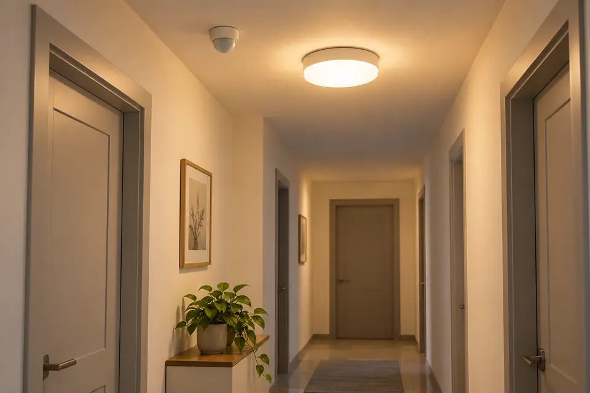
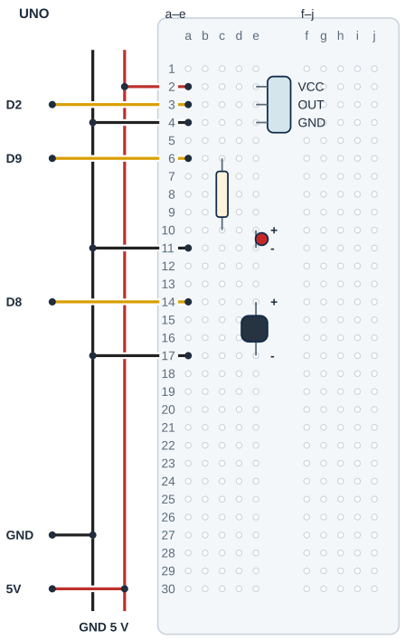

## Tanı • Tahmin et

### Günlük teknolojide

Bir koridor ışığı, algılayıcının verdiği bilgiyle yanar ve bir süre sonra söner. Algılayıcı ile ışığın zaman ayarı farklı görevlerdir. Sen PIR çıkışını okuyacak, LED ve buzzer için bir alarm durumu tutacaksın. Bu sınıf deneyi bir güvenlik sistemi yerine kullanılmaz.



### Sistemin yolu

**Girdi:** PIR OUT seviyesi → **Karar:** Hazırlık ve alarm süresi → **Çıktı:** LED ve aktif buzzer

:::bilgi[Önce düşün]{renk=sari}
Sensör önünde kıpırdamadan durduğunda çıkışın hep HIGH kalacağını düşünür müsün? Tahminini yaz; deneyde kendi modelini gözle.
:::

::yaz[Tahminim]{satir=2}

### Parçayı tanı

- PIR, pasif kızılötesi algılayıcıdır. Kendi ışığını göndermez; görüş alanındaki kızılötesi değişime tepki verir.
- VCC, OUT ve GND başlık sırasını gerçek modelinden doğrula. Bu örnek 5 V besleme ve UNO’ya uygun dijital OUT içindir.
- Açılışta kararlı hale gelmesi için yaklaşık 30–60 saniye gerekebilir. Kod 60 saniye ayırır; modelin daha uzun istiyorsa hazirlikMs değerini uyarla.
- Bazı modellerde H/L köprüsü ve süre/hassasiyet ayarları vardır. H yeniden tetiklemeyi seçer; gerçek modelin yazısını doğrula.
- bool yalnız true veya false saklar. hazir hazırlık durumunu, alarmVar ise uyarı durumunu tutar.

## PIR çıkışını ve uyarıyı ayır

| UNO pini | Bağlantı yolu |
|---|---|
| **GND** | GND rayı → PIR / LED / buzzer |
| **5V** | 5 V rayı → PIR VCC a2 / e2 |
| **D2** | PIR OUT a3 / e3 |
| **D9** | a6 → 220 Ω → LED anot |
| **D8** | a14 / e14 → uygun aktif buzzer + |

_Kırmızı: 5 V · Siyah: GND · Sarı: dijital · Pin adı belirleyicidir._

### Adım adım kur

1. USB’yi çıkar; PIR pinleri, başlık aralığı, besleme ve buzzer uygunluğunu doğrula.
2. Örnek PIR erkek başlığını VCC e2, OUT e3, GND e4 olacak biçimde breadboard’a tak; gövdeyi sabitle.
3. UNO 5 V ve GND’yi ayrı raylara birer jumperla bağla. Raydan a2’ye 5 V, a4’e GND götür; D2 a3’e gider.
4. 220 Ω c6–c10; LED anot e10, katot e11. D9 a6’ya, a11 GND rayına gider.
5. Uygun aktif buzzer + e14, − e17; D8 a14’e, a17 GND rayına gider. Varsa köprüyü modele göre H seç.
6. Ray, yön ve ayrı delikleri kontrol et; sonra USB’yi tak. Programı yükle, hazırlık süresini bekle.

:::dikkat{renk=kirmizi}
Yalnız 5 V’ta UNO pinine uygun, en çok 20 mA çeken aktif buzzer kullan; tür, kutup ve akım belirsizse enerji verme, öğretmeninle doğrula. Buzzer’ı kulağa yaklaştırma. Bağlantıda USB çıkarılmış olsun; şebeke elektriği kullanılmaz.
:::

_Kart ve portu seç; programı önce derle, sonra yükle. Seri Monitör’ü 9600 baud aç._

:::bilgi[Parçanı doğrula · PIR etiketi]{renk=gri}
PIR modülünün pin yazısını oku: VCC, OUT, GND. Sırayı çizimle karşılaştır; yazı okunmuyorsa modülü bağlama, öğretmenine sor (*Parçanı doğrula* sayfası). Buzzer’ın + bacağını gövde yazısından doğrula.

::yaz[soldan sağa … / … / … · buzzer + bacağı …]{satir=1}
:::

### Kendi deliklerin

Kurduktan sonra her ucun gerçekte hangi deliğe girdiğini yaz ve çizimle karşılaştır.

| Uç | Çizimdeki delik | Benim deliğim |
|---|---|---|
| PIR VCC / OUT / GND | e2 / e3 / e4 |   |
| 5 V / D2 / GND jumper’ı | a2 / a3 / a4 |   |
| 220 Ω · LED anot / katot | c6 → c10 · e10 / e11 |   |
| Buzzer + / − | e14 / e17 |   |
| D9 / D8 / GND jumper’ları | a6 / a14 / a11, a17 |   |

## PIR modülünü ve buzzer’ı yerleştir



- **Örnek PIR sırası:** VCC e2 · OUT e3 · GND e4
- **Jumper delikleri:** 5 V a2 · D2 a3 · GND a4
- **LED seri direnci:** 220 Ω: c6-c10
- **LED uçları:** Anot e10 · katot e11
- **Aktif buzzer:** + e14 · − e17
- **Buzzer sinyal / dönüş:** D8 a14 · GND a17
- **Üç dönüş:** Tek UNO GND raydan dağıtılır.

_Kesişen çizgiler yalnız uçlarında birleşir. Her delikte tek uç vardır._

**Sen çiz (defterine):** gerçek modelinin uçlarını ve doğruladığın satırları göster.

Bu çizim VCC-OUT-GND örneğidir. PIR başlık sırası, bakış yönü ve aralığı modelden doğrulanır. Üç GND dönüşü rayda birleşir; her breadboard deliğinde tek uç vardır.

:::bilgi[Modelini eşleştir]{renk=mavi}
Uç aralığı veya sıra farklıysa yerleşimi kendi modeline göre uyarla; bacakları zorlama. Çizim, elindeki parçanın model kimliğini veya güç uygunluğunu kanıtlamaz.
:::

## Hazırlık ve alarm süresini programla

```cpp title="TAM PROGRAM · P15 · 1/2 (tanımlar ve setup)" start=1 dosya=p15_hareket_alarmi
const byte pirPini = 2;
const byte ledPini = 9;
const byte buzzerPini = 8;
const unsigned long hazirlikMs = 60000UL;
const unsigned long alarmMs = 5000UL;
const unsigned long haberlesmeHizi = 9600;
bool hazir = false;
bool alarmVar = false;
int sonHam = LOW;
unsigned long baslangic = 0;
unsigned long sonYuksek = 0;

void setup() {
  pinMode(pirPini, INPUT);
  pinMode(ledPini, OUTPUT);
  pinMode(buzzerPini, OUTPUT);
  digitalWrite(ledPini, LOW);
  digitalWrite(buzzerPini, LOW);
  Serial.begin(haberlesmeHizi);
  Serial.println("Sensor hazirlaniyor...");
  baslangic = millis();
}
```

```cpp title="TAM PROGRAM · P15 · 2/2 (loop)" start=24 dosya=p15_hareket_alarmi
void loop() {
  unsigned long simdi = millis();
  if (!hazir && simdi - baslangic >= hazirlikMs) {
    hazir = true;
    Serial.println("Hazir");
  }
  int ham = digitalRead(pirPini);
  if (hazir && ham != sonHam) {
    sonHam = ham;
    Serial.print(simdi);
    Serial.print(" ms OUT: ");
    Serial.println(ham);
  }
  if (hazir && ham == HIGH) {
    if (!alarmVar) Serial.println("Algilama var");
    alarmVar = true;
    sonYuksek = simdi;
  }
  if (alarmVar && simdi - sonYuksek >= alarmMs) {
    alarmVar = false;
    Serial.println("Alarm bitti");
  }
  if (alarmVar) {
    digitalWrite(ledPini, HIGH);
    digitalWrite(buzzerPini, HIGH);
  } else {
    digitalWrite(ledPini, LOW);
    digitalWrite(buzzerPini, LOW);
  }
}
```

_Kart ve portu seç; programı doğrula ve yükle. Seri Monitör’ü 9600 baud aç._

## PIR alarmı hatalarını ayıkla

### Kodun mantığı

1. setup çıkışları kapatır ve baslangic anını kaydeder. hazir, 60 saniye sonunda true olur.
2. Hazır giriş değişince ms zamanı ve OUT seviyesi yazılır. 0 LOW, 1 HIGH anlamındadır.
3. Her HIGH okumada alarmVar açılır, sonYuksek yenilenir. OUT HIGH kaldıkça süre yenilenir.
4. Son HIGH’dan en az 5 saniye sonra alarm biter; LED ve buzzer alarmVar durumunu izler.

### Hata avcısı

| Belirti | Olası neden | Ne yap? |
|---|---|---|
| Açılışta uyarı yok | Hazırlık süresi veya model | Hazir mesajını bekle. Modelin hazırlık bilgisini doğrula; sırf hızlanmak için süreyi kısaltma. |
| Alarm beklenenden uzun | OUT açık kalma süresi veya tekrar algılama | PIR ayarıyla yazılımın 5 saniyesini ayır. Sensörü sabitle; ortamı ve H/L kipini kontrol et. |
| LED var, buzzer yok | Tür, kutup veya akım uygunluğu | USB’yi çıkar. +/− ve aktif buzzer’ı doğrula; akım bilinmiyorsa doğrudan pini kullanma. |

:::bilgi[Üç farklı zamanı ayır]{renk=mavi}
Hazırlık, PIR’nin kendi OUT açık kalma süresi ve yazılımın alarm kuyruğu ayrı işlerdir. Kod her HIGH okumada sonYuksek değerini yeniler. Bu nedenle beş saniye fiziksel hareket durur durmaz başlamaz. OUT LOW olsa da yazılım uyarısı bir süre sürebilir.
:::

:::bilgi[Mesaj ile ölçümü ayır]{renk=sari}
Hazir bir yazılım durumudur; sensörün fiziksel kararlılığını ölçmez. ms OUT satırı, programın bir çıkış değişimini okuduğu zamanı gösterir. Ekrana gelme anı USB aktarımından etkilenir. Modelin hazırlık ve H/L bilgisi ayrıca doğrulanır.
:::

### Zaman çizgisi

Hazır sensörün önünde bir kez hareket et. Her olayda OUT seviyesini, sonYuksek değerini ve alarmı yaz; alarmMs 5000’dir.

| Olay | OUT | sonYuksek | LED / buzzer |
|---|---|---|---|
| Hazir yazıldı |   |   |   |
| Hareket başladı |   |   |   |
| Hareket durdu |   |   |   |
| OUT LOW’a indi |   |   |   |
| Son HIGH’tan 5 s sonra |   |   |   |

## Alarm süresini değiştir; gözlemini kaydet

Önce tahminini yaz. Denemeden sonra gördüğün sayı veya tepkiyi boş alana kaydet.

| Deneme | Tahminim | Gözlemim |
|---|---|---|
| Yeniden başlat; hazırlık ve Hazir mesajını gözle. |   |   |
| Hazır sensör önünde hareket et; OUT satırını kaydet. |   |   |
| Sabit dur; sonra uzaklaş. OUT 0 ve alarm bitişini izle. |   |   |
| Yalnız alarmMs 2000; aynı ayarlarla tekrar dene. |   |   |

:::bilgi[Bir değişiklik yap]{renk=mavi}
Yalnız alarmMs değerini 5000’den 2000’e indir. PIR’nin H/L ve süre ayarını, yönünü ve deneme hareketini koru. Toplam gözlenen uyarı süresini karşılaştır; bunun yalnız yazılım süresi olmadığını düşün. Sonra 5000’e dön; hazirlikMs değerini kısaltma.
:::

::yaz[Tahminim ve gözlemim]{satir=3}

### Değişiklik sürümleri

“Bir değişiklik yap” sürümleri; ana programla yan yana açıp farkı bul.

```cpp title="Değişiklik sürümü · p15_alarm_2000" start=1 dosya=p15_alarm_2000
const byte pirPini = 2;
const byte ledPini = 9;
const byte buzzerPini = 8;
const unsigned long hazirlikMs = 60000UL;
const unsigned long alarmMs = 2000UL;
const unsigned long haberlesmeHizi = 9600;
bool hazir = false;
bool alarmVar = false;
int sonHam = LOW;
unsigned long baslangic = 0;
unsigned long sonYuksek = 0;

void setup() {
  pinMode(pirPini, INPUT);
  pinMode(ledPini, OUTPUT);
  pinMode(buzzerPini, OUTPUT);
  digitalWrite(ledPini, LOW);
  digitalWrite(buzzerPini, LOW);
  Serial.begin(haberlesmeHizi);
  Serial.println("Sensor hazirlaniyor...");
  baslangic = millis();
}

void loop() {
  unsigned long simdi = millis();
  if (!hazir && simdi - baslangic >= hazirlikMs) {
    hazir = true;
    Serial.println("Hazir");
  }
  int ham = digitalRead(pirPini);
  if (hazir && ham != sonHam) {
    sonHam = ham;
    Serial.print(simdi);
    Serial.print(" ms OUT: ");
    Serial.println(ham);
  }
  if (hazir && ham == HIGH) {
    if (!alarmVar) Serial.println("Algilama var");
    alarmVar = true;
    sonYuksek = simdi;
  }
  if (alarmVar && simdi - sonYuksek >= alarmMs) {
    alarmVar = false;
    Serial.println("Alarm bitti");
  }
  if (alarmVar) {
    digitalWrite(ledPini, HIGH);
    digitalWrite(buzzerPini, HIGH);
  } else {
    digitalWrite(ledPini, LOW);
    digitalWrite(buzzerPini, LOW);
  }
}
```

### Kendini kontrol et

**1.** hazir ve alarmVar hangi türde bilgi saklar?

::yaz[Cevabım]{satir=2}

**2.** Neden beş saniye son fiziksel hareket anından doğrudan sayılmaz?

::yaz[Cevabım]{satir=2}

**3.** Hazır devrede son HIGH t=10000 ms ise ve yeni HIGH yoksa alarm hangi zamandan önce bitmez?

::yaz[Cevabım]{satir=2}

**Sen çiz (defterine):** giriş, süre ve çıkış için üç ayrı kutu oluştur.

**Evde devam et:** Bir koridor ışığının ne zaman yandığını ve söndüğünü dışarıdan gözle. Duran insanı sayan bir aygıt olduğunu varsayma.

**Şimdi sıra sende:** [Proje 10](proje:10) konum komutunu ve PIR uyarısını birleştiren fikri kâğıtta planla. Giriş, karar ve servo komutunu göster; gerçek devreye yeni yük ekleme.

::yaz[Fikrim]{satir=3}

**Kendimi değerlendiriyorum:** Yardımla yaptım · Biraz yardımla · Tek başıma · Başkasına anlatabilirim

::yaz[Bu projeyi nasıl yaptım? Neden?]{satir=1}

:::bilgi[Biliyor muydun?]{renk=sari}
PIR modülünün OUT açık kalma süresi ile programın alarm süresi aynı ayar değildir. H kipinde yeni algılama modülün çıkış süresini uzatabilir.
:::
