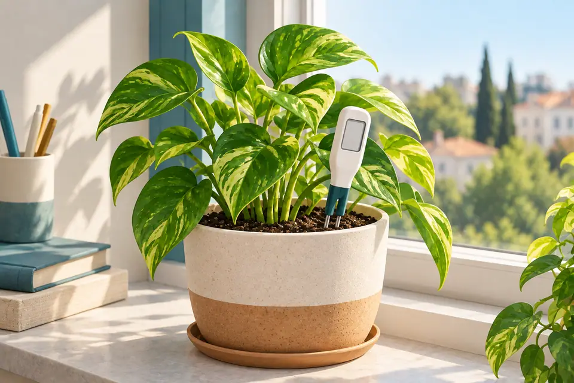
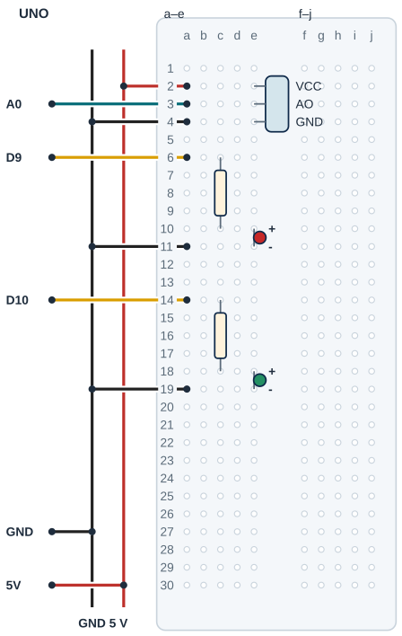

## Tanı • Tahmin et

### Günlük teknolojide

Bir saksının toprağını gözleyip sulama zamanını düşünürsün. Basit iletken prob, toprağın elektriksel davranışına bakar. Sen iki örnek durum arasında bir gösterge kuracaksın. Bu sayı, toprağın gerçek su yüzdesi değildir; bitkinin su ihtiyacına tek başına karar vermez.



### Sistemin yolu

**Girdi:** Toprak probu AO → **Hesap:** İki noktalı gösterge → **Çıktı:** Kırmızı / yeşil LED

:::bilgi[Önce düşün]{renk=sari}
Yalnız uyariEsigi 30’dan 50’ye çıkarsa aynı ham okumada kırmızı LED daha kolay yanar mı? Tahminini yaz.
:::

::yaz[Tahminim]{satir=2}

### Parçayı tanı

- İletken probun AO ucu A0’a gider. Çizim üç uçlu VCC-AO-GND başlığı örnekler; gerçek sırayı doğrula.
- Ölçekleme, bilinen iki örnek durumla göstergeyi eşleştirmektir; kalibrasyon değildir. Aynı toprak ve aynı batırma derinliği korunur.
- kuru=800 ve islak=400 yalnız kod örneğidir. Kendi kuru ve hafif nemlendirilmiş örneklerinin Ham sayılarını ölç; bu sabitleri kendi ölçümlerinle değiştir.
- map, kuru noktayı 0’a ve islak noktayı 100’e taşır. constrain, dışarı taşan hesabı 0–100 aralığında tutar.
- Gösterge, seçtiğin iki örneğe göredir. Tuz, toprak türü ve derinlik sonucu etkiler. Havadaki bağıl nemle aynı ölçüm değildir.

## Nem sensörünün 5 V beslemesini ayır

| UNO pini | Bağlantı yolu |
|---|---|
| **GND** | GND rayı → sensör / iki LED |
| **5V** | 5 V rayı → VCC a2 / e2 |
| **A0** | a3 / e3 → sensör AO |
| **D9** | a6 → 220 Ω → kırmızı LED |
| **D10** | a14 → 220 Ω → yeşil LED |

_Kırmızı: güç · Siyah: GND · Turkuaz: analog · Sarı: dijital. Pin adı belirleyicidir._

### Adım adım kur

1. USB’yi çıkar; sensörün pin sırası ve besleme gerilimi doğrulansın.
2. Kuru başlığı örnekte VCC e2, AO e3, GND e4 olarak ayrı satırlara tak. Probun toprak kısmı kartlardan uzakta kalsın.
3. UNO 5 V ve GND’yi ayrı raylara birer jumper ile bağla. 5 V rayı a2’ye, A0 a3’e, GND rayı a4’e gider.
4. Kırmızı LED: 220 Ω c6–c10, anot e10, katot e11; D9 a6, GND a11.
5. Yeşil LED: 220 Ω c14–c18, anot e18, katot e19; D10 a14, GND a19.
6. Kutupları, ayrı delikleri ve kuru alanları kontrol et; probu sabitle, sonra USB’yi tak.

:::dikkat{renk=kirmizi}
Sensör VCC ucu UNO 5 V hattına bağlanır; GPIO güç kaynağı değildir. Probu yalnız deney sırasında daldır, sonra USB’yi çıkarıp kurula. Yalnız probun izinli bölgesi ıslanır; UNO, breadboard ve USB kuru kalır. Su eklerken ve bağlantıyı değiştirirken USB’yi çıkar.
:::

:::bilgi[Parçanı doğrula · modül etiketi]{renk=gri}
Toprak nemi modülünün başlık yazısını soldan sağa oku: VCC, AO, GND (AO bazen A0 ya da S yazar). Sırayı çizimle karşılaştır (*Parçanı doğrula* sayfası). Besleme gerilimini modelin yazısından veya veri sayfasından doğrula.

::yaz[soldan sağa … / … / …]{satir=1}
:::

### Kendi deliklerin

Kurduktan sonra her ucun gerçekte hangi deliğe girdiğini yaz ve çizimle karşılaştır.

| Uç | Çizimdeki delik | Benim deliğim |
|---|---|---|
| Modül VCC / AO / GND | e2 / e3 / e4 |   |
| 5 V / A0 / GND jumper’ı | a2 / a3 / a4 |   |
| Kırmızı: 220 Ω · LED | c6 → c10 · e10 / e11 |   |
| Yeşil: 220 Ω · LED | c14 → c18 · e18 / e19 |   |
| D9 / D10 / GND jumper’ları | a6 / a14 / a11, a19 |   |

## Nem sensörünü ve LED’leri yerleştir



- **Örnek kuru başlık:** VCC e2 · AO e3 · GND e4
- **Jumper delikleri:** 5 V a2 · A0 a3 · GND a4
- **Kırmızı LED:** 220 Ω c6-c10 · e10/e11
- **Yeşil LED:** 220 Ω c14-c18 · e18/e19
- **LED giriş / dönüş:** D9 a6 · D10 a14 · GND a11/a19
- **Besleme:** UNO 5 V hattı; GPIO değil
- **Prob kısmı dışarıda:** Başlık ve kartlar kuru kalır.

_Kesişen çizgiler yalnız uçlarında birleşir. Her delikte tek uç vardır._

**Sen çiz (defterine):** gerçek modelinin uçlarını ve doğruladığın satırları göster.

Çizim örnek pin sırasını gösterir. Erkek başlıklar ayrı satırlara, jumper’lar aynı grubun ayrı deliklerine girer. Probun izinli toprak/su kısmı breadboard dışında; elektronik başlık ve kartlar kuru kalır.

:::bilgi[Modelini eşleştir]{renk=mavi}
Uç aralığı veya sıra farklıysa yerleşimi kendi modeline göre uyarla; bacakları zorlama. Çizim, elindeki parçanın model kimliğini veya güç uygunluğunu kanıtlamaz.
:::

## Ham nemi göstergeye çevir

```cpp title="TAM PROGRAM · P16" start=1 dosya=p16_bitki_icin_nem_olcer
const byte sensorPini = A0;
const byte kirmizi = 9;
const byte yesil = 10;
const int kuru = 800;
const int islak = 400;
const int uyariEsigi = 30;
const unsigned long aralikMs = 1000;
unsigned long zaman = 0;

void setup() {
  pinMode(kirmizi, OUTPUT);
  pinMode(yesil, OUTPUT);
  Serial.begin(9600);
  zaman = millis();
}

void loop() {
  unsigned long simdi = millis();
  if (simdi - zaman < aralikMs) return;
  zaman = simdi;
  int ham = analogRead(sensorPini);
  Serial.print("Ham: ");
  Serial.println(ham);
  if (kuru == islak) {
    digitalWrite(kirmizi, LOW);
    digitalWrite(yesil, LOW);
    Serial.println("Olcekleme hatasi");
    return;
  }
  int gosterge = constrain(map(ham, kuru, islak, 0, 100), 0, 100);
  Serial.print("Gosterge: ");
  Serial.println(gosterge);
  bool uyari = gosterge < uyariEsigi;
  digitalWrite(kirmizi, uyari);
  digitalWrite(yesil, !uyari);
}
```

_Kart: UNO · Seri Monitör: 9600 baud. Programı derle, sonra yükle. Kodun açıklaması aşağıda._

## Aralıklı okuma ve uyarı eşiği

### Kodun mantığı

1. Sensör 5 V hattındadır. Program her 1000 ms’de bir A0’ı okur; arada loop hemen döner.
2. millis farkı aralikMs’den küçükse return bu loop turunu bitirir; sonraki turda zaman kontrolü sürer.
3. İki referans noktası eşitse hesap yapılmaz; iki LED kapanır ve hata yazılır.
4. Gösterge eşikten küçükse kırmızı, değilse yeşil yanar. bool doğru 1/HIGH, yanlış 0/LOW olur; ! durumu ters çevirir.

### Hata avcısı

| Belirti | Olası neden | Ne yap? |
|---|---|---|
| Gösterge hep 0 veya 100 | Örnek noktaları veya sınır dışı okuma | Ham sayıları karşılaştır; aynı toprak ve derinlikle ölçeklemeyi tekrar incele. Sınırlandırma hatayı gizleyebilir. |
| Olcekleme hatasi yazıyor | kuru ve islak eşit | Farklı iki gerçek örneği ölç. Eşit noktaları keyfi bir sayı ekleyerek düzeltme. |
| Ham değer tutarsız | Temas, besleme veya model | USB’yi çıkar; AO, GND ve kuru başlığı kontrol et. Besleme gerilimi ve pin sırası gerçek modelde doğrulansın. |

:::bilgi[Göstergeyi kendi örneklerinle kur]{renk=mavi}
Önce iki Ham değeri not et. Farklı iki gerçek noktayı kuru ve islak sabitlerine gir; değer yönünün aynı olmasını bekleme. Gösterge 0–100 bir sınıf ölçeğidir. Sensör VCC ucu UNO 5 V hattındadır; deney bitince USB’yi çıkar ve probu kurula.
:::

### Göstergeyi hesapla

Kâğıtta hesapla: kuru 800, islak 400’dür. map ve constrain ile göstergeyi bul; 30’un altı uyarıdır. Son satıra kendi ölçümünü yaz.

| Ham | Gösterge (0–100) | Uyarı var mı? | Yanan LED |
|---|---|---|---|
| 800 |   |   |   |
| 700 |   |   |   |
| 600 |   |   |   |
| 400 |   |   |   |
| Kendi ölçümün |   |   |   |

## Uyarı eşiğini değiştir; sonucu kaydet

Önce tahminini yaz. Denemeden sonra gördüğün sayı veya tepkiyi boş alana kaydet.

| Deneme | Tahminim | Gözlemim |
|---|---|---|
| Aynı derinlikte kuru örnek; Ham sayılarını kaydet. |   |   |
| Aynı topraktan hafif nemli örnek; Ham sayılarını kaydet. |   |   |
| Ölçtüğün iki farklı noktayla göstergeyi tekrar izle. |   |   |
| Yalnız eşik 50; aynı örnek, sonra 30’a dön. |   |   |

:::bilgi[Bir değişiklik yap]{renk=mavi}
Ölçekleme bitince yalnız uyariEsigi 30’dan 50’ye çıksın. Aynı örnek, derinlik ve kabı koru. LED durumunu karşılaştır; sonra 30’a dön. Toprağa bu deney sırasında su ekleme.
:::

::yaz[Tahminim ve gözlemim]{satir=3}

### Değişiklik sürümleri

“Bir değişiklik yap” sürümleri; ana programla yan yana açıp farkı bul.

```cpp title="Değişiklik sürümü · p16_esik_50" start=1 dosya=p16_esik_50
const byte sensorPini = A0;
const byte kirmizi = 9;
const byte yesil = 10;
const int kuru = 800;
const int islak = 400;
const int uyariEsigi = 50;
const unsigned long aralikMs = 1000;
unsigned long zaman = 0;

void setup() {
  pinMode(kirmizi, OUTPUT);
  pinMode(yesil, OUTPUT);
  Serial.begin(9600);
  zaman = millis();
}

void loop() {
  unsigned long simdi = millis();
  if (simdi - zaman < aralikMs) return;
  zaman = simdi;
  int ham = analogRead(sensorPini);
  Serial.print("Ham: ");
  Serial.println(ham);
  if (kuru == islak) {
    digitalWrite(kirmizi, LOW);
    digitalWrite(yesil, LOW);
    Serial.println("Olcekleme hatasi");
    return;
  }
  int gosterge = constrain(map(ham, kuru, islak, 0, 100), 0, 100);
  Serial.print("Gosterge: ");
  Serial.println(gosterge);
  bool uyari = gosterge < uyariEsigi;
  digitalWrite(kirmizi, uyari);
  digitalWrite(yesil, !uyari);
}
```

```cpp title="Değişiklik sürümü · p16_esit_noktalar" start=1 dosya=p16_esit_noktalar
const byte sensorPini = A0;
const byte kirmizi = 9;
const byte yesil = 10;
const int kuru = 400;
const int islak = 400;
const int uyariEsigi = 30;
const unsigned long aralikMs = 1000;
unsigned long zaman = 0;

void setup() {
  pinMode(kirmizi, OUTPUT);
  pinMode(yesil, OUTPUT);
  Serial.begin(9600);
  zaman = millis();
}

void loop() {
  unsigned long simdi = millis();
  if (simdi - zaman < aralikMs) return;
  zaman = simdi;
  int ham = analogRead(sensorPini);
  Serial.print("Ham: ");
  Serial.println(ham);
  if (kuru == islak) {
    digitalWrite(kirmizi, LOW);
    digitalWrite(yesil, LOW);
    Serial.println("Olcekleme hatasi");
    return;
  }
  int gosterge = constrain(map(ham, kuru, islak, 0, 100), 0, 100);
  Serial.print("Gosterge: ");
  Serial.println(gosterge);
  bool uyari = gosterge < uyariEsigi;
  digitalWrite(kirmizi, uyari);
  digitalWrite(yesil, !uyari);
}
```

### Kendini kontrol et

**1.** AO ve besleme hangi UNO pinlerine gider?

::yaz[Cevabım]{satir=2}

**2.** Gösterge 100 neden gerçek su oranının yüzde 100 olduğunu söylemez?

::yaz[Cevabım]{satir=2}

**3.** Örnek kuru 800, islak 400 iken ham 600 hangi göstergeye çevrilir?

::yaz[Cevabım]{satir=2}

**Sen çiz (defterine):** ham okumadan göstergeye giden yolu göster.

**Evde devam et:** Bir bitkinin toprağını gözle; toprak türü, ışık ve sulama tarihini kâğıtta not et.

**Şimdi sıra sende:** [Proje 7](proje:7) ışık göstergesiyle bu iki noktalı göstergeyi kâğıtta karşılaştır; ham sayı ve hesap kutularını ayır.

::yaz[Fikrim]{satir=3}

**Kendimi değerlendiriyorum:** Yardımla yaptım · Biraz yardımla · Tek başıma · Başkasına anlatabilirim

::yaz[Bu projeyi nasıl yaptım? Neden?]{satir=1}

:::bilgi[Biliyor muydun?]{renk=sari}
İletken toprak probunun okuması toprak bileşimine de bağlıdır. İki örnek arasında ölçek kurmak, gerçek su oranını ölçmekle aynı iş değildir.
:::
