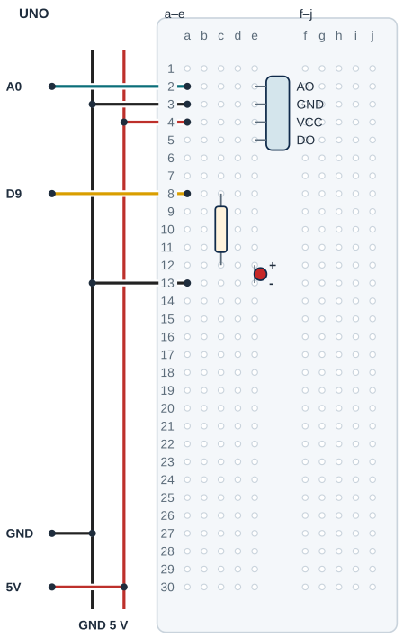

## Tanı • Tahmin et

### Günlük teknolojide

Bir lamba kısa bir sesle durum değiştirebilir. Sınıfta bu fikri küçük bir LED ile deneyeceksin. Mikrofon farklı seslere de tepki verir. Kod alkışın kimliğini tanımaz; seçilen eşiği aşan bir değişimi olay kabul eder.


### Sistemin yolu

**Girdi:** Mikrofon AO örnekleri → **Hesap:** En büyük − en küçük → **Çıktı:** LED durum değişimi

:::bilgi[Önce düşün]{renk=sari}
Yalnız esik 100’den 50’ye inerse aynı ortam sesinde LED daha sık değişebilir mi? Nedenini yaz.
:::

::yaz[Tahminim]{satir=2}

### Parçayı tanı

- Analog AO çıkışı olan, 5 V’a uygun ses modülü kullanılır. Örnek dört pin: AO-GND-VCC-DO; gerçek sıra farklı olabilir.
- AO kısa sürede değişir. Tek örnek yerine 50 ms boyunca en büyük ve en küçük ADC okumaları tutulur.
- İki uç arasındaki fark bu projede pencere farkı (pencereFarki) diye yazılır. Tepe-tepe değişimdir; ADC adımıdır, desibel değildir.
- DO bu projede boş kalır. Modülün ayar vidasının hangi çıkışı etkilediğini kendi belgesinden doğrula.
- Yeni olay için eşik altı bir pencere ve son olaydan en az 400 ms gerekir. Konuşma veya başka kısa sesler de olay olabilir.

## Ses sensörünün AO yolunu ayır

| UNO pini | Bağlantı yolu |
|---|---|
| **GND** | GND rayı → ses modülü / LED |
| **5V** | 5 V rayı → VCC a4 / e4 |
| **A0** | AO a2 / e2 → analog giriş |
| **D9** | a8 → 220 Ω → LED |

_Kırmızı: güç · Siyah: GND · Turkuaz: analog · Sarı: dijital. Pin adı belirleyicidir._

### Adım adım kur

1. USB’yi çıkar; AO/GND/VCC/DO sırasını ve 5 V uygunluğunu doğrula.
2. Erkek başlığı örnekte AO e2, GND e3, VCC e4, DO e5 olarak ayrı satırlara tak; DO’ya jumper bağlama.
3. UNO 5 V ve GND’yi ayrı raylara bağla; 5 V a4’e, GND a3’e, A0 a2’ye gider.
4. 220 Ω c8–c12; LED anot e12, katot e13. D9 a8’e, a13 GND rayına gider.
5. Uçlar, raylar ve LED yönü kontrol edilince USB’yi tak.

:::dikkat{renk=kirmizi}
Mikrofona ya da kulağa çok yakın alkış yapma; normal sesle dene. Şebeke lambası bağlanmaz; modülün pin sırasını çizimden değil yazısından oku. Ayar ve kablo değişiminde USB çıkarılmış olsun.
:::

:::bilgi[Parçanı doğrula · modül etiketi]{renk=gri}
Ses modülünün başlık yazısını soldan sağa oku. Örnekte AO, GND, VCC, DO sırası var; DO kullanılmaz. Sıra farklıysa yerleşimi modülün yazısına göre değiştir (*Parçanı doğrula* sayfası).

::yaz[soldan sağa … / … / … / …]{satir=1}
:::

### Kendi deliklerin

Kurduktan sonra her ucun gerçekte hangi deliğe girdiğini yaz ve çizimle karşılaştır. DO ucuna jumper takılmaz.

| Uç | Çizimdeki delik | Benim deliğim |
|---|---|---|
| AO / GND / VCC / DO | e2 / e3 / e4 / e5 |   |
| A0 / GND / 5 V jumper’ı | a2 / a3 / a4 |   |
| 220 Ω direnç | c8 → c12 |   |
| LED anot / katot | e12 / e13 |   |
| D9 / GND jumper’ı | a8 / a13 |   |

## Ses sensörünü ve LED’i yerleştir



- **Örnek başlık:** AO e2 · GND e3 · VCC e4
- **Boş uç:** DO e5: jumper yok
- **Jumper delikleri:** A0 a2 · GND a3 · 5 V a4
- **LED seri direnci:** 220 Ω: c8-c12
- **LED uçları:** Anot e12 · katot e13
- **LED giriş / dönüş:** D9 a8 · GND a13
- **Gerçek model:** Sıra, AO ve 5 V doğrulanır.

_Kesişen çizgiler yalnız uçlarında birleşir. Her delikte tek uç vardır._

**Sen çiz (defterine):** gerçek modelinin uçlarını ve doğruladığın satırları göster.

Örnek uç sırası ve gövde yerleşimi gerçek modelden doğrulanır. Her delikte tek uç vardır. Modülün erkek başlık uçları ayrı satırlara girer; jumper’lar ayrı deliklerde kalır.

:::bilgi[Modelini eşleştir]{renk=mavi}
Uç aralığı veya sıra farklıysa yerleşimi kendi modeline göre uyarla; bacakları zorlama. Çizim, elindeki parçanın model kimliğini veya güç uygunluğunu kanıtlamaz.
:::

## Alkış penceresini programla

```cpp title="TAM PROGRAM · P17 · 1/2 (tanımlar)" start=1 dosya=p17_alkisla_yanan_lamba
const byte sesPini = A0;
const byte ledPini = 9;
const int esik = 100;
const unsigned long pencereMs = 50;
const unsigned long beklemeMs = 400;
int enKucuk = 1023;
int enBuyuk = 0;
bool ledAcik = false;
bool yenidenHazir = true;
unsigned long pencereBaslangici = 0;
unsigned long sonOlay = 0;
```

```cpp title="TAM PROGRAM · P17 · 2/2 (setup ve loop)" start=13 dosya=p17_alkisla_yanan_lamba
void setup() {
  pinMode(ledPini, OUTPUT);
  digitalWrite(ledPini, LOW);
  Serial.begin(9600);
  pencereBaslangici = millis();
  sonOlay = pencereBaslangici;
}

void loop() {
  unsigned long simdi = millis();
  int ham = analogRead(sesPini);
  if (ham < enKucuk) enKucuk = ham;
  if (ham > enBuyuk) enBuyuk = ham;
  if (simdi - pencereBaslangici < pencereMs) return;
  int pencereFarki = enBuyuk - enKucuk;
  enKucuk = 1023;
  enBuyuk = 0;
  pencereBaslangici = simdi;
  if (pencereFarki <= esik) yenidenHazir = true;
  if (pencereFarki > esik && yenidenHazir &&
      simdi - sonOlay >= beklemeMs) {
    ledAcik = !ledAcik;
    yenidenHazir = false;
    sonOlay = simdi;
  }
  digitalWrite(ledPini, ledAcik);
  Serial.print("PencereFarki: ");
  Serial.print(pencereFarki);
  Serial.print(" LED: ");
  Serial.println(ledAcik);
}
```

_Kart: UNO · Seri Monitör: 9600 baud. Programı derle, sonra yükle. Kodun açıklaması aşağıda._

### Kodu izle

pencereFarki = enBuyuk − enKucuk; esik 100’dür. Kâğıtta hesapla (en küçük ve en büyük okuma): 480 ile 520 → … · 400 ile 650 → … · 300 ile 700 → …. Hangileri eşiği aşar? …

::yaz[Cevaplarım]{satir=2}

## Pencere farkı, eşik ve yeniden hazırlık

### Kodun mantığı

1. Her tur bir AO örneği alınır; enKucuk ve enBuyuk güncellenir.
2. 50 ms dolunca fark hesaplanır; yeni pencere için uç değerler sıfırlanır.
3. pencereFarki \<= esik sessiz kabul edilen pencereyi gösterir; yenidenHazir true olur.
4. Yeterli süreyle gelen yüksek pencere LED’i ters çevirir ve hazırlığı kapatır. Sürekli yüksek pencereler yeni olay üretmez.

### Hata avcısı

| Belirti | Olası neden | Ne yap? |
|---|---|---|
| LED hiç değişmiyor | AO veya eşik | 9600 baud PencereFarki satırını izle. Modelin AO çıkışını doğrula; USB’yi çıkarıp AO/A0 yolunu kontrol et. |
| Başka sesler de açıyor | Ses sınıflandırması yapılmıyor | Ortamı koruyup yalnız eşiği sınayabilirsin. Algılanan olayın mutlaka alkış olduğunu varsayma. |
| İkinci alkış kabul edilmiyor | Arada sessiz pencere veya süre yok | 400 ms’den uzun ara ver; aradaki PencereFarki değerini izle. Çok düşük eşik yeniden hazırlığı engelleyebilir. |

:::bilgi[Yeniden hazırlık ile süre iki ayrı koşuldur]{renk=mavi}
İlk 400 ms içinde olay kabul edilmez. Son olaydan 400 ms geçmesi tek başına yetmez; arada pencereFarki \<= esik olan pencere de gerekir. AO sürekli yüksek pencere farkı veriyorsa LED her 400 ms’de ters dönmez. Pencere farkı desibel değildir.
:::

### Pencereleri izle

Her satır 50 ms’lik bir penceredir; beklemeMs 400’dür ve program 0 ms’de başlar. Tablodaki satırların arasında kalan pencerelerde pencere farkı eşiğin altındadır. yenidenHazir değerini ve LED’in değişip değişmediğini kâğıtta izle.

| Pencere | pencereFarki | yenidenHazir | LED değişir mi? |
|---|---|---|---|
| 0–50 ms | 150 |   |   |
| 400–450 ms | 160 |   |   |
| 450–500 ms | 40 |   |   |
| 500–550 ms | 180 |   |   |
| Kendi örneğin |   |   |   |

## Eşiği değiştir; alkışı kaydet

Önce tahminini yaz. Denemeden sonra gördüğün sayı veya tepkiyi boş alana kaydet.

| Deneme | Tahminim | Gözlemim |
|---|---|---|
| Sessiz ortamda birkaç PencereFarki değerini kaydet. |   |   |
| Normal sesle tek alkış; LED durumunu izle. |   |   |
| Arada sessizce bir saniye bekleyerek iki ayrı alkış. |   |   |
| Yalnız eşik 50, sonra 100’e dön; ortam aynı. |   |   |

:::bilgi[Bir değişiklik yap]{renk=mavi}
Yalnız esik 100’den 50’ye insin. Aynı uzaklık ve normal alkış sesini koru; ortam sesini de kaydet. Sonra 100’e dön. Daha hassas ayarın yeniden hazırlığı nasıl etkilediğini düşün.
:::

::yaz[Tahminim ve gözlemim]{satir=3}

### Değişiklik sürümleri

“Bir değişiklik yap” sürümleri; ana programla yan yana açıp farkı bul.

```cpp title="Değişiklik sürümü · p17_esik_50" start=1 dosya=p17_esik_50
const byte sesPini = A0;
const byte ledPini = 9;
const int esik = 50;
const unsigned long pencereMs = 50;
const unsigned long beklemeMs = 400;
int enKucuk = 1023;
int enBuyuk = 0;
bool ledAcik = false;
bool yenidenHazir = true;
unsigned long pencereBaslangici = 0;
unsigned long sonOlay = 0;

void setup() {
  pinMode(ledPini, OUTPUT);
  digitalWrite(ledPini, LOW);
  Serial.begin(9600);
  pencereBaslangici = millis();
  sonOlay = pencereBaslangici;
}

void loop() {
  unsigned long simdi = millis();
  int ham = analogRead(sesPini);
  if (ham < enKucuk) enKucuk = ham;
  if (ham > enBuyuk) enBuyuk = ham;
  if (simdi - pencereBaslangici < pencereMs) return;
  int pencereFarki = enBuyuk - enKucuk;
  enKucuk = 1023;
  enBuyuk = 0;
  pencereBaslangici = simdi;
  if (pencereFarki <= esik) yenidenHazir = true;
  if (pencereFarki > esik && yenidenHazir &&
      simdi - sonOlay >= beklemeMs) {
    ledAcik = !ledAcik;
    yenidenHazir = false;
    sonOlay = simdi;
  }
  digitalWrite(ledPini, ledAcik);
  Serial.print("PencereFarki: ");
  Serial.print(pencereFarki);
  Serial.print(" LED: ");
  Serial.println(ledAcik);
}
```

### Kendini kontrol et

**1.** Pencere farkı hangi iki sayının farkıdır?

::yaz[Cevabım]{satir=2}

**2.** Kod neden konuşma ile alkışı kesin ayıramaz?

::yaz[Cevabım]{satir=2}

**3.** Eşik 100 iken 400 ms arayla sürekli 150 pencere farkı gelirse neden her pencere LED’i değiştirmez?

::yaz[Cevabım]{satir=2}

**Sen çiz (defterine):** penceredeki pencere farkından LED değişimine giden yolu göster.

**Evde devam et:** Sesle çalışan bir ürün fikri çiz; farklı ortam seslerinin oluşturabileceği yanlış olayları not et.

**Şimdi sıra sende:** [Proje 15](proje:15) içindeki sürekli HIGH ile bu projenin yeni ses olayını kâğıtta karşılaştır.

::yaz[Fikrim]{satir=3}

**Kendimi değerlendiriyorum:** Yardımla yaptım · Biraz yardımla · Tek başıma · Başkasına anlatabilirim

::yaz[Bu projeyi nasıl yaptım? Neden?]{satir=1}

:::bilgi[Biliyor muydun?]{renk=sari}
Mikrofon çıkışının kısa bir penceredeki en büyük ve en küçük örnekleri arasındaki fark, sinyal değişimini incelemek için kullanılabilir. Kalibre edilmedikçe desibel değildir.
:::
