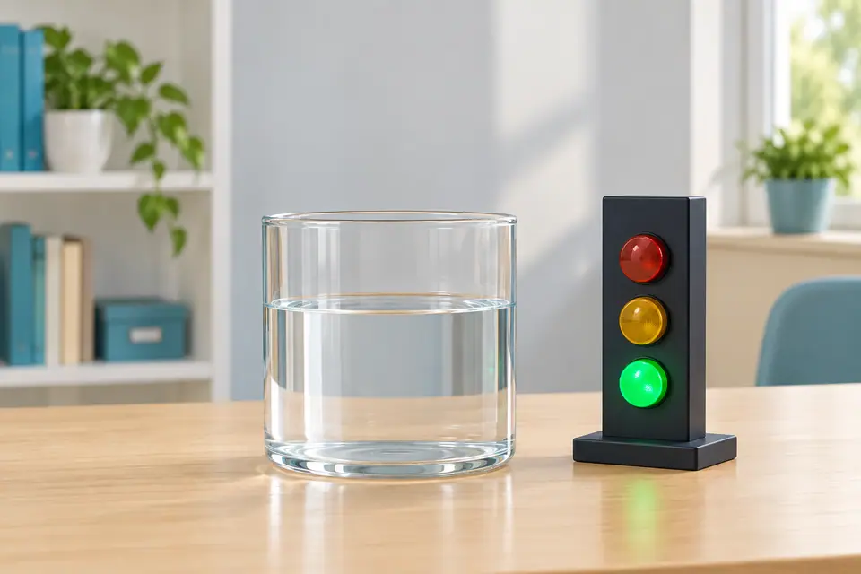
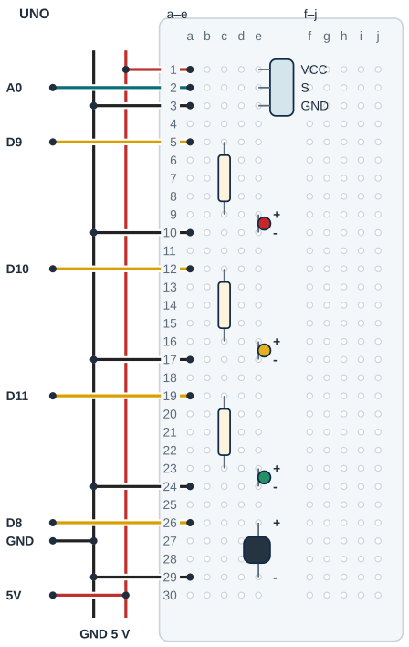

## Tanı • Tahmin et

### Günlük teknolojide

Bir kaptaki su yükselince gösterge değişebilir. Sen düşük, orta ve dolu için üç durum kuracaksın. Dolu durumunda yeşil LED ile buzzer birlikte açılır. Bu sınıf göstergesi bir taşma önleme veya güvenlik sistemi değildir; suyu kesmez.



### Sistemin yolu

**Girdi:** Su probu ham değeri → **Karar:** Duruma bağlı sınırlar → **Çıktı:** 3 LED ve buzzer

:::bilgi[Önce düşün]{renk=sari}
Yalnız marj 20’den 0’a inerse sınır yakınındaki küçük değişimler LED’i nasıl etkileyebilir? Tahminini yaz.
:::

::yaz[Tahminim]{satir=2}

### Parçayı tanı

- Örnek başlık VCC-S-GND’dir. Yalnız modelin izin verdiği iletken iz bölgesi suya değebilir; elektronik başlık kuru kalır.
- Su yüksekliği ile ADC ilişkisi model ve suya bağlıdır. Örnek artan okuma içindir; yönü kendi Ham sayılarından bul.
- 200, 400 ve 20 örnek ayarlardır; santimetre değildir. Eşikleri kendi düşük/orta/dolu okumalarından seç.
- Histerezis, yukarı ve aşağı geçişte ayrı sınır kullanır; aradaki pay marjdır (histerezis payı). Orta eşiği için 220’nin üstünde yükselir, 180’in altında iner.
- Dolu için 420’nin üstü, dönüş için 380’in altı kullanılır. Eşitlikte durum korunur. Marj bölgeleri birbirine değmemeli.

## Su probunun 5 V beslemesini ayır

| UNO pini | Bağlantı yolu |
|---|---|
| **GND** | GND rayı → sensör / LED / buzzer |
| **5V** | 5 V rayı → VCC a1 / e1 |
| **A0** | a2 / e2 → sensör S |
| **D9** | a5 → 220 Ω → kırmızı LED |
| **D10** | a12 → 220 Ω → sarı LED |
| **D11** | a19 → 220 Ω → yeşil LED |
| **D8** | a26 / e26 → uygun aktif buzzer + |

_Kırmızı: güç · Siyah: GND · Turkuaz: analog · Sarı: dijital. Pin adı belirleyicidir._

**Kontrol listesi**

- Gerçek model / pin yönü doğrulandı
- Güç ve sinyal yolları ayrı
- Her delikte tek uç
- Ortak GND / kuru alan kontrolü

### Adım adım kur

1. USB’yi çıkar; sensörün pin sırasını ve buzzer’ın 5 V’ta en fazla 20 mA uygunluğunu doğrula.
2. Kuru başlık VCC e1, S e2, GND e3; 5 V a1, A0 a2, GND a3. UNO 5 V ve GND ayrı raylara gider.
3. Kırmızı: 220 Ω c5–c9, LED e9/e10; D9 a5, GND a10.
4. Sarı: 220 Ω c12–c16, LED e16/e17; D10 a12, GND a17. Yeşil: 220 Ω c19–c23, LED e23/e24; D11 a19, GND a24.
5. Aktif buzzer + e26, − e29; D8 a26, GND a29. Ayrı delikleri ve kutupları kontrol et.
6. Kabı karttan uzakta sabitle; izinli prob bölgesini yerleştir, kuru alanları kontrol et, sonra USB’yi tak.

:::dikkat{renk=kirmizi}
Sensör VCC ucu UNO 5 V hattına bağlanır; GPIO güç kaynağı değildir. Probu yalnız deney sırasında daldır, sonra USB’yi çıkarıp kurula. Yalnız probun izinli bölgesi ıslanır; UNO, breadboard ve USB kuru kalır. Su eklerken ve bağlantıyı değiştirirken USB’yi çıkar, buzzer’ı kulağa yaklaştırma.
:::

:::bilgi[Parçanı doğrula · modül etiketi]{renk=gri}
Su seviyesi modülünün yazısını soldan sağa oku (S, + ve − ya da VCC, S, GND olabilir). Çizimdeki sıra VCC, S, GND’dir; farklıysa yerleşimi modülün yazısına göre değiştir (*Parçanı doğrula* sayfası). Buzzer’ın + bacağını gövde yazısından doğrula.

::yaz[soldan sağa … / … / … · buzzer + …]{satir=1}
:::

## Probu, LED’leri ve buzzer’ı yerleştir



- **Örnek kuru başlık:** VCC e1 · S e2 · GND e3
- **Güç / sinyal:** 5 V a1 · A0 a2 · GND a3
- **Kırmızı LED / 220 Ω:** e9/e10 · c5-c9 · D9 a5
- **Sarı LED / 220 Ω:** e16/e17 · c12-c16 · D10 a12
- **Yeşil LED / 220 Ω:** e23/e24 · c19-c23 · D11 a19
- **Aktif buzzer:** + e26 · − e29 · D8 a26
- **Dönüşler tek rayda:** GND a10/a17/a24/a29

_Kesişen çizgiler yalnız uçlarında birleşir. Her delikte tek uç vardır._

**Sen çiz (defterine):** gerçek modelinin uçlarını ve doğruladığın satırları göster.

Çizim örnek pin sırasını gösterir. Erkek başlıklar ayrı satırlara, jumper’lar aynı grubun ayrı deliklerine girer. Probun izinli toprak/su kısmı breadboard dışında; elektronik başlık ve kartlar kuru kalır.

:::bilgi[Modelini eşleştir]{renk=mavi}
Uç aralığı veya sıra farklıysa yerleşimi kendi modeline göre uyarla; bacakları zorlama. Çizim, elindeki parçanın model kimliğini veya güç uygunluğunu kanıtlamaz.
:::

## Su seviyesini üç duruma çevir

```cpp title="TAM PROGRAM · P18 · 1/2 (tanımlar ve fonksiyonlar)" start=1 dosya=p18_su_seviyesi_uyarisi
const byte suPini = A0;
const byte kirmizi = 9;
const byte sari = 10;
const byte yesil = 11;
const byte buzzer = 8;
const int ortaEsik = 200;
const int doluEsik = 400;
const int marj = 20;
const bool tersOkuma = false;
const unsigned long aralikMs = 500;
byte seviye = 0;
unsigned long zaman = 0;

byte yeniSeviye(int deger) {
  if (seviye == 0) {
    if (deger > ortaEsik + marj) return 1;
  } else if (seviye == 1) {
    if (deger > doluEsik + marj) return 2;
    if (deger < ortaEsik - marj) return 0;
  } else {
    if (deger < doluEsik - marj) return 1;
  }
  return seviye;
}
```

_Kart: UNO · Seri Monitör: 9600 baud. Programı derle, sonra yükle. Programın ikinci kutusu ve açıklaması aşağıda._

### Kendi deliklerin

Kurduktan sonra her ucun gerçekte hangi deliğe girdiğini yaz ve çizimle karşılaştır.

| Uç | Çizimdeki delik | Benim deliğim |
|---|---|---|
| Modül VCC / S / GND | e1 / e2 / e3 |   |
| 5 V / A0 / GND jumper’ı | a1 / a2 / a3 |   |
| Kırmızı: 220 Ω · LED | c5 → c9 · e9 / e10 |   |
| Sarı: 220 Ω · LED | c12 → c16 · e16 / e17 |   |
| Yeşil: 220 Ω · LED | c19 → c23 · e23 / e24 |   |
| Buzzer + / − | e26 / e29 |   |
| D9 / D10 / D11 / D8 | a5 / a12 / a19 / a26 |   |
| GND jumper’ları | a10 / a17 / a24 / a29 |   |

## Histerezis ve geçiş sınırları

```cpp title="TAM PROGRAM · P18 · 2/2 (setup ve loop)" start=26 dosya=p18_su_seviyesi_uyarisi
void setup() {
  pinMode(kirmizi, OUTPUT);
  pinMode(sari, OUTPUT);
  pinMode(yesil, OUTPUT);
  pinMode(buzzer, OUTPUT);
  Serial.begin(9600);
  zaman = millis();
}

void loop() {
  unsigned long simdi = millis();
  if (simdi - zaman < aralikMs) return;
  zaman = simdi;
  int ham = analogRead(suPini);
  int deger = ham;
  if (tersOkuma) deger = 1023 - ham;
  seviye = yeniSeviye(deger);
  digitalWrite(kirmizi, seviye == 0);
  digitalWrite(sari, seviye == 1);
  digitalWrite(yesil, seviye == 2);
  digitalWrite(buzzer, seviye == 2);
  Serial.print("Ham: ");
  Serial.print(ham);
  Serial.print(" Deger: ");
  Serial.print(deger);
  Serial.print(" Seviye: ");
  Serial.println(seviye);
}
```

### Kodun mantığı

1. Sensör 5 V hattındadır. Program her 500 ms’de bir A0’ı okur; arada loop hemen döner.
2. tersOkuma false ise ham doğrudan kullanılır. Doğrulanmış azalan modelde true, 1023 - ham hesabını seçer; eşikler bu yeni değere göre ayarlanır.
3. Durum 0, 1 veya 2’dir. yeniSeviye yalnız bulunulan durumun sınırlarına bakar; her ölçümde en fazla bir basamak değişir (sensörün değil, bu programın kuralı), ani dolum iki ölçümde dolu durumuna ulaşabilir.
4. Üç karşılaştırmadan yalnız biri doğru olur. Yeşil ve buzzer dolu durumunu bildirir; yeşil burada güvenli anlamına gelmez.

### Hata avcısı

| Belirti | Olası neden | Ne yap? |
|---|---|---|
| LED sınırda titriyor | Marj veya oynayan prob | Probu sabitle; Ham ve Deger satırlarını izle. Eşiklerin ve marj bölgelerinin birbirine değmediğini kontrol et. |
| Su artarken değer azalıyor | Gerçek modelin yönü | USB çıkarılarak yapılan seviye değişimlerinde yönü ölç. Yalnız doğrulanmış azalan modelde tersOkuma true seç; sonra işlenmiş eşikleri belirle. |
| Buzzer yok veya kart reset | Tür, akım veya bağlantı | USB’yi çıkar; aktif buzzer türünü, kutbunu ve akımını kontrol et. Belirsiz yüksek akımlı parçayı D8’e bağlama. |

## Seviye hatalarını ayıkla

:::bilgi[Histerezis durumu hatırlar]{renk=mavi}
Örnek durumda 1’den 0’a geçiş için Deger \<180; 0’dan 1’e geçiş için \>220 gerekir. Eşitlikte korunur. 0’dan 2’ye veya 2’den 0’a ani değişim iki ölçüm gerektirir. Başlangıç 0’dır; ilk ölçümden önce üç LED kapalıdır.
:::

### Histerezisi izle

Seviye 0’dan başlar; ortaEsik 200, doluEsik 400, marj 20’dir. Deger sırayla bu değerleri alıyor. Her satırda yeni seviyeyi bul; eşitlikte seviye korunur.

| Deger | Önceki seviye | Yeni seviye |
|---|---|---|
| 210 |   |   |
| 225 |   |   |
| 390 |   |   |
| 425 |   |   |
| 385 |   |   |
| 375 |   |   |
| 175 |   |   |

## Marjı değiştir; seviyeleri kaydet

Önce tahminini yaz. Denemeden sonra gördüğün sayı veya tepkiyi boş alana kaydet.

| Deneme | Tahminim | Gözlemim |
|---|---|---|
| İzinli bölgede düşük/orta/dolu Ham okumalarını kaydet. |   |   |
| Su eklemeden önce USB çıkar; seviyeyi değiştirip tekrar başlat. |   |   |
| Aynı sabit seviyede ardışık Seviye değerlerini izle. |   |   |
| Yalnız marj 0; aynı düzen, sonra 20’ye dön. |   |   |

:::bilgi[Bir değişiklik yap]{renk=mavi}
Önce gerçek modelde geçerli eşikler seçilsin. Yalnız marj 20’den 0’a insin; aynı su, prob konumu ve kabı koru. Sınır çevresindeki okumaları karşılaştır; sonra 20’ye dön. Su ve kablo değişiminde USB çıkar.
:::

::yaz[Tahminim ve gözlemim]{satir=3}

### Değişiklik sürümleri

“Bir değişiklik yap” sürümleri; ana programla yan yana açıp farkı bul.

```cpp title="Değişiklik sürümü · p18_marj_0" start=1 dosya=p18_marj_0
const byte suPini = A0;
const byte kirmizi = 9;
const byte sari = 10;
const byte yesil = 11;
const byte buzzer = 8;
const int ortaEsik = 200;
const int doluEsik = 400;
const int marj = 0;
const bool tersOkuma = false;
const unsigned long aralikMs = 500;
byte seviye = 0;
unsigned long zaman = 0;

byte yeniSeviye(int deger) {
  if (seviye == 0) {
    if (deger > ortaEsik + marj) return 1;
  } else if (seviye == 1) {
    if (deger > doluEsik + marj) return 2;
    if (deger < ortaEsik - marj) return 0;
  } else {
    if (deger < doluEsik - marj) return 1;
  }
  return seviye;
}

void setup() {
  pinMode(kirmizi, OUTPUT);
  pinMode(sari, OUTPUT);
  pinMode(yesil, OUTPUT);
  pinMode(buzzer, OUTPUT);
  Serial.begin(9600);
  zaman = millis();
}

void loop() {
  unsigned long simdi = millis();
  if (simdi - zaman < aralikMs) return;
  zaman = simdi;
  int ham = analogRead(suPini);
  int deger = ham;
  if (tersOkuma) deger = 1023 - ham;
  seviye = yeniSeviye(deger);
  digitalWrite(kirmizi, seviye == 0);
  digitalWrite(sari, seviye == 1);
  digitalWrite(yesil, seviye == 2);
  digitalWrite(buzzer, seviye == 2);
  Serial.print("Ham: ");
  Serial.print(ham);
  Serial.print(" Deger: ");
  Serial.print(deger);
  Serial.print(" Seviye: ");
  Serial.println(seviye);
}
```

```cpp title="Değişiklik sürümü · p18_ters_okuma" start=1 dosya=p18_ters_okuma
const byte suPini = A0;
const byte kirmizi = 9;
const byte sari = 10;
const byte yesil = 11;
const byte buzzer = 8;
const int ortaEsik = 200;
const int doluEsik = 400;
const int marj = 20;
const bool tersOkuma = true;
const unsigned long aralikMs = 500;
byte seviye = 0;
unsigned long zaman = 0;

byte yeniSeviye(int deger) {
  if (seviye == 0) {
    if (deger > ortaEsik + marj) return 1;
  } else if (seviye == 1) {
    if (deger > doluEsik + marj) return 2;
    if (deger < ortaEsik - marj) return 0;
  } else {
    if (deger < doluEsik - marj) return 1;
  }
  return seviye;
}

void setup() {
  pinMode(kirmizi, OUTPUT);
  pinMode(sari, OUTPUT);
  pinMode(yesil, OUTPUT);
  pinMode(buzzer, OUTPUT);
  Serial.begin(9600);
  zaman = millis();
}

void loop() {
  unsigned long simdi = millis();
  if (simdi - zaman < aralikMs) return;
  zaman = simdi;
  int ham = analogRead(suPini);
  int deger = ham;
  if (tersOkuma) deger = 1023 - ham;
  seviye = yeniSeviye(deger);
  digitalWrite(kirmizi, seviye == 0);
  digitalWrite(sari, seviye == 1);
  digitalWrite(yesil, seviye == 2);
  digitalWrite(buzzer, seviye == 2);
  Serial.print("Ham: ");
  Serial.print(ham);
  Serial.print(" Deger: ");
  Serial.print(deger);
  Serial.print(" Seviye: ");
  Serial.println(seviye);
}
```

### Kendini kontrol et

**1.** Dolu durumunun numarası ve yanan LED rengi nedir?

::yaz[Cevabım]{satir=2}

**2.** 220 ile 180 neden iki ayrı geçiş sınırıdır?

::yaz[Cevabım]{satir=2}

**3.** Durum 1, marj 20, Deger 420 ise neden dolu durumuna geçilmez?

::yaz[Cevabım]{satir=2}

**Sen çiz (defterine):** Deger’den seviyeye ve üç LED’e giden yolu göster.

**Evde devam et:** Bir su deposu göstergesi çiz; gösterge ile suyu durduran aygıtın görevlerini ayrı yaz.

**Şimdi sıra sende:** [Proje 16](proje:16) tek eşikli kararına kâğıtta iki ayrı geçiş sınırı ekle; gerçek bağlantıyı değiştirme.

::yaz[Fikrim]{satir=3}

**Kendimi değerlendiriyorum:** Yardımla yaptım · Biraz yardımla · Tek başıma · Başkasına anlatabilirim

::yaz[Bu projeyi nasıl yaptım? Neden?]{satir=1}

:::bilgi[Biliyor muydun?]{renk=sari}
Bazı su probları açık iletken izlerle analog çıkış üretir. Çıkış yönü ve kullanılabilecek ıslak bölge gerçek modelin belgesinden doğrulanır.
:::
