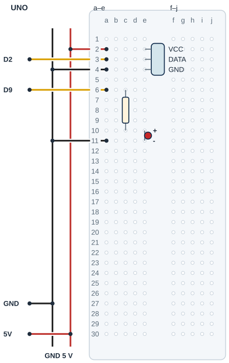

## Tanı • Tahmin et

### Günlük teknolojide

Bir oda göstergesi havanın sıcaklığını ve bağıl nemini yazabilir. Sen iki ölçümü Seri Monitör’de ayrı adlarla göreceksin. LED sınıf için seçilmiş bir aralık dışında veya okuma hatasında yanar. Sağlık, konfor ya da güvenlik sınırı ölçtüğünü varsayma.


### Sistemin yolu

**Girdi:** DHT11 dijital veri → **Hesap:** Geçerli mi? Aralıkta mı? → **Çıktı:** Ekran sayıları / LED

:::bilgi[Önce düşün]{renk=sari}
Yalnız sicaklikEsigi 30’dan 35’e çıkarsa aynı sıcaklık için LED kararı nasıl değişir? Nem koşullarının aynı kaldığını düşün.
:::

::yaz[Tahminim]{satir=2}

### Parçayı tanı

- Çizim, DATA pull-up direnci kendi kartında bulunan üç uçlu 5 V DHT11 modülü içindir. VCC-DATA-GND sırasını doğrula.
- Çıplak dört bacaklı DHT11 aynı yerleşim değildir; DATA pull-up için ayrı bağlantı gerekir. Karttaki direnci varsayma.
- Bağıl nem, havadaki su buharının o sıcaklıktaki doyma durumuna göre oranıdır. Toprağın gösterge sayısı ile aynı şey değildir.
- Kütüphane, sensörle konuşan hazır program parçasıdır. Bu projede Adafruit DHT sensor library ve Adafruit Unified Sensor kurulur.
- DHT11’in tipik belirtilen doğruluğu yaklaşık ±2 °C, bağıl nemde yaklaşık ±5 yüzde puandır. Ekranda tam sayı yazdırmak doğruluğu artırmaz.

## DHT11 veri yolunu ayır

| UNO pini | Bağlantı yolu |
|---|---|
| **GND** | GND rayı → DHT11 / LED |
| **5V** | 5 V rayı → VCC a2 / e2 |
| **D2** | DATA a3 / e3 → dijital giriş |
| **D9** | a6 → 220 Ω → LED |

_Kırmızı: güç · Siyah: GND · Turkuaz: analog · Sarı: dijital. Pin adı belirleyicidir._

### Adım adım kur

1. USB’yi çıkar; üç uçlu DHT11 modülün 5 V ve DATA pull-up uygunluğunu doğrula.
2. Örnek başlık VCC e2, DATA e3, GND e4 olarak ayrı satırlara girer.
3. UNO 5 V ve GND’yi ayrı raylara bağla; 5 V a2, D2 a3, GND a4.
4. LED: 220 Ω c6–c10, anot e10, katot e11; D9 a6, GND a11.
5. Pinleri, dirençleri ve kuru alanı kontrol et; sonra USB’yi tak.

:::dikkat{renk=kirmizi}
Sensöre su, nefes ya da buhar verme; kuru oda havasında dene. Çıplak DHT11 ile modülün pinlerini karıştırma. Model, DATA direnci ve 5 V uygunluğu belirsizken enerji verme.
:::

:::bilgi[Parçanı doğrula · modül etiketi]{renk=gri}
DHT11 modülünün başlık yazısını oku: VCC (+), DATA (S ya da OUT), GND (−). Üç uçlu modülde DATA direncinin kart üstünde olduğunu doğrula. Sırayı çizimle karşılaştır (*Parçanı doğrula* sayfası).

::yaz[soldan sağa … / … / …]{satir=1}
:::

### Kendi deliklerin

Kurduktan sonra her ucun gerçekte hangi deliğe girdiğini yaz ve çizimle karşılaştır.

| Uç | Çizimdeki delik | Benim deliğim |
|---|---|---|
| DHT11 VCC / DATA / GND | e2 / e3 / e4 |   |
| 5 V / D2 / GND jumper’ı | a2 / a3 / a4 |   |
| 220 Ω direnç | c6 → c10 |   |
| LED anot / katot | e10 / e11 |   |
| D9 / GND jumper’ı | a6 / a11 |   |

## DHT11’i ve LED’i yerleştir



- **Örnek başlık:** VCC e2 · DATA e3 · GND e4
- **Jumper delikleri:** 5 V a2 · D2 a3 · GND a4
- **DATA direnci:** Modül üstünde doğrulanır.
- **LED seri direnci:** 220 Ω: c6-c10
- **LED uçları:** Anot e10 · katot e11
- **LED giriş / dönüş:** D9 a6 · GND a11
- **Gerçek model:** Üç uçlu 5 V DHT11 modülü

_Kesişen çizgiler yalnız uçlarında birleşir. Her delikte tek uç vardır._

**Sen çiz (defterine):** gerçek modelinin uçlarını ve doğruladığın satırları göster.

Örnek uç sırası ve gövde yerleşimi gerçek modelden doğrulanır. Her delikte tek uç vardır. Modülün erkek başlık uçları ayrı satırlara girer; jumper’lar ayrı deliklerde kalır.

:::bilgi[Modelini eşleştir]{renk=mavi}
Uç aralığı veya sıra farklıysa yerleşimi kendi modeline göre uyarla; bacakları zorlama. Çizim, elindeki parçanın model kimliğini veya güç uygunluğunu kanıtlamaz.
:::

## Sıcaklığı ve nemi oku

```cpp title="TAM PROGRAM · P19" start=1 dosya=p19_sicaklik_ve_nem_istasyonu
#include <DHT.h>
const byte dhtPini = 2;
const byte ledPini = 9;
const float sicaklikEsigi = 30;
const float nemAlt = 30;
const float nemUst = 60;
const unsigned long aralikMs = 2000;
DHT dht(dhtPini, DHT11);
unsigned long sonOkuma = 0;

void setup() {
  pinMode(ledPini, OUTPUT);
  digitalWrite(ledPini, LOW);
  Serial.begin(9600);
  dht.begin();
  sonOkuma = millis();
}

void loop() {
  unsigned long simdi = millis();
  if (simdi - sonOkuma < aralikMs) return;
  sonOkuma = simdi;
  float nem = dht.readHumidity();
  float sicaklik = dht.readTemperature();
  if (isnan(nem) || isnan(sicaklik)) {
    digitalWrite(ledPini, HIGH);
    Serial.println("Okuma hatasi; gecerli olcum yok");
    return;
  }
  bool uyari = sicaklik > sicaklikEsigi ||
    nem < nemAlt || nem > nemUst;
  digitalWrite(ledPini, uyari);
  Serial.print("Sicaklik C: ");
  Serial.print(sicaklik, 0);
  Serial.print(" Bagil nem %: ");
  Serial.println(nem, 0);
}
```

_Kart: UNO · Seri Monitör: 9600 baud. Programı derle, sonra yükle. Kodun açıklaması aşağıda._

### Kodu izle

Uyarı kuralı: sıcaklık 30’dan büyükse ya da nem 30’dan küçük veya 60’tan büyükse LED yanar. Her satırda kararı kâğıtta bul.

| Ölçüm | Hangi koşul? | LED (yanar / söner) |
|---|---|---|
| 24 °C · %45 |   |   |
| 31 °C · %50 |   |   |
| 26 °C · %25 |   |   |
| 28 °C · %65 |   |   |

## Geçerli ölçüm ve okuma hatası

### Kodun mantığı

1. #include \<DHT.h\> kütüphaneyi ekler; DHT nesnesi D2 ve DHT11 türünü seçer. begin sensörü başlatır.
2. İlk ve sonraki istekler arasında en az 2000 ms vardır. Aynı turdaki sıcaklık ve nem aynı önbellekli okuma sonucunu kullanır.
3. isnan, geçerli sayı olmayan sonucu bulur. || en az bir koşul doğruysa doğrudur. Hata varsa sayı yazılmaz; LED ve hata mesajı açılır.
4. Geçerli çiftte sıcaklık 30’un üstü veya nem 30–60 dışında ise LED yanar. Tam sınırda bu koşullar yanlış olur.

### Hata avcısı

| Belirti | Olası neden | Ne yap? |
|---|---|---|
| DHT.h bulunamadı | Kütüphane eksik | Kütüphane Yöneticisi’nde Adafruit DHT sensor library ile Adafruit Unified Sensor adlarını bulup kur; sonra yeniden derle. |
| Okuma hatasi yazıyor | Model, veri yolu veya güç | Türün DHT11 olduğunu kontrol et. USB’yi çıkar; DATA/D2, GND ve kart üzerindeki pull-up direncini doğrulat. Hata önceki ölçüm değildir. |
| Değerler hemen değişmiyor | Örnekleme ve sensör tepkisi | En az iki saniyelik aralığı koru; kuru havada kararlı bekle. Daha sık istek fiziksel doğruluğu artırmaz. |

:::bilgi[Kütüphaneyi hazırla]{renk=mavi}
Kütüphane Yöneticisi’nde Adafruit DHT sensor library ve Adafruit Unified Sensor kur. Test edilen sürümler kod paketindeki README dosyasındadır. Kartı UNO seç; Seri Monitör 9600 baud. Sketch delay kullanmaz; DHT kütüphanesi iletişim sırasında kısa süre bekler. Tamamen kesintisiz çalıştığını varsayma.
:::

### Okumaları kaydet

aralikMs 2000’dir. Seri Monitör’den beş ardışık satırı kaydet; okuma hatası satırını ayrı işaretle.

| Okuma | Sıcaklık (°C) | Bağıl nem (%) | LED ya da hata |
|---|---|---|---|
| 1 |   |   |   |
| 2 |   |   |   |
| 3 |   |   |   |
| 4 |   |   |   |
| 5 |   |   |   |

## Sıcaklık eşiğini değiştir; sonucu kaydet

Önce tahminini yaz. Denemeden sonra gördüğün sayı veya tepkiyi boş alana kaydet.

| Deneme | Tahminim | Gözlemim |
|---|---|---|
| Kuru oda havasında üç ölçüm çifti ve LED durumunu yaz. |   |   |
| Aynı oda koşulunda bir süre bekle; tekrar karşılaştır. |   |   |
| USB çıkar; DATA jumper’ını ayırıp yeniden başlat, hata mesajını kaydet. |   |   |
| USB çıkar; DATA’yı düzelt. Yalnız sıcaklık eşiği 35, sonra 30. |   |   |

:::bilgi[Bir değişiklik yap]{renk=mavi}
Yalnız sicaklikEsigi 30’dan 35’e çıksın. Aynı konum ve oda koşullarını koru; sıcaklık ve nemi birlikte kaydet. Nem uyarısı varsa LED bu yüzden yanabilir. Sonra 30’a dön. Okuma aralığını iki saniyenin altına indirme.
:::

::yaz[Tahminim ve gözlemim]{satir=3}

### Değişiklik sürümleri

“Bir değişiklik yap” sürümleri; ana programla yan yana açıp farkı bul.

```cpp title="Değişiklik sürümü · p19_sicaklik_35" start=1 dosya=p19_sicaklik_35
#include <DHT.h>
const byte dhtPini = 2;
const byte ledPini = 9;
const float sicaklikEsigi = 35;
const float nemAlt = 30;
const float nemUst = 60;
const unsigned long aralikMs = 2000;
DHT dht(dhtPini, DHT11);
unsigned long sonOkuma = 0;

void setup() {
  pinMode(ledPini, OUTPUT);
  digitalWrite(ledPini, LOW);
  Serial.begin(9600);
  dht.begin();
  sonOkuma = millis();
}

void loop() {
  unsigned long simdi = millis();
  if (simdi - sonOkuma < aralikMs) return;
  sonOkuma = simdi;
  float nem = dht.readHumidity();
  float sicaklik = dht.readTemperature();
  if (isnan(nem) || isnan(sicaklik)) {
    digitalWrite(ledPini, HIGH);
    Serial.println("Okuma hatasi; gecerli olcum yok");
    return;
  }
  bool uyari = sicaklik > sicaklikEsigi ||
    nem < nemAlt || nem > nemUst;
  digitalWrite(ledPini, uyari);
  Serial.print("Sicaklik C: ");
  Serial.print(sicaklik, 0);
  Serial.print(" Bagil nem %: ");
  Serial.println(nem, 0);
}
```

### Kendini kontrol et

**1.** DHT nesnesinde seçilen sensör türü ve veri pini nedir?

::yaz[Cevabım]{satir=2}

**2.** Okuma hatası neden eski sıcaklık sayısıyla gösterilmez?

::yaz[Cevabım]{satir=2}

**3.** Sıcaklık 30, nem 60 iken LED koşullarını tek tek değerlendir.

::yaz[Cevabım]{satir=2}

**Sen çiz (defterine):** DHT11 okumasından uyarı kararına ve LED’e giden yolu göster.

**Evde devam et:** Bir oda göstergesinde sıcaklık, bağıl nem ve hata için üç ayrı alan tasarla.

**Şimdi sıra sende:** [Proje 16](proje:16) gösterge sayısı ile buradaki bağıl nemin neyi temsil ettiğini iki kutuda karşılaştır.

::yaz[Fikrim]{satir=3}

**Kendimi değerlendiriyorum:** Yardımla yaptım · Biraz yardımla · Tek başıma · Başkasına anlatabilirim

::yaz[Bu projeyi nasıl yaptım? Neden?]{satir=1}

:::bilgi[Biliyor muydun?]{renk=sari}
DHT kütüphanesi kısa aralıkla yapılan sıcaklık ve nem isteklerinde son okuma sonucunu paylaşır. Programdaki istek sayısı ile yeni fiziksel ölçüm sayısı aynı olmayabilir.
:::
