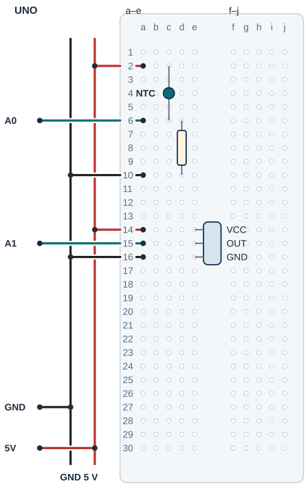

## Tanı • Tahmin et

### Günlük teknolojide

İki sıcaklık algılayıcısı aynı ortamı farklı elektriksel yollardan izler. LM35 gerilim üretir; NTC’nin direnci değişir. Sen iki sensörün sonucunu yan yana okuyacak, NTC’yi bir referans termometreyle karşılaştıracaksın. İki sayının benzemesi tek başına doğru ölçtüklerini kanıtlamaz.


### Sistemin yolu

**Girdi:** A0 NTC / A1 LM35 → **Hesap:** Direnç modeli / gerilim → **Çıktı:** Ham değerler / sıcaklık

:::bilgi[Önce düşün]{renk=sari}
Yalnız aralikMs 1000’den 2000’e çıkarsa ekrana yazma sıklığı ve ölçüm doğruluğu aynı biçimde değişir mi? Gerekçeni yaz.
:::

::yaz[Tahminim]{satir=2}

### Parçayı tanı

- NTC ısınınca direnci azalan bir parçadır. [Proje 7](proje:7) bölücüsünde bu kez üst kolda NTC, alt kolda 10 kΩ vardır.
- Bu yön için direnç: R = seriR × (1023 / ham − 1). Ters yerleşim başka denklem ister; bu devrede kolları değiştirme.
- referansR (R0) 10000 Ω, referansK 298,15 K ve beta (B) 3950 örnek değerlerdir. Program bunlarla her zaman bir NTC °C sonucu yazar.
- Referans termometreyi NTC’nin yanına koy ve farkı kaydet. Gerçek parçanın R25 ve B değerini veri sayfasından doğrula; 10 kΩ ve B=3950 yalnız örnektir. Tek sıcaklık noktasına bakarak beta’yı değiştirme.
- LM35 hesabı 10 mV/°C ve adcReferansi=5,0 V varsayar. Gerçek UNO referansı ve LM35 pinleri öğretmenle doğrulanır.

## NTC bölücüsünü ve LM35’i ayır

| UNO pini | Bağlantı yolu |
|---|---|
| **GND** | GND rayı → 10 kΩ / LM35 |
| **5V** | 5 V rayı → NTC / LM35 VCC |
| **A0** | a6 → NTC / 10 kΩ ortak düğümü |
| **A1** | OUT a15 / e15 → LM35 çıkışı |

_Kırmızı: güç · Siyah: GND · Turkuaz: analog · Sarı: dijital. Pin adı belirleyicidir._

### Adım adım kur

1. USB’yi çıkar; NTC değerlerini ve LM35 modelinin besleme/çıkış/GND pinlerini doğrula.
2. UNO 5 V ve GND’yi ayrı raylara bağla. NTC c2–c6; 10 kΩ direnç d6–d10 arasında aynı yarıda kalır.
3. 5 V rayı a2’ye; A0 a6’ya; a10 GND rayına gider. NTC ve direnç satır 6’da ayrı deliklerle birleşir.
4. LM35 örnek uçları VCC e14, OUT e15, GND e16; raydan 5 V a14, A1 a15, GND a16. Gerçek pin yönünü eşleştir.
5. Model ve yolları kontrol et; parçalar kuru ve sabitken USB’yi tak.

:::dikkat{renk=kirmizi}
NTC doğrudan 5 V ile GND arasına bağlanmaz; seri 10 kΩ korunur. Sensörleri suya sokma, ısıtıcıya değdirme; kuru oda havasında karşılaştır. Pin veya model bilgisi belirsizse enerji verme.
:::

:::bilgi[Parçanı doğrula · direnç ve LM35]{renk=gri}
10 kΩ direnci renk bandıyla bul: kahverengi-siyah-turuncu (*Parçanı doğrula* sayfası). NTC modelini varsa gövde kodundan, yoksa set etiketinden doğrula. LM35’in düz yüzü sana bakarken soldan sağa +VS, VOUT, GND; çizimde VCC, OUT, GND.

::yaz[direnç bantları … · NTC yazısı … · LM35 sırası …]{satir=1}
:::

### Kendi deliklerin

Kurduktan sonra her ucun gerçekte hangi deliğe girdiğini yaz ve çizimle karşılaştır. NTC, 10 kΩ ve A0 aynı satırda (6 numara) buluşmalı.

| Uç | Çizimdeki delik | Benim deliğim |
|---|---|---|
| NTC | c2 → c6 |   |
| 10 kΩ direnç | d6 → d10 |   |
| 5 V / A0 / GND jumper’ı | a2 / a6 / a10 |   |
| LM35 VCC / OUT / GND | e14 / e15 / e16 |   |
| 5 V / A1 / GND jumper’ı | a14 / a15 / a16 |   |

## NTC’yi, direnci ve LM35’i yerleştir



- **NTC üst kol:** c2-c6 · 5 V a2
- **10 kΩ alt kol:** d6-d10 · GND a10
- **Ölçüm düğümü:** c6/d6/A0 a6 aynı grup
- **LM35 örnek uçları:** VCC e14 · OUT e15 · GND e16
- **LM35 jumper delikleri:** 5 V a14 · A1 a15 · GND a16
- **Modelin yönü:** Gerçek LM35 pinlerini eşleştir.
- **NTC modelini doğrula:** Referansla karşılaştır; R25/B ve bölücüyü denetle.

_Kesişen çizgiler yalnız uçlarında birleşir. Her delikte tek uç vardır._

**Sen çiz (defterine):** gerçek modelinin uçlarını ve doğruladığın satırları göster.

Örnek uç sırası ve gövde yerleşimi gerçek modelden doğrulanır. Her delikte tek uç vardır. LM35 uçları ayrı satırlara girer; jumper’lar ayrı deliklerde kalır.

:::bilgi[Modelini eşleştir]{renk=mavi}
Uç aralığı veya sıra farklıysa yerleşimi kendi modeline göre uyarla; bacakları zorlama. Çizim, elindeki parçanın model kimliğini veya güç uygunluğunu kanıtlamaz.
:::

## İki sıcaklığı yan yana hesapla

```cpp title="TAM PROGRAM · P20 · 1/2 (tanımlar ve fonksiyonlar)" start=1 dosya=p20_termistor_mu_lm35_mi
#include <math.h>
const byte ntcPini = A0;
const byte lm35Pini = A1;
const float seriR = 10000;
const float referansR = 10000; // örnek; veri sayfasından doğrula
const float beta = 3950; // örnek; veri sayfasından doğrula
const float referansK = 298.15;
const float adcReferansi = 5.0;
const unsigned long aralikMs = 1000;
unsigned long sonOkuma = 0;

float ntcSicaklik(int ham) {
  if (ham <= 0 || ham >= 1023) return NAN;
  float r = seriR * (1023.0 / ham - 1.0);
  float tersK = 1.0 / referansK + log(r / referansR) / beta;
  if (tersK <= 0) return NAN;
  return 1.0 / tersK - 273.15;
}
```

```cpp title="TAM PROGRAM · P20 · 2/2 (setup ve loop)" start=20 dosya=p20_termistor_mu_lm35_mi
void setup() {
  Serial.begin(9600);
  sonOkuma = millis();
}

void loop() {
  unsigned long simdi = millis();
  if (simdi - sonOkuma < aralikMs) return;
  sonOkuma = simdi;
  int hamNtc = analogRead(ntcPini);
  int hamLm = analogRead(lm35Pini);
  float ntc = ntcSicaklik(hamNtc);
  float lm = hamLm * adcReferansi / 1023.0 * 100.0;
  Serial.print("Ham NTC: ");
  Serial.print(hamNtc);
  Serial.print(" Ham LM35: ");
  Serial.print(hamLm);
  if (isnan(ntc)) {
    Serial.print(" NTC okumasi gecersiz");
  } else {
    Serial.print(" NTC C: ");
    Serial.print(ntc, 1);
  }
  Serial.print(" LM35 C: ");
  Serial.println(lm, 1);
}
```

_Kart: UNO · Seri Monitör: 9600 baud. Programı derle, sonra yükle. Kodun açıklaması aşağıda._

### Kodu izle

::yaz[LM35 hesabı: ham × 5,0 / 1023,0 × 100. Kâğıtta hesapla: ham 56 → … °C · ham 61 → … °C. Sonra Seri Monitör ile karşılaştır.]{satir=1}

## NTC’yi referansla karşılaştır

### Kodun mantığı

1. ntcSicaklik ham sayıyı alır. Ham 0 veya 1023 ise NTC kopuk ya da kısa devre olabilir; NAN döner ve ekrana NTC okumasi gecersiz yazılır.
2. Pozitif direnç ve beta ile log doğal logaritmayı hesaplar. Kelvin sonucundan 273,15 çıkarılarak °C bulunur.
3. referansR, referansK ve beta NTC modeline ait parametrelerdir. Sonucu referans termometreyle karşılaştır; fark büyükse model değerini, bölücü yönünü ve bağlantıyı incele.
4. Her saniye iki ham değer ile NTC ve LM35 °C sonuçları yan yana yazılır. NTC okumasi gecersiz mesajı LM35 okumayı durdurmaz.

### Hata avcısı

| Belirti | Olası neden | Ne yap? |
|---|---|---|
| NTC okumasi gecersiz yazıyor | ADC uç değeri: kopuk veya kısa devre | USB’yi çıkar; NTC, 10 kΩ direnç ve A0 yolunu incele. Ham 0 ya da 1023 tek bir arıza türünü kanıtlamaz. |
| NTC ile referans çok farklı | Örnek model değeri, bölücü yönü veya bekleme | Aynı havada birkaç dakika bekle. Fark 2 °C’den büyükse beta’yı değiştirme; veri sayfasındaki R25 ve B değerini, bölücü yönünü ve seri direnci kontrol et. |
| LM35 sayısı anlamsız | Pin, model veya gerilim | USB’yi çıkar; gerçek paket yönünü ve A1 çıkış yolunu doğrula. Daha fazla ondalık basamak ekleyerek hatayı gideremezsin. |

:::bilgi[Model hesabı ve gösterilen basamak]{renk=mavi}
β modeli: 1/T = 1/T0 + ln(R/R0)/β. T ve T0 Kelvin; 25 °C = 298,15 K. log doğal logaritmadır. R0 = 10000 ve B = 3950 örnektir; gerçek R25 ve B veri sayfasından doğrulanır, referans termometreyle karşılaştırılır. 5 V referansla LM35’in bir ADC adımı yaklaşık 0,49 °C’dir; bu toplam ölçüm hatası değildir.
:::

### İki sensörü karşılaştır

Aynı ortamda NTC ve LM35 okumalarını ve referans termometreyi yaz. Fark 2 °C’yi aşarsa nedenini ara; beta’yı tek noktaya göre değiştirme.

| Durum | NTC (°C) | LM35 (°C) | Referans (°C) |
|---|---|---|---|
| Oda havası |   |   |   |
| Avucunda 30 saniye |   |   |   |
| Bıraktıktan 2 dakika sonra |   |   |   |
| Kendi durumun |   |   |   |

## Aralığı değiştir; iki ölçümü kaydet

Önce tahminini yaz. Denemeden sonra gördüğün sayı veya tepkiyi boş alana kaydet.

| Deneme | Tahminim | Gözlemim |
|---|---|---|
| İlk çalıştırmada iki ham değeri ve iki °C sonucunu yaz. |   |   |
| Referans: ___ °C · NTC: ___ °C · Fark: ___ °C |   |   |
| Fark 2 °C’den büyükse beta’yı değiştirme; farkı ve olası nedeni yaz. |   |   |
| Yalnız aralık 2000 ms; sonra 1000 ms’ye dön. |   |   |

:::bilgi[Bir değişiklik yap]{renk=mavi}
Yalnız aralikMs 1000’den 2000’e çıksın. Aynı kuru ortamı ve sabit sensör yerlerini koru. Yazma aralığını gözle; daha seyrek yazmanın doğruluğu artırdığını varsayma. Sonra 1000’e dön. Referans karşılaştırması ayrı bir denemedir.
:::

::yaz[Tahminim ve gözlemim]{satir=3}

### Değişiklik sürümleri

“Bir değişiklik yap” sürümleri; ana programla yan yana açıp farkı bul.

```cpp title="Değişiklik sürümü · p20_aralik_2000" start=1 dosya=p20_aralik_2000
#include <math.h>
const byte ntcPini = A0;
const byte lm35Pini = A1;
const float seriR = 10000;
const float referansR = 10000; // örnek; veri sayfasından doğrula
const float beta = 3950; // örnek; veri sayfasından doğrula
const float referansK = 298.15;
const float adcReferansi = 5.0;
const unsigned long aralikMs = 2000;
unsigned long sonOkuma = 0;

float ntcSicaklik(int ham) {
  if (ham <= 0 || ham >= 1023) return NAN;
  float r = seriR * (1023.0 / ham - 1.0);
  float tersK = 1.0 / referansK + log(r / referansR) / beta;
  if (tersK <= 0) return NAN;
  return 1.0 / tersK - 273.15;
}

void setup() {
  Serial.begin(9600);
  sonOkuma = millis();
}

void loop() {
  unsigned long simdi = millis();
  if (simdi - sonOkuma < aralikMs) return;
  sonOkuma = simdi;
  int hamNtc = analogRead(ntcPini);
  int hamLm = analogRead(lm35Pini);
  float ntc = ntcSicaklik(hamNtc);
  float lm = hamLm * adcReferansi / 1023.0 * 100.0;
  Serial.print("Ham NTC: ");
  Serial.print(hamNtc);
  Serial.print(" Ham LM35: ");
  Serial.print(hamLm);
  if (isnan(ntc)) {
    Serial.print(" NTC okumasi gecersiz");
  } else {
    Serial.print(" NTC C: ");
    Serial.print(ntc, 1);
  }
  Serial.print(" LM35 C: ");
  Serial.println(lm, 1);
}
```

### Kendini kontrol et

**1.** Bölücünün üst ve alt kolunda hangi parçalar var?

::yaz[Cevabım]{satir=2}

**2.** Beta 3950 neden yalnız bir örnek değerdir; gerçek değeri nereden doğrularsın?

::yaz[Cevabım]{satir=2}

**3.** Ham değer 511,5 kabul edilen kâğıt örneğinde seriR=10000 ise R kaç ohm olur?

::yaz[Cevabım]{satir=2}

**Sen çiz (defterine):** ham okumadan göstergeye giden yolu göster.

**Evde devam et:** İki termometreyi karşılaştırmak için aynı ortam, bekleme ve referans koşullarını kâğıtta listele.

**Şimdi sıra sende:** [Proje 8](proje:8) LM35 yoluyla NTC yolunu karşılaştır: biri gerilimden, diğeri direnç ve modelden °C’ye gider.

::yaz[Fikrim]{satir=3}

**Kendimi değerlendiriyorum:** Yardımla yaptım · Biraz yardımla · Tek başıma · Başkasına anlatabilirim

::yaz[Bu projeyi nasıl yaptım? Neden?]{satir=1}

:::bilgi[Biliyor muydun?]{renk=sari}
NTC’nin beta değeri modelin belirli sıcaklıklar arasındaki direnç eğrisine bağlıdır. Bütün termistörler için tek bir evrensel beta yoktur.
:::
