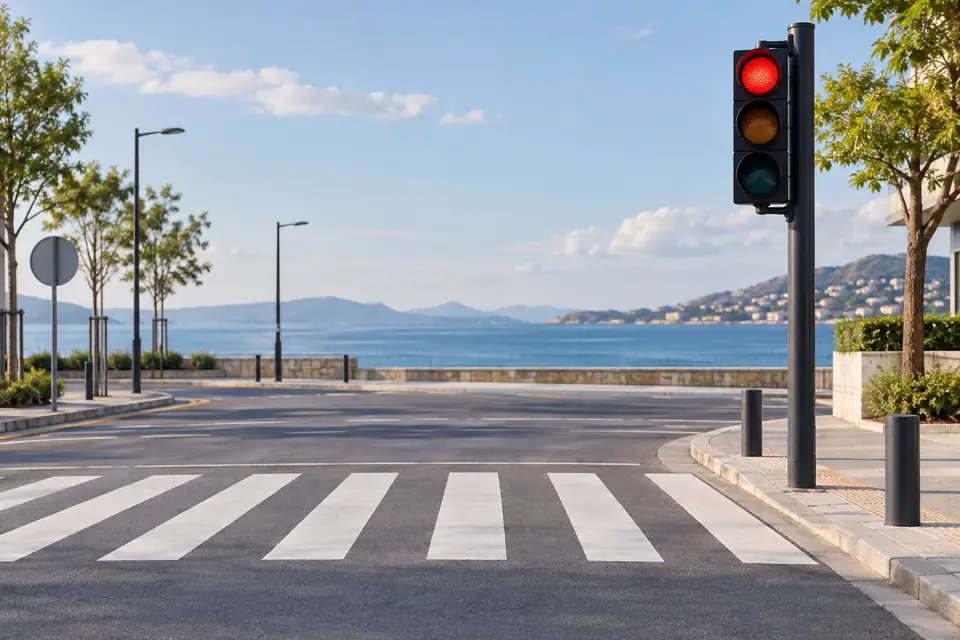
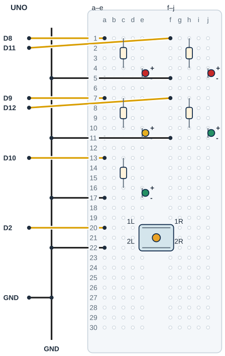

## Tanı • Tahmin et

### Günlük teknolojide

Bir yaya butonu ışık sistemine istek yollar. Sen beş LED ile bir geçiş sırası kuracaksın. Araçların ve yayaların yeşilleri ayrı zamanlarda yanacak. Bu sınıf modeli, gerçek trafik kontrolü için kullanılmaz; yola veya gerçek lambalara bağlanmaz.



### Sistemin yolu

**Girdi:** Kararlı buton basışı. → **Karar:** Durum ve geçen süre. → **Çıktı:** Beş LED’in sırası.

:::bilgi[Önce düşün]{renk=sari}
Yalnız yayaMs 5000’den 3000’e inerse butondan normal duruma dönüş süresini nasıl tahmin edersin? Işık sırası aynı kalsın.
:::

::yaz[Tahminim]{satir=2}

### Parçayı tanı

- Dizi, sırayla saklanan değerler listesidir. Küçük örnek: int sureler\[3\] = {500, 1000, 2000}; burada sureler\[0\] 500, sureler\[2\] 2000’dir.
- ledPinleri içinde araç kırmızı, sarı, yeşil; ardından yaya kırmızı ve yeşil pinleri vardır. isiklar satırı bir durum, sütunu bir LED için 0 veya 1 saklar; sureler aynı sıradaki beklemeyi tutar.
- [Proje 14](proje:14) INPUT\_PULLUP kullanır: bırakılan buton HIGH, basılan LOW okunur. Harici 10 kΩ eklenmez; butonun iç çiftlerini uç bulucuyla bul (yöntem B, *Parçanı doğrula* sayfası).
- [Proje 12](proje:12) titreşim elemesi ve [Proje 15](proje:15) zamanlayıcı burada birleşir. 30 ms kararlı okuma, bu modelde kullanılan örnek eleme süresidir.
- Sıra işlerken yeni basışlar biriktirilmez. Sıra bitince buton bırakılmış olmalı; basılı tutmak yeni sıra başlatmaz.

## Beş LED’i ve butonu ayrı bağla

| UNO pini | Bağlantı yolu |
|---|---|
| **GND** | Siyah ray; LED katotları ve BTN alt çift |
| **D8** | a1 → 220 Ω → AK anot e4 |
| **D9** | a7 → 220 Ω → AS anot e10 |
| **D10** | a13 → 220 Ω → AY anot e16 |
| **D11** | f1 → 220 Ω → YK anot j4 |
| **D12** | f7 → 220 Ω → YY anot j10 |
| **D2** | a20 → BTN üst çift e20/f20 |

_Kırmızı: güç · Siyah: GND · Turkuaz: analog · Sarı: dijital. Pin adı belirleyicidir._

**Kontrol listesi**

- Gerçek model / pin yönü doğrulandı
- Güç ve sinyal yolları ayrı
- Her delikte tek uç
- Ortak GND / yük koşulu kontrolü

### Adım adım kur

1. USB’yi çıkar. Butonun iç çiftlerini ve LED yönlerini kontrol et; UNO GND’yi siyah raya bağla.
2. Araç kırmızı: 220 Ω c1–c4, LED anot e4/katot e5; D8 a1, GND a5.
3. Araç sarı: 220 Ω c7–c10, LED e10/e11; D9 a7, GND a11. Araç yeşil: 220 Ω c13–c16, LED e16/e17; D10 a13, GND a17.
4. Yaya kırmızı: 220 Ω h1–h4, LED j4/j5; D11 f1, GND f5. Yaya yeşil: 220 Ω h7–h10, LED j10/j11; D12 f7, GND f11.
5. Buton: üst çift e20/f20, alt çift e22/f22. D2 a20’ye, a22 GND rayına gider; 5 V bağlama.
6. Ayrı delikleri, beş seri direnci ve buton çiftlerini kontrol et. USB’yi tak; bağlantı değişiminde yeniden çıkar.

:::dikkat{renk=kirmizi}
Bu yalnız masa üstünde çalışan eğitim modelidir. Beş LED’in her biri kendi 220 Ω direncini kullanır; iki yeşili birlikte yakacak değişiklik yapma. Gerçek trafik sistemi kurallarını veya arıza korumasını temsil etmez.
:::

:::bilgi[Parçanı doğrula · buton ve LED’ler]{renk=gri}
Butonun anahtarlanan çiftini uç bulucuyla bul (yöntem B, *Parçanı doğrula* sayfası). Beş LED’in uzun bacağı anottur; her LED kendi 220 Ω direnciyle bağlanır.

::yaz[anahtarlanan çift … / … · anotlar uzun bacakta mı? …]{satir=1}
:::

:::bilgi[Işık adları]{renk=mavi}
AK araç kırmızı · AS araç sarı · AY araç yeşil · YK yaya kırmızı · YY yaya yeşil. Çizimde ve tablolarda bu kısaltmalar kullanılır.
:::

## LED’leri ve butonu yerleştir



- **GND dağıtımı:** UNO’dan bir GND jumper’ı çıkar. Beş LED ve buton aynı siyah raydan GND alır.
- **Üç araç ışığı:** Solda AK: D8; AS: D9; AY: D10. Her ışığın kendi direnci ve iki ayrı LED deliği vardır.
- **İki yaya ışığı:** Sağda YK: D11; YY: D12. Sağ yarıdaki direnç ve LED’ler kanalı aşmaz.
- **Buton çiftleri:** Üst e20/f20 ve alt e22/f22 iç çiftleri doğrulansın. Üst D2, alt GND; 5 V gerekmez.
- **Bir uç, bir delik:** Direnç, LED ve jumper ayrı deliklerde buluşur. Aynı satır aynı yarıda elektriksel bağlantı sağlar.
- **Modeli sınırla:** Renk ve süre sırası yalnız eğitim örneğidir. Gerçek trafik güvenliği veya arıza yönetimi sağlamaz.

_Kesişen çizgiler yalnız uçlarında birleşir. Her delikte tek uç vardır._

**Sen çiz (defterine):** gerçek modelinin uç adlarını ve doğruladığın satırları göster.

Çizim örnek pin sırasını gösterir. Gerçek parça uçlarını üretici şemasıyla eşleştir. Başlıklar ayrı satırlara, jumper’lar aynı grubun ayrı deliklerine girer.

:::bilgi[Modelini eşleştir]{renk=mavi}
LED renklerini ledPinleri sırasıyla eşleştir: D8 araç kırmızı, D9 sarı, D10 yeşil, D11 yaya kırmızı, D12 yaya yeşil. Butonun iç çiftleri farklıysa butonu 90° çevir.
:::

## Yaya isteğiyle ışık sırası üret

```cpp title="TAM PROGRAM · P21 · 1/2 (tanımlar ve fonksiyonlar)" start=1 dosya=p21_yaya_gecidi_trafik_isiklari
const byte ledPinleri[5] = {8, 9, 10, 11, 12};
const byte butonPini = 2;
const byte durumSayisi = 5;
const byte yanipFazSayisi = 6;
const unsigned long hazirlikMs = 2000;
const unsigned long tumuKirmiziMs = 1000;
const unsigned long yayaMs = 5000;
const unsigned long yanipSonmeMs = 300;
const unsigned long titresimMs = 30;
const unsigned long yanipBitisMs = yanipFazSayisi * yanipSonmeMs;
const byte isiklar[5][5] = {
  {0,0,1,1,0}, {0,1,0,1,0}, {1,0,0,1,0},
  {1,0,0,0,1}, {1,0,0,0,0}
};
const unsigned long sureler[5] = {
  0, hazirlikMs, tumuKirmiziMs, yayaMs, yanipBitisMs + tumuKirmiziMs
};
byte durum = 0;
bool sonHam = HIGH;
bool kararli = HIGH;
bool yenidenHazir = false;
unsigned long sonDegisim = 0;
unsigned long durumBaslangici = 0;

void isikGoster(unsigned long simdi) {
  for (byte sira = 0; sira < 5; sira++)
    digitalWrite(ledPinleri[sira], isiklar[durum][sira]);
  if (durum == 4) {
    unsigned long gecen = simdi - durumBaslangici;
    bool yaniyor = gecen < yanipBitisMs && (gecen / yanipSonmeMs) % 2 == 1;
    digitalWrite(ledPinleri[4], yaniyor);
    digitalWrite(ledPinleri[3], gecen >= yanipBitisMs);
  }
}
```

_Kart: UNO. Bu program Seri Monitör’e veri yazmaz. Programı derle, sonra yükle. Programın ikinci kutusu ve açıklaması aşağıda._

### Kendi deliklerin

Kurduktan sonra her ucun gerçekte hangi deliğe girdiğini yaz ve çizimle karşılaştır.

| Uç | Çizimdeki delik | Benim deliğim |
|---|---|---|
| Araç ışıkları AK / AS / AY | e4–e5 · e10–e11 · e16–e17 |   |
| Araç dirençleri | c1–c4 · c7–c10 · c13–c16 |   |
| Yaya ışıkları YK / YY | j4–j5 · j10–j11 |   |
| Yaya dirençleri | h1–h4 · h7–h10 |   |
| Buton üst / alt çift | e20 / f20 · e22 / f22 |   |
| D8–D12 / D2 jumper’ları | a1, a7, a13, f1, f7 / a20 |   |

## Beş durum ve zaman sınırları

```cpp title="TAM PROGRAM · P21 · 2/2 (setup ve loop)" start=36 dosya=p21_yaya_gecidi_trafik_isiklari
void setup() {
  for (byte sira = 0; sira < 5; sira++)
    pinMode(ledPinleri[sira], OUTPUT);
  pinMode(butonPini, INPUT_PULLUP);
  sonHam = digitalRead(butonPini);
  kararli = sonHam;
  sonDegisim = millis();
  isikGoster(sonDegisim);
}

void loop() {
  unsigned long simdi = millis();
  bool ham = digitalRead(butonPini);
  if (ham != sonHam) {
    sonDegisim = simdi;
    sonHam = ham;
  }
  if (simdi - sonDegisim >= titresimMs) {
    kararli = ham;
    if (durum == 0 && kararli == HIGH) yenidenHazir = true;
    if (durum == 0 && kararli == LOW && yenidenHazir) {
      yenidenHazir = false;
      durum = 1;
      durumBaslangici = simdi;
    }
  }
  if (durum > 0 && simdi - durumBaslangici >= sureler[durum]) {
    durum++;
    if (durum == durumSayisi) durum = 0;
    durumBaslangici = simdi;
  }
  isikGoster(simdi);
}
```

### Kodun mantığı

1. ledPinleri pin sırasını, isiklar beş durumun çıkış satırlarını, sureler her durumun süresini tutar. durum satırı, sira sütunu seçer.
2. isikGoster durum satırını beş LED’e yazar. Normal satır araç yeşil ve yaya kırmızıdır; hiçbir satırda iki yeşil birlikte yanmaz.
3. sonHam değişirse sonDegisim yenilenir. titresimMs dolunca kararli kabul edilir; normal durumda bırakılmış buton yenidenHazir olur.
4. Kararlı basış durum 1’i başlatır. Sıra: 1 sarı, 2 tümü kırmızı, 3 yaya yeşili, 4 bitiş, sonra 0 normal durum.
5. Durum 4’te gecen süre hesaplanır: yaya yeşili üç kez yanıp söner, yanipBitisMs dolunca yaya kırmızısı yanar. İki tümü-kırmızı aralık 1000 ms’dir; delay veya basış bekleyen while yoktur.

:::bilgi[İki tür sıra]{renk=mavi}
ledPinleri sütunları, durum satırları seçer. 5 durum vardır; dizi elemanlarına 0–4 aralığında erişilir.
:::

## Işık sırası hatalarını ayıkla

### Hata avcısı

| Belirti | Olası neden | Ne yap? |
|---|---|---|
| Buton hiç istek üretmiyor | Yanlış iç çift veya yön | USB’yi çıkar; iç çiftleri uç bulucuyla yeniden bul. Gerekirse butonu 90° çevirip üst/alt çiftleri yeniden eşleştir. |
| Tek basış birkaç sıra üretiyor | Bırakma veya temas sorunu | Önce butonu bırak, normal durumu gözle, sonra bir kez bas. D2/GND ve kararlı okuma süresini kontrol et. |
| Renkler sıraya uymuyor | Dizi sırası ile kablolar farklı | USB’yi çıkar; D8–D12 ile ledPinleri sırasını eşleştir. GND rayı ve her LED’in ayrı direncini kontrol et. |

### Durumları izle

isiklar dizisinden her durumda yanan ışıkları bul (1 yanar, 0 söner); sıra AK, AS, AY, YK, YY’dir. Süreyi sureler dizisinden yaz. Son satırda butonun neden etkisiz kaldığını açıkla.

| durum | Yanan araç ışığı | Yanan yaya ışığı | Süre (ms) |
|---|---|---|---|
| 0 |   |   |   |
| 1 |   |   |   |
| 2 |   |   |   |
| 3 |   |   |   |
| 4 (ilk 1800 ms) |   |   |   |
| 4 (son 1000 ms) |   |   |   |
| durum 2’de basış |   |   |   |

## Yaya süresini değiştir; sırayı kaydet

Önce tahminini yaz. Denemeden sonra gördüğün tepkiyi boş alana kaydet.

| Deneme | Tahminim | Gözlemim |
|---|---|---|
| Başlangıçta araç/yaya renklerini kaydet. |   |   |
| Bir kez bas, sıra boyunca her durumun renklerini yaz. |   |   |
| Butonu sıra bitene kadar basılı tut; sıra sayısını yaz. |   |   |
| Sıra içinde kısa basıp bırak; normal dönünce tekrar izle. |   |   |
| Yalnız yayaMs 3000; aynı deney, sonra 5000’e dön. |   |   |

:::bilgi[Bir değişiklik yap]{renk=mavi}
Yalnız yayaMs 5000’den 3000’e insin. Butona aynı biçimde bir kez bas; sırayı ve süre gözlemini karşılaştır. İki tümü-kırmızı aralık 1000 ms kalsın. Sonra 5000’e dön.
:::

::yaz[Tahminim ve gözlemim]{satir=3}

### Değişiklik sürümleri

“Bir değişiklik yap” sürümleri; ana programla yan yana açıp farkı bul.

```cpp title="Değişiklik sürümü · p21_titresim_50" start=1 dosya=p21_titresim_50
const byte ledPinleri[5] = {8, 9, 10, 11, 12};
const byte butonPini = 2;
const byte durumSayisi = 5;
const byte yanipFazSayisi = 6;
const unsigned long hazirlikMs = 2000;
const unsigned long tumuKirmiziMs = 1000;
const unsigned long yayaMs = 5000;
const unsigned long yanipSonmeMs = 300;
const unsigned long titresimMs = 50;
const unsigned long yanipBitisMs = yanipFazSayisi * yanipSonmeMs;
const byte isiklar[5][5] = {
  {0,0,1,1,0}, {0,1,0,1,0}, {1,0,0,1,0},
  {1,0,0,0,1}, {1,0,0,0,0}
};
const unsigned long sureler[5] = {
  0, hazirlikMs, tumuKirmiziMs, yayaMs, yanipBitisMs + tumuKirmiziMs
};
byte durum = 0;
bool sonHam = HIGH;
bool kararli = HIGH;
bool yenidenHazir = false;
unsigned long sonDegisim = 0;
unsigned long durumBaslangici = 0;

void isikGoster(unsigned long simdi) {
  for (byte sira = 0; sira < 5; sira++)
    digitalWrite(ledPinleri[sira], isiklar[durum][sira]);
  if (durum == 4) {
    unsigned long gecen = simdi - durumBaslangici;
    bool yaniyor = gecen < yanipBitisMs && (gecen / yanipSonmeMs) % 2 == 1;
    digitalWrite(ledPinleri[4], yaniyor);
    digitalWrite(ledPinleri[3], gecen >= yanipBitisMs);
  }
}

void setup() {
  for (byte sira = 0; sira < 5; sira++)
    pinMode(ledPinleri[sira], OUTPUT);
  pinMode(butonPini, INPUT_PULLUP);
  sonHam = digitalRead(butonPini);
  kararli = sonHam;
  sonDegisim = millis();
  isikGoster(sonDegisim);
}

void loop() {
  unsigned long simdi = millis();
  bool ham = digitalRead(butonPini);
  if (ham != sonHam) {
    sonDegisim = simdi;
    sonHam = ham;
  }
  if (simdi - sonDegisim >= titresimMs) {
    kararli = ham;
    if (durum == 0 && kararli == HIGH) yenidenHazir = true;
    if (durum == 0 && kararli == LOW && yenidenHazir) {
      yenidenHazir = false;
      durum = 1;
      durumBaslangici = simdi;
    }
  }
  if (durum > 0 && simdi - durumBaslangici >= sureler[durum]) {
    durum++;
    if (durum == durumSayisi) durum = 0;
    durumBaslangici = simdi;
  }
  isikGoster(simdi);
}
```

```cpp title="Değişiklik sürümü · p21_yaya_3000" start=1 dosya=p21_yaya_3000
const byte ledPinleri[5] = {8, 9, 10, 11, 12};
const byte butonPini = 2;
const byte durumSayisi = 5;
const byte yanipFazSayisi = 6;
const unsigned long hazirlikMs = 2000;
const unsigned long tumuKirmiziMs = 1000;
const unsigned long yayaMs = 3000;
const unsigned long yanipSonmeMs = 300;
const unsigned long titresimMs = 30;
const unsigned long yanipBitisMs = yanipFazSayisi * yanipSonmeMs;
const byte isiklar[5][5] = {
  {0,0,1,1,0}, {0,1,0,1,0}, {1,0,0,1,0},
  {1,0,0,0,1}, {1,0,0,0,0}
};
const unsigned long sureler[5] = {
  0, hazirlikMs, tumuKirmiziMs, yayaMs, yanipBitisMs + tumuKirmiziMs
};
byte durum = 0;
bool sonHam = HIGH;
bool kararli = HIGH;
bool yenidenHazir = false;
unsigned long sonDegisim = 0;
unsigned long durumBaslangici = 0;

void isikGoster(unsigned long simdi) {
  for (byte sira = 0; sira < 5; sira++)
    digitalWrite(ledPinleri[sira], isiklar[durum][sira]);
  if (durum == 4) {
    unsigned long gecen = simdi - durumBaslangici;
    bool yaniyor = gecen < yanipBitisMs && (gecen / yanipSonmeMs) % 2 == 1;
    digitalWrite(ledPinleri[4], yaniyor);
    digitalWrite(ledPinleri[3], gecen >= yanipBitisMs);
  }
}

void setup() {
  for (byte sira = 0; sira < 5; sira++)
    pinMode(ledPinleri[sira], OUTPUT);
  pinMode(butonPini, INPUT_PULLUP);
  sonHam = digitalRead(butonPini);
  kararli = sonHam;
  sonDegisim = millis();
  isikGoster(sonDegisim);
}

void loop() {
  unsigned long simdi = millis();
  bool ham = digitalRead(butonPini);
  if (ham != sonHam) {
    sonDegisim = simdi;
    sonHam = ham;
  }
  if (simdi - sonDegisim >= titresimMs) {
    kararli = ham;
    if (durum == 0 && kararli == HIGH) yenidenHazir = true;
    if (durum == 0 && kararli == LOW && yenidenHazir) {
      yenidenHazir = false;
      durum = 1;
      durumBaslangici = simdi;
    }
  }
  if (durum > 0 && simdi - durumBaslangici >= sureler[durum]) {
    durum++;
    if (durum == durumSayisi) durum = 0;
    durumBaslangici = simdi;
  }
  isikGoster(simdi);
}
```

### Kendini kontrol et

**1.** ledPinleri dizisinin 0 ve 4 sıralarında hangi ışıklar vardır?

::yaz[Cevabım]{satir=2}

**2.** Butonu basılı tutunca ikinci sıra neden başlamaz?

::yaz[Cevabım]{satir=2}

**3.** Bir ışık satırında araç ve yaya yeşili birlikte 1 olursa hangi model kuralı bozulur?

::yaz[Cevabım]{satir=2}

**Sen çiz (defterine):** girdiden çıkışa giden karar yolunu göster.

**Evde devam et:** Güvenli bir yerde bir yaya geçidini gözle. Buton ile ışık sırası arasındaki aşamaları kâğıtta not et; yola çıkarak deney yapma.

**Şimdi sıra sende:** [Proje 15](proje:15) zamanlayıcısı ile bu sırayı kâğıtta karşılaştır. İstek kabul edilen ve edilmeyen zamanları farklı işaretlerle göster.

::yaz[Fikrim]{satir=3}

**Kendimi değerlendiriyorum:** Yardımla yaptım · Biraz yardımla · Tek başıma · Başkasına anlatabilirim

::yaz[Bu projeyi nasıl yaptım? Neden?]{satir=1}

:::bilgi[Biliyor muydun?]{renk=sari}
Dizi, tek bir ad altında birden çok değeri sırasıyla saklar. İlk elemanın sırası C++ içinde 0’dır.
:::
