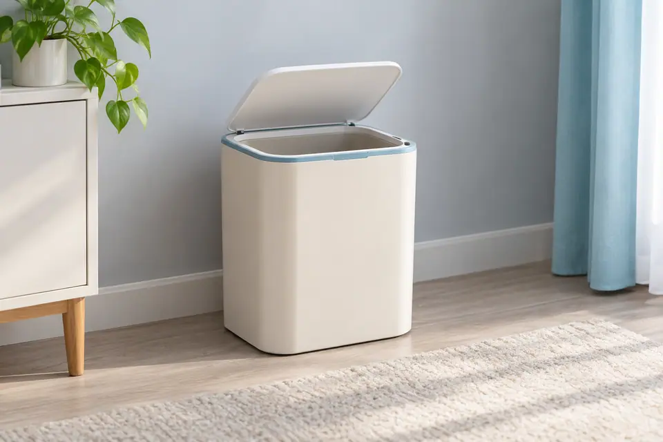
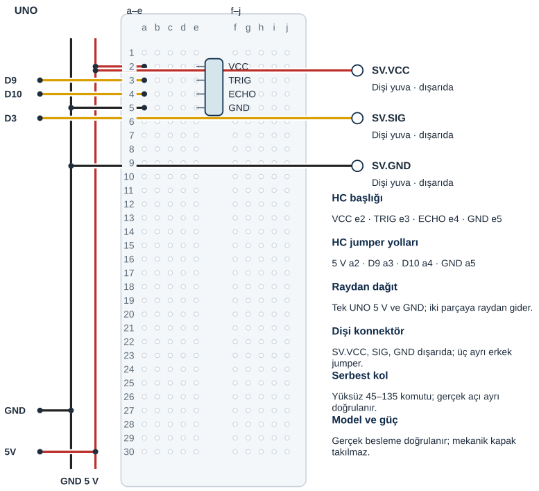

## Tanı • Tahmin et

### Günlük teknolojide

Temassız bir kutuda sensör, yaklaşan nesneyi algılar. Kontrolcü karar verir; motor kapağı hareket ettirir. Sen bu zinciri serbest servo koluyla modelleyeceksin. Burada gerçek bir çöp kutusu kapağı sürülmez. Sensör hatası ile uzak nesne aynı durum değildir.



### Sistemin yolu

**Girdi:** HC-SR04 yankı süresi. → **Karar:** Mesafe, durum ve süre. → **Çıktı:** D3 servo açı komutu.

:::bilgi[Önce düşün]{renk=sari}
Yalnız acikTutmaMs 2000’den 3000’e çıkarsa uzaklaşan hedefte kolun kapalı komutuna dönmesi nasıl değişir?
:::

::yaz[Tahminim]{satir=2}

### Parçayı tanı

- HC-SR04 için [Proje 9](proje:9), serbest servo kolu için [Proje 10](proje:10) bilgilerini kullan. Servo sinyali bu birleşimde D3’tedir.
- Açma eşiği 15 cm, kapatma marjı 5 cm örnektir. Marj iki geçiş arasındaki farktır; [Proje 18](proje:18) içindeki histerezisi hatırla.
- Kapalıyken 15 cm’nin altı açar. Açıkken 20 cm veya daha yakındaki geçerli ölçüm açık tutma zamanını yeniler.
- Uzak geçerli ölçümde son yakın okumadan 2000 ms sonra kapanır. 15–20 cm aralığı kapalı kolu kendiliğinden açmaz.
- Ölçüm yoksa kapalı komut hemen seçilir. Bu, yalnız serbest model kolunun kararıdır; insanı koruyan bir kapak denetimi değildir.

## HC-SR04’ü ve servoyu ayrı bağla

| UNO pini | Bağlantı yolu |
|---|---|
| **GND** | Ray → HC.GND e5 / SV.GND |
| **5V** | Ray → HC.VCC e2 / SV.VCC |
| **D9** | a3 → HC.TRIG e3 |
| **D10** | a4 → HC.ECHO e4 |
| **D3** | Doğrudan SV.SIG dişi yuvası |

_Kırmızı: güç · Siyah: GND · Turkuaz: analog · Sarı: dijital. Pin adı belirleyicidir._

### Adım adım kur

1. USB kablosunu çıkar; HC-SR04 pinleri, SG90 konnektörü ve gerçek servo beslemesi doğrulansın.
2. HC-SR04 başlığını örnekte VCC e2, TRIG e3, ECHO e4, GND e5 olarak ayrı satırlara tak.
3. UNO 5 V ve GND tek jumper ile ayrı raylara gider. Raylardan 5 V a2’ye, GND a5’e dağıtılır.
4. D9 a3’e, D10 a4’e gider. Sensörün erkek pinleri breadboard’a girer; doğrudan erkek-erkek jumper’a bağlanmaz.
5. SG90’ın dişi konnektörüne ayrı erkek uçlar tak: VCC 5 V rayına, GND siyah raya, SIG doğrudan D3’e gider.
6. Kolu serbest bırak; yönleri ve ayrı uçları kontrol et. Besleme uygunluğu doğrulanınca USB’yi tak.

:::dikkat{renk=kirmizi}
Yalnız yüksüz SG90 ve serbest kol kullan; UNO 5 V hattının gerçek servoya yetmesi için öğretmenin doğrulaması gerekir. Titreme, ısınma ya da reset görürsen USB’yi çıkar; sıkışan kolu zorlama. Parmaklarını dönen koldan uzak tut; servo yalnız kendi hafif koluyla, yüksüz çalışır.
:::

:::bilgi[Parçanı doğrula · modül ve servo]{renk=gri}
HC-SR04’ün başlık yazısını soldan sağa oku: VCC, Trig, Echo, GND (*Parçanı doğrula* sayfası). Servonun dişi yuvalarındaki kablo renklerini model belgesiyle eşleştir.

::yaz[HC sırası … / … / … / … · servo VCC / SIG / GND renkleri …]{satir=1}
:::

### Kendi bağlantıların

Kurduktan sonra her ucun gerçek deliğini ya da pinini yaz ve çizimle karşılaştır.

| Uç | Çizimdeki delik | Benim deliğim |
|---|---|---|
| HC VCC / TRIG / ECHO / GND | e2 / e3 / e4 / e5 |   |
| 5 V / D9 / D10 / GND jumper’ı | a2 / a3 / a4 / a5 |   |
| Servo VCC / GND yuvası | 5 V rayı / GND rayı |   |
| Servo SIG yuvası | UNO D3 |   |

## HC-SR04’ü ve servo yollarını yerleştir



_Kesişen çizgiler yalnız uçlarında birleşir. Her delikte tek uç vardır._

**Sen çiz (defterine):** gerçek modelinin uç adlarını ve doğruladığın satırları göster.

Çizim örnek pin sırasını gösterir. Gerçek parça uçlarını üretici şemasıyla eşleştir. Başlıklar ayrı satırlara, jumper’lar aynı grubun ayrı deliklerine girer.

:::bilgi[Modelini eşleştir]{renk=mavi}
Yumuşak veya açılı hedef yankıyı güvenilir döndürmeyebilir. UNO 5 V hattının gerçek SG90’a yeterliliği ayrıca doğrulanır; bu yerleşim fiziksel güç onayı değildir.
:::

## Mesafeye göre kapak komutu üret

```cpp title="TAM PROGRAM · P22 · 1/2 (tanımlar ve fonksiyonlar)" start=1 dosya=p22_akilli_cop_kutusu
#include <Servo.h>
const byte trigPini = 9;
const byte echoPini = 10;
const byte servoPini = 3;
const byte hazirlikUs = 2;
const byte tetiklemeUs = 10;
const byte kapaliAci = 45;
const byte acikAci = 135;
const float acmaEsigiCm = 15;
const float kapatmaMarjiCm = 5;
const float sesHiziCmUs = 0.0343;
const float enAzCm = 2;
const float enCokCm = 400;
const unsigned long zamanAsimiUs = 30000;
const unsigned long olcumAraligiMs = 100;
const unsigned long acikTutmaMs = 2000;
Servo motor;
bool kapakAcik = false;
unsigned long sonOlcum = 0;
unsigned long sonYakin = 0;

float mesafeOlc() {
  digitalWrite(trigPini, LOW);
  delayMicroseconds(hazirlikUs);
  digitalWrite(trigPini, HIGH);
  delayMicroseconds(tetiklemeUs);
  digitalWrite(trigPini, LOW);
  unsigned long sureUs = pulseIn(echoPini, HIGH, zamanAsimiUs);
  float cm = sureUs * sesHiziCmUs / 2; // 2: ses gider ve döner
  if (sureUs == 0 || cm < enAzCm || cm > enCokCm) return -1;
  return cm;
}
```

_Kart: UNO · Seri Monitör: 9600 baud. Programı derle, sonra yükle. Programın ikinci kutusu ve açıklaması aşağıda._

### Kodu izle

acmaEsigiCm 15, kapatmaMarjiCm 5, acikTutmaMs 2000’dir. Kapak kapalıyken başla; her ölçümden sonra kapakAcik değerini ve servo komutunu kâğıtta bul.

| Ölçüm | kapakAcik | Servo komutu (derece) |
|---|---|---|
| 30 cm |   |   |
| 12 cm |   |   |
| 18 cm |   |   |
| Ölçüm yok |   |   |

## Açma, açık tutma ve hata

```cpp title="TAM PROGRAM · P22 · 2/2 (setup ve loop)" start=34 dosya=p22_akilli_cop_kutusu
void setup() {
  pinMode(trigPini, OUTPUT);
  pinMode(echoPini, INPUT);
  motor.attach(servoPini);
  motor.write(kapaliAci);
  Serial.begin(9600);
  sonOlcum = millis();
}

void loop() {
  unsigned long simdi = millis();
  if (simdi - sonOlcum < olcumAraligiMs) return;
  sonOlcum = simdi;
  float cm = mesafeOlc();
  simdi = millis();
  if (cm < 0) {
    kapakAcik = false;
    Serial.println("Olcum yok; kapali komut");
  } else {
    if (cm < acmaEsigiCm) kapakAcik = true;
    if (kapakAcik && cm <= acmaEsigiCm + kapatmaMarjiCm) {
      sonYakin = simdi;
    } else if (kapakAcik && simdi - sonYakin >= acikTutmaMs) {
      kapakAcik = false;
    }
    Serial.print("cm: ");
    Serial.print(cm, 1);
    Serial.print(" Acik komut: ");
    Serial.println(kapakAcik);
  }
  if (kapakAcik) motor.write(acikAci);
  else motor.write(kapaliAci);
}
```

### Kodun mantığı

1. mesafeOlc, TRIG’e 10 µs darbe verir. pulseIn’e 30 000 µs zaman aşımı verilir; sıfırda veya 2–400 cm dışında -1 döner.
2. motor.attach D3’ü [Proje 10](proje:10) içindeki gibi servo sinyal pini yapar. motor.write, kapaliAci 45 komutuyla başlar; gerçek açıyı ölçmez.
3. sonOlcum ile en az 100 ms ölçüm başlangıcı aralığı korunur. unsigned long zaman farkları millis taşmasını da kapsar.
4. Geçerli cm, acmaEsigiCm altındaysa kapakAcik true olur. Açık durumdaki yakın okumalar sonYakin değerini yeniler.
5. Uzak geçerli okumada acikTutmaMs dolarsa kapakAcik false olur. Hata bu beklemeyi atlar; kapalı komut ve hata mesajı seçilir.
6. motor.write yalnız seçilen açık veya kapalı komutu gönderir. Yazılımdaki karar gerçek kapağın güvenliğini veya konumunu ölçmez.

:::bilgi[Komut ve ölçüm farklıdır]{renk=mavi}
Acik komut 1 veya 0 yazısı, programın kararını bildirir. Fiziksel açı geri bildirimi yoktur. Olcum yok satırında geçerli bir cm sayısı verilmez.
:::

## Kapak hatalarını ayıkla

### Hata avcısı

| Belirti | Olası neden | Ne yap? |
|---|---|---|
| Olcum yok yazıyor | Yankı veya geçerli aralık yok | Düz hedefi 2–400 cm aralığında dene. USB’yi çıkarıp ECHO/D10 ve GND yolunu kontrol et; hata -1 bir mesafe değildir. |
| Kart reset oluyor veya kol titriyor | Besleme, sıkışma veya model | USB’yi çıkar; kolu serbest bırak. Gerçek SG90 güç gereksinimini model belgesinden kontrol et; eşiği değiştirerek güç sorununu gizleme. |
| Hedef uzaklaşınca hemen kapanmıyor | Açık tutma süresi | Açık komut ile ölçümü karşılaştır. Geçerli hedef 20 cm’yi aşınca son yakın okumadan beri geçen süreyi gözle. |

### Kapak zaman çizgisi

Ölçüm 100 ms’de bir alınır; el kutuya yaklaşıp uzaklaşıyor. Kapak kapalıyken başla. Her satırda yakınlığı, sonYakin değerini ve kapak kararını yaz.

| Zaman · ölçüm | ≤ 20 cm mi? | sonYakin (ms) | Kapak |
|---|---|---|---|
| 0 ms · 40 cm |   |   |   |
| 100 ms · 12 cm |   |   |   |
| 200 ms · 19 cm |   |   |   |
| 300 ms · 22 cm |   |   |   |
| 2000 ms · 22 cm |   |   |   |
| 2300 ms · 22 cm |   |   |   |
| Kendi örneğin |   |   |   |

## Açık tutma süresini değiştir; kaydet

Önce tahminini yaz. Denemeden sonra gördüğün tepkiyi boş alana kaydet.

| Deneme | Tahminim | Gözlemim |
|---|---|---|
| Düz hedef yaklaşık 10 cm; ölçümü ve kol komutunu yaz. |   |   |
| Açık kolda hedef yaklaşık 30 cm; dönüş süresini gözle. |   |   |
| USB çıkar; ECHO’yu ayırıp başlat. Hata mesajını gözle; sonra USB çıkarıp düzelt. |   |   |
| Yalnız açık tutma 3000 ms; aynı hedef ve konum, sonra 2000 ms’ye dön. |   |   |

:::bilgi[Bir değişiklik yap]{renk=mavi}
Yalnız acikTutmaMs 2000’den 3000’e çıksın. Aynı hedefi ve açı komutlarını koru; uzaklaştırma sonrası dönüşü karşılaştır. Sonra 2000’e dön. Karton veya kol bağlantısını bu deneyde değiştirme.
:::

::yaz[Tahminim ve gözlemim]{satir=3}

### Değişiklik sürümleri

“Bir değişiklik yap” sürümleri; ana programla yan yana açıp farkı bul.

```cpp title="Değişiklik sürümü · p22_acik_tutma_3000" start=1 dosya=p22_acik_tutma_3000
#include <Servo.h>
const byte trigPini = 9;
const byte echoPini = 10;
const byte servoPini = 3;
const byte hazirlikUs = 2;
const byte tetiklemeUs = 10;
const byte kapaliAci = 45;
const byte acikAci = 135;
const float acmaEsigiCm = 15;
const float kapatmaMarjiCm = 5;
const float sesHiziCmUs = 0.0343;
const float enAzCm = 2;
const float enCokCm = 400;
const unsigned long zamanAsimiUs = 30000;
const unsigned long olcumAraligiMs = 100;
const unsigned long acikTutmaMs = 3000;
Servo motor;
bool kapakAcik = false;
unsigned long sonOlcum = 0;
unsigned long sonYakin = 0;

float mesafeOlc() {
  digitalWrite(trigPini, LOW);
  delayMicroseconds(hazirlikUs);
  digitalWrite(trigPini, HIGH);
  delayMicroseconds(tetiklemeUs);
  digitalWrite(trigPini, LOW);
  unsigned long sureUs = pulseIn(echoPini, HIGH, zamanAsimiUs);
  float cm = sureUs * sesHiziCmUs / 2; // 2: ses gider ve döner
  if (sureUs == 0 || cm < enAzCm || cm > enCokCm) return -1;
  return cm;
}

void setup() {
  pinMode(trigPini, OUTPUT);
  pinMode(echoPini, INPUT);
  motor.attach(servoPini);
  motor.write(kapaliAci);
  Serial.begin(9600);
  sonOlcum = millis();
}

void loop() {
  unsigned long simdi = millis();
  if (simdi - sonOlcum < olcumAraligiMs) return;
  sonOlcum = simdi;
  float cm = mesafeOlc();
  simdi = millis();
  if (cm < 0) {
    kapakAcik = false;
    Serial.println("Olcum yok; kapali komut");
  } else {
    if (cm < acmaEsigiCm) kapakAcik = true;
    if (kapakAcik && cm <= acmaEsigiCm + kapatmaMarjiCm) {
      sonYakin = simdi;
    } else if (kapakAcik && simdi - sonYakin >= acikTutmaMs) {
      kapakAcik = false;
    }
    Serial.print("cm: ");
    Serial.print(cm, 1);
    Serial.print(" Acik komut: ");
    Serial.println(kapakAcik);
  }
  if (kapakAcik) motor.write(acikAci);
  else motor.write(kapaliAci);
}
```

### Kendini kontrol et

**1.** TRIG, ECHO ve servo sinyali hangi UNO pinlerindedir?

::yaz[Cevabım]{satir=2}

**2.** Ölçüm yok neden hedefin uzakta olduğunu kanıtlamaz?

::yaz[Cevabım]{satir=2}

**3.** Kol kapalıyken 17 cm okunursa açılır mı? Açıkken aynı okumada zaman nasıl etkilenir?

::yaz[Cevabım]{satir=2}

**Sen çiz (defterine):** sensör ve çıkışın ortak GND yolunu işaretle.

**Evde devam et:** Temassız bir ürün gözle. Sensör, karar ve hareket görevlerini çiz; sensör türünü dış görünüşten kesin çıkarma.

**Şimdi sıra sende:** [Proje 18](proje:18) göstergesiyle bu serbest kolun durumlarını kâğıtta karşılaştır. Hata ve geçerli uzak ölçüm için ayrı kutular kur.

::yaz[Fikrim]{satir=3}

**Kendimi değerlendiriyorum:** Yardımla yaptım · Biraz yardımla · Tek başıma · Başkasına anlatabilirim

::yaz[Bu projeyi nasıl yaptım? Neden?]{satir=1}

:::bilgi[Biliyor muydun?]{renk=sari}
HC-SR04 belgesi ölçüm çevrimi için 60 ms’den uzun aralık önerir. Buradaki 100 ms aralık yeni tetiklemeleri ayırır; gerçek hedefin güvenilir ölçüldüğünü tek başına kanıtlamaz.
:::
