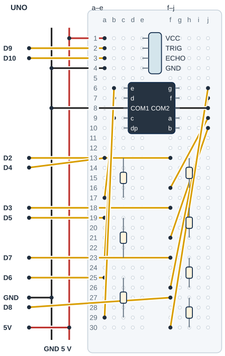

## Tanı • Tahmin et

### Günlük teknolojide

Bir dijital saat rakamları küçük ışıklı çubuklarla gösterir. Sen yedi çubuğu bir rakam için birlikte yöneteceksin. Tek hane tam mesafeyi yazamaz; seçtiğin genişlikte bir aralığı bildirir. Ölçüm yokken bir hata işareti gösterilir; bu işaret mesafe değildir.


### Sistemin yolu

**Girdi:** HC-SR04 yankı süresi. → **Hesap:** Mesafe → aralık → desen. → **Çıktı:** Rakam, çizgi veya E.

:::bilgi[Önce düşün]{renk=sari}
Yalnız aralikCm 10’dan 20’ye çıkarsa aynı uzaklıktaki hedef için göstereceğin rakamı nasıl bulursun? Tahminini yaz.
:::

::yaz[Tahminim]{satir=2}

### Parçayı tanı

- Segment, rakamı oluşturan ışıklı çubuktur. Adları a–g’dir; dp ondalık noktadır ve bu devrede boş kalır.
- Ortak katotta ortak uçlar GND’ye, ortak anotta 5 V’a gider. Koddaki ortakAnot ayarı ve gerçek ortak ray aynı tipe göre seçilir.
- Çizim, 15,24 mm sıra aralıklı örnek bacak eşlemesidir. Gerçek bacak bulma testi eşleşmeden kullanma; a–g çizimi fiziksel bacak numarası değildir.
- Her segmentin ayrı 220 Ω direnci vardır. Örnek akım: (5 − 2) / 220 ≈ 0,0136 A; yedi ışık ≈ 95 mA eder.
- Gerçek ileri gerilimi, direnç toleransını, paket ortak uçlarını ve toplam pin akımını belgeden kontrol et; emin olamazsan öğretmenine sor. Her pinin akımı en fazla 20 mA olmalı.

## HC-SR04’ü ve yedi segmenti bağla

| UNO pini | Bağlantı yolu |
|---|---|
| **GND** | Siyah ray; HC GND e4, COM c8/g8 |
| **5V** | Kırmızı ray → HC VCC e1 |
| **D9** | a2 → HC TRIG e2 |
| **D10** | a3 → HC ECHO e3 |
| **D2** | f13 → R\_a → a g9 |
| **D3** | f18 → R\_b → b g10 |
| **D4** | a13 → R\_c → c c9 |
| **D5** | a19 → R\_d → d c7 |
| **D6** | a25 → R\_e → e c6 |
| **D7** | f23 → R\_f → f g7 |
| **D8** | f27 → R\_g → g g6 |

_Kırmızı: güç · Siyah: GND · Turkuaz: analog · Sarı: dijital. Pin adı belirleyicidir._

### Adım adım kur

1. USB’yi çıkar. Ortak tipi ve a–g eşlemesini bacak taramasıyla bul ([Parçanı doğrula](genel:parcani-dogrula) sayfası); sonucu yaz. Örnek eşleme farklıysa yerleşimi uyarla.
2. UNO 5 V ve GND’yi ayrı raylara bağla. HC başlığı e1/e2/e3/e4: VCC/TRIG/ECHO/GND; a1 5 V, a2 D9, a3 D10, a4 GND.
3. Örnek göstergeyi yüzü saat yönünde çeyrek tur dönmüş tak: c6–c10 ve g6–g10. Sol: e,d,ortak,c,dp; sağ: g,f,ortak,a,b. Ortak katot örneğinde a8 ve j8 GND’ye gider; dp c10 boş kalır. Anot tipinde iki ortak jumper 5 V rayına taşınır; kod da true seçilir.
4. a,b,f,g için sağdaki 220 Ω yolları: h13–h16, h18–h21, h23–h26, h27–h30; D2 f13, D3 f18, D7 f23, D8 f27. Çıkış jumper’ları: f16→j9 (a), f21→j10 (b), f26→j7 (f), f30→j6 (g).
5. c,d,e için soldaki 220 Ω yolları: c13–c17, c19–c23, c25–c29; D4 a13, D5 a19, D6 a25. Çıkış jumper’ları: a17→b9 (c), a23→b7 (d), a29→b6 (e).
6. Yedi ayrı direnci, segment uçlarını, ortak rayı ve HC pinlerini kontrol et. USB’yi tak; değişiklik yapmadan önce yeniden çıkar.

:::dikkat{renk=kirmizi}
Bacak testi dirençsiz yapılmaz; ortak uçları UNO’nun sinyal pinine bağlama. Yalnız tek segment pin akımını değil, ortak anot/katot ucunun izin verilen toplam akımını da veri sayfasından doğrula. Gerçek tip, besleme ve akım doğrulanmadan tüm göstergeden akım geçirme.
:::

:::bilgi[Parçanı doğrula · 7 segment ve modül]{renk=gri}
7 segmentin ortak türünü ve bacak harflerini bacak taramasıyla bul ([Parçanı doğrula](genel:parcani-dogrula) sayfası); sonuçları breadboard sayfasındaki Gerçek bacak tablosuna yaz. HC-SR04 yazısını soldan sağa oku.

::yaz[ortak tür … · HC sırası … / … / … / …]{satir=1}
:::

## Göstergeyi ve dirençleri yerleştir



- **Örnek paket yönü:** Yüz saat yönünde çeyrek tur dönük. c6–c10 / g6–g10; testi doğrula.
- **İki ortak uç:** COM1 c8, COM2 g8; a8/j8 GND. Anotta 5 V; dp c10 boş.
- **a ve b yolları:** D2 → R\_a → a g9; D3 → R\_b → b g10. Her yol ayrı 220 Ω.
- **c, d ve e yolları:** D4 → R\_c → c c9; D5 → R\_d → d c7; D6 → R\_e → e c6.
- **f ve g yolları:** D7 → R\_f → f g7; D8 → R\_g → g g6. Dirençler aynı yarıda.
- **Sensör başlığı:** HC e1–e4: VCC, TRIG, ECHO, GND. Her uç ayrı a-satırına.
- **Akım kontrolü:** Yedi ayrı 220 Ω. Ortak uçlar rayda; toplam akımı doğrulat.

_Kesişen çizgiler yalnız uçlarında birleşir. Her delikte tek uç vardır._

Çizim örnek pin sırasını gösterir. Gerçek parça uçlarını üretici şemasıyla eşleştir. Başlıklar ayrı satırlara, jumper’lar aynı grubun ayrı deliklerine girer.

:::bilgi[Modelini eşleştir]{renk=mavi}
2–400 cm yaygın HC-SR04 örnek aralığıdır; gerçek modelini doğrula. Ses hızı yaklaşık alınır; yumuşak veya açılı hedef güvenilir olmayabilir.
:::

_Bacak testinden sonra doldur. Örnek haritayı gerçek gözlem yerine yazma._

| Ad | Gerçek bacak | Ad | Gerçek bacak | Ad | Gerçek bacak |
|---|---|---|---|---|---|
| a |   | b |   | c |   |
| d |   | e |   | f |   |
| g |   | COM1/2 |   | dp |   |

## Mesafeyi rakama çevir

```cpp title="TAM PROGRAM · P23 · 1/2 (tanımlar ve fonksiyonlar)" start=1 dosya=p23_mesafeyi_7_segmentte_goster
#include <math.h>
const byte segmentPinleri[7] = {2, 3, 4, 5, 6, 7, 8};
const byte trigPini = 9;
const byte echoPini = 10;
const byte hazirlikUs = 2;
const byte tetiklemeUs = 10;
const byte rakamSayisi = 10;
const byte ondalikBasamak = 1;
const unsigned long haberlesmeHizi = 9600;
const bool ortakAnot = false;
const int aralikCm = 10;
const float altCm = 2;
const float ustCm = 400;
const float sesCmUs = 0.0343;
const unsigned long aralikMs = 250;
const unsigned long zamanAsimiUs = 30000;
const byte hataDeseni = 0x79;
const byte sinirDeseni = 0x40;
const byte rakamlar[rakamSayisi] = {
  0x3F, 0x06, 0x5B, 0x4F, 0x66,
  0x6D, 0x7D, 0x07, 0x7F, 0x6F
};
unsigned long sonOkuma = 0;

void goster(byte desen) {
  for (byte sira = 0; sira < 7; sira++) {
    bool yan = (desen >> sira) & 1;
    digitalWrite(segmentPinleri[sira], yan != ortakAnot);
  }
}
```

_Kart: UNO · Seri Monitör: 9600 baud. Programı derle, sonra yükle. Programın ikinci kutusu ve açıklaması aşağıda._

### Kodu izle

aralikCm 10’dur. Gösterilen rakam, cm / 10 sonucunun tam sayı kısmıdır. 100 cm ve üstünde orta çizgi, ölçüm yoksa E deseni görünür.

| Mesafe | Ekrandaki rakam / desen | Yanan segmentler |
|---|---|---|
| 7,5 cm |   |   |
| 34 cm |   |   |
| 99 cm |   |   |
| 120 cm |   |   |
| Ölçüm yok |   |   |

## Desen, aralık ve hata işareti

```cpp title="TAM PROGRAM · P23 · 2/2 (fonksiyonlar, setup ve loop)" start=32 dosya=p23_mesafeyi_7_segmentte_goster
float mesafeOlc() {
  digitalWrite(trigPini, LOW);
  delayMicroseconds(hazirlikUs);
  digitalWrite(trigPini, HIGH);
  delayMicroseconds(tetiklemeUs);
  digitalWrite(trigPini, LOW);
  unsigned long sureUs = pulseIn(echoPini, HIGH, zamanAsimiUs);
  if (sureUs == 0) return NAN;
  return sureUs * sesCmUs / 2; // 2: ses gider ve döner
}

void setup() {
  pinMode(trigPini, OUTPUT);
  pinMode(echoPini, INPUT);
  for (byte sira = 0; sira < 7; sira++) {
    digitalWrite(segmentPinleri[sira], ortakAnot);
    pinMode(segmentPinleri[sira], OUTPUT);
  }
  goster(0);
  Serial.begin(haberlesmeHizi);
  sonOkuma = millis();
}

void loop() {
  unsigned long simdi = millis();
  if (simdi - sonOkuma < aralikMs) return;
  sonOkuma = simdi;
  float cm = mesafeOlc();
  if (isnan(cm) || cm < altCm || cm > ustCm) {
    goster(hataDeseni);
    Serial.println("Olcum yok / aralik disi");
  } else {
    Serial.print("Mesafe cm: ");
    Serial.println(cm, ondalikBasamak);
    if (cm >= rakamSayisi * aralikCm) goster(sinirDeseni);
    else goster(rakamlar[int(cm / aralikCm)]);
  }
}
```

### Kodun mantığı

1. segmentPinleri a–g sırasını tutar. rakamlar içindeki on desen 0–9 rakamlarını seçer; 0x başlığı onaltılı sayı yazımıdır.
2. goster, desenin sira bitini sağa kaydırıp & 1 ile seçer. yan != ortakAnot, katotta HIGH, anotta LOW ile ışığı açar.
3. mesafeOlc kısa TRIG darbesi verir. pulseIn en çok 30000 µs bekler; sureUs sıfırsa NAN döner ve sahte santimetre üretilmez.
4. İlk okuma en az 250 ms sonra yapılır. pulseIn beklerken loop kısa süre durabilir; millis aralığı bu beklemeyi kaldırmaz.
5. Örnek 2–400 cm dışı veya NAN için E gösterilir. Geçerli aralıkta int(cm / aralikCm) tam kısma iner; on aralık ve üstü çizgidir.

## Gösterge hatalarını ayıkla

:::bilgi[Rakam ve hata ayrı]{renk=mavi}
Bit sırası a,b,c,d,e,f,g’dir. E veri hatası/aralık dışıdır; çizgi ölçülmüş on veya daha çok aralığı gösterir.
:::

### Hata avcısı

| Belirti | Olası neden | Ne yap? |
|---|---|---|
| Rakamın yanlış çubukları yanıyor | Bacak haritası veya dizi sırası | USB’yi çıkar; tek segment testinde bulduğun a–g adlarını D2–D8 ile eşleştir. Paket üzerindeki bacak sırasını çizimden varsayma. |
| Ekran ters ya da hiç yanmıyor | Ortak tip ile kod farklı | USB’yi çıkar; gerçek ortak tipi ve ortakAnot değerini birlikte doğrula. Ortak uç iki rayı birleştirmemeli; dirençleri koru. |
| E veya sınırda değişen rakam var | Yankı yok, aralık veya hedef | Seri Monitör mesajını oku. Düz sert hedefi sabitle; [Proje 9](proje:9) TRIG/ECHO yolunu ve cetvel ölçüsünü kontrol et. |

### Bacak testini yap

1. USB çıkarılmışken paketin yüzünü ve on bacağın yerini çiz. Ortak adayı ve bir segment yalnız seri 220 Ω ile bağlansın.
2. Önce ortak katot yönünü, kısa süreyle bir segmenti dene; USB’yi çıkar. Anot yönünü denemeden önce modelin ters gerilime uygunluğunu belgesinden oku.
3. Tek ortak aday aynı yönde birçok ayrı çubuğu yakabiliyorsa ortak tipi ve uçlar belirlenir. Her denemede tek segment, kendi direnç yolu ile sınanır.
4. Yanan çubuğun a–g adını ve fiziksel bacağını boş eşleme tablosuna yaz. dp ayrı noktadır; bu projede bağlanmaz.
5. Örnek harita ile gerçek harita aynı değilse yerleşimi kendi haritana göre uyarla. Parça tipi veya izinli ters gerilim belirsizse denemeye enerji verme.

### Desenleri çöz

rakamlar dizisindeki her bayt a’dan g’ye segmentleri tutar; en sağdaki bit a’dır. Desenin yaktığı segmentleri ve görünen şekli yaz.

| Desen | Yanan segmentler | Görünen şekil |
|---|---|---|
| 0x06 |   |   |
| 0x5B |   |   |
| 0x79 |   |   |

## Aralığı değiştir; rakamları kaydet

Önce tahminini yaz. Denemeden sonra gördüğün tepkiyi boş alana kaydet.

| Deneme | Tahminim | Gözlemim |
|---|---|---|
| Tek segment testinde a–g ve ortak uçlarını kaydet. |   |   |
| Cetvelle üç farklı konum seç; cm ve görülen işareti yaz. |   |   |
| 10 cm ile 100 cm sınırlarının iki yanını sabit hedefle dene. |   |   |
| USB çıkar; ECHO ayırıp yeniden aç, hata işaretini kaydet. |   |   |
| USB çıkar; ECHO’yu düzelt. Yalnız aralık 20, sonra 10. |   |   |

:::bilgi[Bir değişiklik yap]{renk=mavi}
Yalnız aralikCm 10’dan 20’ye çıksın. Aynı sert hedefi ve cetvel konumlarını koru; işaretleri karşılaştır. On aralık sınırının hangi mesafeye taşındığını düşün. Sonra 10’a dön.
:::

::yaz[Tahminim ve gözlemim]{satir=3}

### Değişiklik sürümleri

“Bir değişiklik yap” sürümleri; ana programla yan yana açıp farkı bul.

```cpp title="Değişiklik sürümü · p23_aralik_20" start=1 dosya=p23_aralik_20
#include <math.h>
const byte segmentPinleri[7] = {2, 3, 4, 5, 6, 7, 8};
const byte trigPini = 9;
const byte echoPini = 10;
const byte hazirlikUs = 2;
const byte tetiklemeUs = 10;
const byte rakamSayisi = 10;
const byte ondalikBasamak = 1;
const unsigned long haberlesmeHizi = 9600;
const bool ortakAnot = false;
const int aralikCm = 20;
const float altCm = 2;
const float ustCm = 400;
const float sesCmUs = 0.0343;
const unsigned long aralikMs = 250;
const unsigned long zamanAsimiUs = 30000;
const byte hataDeseni = 0x79;
const byte sinirDeseni = 0x40;
const byte rakamlar[rakamSayisi] = {
  0x3F, 0x06, 0x5B, 0x4F, 0x66,
  0x6D, 0x7D, 0x07, 0x7F, 0x6F
};
unsigned long sonOkuma = 0;

void goster(byte desen) {
  for (byte sira = 0; sira < 7; sira++) {
    bool yan = (desen >> sira) & 1;
    digitalWrite(segmentPinleri[sira], yan != ortakAnot);
  }
}

float mesafeOlc() {
  digitalWrite(trigPini, LOW);
  delayMicroseconds(hazirlikUs);
  digitalWrite(trigPini, HIGH);
  delayMicroseconds(tetiklemeUs);
  digitalWrite(trigPini, LOW);
  unsigned long sureUs = pulseIn(echoPini, HIGH, zamanAsimiUs);
  if (sureUs == 0) return NAN;
  return sureUs * sesCmUs / 2; // 2: ses gider ve döner
}

void setup() {
  pinMode(trigPini, OUTPUT);
  pinMode(echoPini, INPUT);
  for (byte sira = 0; sira < 7; sira++) {
    digitalWrite(segmentPinleri[sira], ortakAnot);
    pinMode(segmentPinleri[sira], OUTPUT);
  }
  goster(0);
  Serial.begin(haberlesmeHizi);
  sonOkuma = millis();
}

void loop() {
  unsigned long simdi = millis();
  if (simdi - sonOkuma < aralikMs) return;
  sonOkuma = simdi;
  float cm = mesafeOlc();
  if (isnan(cm) || cm < altCm || cm > ustCm) {
    goster(hataDeseni);
    Serial.println("Olcum yok / aralik disi");
  } else {
    Serial.print("Mesafe cm: ");
    Serial.println(cm, ondalikBasamak);
    if (cm >= rakamSayisi * aralikCm) goster(sinirDeseni);
    else goster(rakamlar[int(cm / aralikCm)]);
  }
}
```

```cpp title="Değişiklik sürümü · p23_ortak_anot" start=1 dosya=p23_ortak_anot
#include <math.h>
const byte segmentPinleri[7] = {2, 3, 4, 5, 6, 7, 8};
const byte trigPini = 9;
const byte echoPini = 10;
const byte hazirlikUs = 2;
const byte tetiklemeUs = 10;
const byte rakamSayisi = 10;
const byte ondalikBasamak = 1;
const unsigned long haberlesmeHizi = 9600;
const bool ortakAnot = true;
const int aralikCm = 10;
const float altCm = 2;
const float ustCm = 400;
const float sesCmUs = 0.0343;
const unsigned long aralikMs = 250;
const unsigned long zamanAsimiUs = 30000;
const byte hataDeseni = 0x79;
const byte sinirDeseni = 0x40;
const byte rakamlar[rakamSayisi] = {
  0x3F, 0x06, 0x5B, 0x4F, 0x66,
  0x6D, 0x7D, 0x07, 0x7F, 0x6F
};
unsigned long sonOkuma = 0;

void goster(byte desen) {
  for (byte sira = 0; sira < 7; sira++) {
    bool yan = (desen >> sira) & 1;
    digitalWrite(segmentPinleri[sira], yan != ortakAnot);
  }
}

float mesafeOlc() {
  digitalWrite(trigPini, LOW);
  delayMicroseconds(hazirlikUs);
  digitalWrite(trigPini, HIGH);
  delayMicroseconds(tetiklemeUs);
  digitalWrite(trigPini, LOW);
  unsigned long sureUs = pulseIn(echoPini, HIGH, zamanAsimiUs);
  if (sureUs == 0) return NAN;
  return sureUs * sesCmUs / 2; // 2: ses gider ve döner
}

void setup() {
  pinMode(trigPini, OUTPUT);
  pinMode(echoPini, INPUT);
  for (byte sira = 0; sira < 7; sira++) {
    digitalWrite(segmentPinleri[sira], ortakAnot);
    pinMode(segmentPinleri[sira], OUTPUT);
  }
  goster(0);
  Serial.begin(haberlesmeHizi);
  sonOkuma = millis();
}

void loop() {
  unsigned long simdi = millis();
  if (simdi - sonOkuma < aralikMs) return;
  sonOkuma = simdi;
  float cm = mesafeOlc();
  if (isnan(cm) || cm < altCm || cm > ustCm) {
    goster(hataDeseni);
    Serial.println("Olcum yok / aralik disi");
  } else {
    Serial.print("Mesafe cm: ");
    Serial.println(cm, ondalikBasamak);
    if (cm >= rakamSayisi * aralikCm) goster(sinirDeseni);
    else goster(rakamlar[int(cm / aralikCm)]);
  }
}
```

### Kendini kontrol et

**1.** a–g kaç segmenttir; dp bu devrede neden boş kalır?

::yaz[Cevabım]{satir=2}

**2.** Bir rakam neden tam mesafeyi değil bir aralığı bildirir?

::yaz[Cevabım]{satir=2}

**3.** Örnek 35 cm için aralikCm 10 iken int(cm / aralikCm) hesabını kâğıtta yap.

::yaz[Cevabım]{satir=2}

**Sen çiz (defterine):** girdiden çıkışa giden karar yolunu göster.

**Evde devam et:** Bir dijital saati veya tek haneli göstergeyi gözle. Aynı ışıklı çubukların hangi rakamlarda birlikte yandığını çiz.

**Şimdi sıra sende:** [Proje 21](proje:21) ışık satırları ile rakamlar desenlerini kâğıtta karşılaştır. Bir satırın birden çok çıkışı nasıl yönettiğini göster.

::yaz[Fikrim]{satir=3}

**Kendimi değerlendiriyorum:** Yardımla yaptım · Biraz yardımla · Tek başıma · Başkasına anlatabilirim

::yaz[Bu projeyi nasıl yaptım? Neden?]{satir=1}

:::bilgi[Biliyor muydun?]{renk=sari}
Bir bayt içindeki bitler ayrı açık/kapalı bilgileri saklayabilir. Burada yedi bit, yedi segmentin durumunu belirler.
:::
