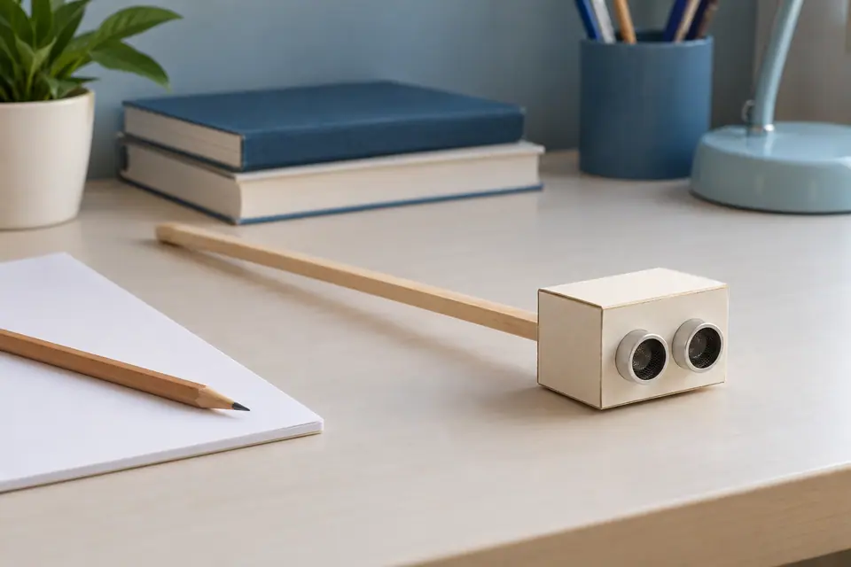
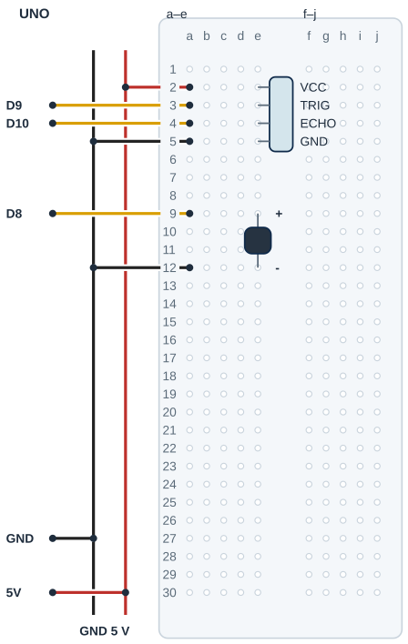

## Tanı • Tahmin et

### Günlük teknolojide

Bazı ürünler çevreden aldıkları bilgiyi sesle bildirir. Sen masada duran sensörün üç mesafe bölgesini farklı seslerle ayıracaksın. Dördüncü durum, geçerli ölçüm olmadığını bildirir. Bu bir eğitim prototipidir. Gerçek bir yardımcı cihaz değildir; görme engelli bireylerin kullandığı desteklerin yerini tutmaz.



### Sistemin yolu

**Girdi:** HC-SR04 yankı süresi. → **Karar:** 3 bölge + ölçüm hatası. → **Çıktı:** D8 pasif buzzer ritmi.

:::bilgi[Önce düşün]{renk=sari}
Yalnız yakinEsigiCm 20’den 30’a çıkarsa aynı hedef uzaklığı için hızlı ritim hangi bölgede seçilir?
:::

::yaz[Tahminim]{satir=2}

### Parçayı tanı

- Pasif buzzer frekans komutuyla ses üretir; [Proje 3](proje:3) içindeki tone ve noTone görevlerini hatırla. Frekans deneyi pasif buzzer ile yapılır.
- Durum 2: geçerli mesafe 20 cm’nin altında. Durum 1: 20 cm veya daha fazla, 50 cm’nin altında.
- Durum 0: geçerli mesafe en az 50 cm. Durum 3: yankı yok veya hesap 2–400 cm dışında; geçerli mesafe bilinmez.
- Yakında 1400 Hz hızlı tek bip, ortada 1000 Hz yavaş tek bip vardır. Hatada 500 Hz iki kısa bip duyulur; uzak bölge sessizdir.
- Sessizlik güvenli yol anlamına gelmez. İnce, yumuşak veya açılı nesne ile zemindeki çukur bu modelden güvenilir biçimde çıkarılamaz.

## HC-SR04’ü ve buzzer’ı ayrı bağla

| UNO pini | Bağlantı yolu |
|---|---|
| **GND** | Ray → HC.GND e5 / BZ.− e12 |
| **5V** | Ray → HC.VCC e2 |
| **D9** | a3 → HC.TRIG e3 |
| **D10** | a4 → HC.ECHO e4 |
| **D8** | a9 → BZ.+ e9 |

_Kırmızı: güç · Siyah: GND · Turkuaz: analog · Sarı: dijital. Pin adı belirleyicidir._

### Adım adım kur

1. USB kablosunu çıkar; HC-SR04 başlık adlarını ve pasif buzzer’ın pin akımına uygunluğunu doğrulat.
2. Örnek başlık VCC e2, TRIG e3, ECHO e4, GND e5; erkek pinler ayrı satırlara girer.
3. UNO 5 V ve GND tek jumper ile ayrı raylara gider. 5 V a2, GND a5; D9 a3 ve D10 a4 olur.
4. Pasif buzzer + e9, − e12; D8 a9’a, a12 GND rayına gider. Buzzer aynı yarıda kalır.
5. Sensörü masada sabit tut; kutupları ve ayrı delikleri kontrol et. Parçalar uygunsa USB’yi tak.

:::dikkat{renk=kirmizi}
Gerçek bir yardımcı cihaz değildir; masada sabit prototip olarak dene, onunla yürüme, gözlerini kapatma ya da trafikte deneme. Görme engelli bireylerden cihazı yol bulmak için kullanmalarını isteme. Bağlantıda USB’yi çıkar, buzzer’ı kulağa yaklaştırma; 5 V’ta en çok 20 mA uygunluğu doğrulanmadan D8’e bağlama.
:::

:::bilgi[Parçanı doğrula · modül ve buzzer]{renk=gri}
HC-SR04’ün başlık yazısını soldan sağa oku (*Parçanı doğrula* sayfası). Bu projede tone ile çalınan pasif buzzer gerekir; türünü ve + bacağını öğretmeninle doğrula.

::yaz[HC sırası … / … / … / … · buzzer türü …]{satir=1}
:::

### Kendi deliklerin

Kurduktan sonra her ucun gerçekte hangi deliğe girdiğini yaz ve çizimle karşılaştır.

| Uç | Çizimdeki delik | Benim deliğim |
|---|---|---|
| HC VCC / TRIG / ECHO / GND | e2 / e3 / e4 / e5 |   |
| 5 V / D9 / D10 / GND jumper’ı | a2 / a3 / a4 / a5 |   |
| Buzzer + / − | e9 / e12 |   |
| D8 / GND jumper’ı | a9 / a12 |   |

## Sensörü ve buzzer’ı yerleştir



- **HC başlığı:** VCC e2 · TRIG e3 · ECHO e4 · GND e5; gerçek modeli doğrula.
- **5 V ve GND:** Tek UNO 5 V ve GND; parçaların GND yolları siyah rayda birleşir.
- **Sensörün sinyali:** D9 a3 → TRIG e3 · D10 a4 → ECHO e4; delikler ayrıdır.
- **Pasif buzzer:** + e9 · − e12 aynı yarıda; D8 a9, GND rayı a12.
- **Türü doğrula:** Pasif tür, bacak aralığı ve pin akımı öğretmence doğrulanır.
- **Masa deneyi:** Sensör ve hedef sabittir; cihazla yürünmez, gözler kapatılmaz.

_Kesişen çizgiler yalnız uçlarında birleşir. Her delikte tek uç vardır._

**Sen çiz (defterine):** gerçek modelinin uç adlarını ve doğruladığın satırları göster.

Çizim örnek pin sırasını gösterir. Gerçek parça uçlarını üretici şemasıyla eşleştir. Başlıklar ayrı satırlara, jumper’lar aynı grubun ayrı deliklerine girer.

:::bilgi[Modelini eşleştir]{renk=mavi}
HC-SR04 yüzey ve açıya bağlıdır. Yerleşim, bir yardımcı cihazın güvenilirliğini sınamaz. Pasif buzzer’ın gerçek gerilim ve akımı ayrıca doğrulanır.
:::

## Mesafeyi ses ritmine çevir

```cpp title="TAM PROGRAM · P24 · 1/2 (tanımlar ve fonksiyonlar)" start=1 dosya=p24_akilli_baston_egitim_prototipi
const byte trigPini = 9;
const byte echoPini = 10;
const byte buzzerPini = 8;
const byte hazirlikUs = 2;
const byte tetiklemeUs = 10;
const float yakinEsigiCm = 20;
const float ortaEsigiCm = 50;
const float sesHiziCmUs = 0.0343;
const float enAzCm = 2;
const float enCokCm = 400;
const unsigned long zamanAsimiUs = 30000;
const unsigned long olcumAraligiMs = 100;
// Dizi sırası durumdur: 0 uzak, 1 orta, 2 yakın, 3 ölçüm yok
const unsigned long periyotlar[4] = {1000, 700, 200, 1000};
const unsigned long sesSureleri[4] = {0, 120, 100, 80};
const unsigned int frekanslar[4] = {0, 1000, 1400, 500};
byte durum = 3;
unsigned long sonOlcum = 0;
unsigned long ritimBaslangici = 0;

float mesafeOlc() {
  digitalWrite(trigPini, LOW);
  delayMicroseconds(hazirlikUs);
  digitalWrite(trigPini, HIGH);
  delayMicroseconds(tetiklemeUs);
  digitalWrite(trigPini, LOW);
  unsigned long sureUs = pulseIn(echoPini, HIGH, zamanAsimiUs);
  float cm = sureUs * sesHiziCmUs / 2; // 2: ses gider ve döner
  if (sureUs == 0 || cm < enAzCm || cm > enCokCm) return -1;
  return cm;
}
```

_Kart: UNO · Seri Monitör: 9600 baud. Programı derle, sonra yükle. Programın ikinci kutusu ve açıklaması aşağıda._

### Kodu izle

yakinEsigiCm 20, ortaEsigiCm 50’dir. Her ölçümde durumu bul; ritmi periyotlar, sesSureleri ve frekanslar dizilerinden oku.

| Ölçüm | durum | Periyot (ms) | Ses ms / Hz |
|---|---|---|---|
| 80 cm |   |   |   |
| 35 cm |   |   |   |
| 12 cm |   |   |   |
| Ölçüm yok |   |   |   |

## Dört durum ve ritim süreleri

```cpp title="TAM PROGRAM · P24 · 2/2 (setup ve loop)" start=33 dosya=p24_akilli_baston_egitim_prototipi
void setup() {
  pinMode(trigPini, OUTPUT);
  pinMode(echoPini, INPUT);
  pinMode(buzzerPini, OUTPUT);
  Serial.begin(9600);
  sonOlcum = millis();
  ritimBaslangici = sonOlcum;
}

void loop() {
  unsigned long simdi = millis();
  if (simdi - sonOlcum >= olcumAraligiMs) {
    sonOlcum = simdi;
    float cm = mesafeOlc();
    simdi = millis();
    byte yeniDurum = 0;
    if (cm < 0) yeniDurum = 3;
    else if (cm < yakinEsigiCm) yeniDurum = 2;
    else if (cm < ortaEsigiCm) yeniDurum = 1;
    if (yeniDurum != durum) ritimBaslangici = simdi;
    durum = yeniDurum;
    Serial.print("Durum: ");
    Serial.println(durum);
  }
  if (simdi - ritimBaslangici >= periyotlar[durum]) ritimBaslangici = simdi;
  unsigned long faz = simdi - ritimBaslangici;
  bool sesVar = faz < sesSureleri[durum];
  if (durum == 3) sesVar = sesVar ||
    (faz >= 2 * sesSureleri[3] && faz < 3 * sesSureleri[3]);
  if (durum != 0 && sesVar) tone(buzzerPini, frekanslar[durum]);
  else noTone(buzzerPini);
}
```

### Kodun mantığı

1. mesafeOlc, kısa TRIG darbesinden sonra 30 000 µs zaman aşımıyla yankı bekler. Hata durumunda -1 döner; bu bir mesafe değildir.
2. sonOlcum ile 100 ms aralık korunur. Yeni ölçüm yokken mevcut ritmin zaman denetimi devam eder; delay kullanılmaz.
3. yeniDurum önce 0’dır. Hata 3, 20 cm altı 2, 50 cm altı 1 olur; kalan geçerli mesafe 0’da kalır.
4. Durum değişirse ritimBaslangici yenilenir. unsigned long farklarıyla döngü zamanı ve millis taşması yönetilir.
5. periyotlar, sesSureleri ve frekanslar dizileri durum sırasıyla okunur: 0 uzak, 1 orta, 2 yakın, 3 ölçüm yok. Hata döngüsünde 0–80 ms ve 160–240 ms aralıkları iki kısa ses oluşturur.
6. sesVar ve durum birlikte tone veya noTone seçer. Ölçüm beklemesi en fazla yaklaşık 30 ms ritmi geciktirebilir; tamamen beklemesiz program değildir.

:::bilgi[Dört durum kartı]{renk=mavi}
0 uzak ve sessiz; 1 orta, yavaş tek bip; 2 yakın, hızlı tek bip; 3 ölçüm yok, iki kısa düşük frekanslı bip. İlk ölçümden önce de 3 seçilir.
:::

## Ritim hatalarını ayıkla

### Hata avcısı

| Belirti | Olası neden | Ne yap? |
|---|---|---|
| Hiç ses yok | Uzak bölge veya buzzer yolu | Seri Monitör’de Durum değerini izle. USB’yi çıkarıp pasif türü, D8, GND ve akım uygunluğunu kontrol et. |
| Hata ile yakın ses karışıyor | Tür, ortam sesi veya ritim | Durum 3 ile 2’nin ritmini masada karşılaştır. Kulağa yaklaştırma; anlaşılmayan ses gerçek bir uyarı yeterliliği sayılmaz. |
| Bir hedef algılanmıyor | Yüzey, açı veya aralık | Sabit düz hedef ve cetvelle karşılaştır. Sensörü yol bulma veya çukur algılama aracı olarak kullanma. |

### Ritmi çiz

Durum 1’de periyot 700 ms, ses 120 ms ve frekans 1000 Hz’dir. faz, ritmin başından geçen süredir; her 700 ms’de sıfırlanır. Her satırda sesin çalıp çalmadığını yaz.

| Durum 1’den beri (ms) | faz (ms) | Ses var mı? |
|---|---|---|
| 0 |   |   |
| 100 |   |   |
| 119 |   |   |
| 120 |   |   |
| 500 |   |   |
| 700 |   |   |
| 820 |   |   |

## Yakın eşiği değiştir; ritmi kaydet

Önce tahminini yaz. Denemeden sonra gördüğün tepkiyi boş alana kaydet.

| Deneme | Tahminim | Gözlemim |
|---|---|---|
| Düz hedef yaklaşık 10 cm; Durum ve ritmi kaydet. |   |   |
| Aynı hedef yaklaşık 30 cm; Durum ve ritmi kaydet. |   |   |
| Aynı hedef yaklaşık 60 cm; Durum ve ses durumunu yaz. |   |   |
| USB çıkar; ECHO’yu ayırıp başlat. Hata ritmini gözle; USB çıkarıp düzelt. |   |   |
| Yalnız yakın eşik 30 cm; aynı hedefi karşılaştır, sonra 20 cm’ye dön. |   |   |

:::bilgi[Bir değişiklik yap]{renk=mavi}
Yalnız yakinEsigiCm 20’den 30’a çıksın. ortaEsigiCm 50 ve bütün ses süreleri aynı kalsın. Aynı düz hedefte Durum ile ritmi karşılaştır; sonra 20’ye dön. Denemeyi masada yap.
:::

::yaz[Tahminim ve gözlemim]{satir=3}

### Değişiklik sürümleri

“Bir değişiklik yap” sürümleri; ana programla yan yana açıp farkı bul.

```cpp title="Değişiklik sürümü · p24_yakin_30" start=1 dosya=p24_yakin_30
const byte trigPini = 9;
const byte echoPini = 10;
const byte buzzerPini = 8;
const byte hazirlikUs = 2;
const byte tetiklemeUs = 10;
const float yakinEsigiCm = 30;
const float ortaEsigiCm = 50;
const float sesHiziCmUs = 0.0343;
const float enAzCm = 2;
const float enCokCm = 400;
const unsigned long zamanAsimiUs = 30000;
const unsigned long olcumAraligiMs = 100;
// Dizi sırası durumdur: 0 uzak, 1 orta, 2 yakın, 3 ölçüm yok
const unsigned long periyotlar[4] = {1000, 700, 200, 1000};
const unsigned long sesSureleri[4] = {0, 120, 100, 80};
const unsigned int frekanslar[4] = {0, 1000, 1400, 500};
byte durum = 3;
unsigned long sonOlcum = 0;
unsigned long ritimBaslangici = 0;

float mesafeOlc() {
  digitalWrite(trigPini, LOW);
  delayMicroseconds(hazirlikUs);
  digitalWrite(trigPini, HIGH);
  delayMicroseconds(tetiklemeUs);
  digitalWrite(trigPini, LOW);
  unsigned long sureUs = pulseIn(echoPini, HIGH, zamanAsimiUs);
  float cm = sureUs * sesHiziCmUs / 2; // 2: ses gider ve döner
  if (sureUs == 0 || cm < enAzCm || cm > enCokCm) return -1;
  return cm;
}

void setup() {
  pinMode(trigPini, OUTPUT);
  pinMode(echoPini, INPUT);
  pinMode(buzzerPini, OUTPUT);
  Serial.begin(9600);
  sonOlcum = millis();
  ritimBaslangici = sonOlcum;
}

void loop() {
  unsigned long simdi = millis();
  if (simdi - sonOlcum >= olcumAraligiMs) {
    sonOlcum = simdi;
    float cm = mesafeOlc();
    simdi = millis();
    byte yeniDurum = 0;
    if (cm < 0) yeniDurum = 3;
    else if (cm < yakinEsigiCm) yeniDurum = 2;
    else if (cm < ortaEsigiCm) yeniDurum = 1;
    if (yeniDurum != durum) ritimBaslangici = simdi;
    durum = yeniDurum;
    Serial.print("Durum: ");
    Serial.println(durum);
  }
  if (simdi - ritimBaslangici >= periyotlar[durum]) ritimBaslangici = simdi;
  unsigned long faz = simdi - ritimBaslangici;
  bool sesVar = faz < sesSureleri[durum];
  if (durum == 3) sesVar = sesVar ||
    (faz >= 2 * sesSureleri[3] && faz < 3 * sesSureleri[3]);
  if (durum != 0 && sesVar) tone(buzzerPini, frekanslar[durum]);
  else noTone(buzzerPini);
}
```

### Kendini kontrol et

**1.** Ölçüm hatasının durum numarası ve ses düzeni nedir?

::yaz[Cevabım]{satir=2}

**2.** Sessiz uzak durum neden güvenli yol anlamına gelmez?

::yaz[Cevabım]{satir=2}

**3.** Geçerli 20 cm ve 50 cm okumaları hangi durumlara girer? Koşulları sırayla izle.

::yaz[Cevabım]{satir=2}

**Sen çiz (defterine):** sensör ve çıkışın ortak GND yolunu işaretle.

**Evde devam et:** Bir sesli ürün gözle. Kullanıcı sesi duyamıyorsa bilgiyi başka hangi yolla alabileceğini kâğıtta tasarla.

**Şimdi sıra sende:** [Proje 22](proje:22) içindeki hata kararını bu projenin ayrı hata ritmiyle karşılaştır. Kâğıtta dört durum için bir açıklama kartı hazırla.

::yaz[Fikrim]{satir=3}

**Kendimi değerlendiriyorum:** Yardımla yaptım · Biraz yardımla · Tek başıma · Başkasına anlatabilirim

::yaz[Bu projeyi nasıl yaptım? Neden?]{satir=1}

:::bilgi[Biliyor muydun?]{renk=sari}
tone, sesi üretirken programın devam etmesine izin verir. Burada ritim millis ile seçilir; pulseIn sırasında ise yankı için kısa, sınırlı bekleme vardır.
:::
