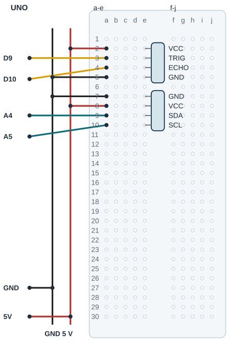

## Tanı • Tahmin et

:::bilgi[Ek malzeme]{renk=sari}
Bu parça kit içinde yoktur: 5 V’a uygun I²C 16×2 LCD, PCF8574 arayüzü ve erkek başlık.
:::

### Günlük teknolojide

Bir gösterge, sensörün hesaplanan sonucunu görünür yapar. Ekran sayı yazdığı için ölçüm kendiliğinden doğru olmaz. Sen mesafeyi iki satırlı LCD’de göstereceksin. Yankı olmadığında eski sayı silinir. Ekranın bağlantısı ve sensörün hedefi ayrı ayrı sınanır.


### Sistemin yolu

**Girdi:** HC-SR04 yankı süresi → **Karar:** Geçerli ölçüm / hata → **Çıktı:** I²C 16×2 LCD

:::bilgi[Önce düşün]{renk=sari}
Yalnız aralikMs 250’den 500’e çıkarsa ekrandaki yenileme sıklığı nasıl değişir?
:::

::yaz[Tahminim]{satir=2}

### Parçayı tanı

- 16×2, iki satırda on altışar karakter demektir. LCD modülünün PCF8574 kartı I²C adlı iki sinyal hattıyla konuşur.
- UNO R3’te SDA A4, SCL A5’tir. SDA veri, SCL saat sinyalidir; A4/A5 bu projede analog ölçüm için kullanılmaz.
- I²C adresi cihazın kimliğidir. 0x27 veya 0x3F’yi varsayma; hd44780\_I2Cexp desteklenen ekranın adresini ve pin eşlemesini arar.
- begin sonucu 0 ise başlatma başarılıdır. Hata varsa Seri Monitör mesaj verir; LCD üzerinde görünen eski yazı yeni ölçüm değildir.
- PCF8574, modülün tamamını tanımlamaz. Gerçek 5 V, SDA/SCL pull-up dirençleri ve arka ışık akımı ayrıca doğrulanır.

## Güç, sinyal ve GND yollarını eşleştir

| UNO pini | Bağlantı yolu |
|---|---|
| **GND** | Ray → HC.GND e5 / LCD.GND e7 |
| **5V** | Ray → HC.VCC e2 / LCD.VCC e8 |
| **D9** | a3 → HC.TRIG e3 |
| **D10** | a4 → HC.ECHO e4 |
| **A4** | a9 → LCD.SDA e9 |
| **A5** | a10 → LCD.SCL e10 |

_Kırmızı: güç · Siyah: GND · Sarı: dijital · Turkuaz: analog. A4/A5 burada I²C sinyalidir._

**Kontrol listesi**

- Model / pin adları doğrulandı
- Güç yolları kontrol edildi
- Her delikte tek uç
- İki besleme gerekiyorsa ikisi ayrı

### Adım adım kur

1. USB kablosunu çıkar; LCD’nin 5 V uygunluğu, SDA/SCL pull-up dirençleri ve başlık adlarını doğrula.
2. HC-SR04: VCC e2, TRIG e3, ECHO e4, GND e5. LCD örneği: GND e7, VCC e8, SDA e9, SCL e10.
3. UNO 5 V ve GND tek jumper ile ayrı raylara gider. Sensör için 5 V a2, GND a5; LCD için GND a7, 5 V a8.
4. Sensör D9 a3, D10 a4. LCD SDA için A4 a9’a; SCL için A5 a10’a gider.
5. LCD gövdesini dışarıda destekle; erkek başlığı breadboard’a girsin. Her delikte bir uç ve rayları kontrol ettir; sonra USB’yi tak.

:::dikkat{renk=kirmizi}
Gerçek başlık sırası çizimden çıkarılmaz. Erkek başlıklı modüle erkek jumper doğrudan takılmaz. Kart üzerindeki SDA/SCL pull-up ve 5 V uyumu doğrulansın. LCD ve arka ışık akımı USB toplam güç bütçesine dahildir; belirsiz parçaya enerji verme. Bağlantı değişiminde USB çıkarılır.
:::

**Sen çiz (defterine):** güç ve GND yollarını farklı çizgilerle göster.

## Örnek başlığı gerçek modelle eşleştir



- **HC başlığı:** VCC e2 · TRIG e3 · ECHO e4 · GND e5
- **LCD başlığı:** GND e7 · VCC e8 · SDA e9 · SCL e10
- **I²C sinyalleri:** A4 a9 → SDA; A5 a10 → SCL
- **Raylar:** Tek 5 V ve GND; iki modüle raydan dağıt
- **Gövdeyi destekle:** Erkek başlık takılır; LCD gövdesi dışarıda
- **Gerçek model:** 5 V, pull-up, arka ışık akımı doğrulanır

_Kesişen çizgiler yalnız uçlarında birleşir. Her delikte tek uç vardır._

Örnek başlık sırası ve delikler gösterilir. Gerçek pinleri üretici belgesinden doğrula; modül gövdesi ve bağlantı uçları zorlanmaz.

:::bilgi[Modelini eşleştir]{renk=mavi}
Tek 5 V PCF8574 LCD ve kart üzerindeki SDA/SCL pull-up dirençleri doğrulanmış örnek içindir. Başlık sırası ve gövde ölçüsü modele bağlıdır.
:::

**Sen çiz (defterine):** sensör ve çıkışın ortak GND yolunu işaretle.

## Tam programı derle ve yükle

```cpp title="TAM PROGRAM · EK-K1" start=1 dosya=ekk1_lcd_mesafe
#include <Wire.h>
#include <hd44780.h>
#include <hd44780ioClass/hd44780_I2Cexp.h>
const byte trigPini = 9, echoPini = 10;
const byte hazirlikUs = 2, tetiklemeUs = 10;
const float sesHiziCmUs = 0.0343, enAzCm = 2, enCokCm = 400;
const unsigned long zamanAsimiUs = 30000, aralikMs = 250;
const byte sutun = 16, satir = 2;
hd44780_I2Cexp ekran;
bool ekranHazir = false;
unsigned long sonOlcum = 0;

float mesafeOlc() {
  digitalWrite(trigPini, LOW);
  delayMicroseconds(hazirlikUs);
  digitalWrite(trigPini, HIGH);
  delayMicroseconds(tetiklemeUs);
  digitalWrite(trigPini, LOW);
  unsigned long sureUs = pulseIn(echoPini, HIGH, zamanAsimiUs);
  float cm = sureUs * sesHiziCmUs / 2.0;
  if (sureUs == 0 || cm < enAzCm || cm > enCokCm) return -1;
  return cm;
}

void setup() {
  pinMode(trigPini, OUTPUT); pinMode(echoPini, INPUT);
  Serial.begin(9600);
  Wire.begin(); Wire.setWireTimeout(zamanAsimiUs, true);
  ekranHazir = ekran.begin(sutun, satir) == 0;
  if (!ekranHazir) Serial.println("LCD baslatma hatasi");
  sonOlcum = millis();
}

void loop() {
  if (!ekranHazir) return;
  unsigned long simdi = millis();
  if (simdi - sonOlcum < aralikMs) return;
  sonOlcum = simdi;
  float cm = mesafeOlc();
  if (ekran.clear() != 0) {
    ekranHazir = false;
    Serial.println("LCD iletisim hatasi");
    return;
  }
  ekran.setCursor(0, 0);
  if (cm < 0) {
    ekran.print("Olcum yok");
    Serial.println("Olcum yok");
  } else {
    ekran.print("Mesafe: "); ekran.print(cm, 1); ekran.print(" cm");
    Serial.print("cm: "); Serial.println(cm, 1);
  }
  ekran.setCursor(0, 1); ekran.print("Sinif deneyi");
}
```

_Kart: UNO · Seri Monitör: 9600 baud. Açıklama aşağıda._

## Ölçüm, hata ve çıkış komutunu ayır

### Kodun mantığı

1. #include satırları Wire ve hd44780 kütüphanesini ekler. ekran nesnesine sabit I²C adresi verilmez; tek desteklenen LCD bağlanır.
2. Wire.setWireTimeout, I²C beklemesini sınırlar. ekran.begin 16 sütun ve 2 satır seçer; 0 dışındaki sonuçta ekranHazir false kalır.
3. sonOlcum ile ölçüm başlangıçları en az 250 ms ayrılır. millis farkı unsigned long olarak tutulur; taşmada süre denetimi sürer.
4. mesafeOlc, 30 000 µs zaman aşımıyla yankı alır. Sıfır veya 2-400 cm dışında -1 kullanılır; 999 gerçek mesafe değildir.
5. clear, önceki sonucu siler. İletişim hatası varsa ölçüm yazımı durur; Seri Monitör hata verir ve bağlantı düzeltilince yeniden başlatılır.
6. Geçerli cm bir ondalıkla yazılır; hata Olcum yok yazar. Ekran basamağı sensörün doğruluğunu artırmaz.

### Hata avcısı

| Belirti | Olası neden | Ne yap? |
|---|---|---|
| LCD baslatma hatasi | Model, I²C yolu veya adres bulunamadı | USB’yi çıkar; SDA/A4, SCL/A5, başlık ve pull-up dirençlerini doğrulat. Kütüphanenin I2CexpDiag örneğini öğretmenle çalıştır; adresi keyfi seçme. |
| Işık var, yazı yok | Kontrast veya gerçek model | Seri Monitör mesajını izle. Modelin kontrast ayarını öğretmenle küçük adımlarla değiştir; arka ışık iletişim kanıtı değildir. |
| Olcum yok veya değişmeyen eski yazı | Sensör yankısı veya ekran yolu | Düz hedef ve Seri Monitör ile karşılaştır. İletişim hata mesajı varsa eski LCD yazısını yeni ölçüm sayma; USB’yi çıkarıp bağlantıyı düzelt. |

:::bilgi[Kütüphaneyi hazırla]{renk=mavi}
Kütüphane Yöneticisi’nde Bill Perry’nin hd44780 1.3.2 sürümünü kur. I2CexpDiag örneği gerçek modeli sınar. Başlatma hatası varsa önce bağlantıyı düzelt; 0x27/0x3F yazıp deneme yapma.
:::

**Sen çiz (defterine):** giriş, programın durumu ve çıkış için üç ayrı kutu göster.

## Bir sabiti değiştir; gözlemini yaz

Tahminini denemeden önce yaz. Öğretmenin onayladığı düzeni dene; sonra gerçek gözlemini kaydet.

| Deneme | Tahminim | Gözlemim |
|---|---|---|
| Sabit düz hedef yaklaşık 10 cm; LCD ve Seri Monitör’ü karşılaştır. |   |   |
| Aynı hedef yaklaşık 30 cm; değişimi ve yenileme aralığını kaydet. |   |   |
| USB çıkar; ECHO’yu ayırıp başlat. Hata yazısını gözle; sonra düzelt. |   |   |
| Yalnız aralık 500 ms; aynı hedef, sonra 250 ms’ye dön. |   |   |

:::bilgi[Bir değişiklik yap]{renk=mavi}
Yalnız aralikMs 250’den 500’e çıksın. Aynı hedef ve konumu koru; yenileme süresini karşılaştır. Sonra 250’ye dön. Adres, LCD boyutu ve kablolar bu deneyde değişmesin.
:::

::yaz[Tahminim ve gözlemim]{satir=3}

### Değişiklik sürümleri

“Bir değişiklik yap” sürümleri; ana programla yan yana açıp farkı bul.

```cpp title="Değişiklik sürümü · ekk1_aralik_500" start=1 dosya=ekk1_aralik_500
#include <Wire.h>
#include <hd44780.h>
#include <hd44780ioClass/hd44780_I2Cexp.h>
const byte trigPini = 9, echoPini = 10;
const byte hazirlikUs = 2, tetiklemeUs = 10;
const float sesHiziCmUs = 0.0343, enAzCm = 2, enCokCm = 400;
const unsigned long zamanAsimiUs = 30000, aralikMs = 500;
const byte sutun = 16, satir = 2;
hd44780_I2Cexp ekran;
bool ekranHazir = false;
unsigned long sonOlcum = 0;

float mesafeOlc() {
  digitalWrite(trigPini, LOW);
  delayMicroseconds(hazirlikUs);
  digitalWrite(trigPini, HIGH);
  delayMicroseconds(tetiklemeUs);
  digitalWrite(trigPini, LOW);
  unsigned long sureUs = pulseIn(echoPini, HIGH, zamanAsimiUs);
  float cm = sureUs * sesHiziCmUs / 2.0;
  if (sureUs == 0 || cm < enAzCm || cm > enCokCm) return -1;
  return cm;
}

void setup() {
  pinMode(trigPini, OUTPUT); pinMode(echoPini, INPUT);
  Serial.begin(9600);
  Wire.begin(); Wire.setWireTimeout(zamanAsimiUs, true);
  ekranHazir = ekran.begin(sutun, satir) == 0;
  if (!ekranHazir) Serial.println("LCD baslatma hatasi");
  sonOlcum = millis();
}

void loop() {
  if (!ekranHazir) return;
  unsigned long simdi = millis();
  if (simdi - sonOlcum < aralikMs) return;
  sonOlcum = simdi;
  float cm = mesafeOlc();
  if (ekran.clear() != 0) {
    ekranHazir = false;
    Serial.println("LCD iletisim hatasi");
    return;
  }
  ekran.setCursor(0, 0);
  if (cm < 0) {
    ekran.print("Olcum yok");
    Serial.println("Olcum yok");
  } else {
    ekran.print("Mesafe: "); ekran.print(cm, 1); ekran.print(" cm");
    Serial.print("cm: "); Serial.println(cm, 1);
  }
  ekran.setCursor(0, 1); ekran.print("Sinif deneyi");
}
```

### Kendini kontrol et

**1.** SDA ve SCL hangi UNO R3 pinlerine gider?

::yaz[Cevabım]{satir=2}

**2.** LCD arka ışığının yanması neden iletişimin çalıştığını kanıtlamaz?

::yaz[Cevabım]{satir=2}

**3.** Geçerli ölçümden sonraki yankı sıfırsa önceki cm sayısı neden silinmelidir?

::yaz[Cevabım]{satir=2}

**Evde devam et:** Bir sayısal gösterge gözle. Sayı, birim ve hata için hangi alanları kullandığını kâğıtta göster.

**Şimdi sıra sende:** Ana kitap [Proje 9](proje:9)’daki Seri Monitör bilgisiyle LCD bilgisini karşılaştır; birinin hatası ötekinin ölçümünü nasıl etkiler?

::yaz[Fikrim]{satir=3}

**Kendimi değerlendiriyorum:** Yardımla yaptım · Biraz yardımla · Tek başıma · Başkasına anlatabilirim

::yaz[Bu projeyi nasıl yaptım? Neden?]{satir=1}

:::bilgi[Biliyor muydun?]{renk=sari}
hd44780\_I2Cexp, desteklenen I²C arayüzün adres ve pin eşlemesini bulabilir. Bu özellik gerçek modülün besleme ve pull-up uygunluğunu doğrulamaz.
:::

**Sen çiz (defterine):** sensör ve çıkışın ortak GND yolunu işaretle.
