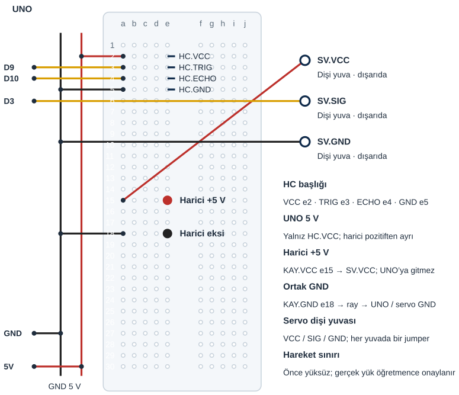

## Tanı • Tahmin et

:::bilgi[Ek malzeme]{renk=sari}
Bu parça kit içinde yoktur: regüle 5 V düşük gerilim kaynağı ve yalıtılmış bağlantı uçları. Kapak düzeneği öğretmen denetimindedir.
:::

### Günlük teknolojide

Bir mekanizmanın gücü, kontrol sinyalinden ayrı sağlanabilir. Sen servo beslemesini USB hattından ayıran bağlantıyı inceleyeceksin. Önce serbest kol denenir. Öğretmen uygun mekanizmayı ve yükü doğrularsa küçük kapak modeli eklenir. Güç kaynağının büyümesi her kapağın uygun olduğunu göstermez.


### Sistemin yolu

**Girdi:** HC-SR04 yankı süresi → **Karar:** Mesafe, durum ve süre → **Çıktı:** D3 servo açı komutu

:::bilgi[Önce düşün]{renk=sari}
Yalnız acikTutmaMs 2000’den 3000’e çıkarsa uzaklaşan hedefte kolun kapalı komutuna dönmesi nasıl değişir?
:::

::yaz[Tahminim]{satir=2}

### Parçayı tanı

- Ana kitap [Proje 22](proje:22)’deki mesafe ve zaman kararı korunur. Eklenen parça, servoya uygun regüle 5 V kaynaktır.
- UNO USB’den, HC-SR04 UNO 5 V’tan beslenir. Servo VCC yalnız harici +5 V’a gider; iki pozitif güç hattı birleşmez.
- Servo GND ve harici eksi, UNO GND ile ortaktır. D3 yalnız sinyal taşır; motor gücü vermez.
- Kaynağın gerilimi, ani hareket ve sıkışma akımı gerçek servo belgesinden öğretmenle doğrulanır. Pili veya adaptörü görünüşünden uygun sayma.
- Önce serbest kol ve sınırlı komut aralığı denenir. Yük, kol uzunluğu, sıkışma ve parmak aralığı öğretmen doğrulaması ister.

## Güç, sinyal ve GND yollarını eşleştir

| UNO pini | Bağlantı yolu |
|---|---|
| **GND** | Ray → HC.GND / harici eksi / servo GND |
| **5V** | Ray → yalnız HC.VCC e2 |
| **D9** | a3 → HC.TRIG e3 |
| **D10** | a4 → HC.ECHO e4 |
| **D3** | Doğrudan SV.SIG dişi yuvası |

_Kırmızı: güç · Siyah: GND · Sarı: dijital · Turkuaz: analog. A4/A5 burada I²C sinyalidir._

**Kontrol listesi**

- Model / pin adları doğrulandı
- Güç yolları kontrol edildi
- Her delikte tek uç
- İki besleme gerekiyorsa ikisi ayrı

### Adım adım kur

1. USB’yi ve harici kaynağı ayır. Kaynak gerilimi, kutup, servo modeli ve akım uygunluğu öğretmence doğrulansın.
2. HC-SR04 VCC e2, TRIG e3, ECHO e4, GND e5. UNO 5 V kırmızı raya; GND siyah raya gider.
3. 5 V a2, GND a5; TRIG D9 a3, ECHO D10 a4. HC-SR04 yalnız UNO 5 V hattında kalır.
4. Servo VCC dişi yuvası harici +5 V’a; GND dişi yuvası harici eksi ve GND rayına gider. Harici +5 V, a15 düğümünden dağıtılır.
5. D3 servo SIG dişi yuvasına gider. Harici +5 V ile UNO 5 V’ın ayrı olduğunu ve ortak GND yolunu kontrol ettir.
6. Kol serbestken iki beslemeyi öğretmen açsın. Yön ve komut aralığı doğrulandıktan sonra uygun kapak düzeneğini yalnız öğretmen kurar.

:::dikkat{renk=kirmizi}
Harici +5 V asla UNO 5 V pinine veya UNO 5 V rayına bağlanmaz. Öğrenci şebeke bağlantısı yapmaz; yalnız hazır, yalıtılmış düşük gerilim çıkışı kullanılır. USB ve harici güç, kablo veya kapak değişiminde birlikte ayrılır. Parmaklarını kapaktan ve koldan uzak tut. Sıkışma, titreme, ısınma veya reset varsa iki beslemeyi ayır; daha güçlü kaynakla zorlamaya devam etme.
:::

**Sen çiz (defterine):** güç ve GND yollarını farklı çizgilerle göster.

## Örnek başlığı gerçek modelle eşleştir



Kesişen çizgiler yalnız uçlarında birleşir. Her delikte tek uç vardır.

Örnek başlık sırası ve delikler gösterilir. Gerçek pinleri üretici belgesinden doğrula; modül gövdesi ve bağlantı uçları zorlanmaz.

:::bilgi[Modelini eşleştir]{renk=mavi}
Çizim regüle 5 V kaynağın yalnız düşük gerilim uçlarını gösterir. Kaynak akımı ve kapak torku gerçek modele bağlıdır; 4×AA kendiliğinden regüle 5 V değildir.
:::

**Sen çiz (defterine):** sensör ve çıkışın ortak GND yolunu işaretle.

## Tam programı derle ve yükle

```cpp title="TAM PROGRAM · EK-K2" start=1 dosya=ekk2_servo_kapak
#include <Servo.h>
const byte trigPini = 9, echoPini = 10, servoPini = 3;
const byte hazirlikUs = 2, tetiklemeUs = 10, gidisDonusSayisi = 2;
const byte kapaliAci = 60, acikAci = 120;
const unsigned int darbeAltUs = 1000, darbeUstUs = 2000;
const float acmaEsigiCm = 15, kapatmaMarjiCm = 5;
const float sesHiziCmUs = 0.0343, enAzCm = 2, enCokCm = 400;
const unsigned long zamanAsimiUs = 30000;
const unsigned long olcumAraligiMs = 100, acikTutmaMs = 2000;
Servo motor;
bool kapakAcik = false;
unsigned long sonOlcum = 0, sonYakin = 0;

float mesafeOlc() {
  digitalWrite(trigPini, LOW);
  delayMicroseconds(hazirlikUs);
  digitalWrite(trigPini, HIGH);
  delayMicroseconds(tetiklemeUs);
  digitalWrite(trigPini, LOW);
  unsigned long sureUs = pulseIn(echoPini, HIGH, zamanAsimiUs);
  float cm = sureUs * sesHiziCmUs / gidisDonusSayisi;
  if (sureUs == 0 || cm < enAzCm || cm > enCokCm) return -1;
  return cm;
}

void setup() {
  pinMode(trigPini, OUTPUT);
  pinMode(echoPini, INPUT);
  motor.attach(servoPini, darbeAltUs, darbeUstUs);
  motor.write(kapaliAci);
  Serial.begin(9600);
  sonOlcum = millis();
}

void loop() {
  unsigned long simdi = millis();
  if (simdi - sonOlcum < olcumAraligiMs) return;
  sonOlcum = simdi;
  float cm = mesafeOlc();
  simdi = millis();
  if (cm < 0) {
    kapakAcik = false;
    Serial.println("Olcum yok; kapali komut");
  } else {
    if (cm < acmaEsigiCm) kapakAcik = true;
    if (kapakAcik && cm <= acmaEsigiCm + kapatmaMarjiCm) {
      sonYakin = simdi;
    } else if (kapakAcik && simdi - sonYakin >= acikTutmaMs) {
      kapakAcik = false;
    }
    Serial.print("cm: "); Serial.print(cm, 1);
    Serial.print(" Acik komut: "); Serial.println(kapakAcik);
  }
  if (kapakAcik) motor.write(acikAci);
  else motor.write(kapaliAci);
}
```

_Kart: UNO · Seri Monitör: 9600 baud. Açıklama aşağıda._

## Ölçüm, hata ve çıkış komutunu ayır

### Kodun mantığı

1. mesafeOlc, TRIG’e 10 µs darbe verir. pulseIn’e 30 000 µs zaman aşımı verilir; sıfırda veya 2-400 cm dışında -1 döner.
2. motor.attach D3’ü ve ana kitap [Proje 10](proje:10) içindeki 1000-2000 µs darbe ayarını seçer. motor.write, kapaliAci 60 komutuyla başlar; gerçek açıyı ölçmez.
3. sonOlcum ile en az 100 ms ölçüm başlangıcı aralığı korunur. unsigned long zaman farkları millis taşmasını da kapsar.
4. Geçerli cm, acmaEsigiCm altındaysa kapakAcik true olur. Açık durumdaki yakın okumalar sonYakin değerini yeniler.
5. Uzak geçerli okumada acikTutmaMs dolarsa kapakAcik false olur. Hata bu beklemeyi atlar; kapalı komut ve hata mesajı seçilir.
6. motor.write yalnız seçilen açık veya kapalı komutu gönderir. Yazılımdaki karar gerçek kapağın güvenliğini veya konumunu ölçmez.

### Hata avcısı

| Belirti | Olası neden | Ne yap? |
|---|---|---|
| Reset veya titreme | Ortak GND, güç veya sıkışma | USB ve harici kaynağı ayır. Öğretmen akımı, kutbu, ortak GND ve yükü doğrulasın; yalnız eşiği değiştirerek güç sorununu gizleme. |
| Kapak ters veya fazla hareket ediyor | Kol montajı veya mekanik sınır | İki beslemeyi ayır; kapağı öğretmen söksün. Önce serbest kol ve gerçek açı aralığı doğrulansın; kapağı elle zorlamayla düzeltme. |
| Ölçüm hatasında kapalı komut | Yankı geçersiz | Düz hedef ve Seri Monitör’ü karşılaştır. Bu yazılım komutu insanı sıkışmadan koruyan bir güvenlik sistemi değildir. |

:::bilgi[Güç ve karar farklıdır]{renk=mavi}
Aynı mesafe programı güç akımını, mekanik sıkışmayı veya gerçek kapağın konumunu ölçmez. Kapalı komut bir koruma sistemi değildir; uygunluk öğretmen denetimi ister.
:::

**Sen çiz (defterine):** giriş, programın durumu ve çıkış için üç ayrı kutu göster.

## Bir sabiti değiştir; gözlemini yaz

Tahminini denemeden önce yaz. Öğretmenin onayladığı düzeni dene; sonra gerçek gözlemini kaydet.

| Deneme | Tahminim | Gözlemim |
|---|---|---|
| Öğretmen serbest kolda kaynak/akım ve iki pozitif hattın ayrılığını doğrulasın. |   |   |
| Düz hedef yaklaşık 10 / 30 cm; serbest kol komutunu ve süreyi kaydet. |   |   |
| Öğretmen uygun küçük yükü onaylarsa aynı hedefte mekanizmayı gözle. |   |   |
| Yalnız açık tutma 3000 ms; uygun aynı düzen, sonra 2000 ms’ye dön. |   |   |

:::bilgi[Bir değişiklik yap]{renk=mavi}
Yalnız acikTutmaMs 2000’den 3000’e çıksın. Doğrulanmış aynı düzeneği ve hedefi koru; dönüş süresini karşılaştır. Sonra 2000’e dön. Besleme, yük ve açı ayarları bu deneyde değiştirilmez.
:::

::yaz[Tahminim ve gözlemim]{satir=3}

### Değişiklik sürümleri

“Bir değişiklik yap” sürümleri; ana programla yan yana açıp farkı bul.

```cpp title="Değişiklik sürümü · ekk2_acik_tutma_3000" start=1 dosya=ekk2_acik_tutma_3000
#include <Servo.h>
const byte trigPini = 9, echoPini = 10, servoPini = 3;
const byte hazirlikUs = 2, tetiklemeUs = 10, gidisDonusSayisi = 2;
const byte kapaliAci = 60, acikAci = 120;
const unsigned int darbeAltUs = 1000, darbeUstUs = 2000;
const float acmaEsigiCm = 15, kapatmaMarjiCm = 5;
const float sesHiziCmUs = 0.0343, enAzCm = 2, enCokCm = 400;
const unsigned long zamanAsimiUs = 30000;
const unsigned long olcumAraligiMs = 100, acikTutmaMs = 3000;
Servo motor;
bool kapakAcik = false;
unsigned long sonOlcum = 0, sonYakin = 0;

float mesafeOlc() {
  digitalWrite(trigPini, LOW);
  delayMicroseconds(hazirlikUs);
  digitalWrite(trigPini, HIGH);
  delayMicroseconds(tetiklemeUs);
  digitalWrite(trigPini, LOW);
  unsigned long sureUs = pulseIn(echoPini, HIGH, zamanAsimiUs);
  float cm = sureUs * sesHiziCmUs / gidisDonusSayisi;
  if (sureUs == 0 || cm < enAzCm || cm > enCokCm) return -1;
  return cm;
}

void setup() {
  pinMode(trigPini, OUTPUT);
  pinMode(echoPini, INPUT);
  motor.attach(servoPini, darbeAltUs, darbeUstUs);
  motor.write(kapaliAci);
  Serial.begin(9600);
  sonOlcum = millis();
}

void loop() {
  unsigned long simdi = millis();
  if (simdi - sonOlcum < olcumAraligiMs) return;
  sonOlcum = simdi;
  float cm = mesafeOlc();
  simdi = millis();
  if (cm < 0) {
    kapakAcik = false;
    Serial.println("Olcum yok; kapali komut");
  } else {
    if (cm < acmaEsigiCm) kapakAcik = true;
    if (kapakAcik && cm <= acmaEsigiCm + kapatmaMarjiCm) {
      sonYakin = simdi;
    } else if (kapakAcik && simdi - sonYakin >= acikTutmaMs) {
      kapakAcik = false;
    }
    Serial.print("cm: "); Serial.print(cm, 1);
    Serial.print(" Acik komut: "); Serial.println(kapakAcik);
  }
  if (kapakAcik) motor.write(acikAci);
  else motor.write(kapaliAci);
}
```

### Kendini kontrol et

**1.** Harici +5 V hangi servo ucuna gider; hangi UNO ucuna bağlanmaz?

::yaz[Cevabım]{satir=2}

**2.** Ayrı güç kaynaklarında GND neden ortak, pozitif hatlar neden ayrı tutulur?

::yaz[Cevabım]{satir=2}

**3.** Servo titrerken daha ağır kapak eklemek yerine ilk hangi işlemi yaparsın?

::yaz[Cevabım]{satir=2}

**Evde devam et:** Bir motorlu kapak fikri çiz. Hareketli bölgeleri ve ayrı güç/sinyal yollarını kâğıtta işaretle.

**Şimdi sıra sende:** Ana kitap [Proje 22](proje:22) ile güç yollarını karşılaştır; aynı programın farklı güç dağıtımında neyi ölçmediğini yaz.

::yaz[Fikrim]{satir=3}

**Kendimi değerlendiriyorum:** Yardımla yaptım · Biraz yardımla · Tek başıma · Başkasına anlatabilirim

::yaz[Bu projeyi nasıl yaptım? Neden?]{satir=1}

:::bilgi[Biliyor muydun?]{renk=sari}
Servo sinyalinin GND referansı kontrolcüyle ortak tutulur. Motorun gücü harici kaynaktan gelir; daha yüksek kaynak akımı mekanik yükün uygunluğunu kanıtlamaz.
:::

**Sen çiz (defterine):** sensör ve çıkışın ortak GND yolunu işaretle.
