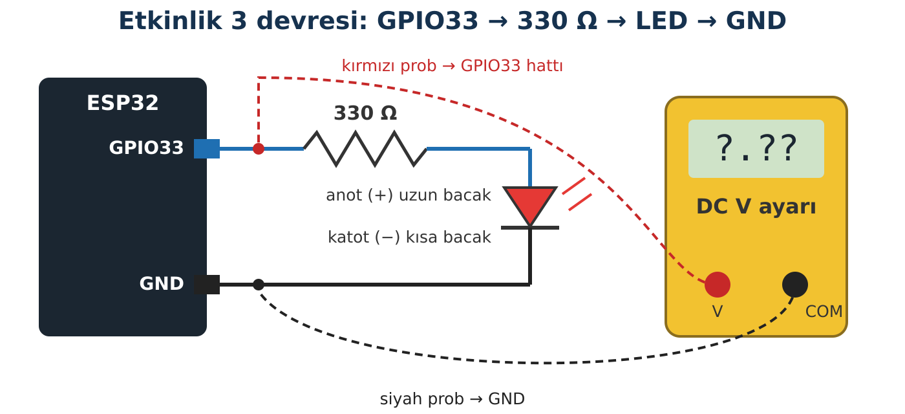

## Hedeflerim

Bu föyün sonunda:

- ESP32 ile Arduino Uno arasındaki önemli farkları açıklayabilirim.
- ESP32'nin HIGH gerilimini **ölçerek** gösterir, pinlere neden 5 V uygulanmaması gerektiğini anlatabilirim.
- Arduino IDE'yi ESP32 için kurar, kartıma kendi başıma kod yüklerim.
- Kartımdaki sınıf pinlerini bulur, dikkat gerektiren pinleri ayırt ederim.
- Yükleme hatalarında R1 Yükleme Rutini'ni uygularım.

## Malzemeler

| Malzeme | Adet | Not |
| --- | --- | --- |
| ESP32-WROOM-32 geliştirme kartı (30 pin, Type-C) | 1 |  |
| USB Type-C **veri** kablosu | 1 | Şarj kablosu değil |
| Breadboard | 1 |  |
| Kırmızı LED (5 mm) | 1 |  |
| 330 Ω direnç | 1 | Turuncu-turuncu-kahverengi |
| Jumper kablo | 3 |  |
| Dijital multimetre | Sınıfta 1+ | Gruplar sırayla kullanır |
| Bilgisayar + Arduino IDE 2 | 1 | Kurulum öğretmenle yapılır |

## Kavram: Arduino'dan Ne Farklı?

ESP32 de Arduino IDE ile programlanır; setup(), loop(), pinMode() ve digitalWrite() aynıdır. Ama kartın **çalışma gerilimi** ve **pin kuralları** farklıdır. Arduino alışkanlıklarını olduğu gibi taşımak, kartı bozmanın en kısa yoludur.

| Özellik | Arduino Uno | ESP32-WROOM-32 | Bu kitapta ne demek? |
| --- | --- | --- | --- |
| Lojik gerilim | 5 V | **3,3 V** | Pinlere en fazla 3,3 V gelebilir. 5 V çıkış veren modül doğrudan bağlanmaz. |
| İşlemci | 8 bit, 16 MHz, 1 çekirdek | 32 bit, 240 MHz'e kadar, 2 çekirdek | Wi-Fi arka planda çalışırken senin kodun da çalışabilir. |
| Kablosuz | Yok | Wi-Fi + Bluetooth | Web paneli ve iki kart arası haberleşme mümkün. |
| Analog okuma | 10 bit (0–1023) | 12 bit (0–4095) | Arduino'daki analog eşikler aynen kullanılamaz. |
| Güç pinleri | 5V ve 3.3V | **VIN** (USB'den ≈5 V) ve **3V3** | Servo, WS2812 gibi yükler 3V3'ten beslenmez. |
| Pin adları | D2, A0 … | GPIO numarası | Kodda 33 yazmak GPIO33 demektir. |

:::dikkat[Altın Kural: ESP32 pinleri 5 V'a dayanıklı değildir]
Bir GPIO pinine 3,3 V'tan belirgin şekilde yüksek gerilim gelirse, pinin içindeki koruma elemanlarından akım akar ve pin ya da çip kalıcı olarak zarar görebilir. Hasar her zaman hemen görünmez: kart bir süre "bazen çalışan" bir karta dönüşebilir. Bu yüzden:

- Pinlere **3,3 V'tan yüksek** gerilim uygulama.
- Motor, servo, LED şerit gibi yükleri **pinden besleme**; pin yalnız sinyal verir.
- Harici besleme kullanıyorsan **GND'leri ortakla**; USB takılıyken VIN pinine harici 5 V bağlama.
- Bağlantıyı **USB çıkıkken** yap, takmadan önce **R2 Güç Kontrol Rutini**'ni uygula.
- 3V3 ya da VIN pinini GND'ye **doğrudan bağlama** (kısa devre). Kart ısınırsa USB'yi hemen çıkar.
:::

## Etkinlik 1 — Kurulum

1. Arduino IDE 2'yi aç. **Dosya → Tercihler → Ek Kart Yöneticisi URL'leri** alanına şu adresi ekle: **https://espressif.github.io/arduino-esp32/package_esp32_index.json**
2. **Kart Yöneticisi**'nde "esp32" ara, **esp32 by Espressif Systems** paketini Kit ve Sürüm Tablosu'ndaki sürümle kur.
3. Kartı tak. Kartın USB girişinin yanındaki küçük çipin üzerindeki yazıyı oku: **CP2102** ya da **CH340/CH9102**. Windows'ta **Aygıt Yöneticisi → Bağlantı noktaları (COM ve LPT)** altında kartın görünmesi gerekir. Görünmüyorsa öğretmenin sürücüyü kurar.
4. **Araçlar → Kart → esp32 → ESP32 Dev Module** seç, ardından **Araçlar → Bağlantı noktası**'ndan COM numaranı seç.

|  |  |
| --- | --- |
| Kartımın USB-seri çipi: |  |
| COM numaram: |  |
| Kurulu esp32 paket sürümü: |  |

## Etkinlik 2 — ESP32 ile İlk Konuşma

### Tahminim

Kodu yüklemeden önce tahmin et: ESP32'nin kaç çekirdeği var, işlemcisi kaç MHz'te çalışıyor? Tahminlerini aşağıdaki tablonun "Tahminim" sütununa yaz.

```cpp title="Kod 0.1 — Foy0_Merhaba" start=1 dosya=Foy0_Merhaba
// FOY 0 - Etkinlik 2: ESP32 ile ilk konusma
void setup() {
  Serial.begin(115200);   // Seri Monitor de 115200 olmali
  delay(1000);            // Seri Monitor'un acilmasi icin kisa bekleme

  Serial.println("Merhaba ESP32!");
  Serial.print("Cip modeli: ");
  Serial.println(ESP.getChipModel());
  Serial.print("Cekirdek sayisi: ");
  Serial.println(ESP.getChipCores());
  Serial.print("Islemci hizi (MHz): ");
  Serial.println(ESP.getCpuFreqMHz());
  Serial.print("Flash bellek (MB): ");
  Serial.println(ESP.getFlashChipSize() / (1024 * 1024));
}

void loop() {
  Serial.print("Acik kalma suresi (s): ");
  Serial.println(millis() / 1000);
  delay(1000);
}
```

### Kodun Mantığı

- **Satır 3:** Seri haberleşmeyi 115200 hızında başlatır. Seri Monitör'deki hız da aynı olmalıdır; farklıysa anlamsız karakterler görürsün.
- **Satır 4:** Kart açıldıktan sonra 1 saniye bekler; ilk mesajların kaçmaması için.
- **Satır 7–14:** ESP. ile başlayan komutlar kartın kendisi hakkında bilgi verir. "Cip modeli" satırında **WROOM-32 değil**, ESP32-D0WD… gibi bir ad görebilirsin: WROOM-32 bir **modüldür**; içinde çip, flash bellek ve anten birlikte bulunur.
- **Satır 19:** millis() kartın açılışından beri geçen süreyi milisaniye olarak verir; 1000'e bölünce saniye elde edilir.

:::bilgi[Kodda neden Türkçe karakter yok?]
Bu kitaptaki kodlarda ekrana yazılan metinlerde ç, ğ, ı, ö, ş, ü yerine c, g, i, o, s, u kullanıyoruz ("Acik kalma suresi" gibi). Sebep: OLED ekranların yazı tipi bu harfleri içermez; Seri Monitör'de ise bazı IDE sürümleri ve bilgisayar ayarları bozuk karakter gösterebilir. ASCII harflerle yazılan metin her yerde aynı görünür. Web sayfaları (Föy 6 ve 11) bunun dışındadır: tarayıcı Türkçe harfleri doğru gösterir.
:::

### Gözlem

| Bilgi | Tahminim | Seri Monitör'de gördüğüm |
| --- | --- | --- |
| Çip modeli |  |  |
| Çekirdek sayısı |  |  |
| İşlemci hızı (MHz) |  |  |
| Flash bellek (MB) |  |  |

### Değiştir – Gözle

| Değişiklik | Tahminim | Gözlemim | Açıklamam |
| --- | --- | --- | --- |
| Seri Monitör hızını 9600 yap (kodu değiştirme) |  |  |  |
| Kart çalışırken **EN** tuşuna bir kez bas |  |  |  |

## Etkinlik 3 — HIGH Kaç Volttur?

Arduino Uno'da HIGH yaklaşık 5 V'tur. ESP32'de durum ne? Bu kez tahmini **ölçümle** sınayacağız.

### Bağlantı



| Eleman | Uç | Bağlandığı yer |
| --- | --- | --- |
| 330 Ω direnç | 1. uç | GPIO33 |
| 330 Ω direnç | 2. uç | LED anot (+, uzun bacak) |
| LED | Katot (−, kısa bacak) | GND |
| Multimetre | Kırmızı prob / siyah prob | GPIO33 hattı / GND (DC V kademesi) |

:::rutin[Bağladın mı?]
USB'yi takmadan önce **R2 Güç Kontrol Rutini**'ni uygula.
:::

### Tahminim

::yaz[ESP32'de GPIO33 HIGH iken ölçeceğimi düşündüğüm gerilim: … V, çünkü]{satir=1}

```cpp title="Kod 0.2 — Foy0_Pin33" start=1 dosya=Foy0_Pin33
// FOY 0 - Etkinlik 3: HIGH kac volttur?
const int TEST_PIN = 33;   // Sinif pin planinda buzzer pini

void setup() {
  Serial.begin(115200);
  pinMode(TEST_PIN, OUTPUT);
}

void loop() {
  digitalWrite(TEST_PIN, HIGH);
  Serial.println("GPIO33 = HIGH  -> simdi olc");
  delay(5000);

  digitalWrite(TEST_PIN, LOW);
  Serial.println("GPIO33 = LOW   -> simdi olc");
  delay(5000);
}
```

### Kodun Mantığı

- **Satır 2:** Pin numarası bir sabitte tutulur. Pini değiştirmek istersen yalnız bu satırı değiştirirsin.
- **Satır 6:** Pin çıkış yapılır. ESP32'de her pin çıkış olamaz (bkz. Etkinlik 4).
- **Satır 12 ve 16:** 5 saniyelik beklemeler, multimetreyi okuman için bilerek uzun tutuldu.

### Ölçüm

| Ölçülen nokta | Tahminim (V) | Ölçümüm (V) | LED durumu |
| --- | --- | --- | --- |
| GPIO33 = HIGH |  |  |  |
| GPIO33 = LOW |  |  |  |
| 3V3 pini – GND |  |  | — |
| VIN pini – GND (USB takılı) |  |  | — |

:::fen[Fen bağlantısı: Gerilim nereye paylaşılıyor?]
Kapalı devrede kaynağın gerilimi elemanlar arasında paylaşılır: **V(pin) = V(direnç) + V(LED)**. LED'in iki bacağı arasındaki gerilimi de ölçersen direncin üzerindeki gerilimi bulabilir, **I = V / R** ile devreden geçen akımı hesaplayabilirsin (★ görev). HIGH değerini 3,3 V'tan biraz düşük ölçtüysen şaşırma: pin, LED'e akım verirken çıkış gerilimi biraz düşer.
:::

**Tartış:** Arduino projesinden kalan ve çıkışı 5 V olan bir modülü GPIO33'e doğrudan bağlasaydık ne olurdu? Ölçümlerini kullanarak açıkla.

::yaz{satir=3}

## Etkinlik 4 — Kartımın Haritası


:::dikkat[Resim bir örnektir]
30 pinli ESP32 kartlarında pinlerin sırası üreticiye göre değişebilir. **Doğru bilgi kartının üzerindeki yazıdır.** Kodda her zaman GPIO numarası kullanılır; kartın farklıysa kod değişmez, yalnız kablonun takıldığı yer değişir.
:::

Kartını çevir, yazıları oku ve tabloyu doldur.

| Sınıf işlevi | GPIO | Kartımda hangi sırada? (sol/sağ) | Üstten kaçıncı pin? |
| --- | --- | --- | --- |
| I2C SDA | 21 |  |  |
| I2C SCL | 22 |  |  |
| SPI SCK / MISO / MOSI | 18 / 19 / 23 |  |  |
| MicroSD CS | 27 |  |  |
| WS2812 veri | 16 |  |  |
| Servo sinyal | 25 |  |  |
| Buton | 26 |  |  |
| PIR çıkış | 32 |  |  |
| Buzzer | 33 |  |  |
| 3V3 | — |  |  |
| VIN | — |  |  |
| GND | — |  |  |

Kartım resimdeki düzenle aynı mı?   ☐ Evet   ☐ Hayır, farklı olan pinler: …

### Neden bu pinler seçildi?

| Pin grubu | Neden dikkat? | Kitaptaki kararımız |
| --- | --- | --- |
| GPIO34, 35, 36 (VP), 39 (VN) | Yalnız giriş olabilir; çıkış veremez, dahili pull-up direnci yoktur. | Sınıf planında kullanılmadı. |
| GPIO0, 2, 5, 12, 15 | Açılış (strapping) pinleri: kart açılırken durumları okunur. Örneğin GPIO12 açılışta HIGH ise kart hiç başlamayabilir. | Kullanılmadı. |
| GPIO1 (TX0), GPIO3 (RX0) | USB üzerinden bilgisayarla haberleşme hattıdır. | Kullanılmadı. |
| GPIO6–11 | Kartın flash belleğine bağlıdır. Bu kartta dışarı çıkarılmamıştır. | Kullanılamaz. |
| GPIO25, 26, 27 | Wi-Fi açıkken **analog** okumada kullanılamaz (ADC2). | Yalnız dijital işlerde kullanıyoruz; sorun yok. |

## Hata Avcısı

| Belirti | Olası neden | Ne yaparım? |
| --- | --- | --- |
| Bağlantı noktası listesinde COM yok | Yalnız şarj eden kablo ya da sürücü eksik | Başka kablo dene; Aygıt Yöneticisi'ne bak; öğretmene haber ver. |
| "Connecting…" yazıp "Failed to connect" hatası | Kart yükleme moduna girmedi | R1 adım 4: BOOT'u basılı tut, yükleme başlayınca bırak. |
| Seri Monitör'de anlamsız karakterler | Hız uyuşmuyor | Seri Monitör hızını 115200 yap. |
| Yükleme bitti ama Seri Monitör boş | Monitör geç açıldı ya da yanlış port | EN tuşuna bas; portu ve hızı kontrol et. |
| "Brownout detector was triggered", kart sürekli yeniden başlıyor | Besleme yetersiz ya da devrede aşırı yük / kısa devre | USB'yi çıkar, devreyi R2 ile kontrol et; USB çoklayıcı kullanma. |
| Kart ısınıyor | Kısa devre | USB'yi hemen çıkar, öğretmene haber ver. |
| Kart listesinde ESP32 yok | Kart paketi kurulmamış | Etkinlik 1, adım 1–2. |

### Bilerek hatalı kod

Bir öğrenci LED'i GPIO34'e bağlayıp aşağıdaki kodu yükledi. Kod hatasız derleniyor, Seri Monitör mesajları düzgün geliyor; ama **LED hiç yanmıyor** ve multimetre pinde 0 V gösteriyor.

```cpp title="Kod 0.3 — Foy0_Hatali" start=1 dosya=Foy0_Hatali
// FOY 0 - Hata Avcisi: Bu kodda bilerek birakilmis bir hata var!
const int TEST_PIN = 34;

void setup() {
  Serial.begin(115200);
  pinMode(TEST_PIN, OUTPUT);
}

void loop() {
  digitalWrite(TEST_PIN, HIGH);
  Serial.println("LED yanmali...");
  delay(1000);
  digitalWrite(TEST_PIN, LOW);
  Serial.println("LED sonmeli...");
  delay(1000);
}
```

**Hata:** Sorun hangi satırda, neden? Etkinlik 4'teki haritayı kullan. Düzeltmek için ne yaparsın?

::yaz{satir=3}

## Şimdi Sıra Sende

- [ ] **Görev (herkes):** LED'i 1 saniye aralıkla yakıp söndür ve her değişimde Seri Monitör'e "YANDI" ya da "SONDU" yaz. Önce algoritmayı sözcüklerle yaz, sonra kodla.

::yaz[Algoritmam:]{satir=3}

- [ ] **★ Görev:** LED yanarken LED'in bacakları arasındaki gerilimi ölç. Direncin üzerindeki gerilimi ve devreden geçen akımı hesapla.

| V(pin) HIGH | V(LED) | V(direnç) = V(pin) − V(LED) | I = V(direnç) / 330 Ω |
| --- | --- | --- | --- |
|  |  |  |  |

- [ ] **★★ Görev:** LED ile "3 kısa, 1 uzun" yanıp sönen bir sinyal oluştur. Kısa ve uzun süreleri kodun başında iki sabit değişkende tut; yalnız bu iki satırı değiştirerek sinyalin hızını değiştirebilmelisin.

## YZ ile Destek Al

:::yz[Kural]
YZ aracını yalnız **öğretmeninin izin verdiği biçimde** ve okulunun belirlediği hesapla kullan. İsteminde parola, ad-soyad ya da okul bilgisi paylaşma. YZ'den önce **açıklama ve kontrol listesi** iste; kodu baştan yazdırma.
:::

:::yz[Örnek istem]
"ESP32'ye kod yüklerken 'Failed to connect to ESP32: No serial data received' hatası alıyorum. Kart: ESP32-WROOM-32, 30 pin, Type-C. Arduino IDE 2 kullanıyorum. Bana kod verme. Olası nedenleri en olasıdan en aza doğru sırala ve her birini nasıl kontrol edeceğimi tek cümleyle yaz."
:::

### YZ cevabını nasıl doğruladım?

|  |  |
| --- | --- |
| YZ'nin önerdiği ilk kontrol: |  |
| Gerçekten denedim mi? Ne oldu? |  |
| YZ haklı mıydı? Nasıl anladım? |  |

## Kendimi Kontrol Ediyorum

**1.** Arkadaşın, Arduino projesinden kalan HC-SR04 mesafe sensörünün ECHO pinini (5 V çıkış verir) doğrudan GPIO32'ye bağlamak istiyor. Ona ne söylersin, neden?

::yaz{satir=3}

**2.** Kartındaki pin sırası kitaptaki resimden farklıysa kodda neyi değiştirirsin, neyi değiştirmezsin?

::yaz{satir=2}

**3.** Bir öğrenci butonu GPIO34'e bağlayıp INPUT_PULLUP kullanıyor ve buton kararsız okunuyor. Nedeni ne olabilir?

::yaz{satir=2}

**4.** Yükleme "Connecting…" aşamasında kalıyor. Hangi üç şeyi hangi sırayla kontrol edersin?

::yaz{satir=3}

**5.** EN tuşuna basınca "Acik kalma suresi" neden sıfırdan başladı? Bu bilgi, ileride sensör verisini zamanla kaydederken neden önemli olabilir?

::yaz{satir=3}

### Öz değerlendirme

- [ ] Kartıma kendi başıma kod yükleyebiliyorum.
- [ ] ESP32'nin HIGH geriliminin kaç volt olduğunu ölçerek gösterebiliyorum.
- [ ] Kartımda sınıf pinlerini bulabiliyorum.
- [ ] Dikkat gerektiren pinleri ve nedenlerini söyleyebiliyorum.
- [ ] Yükleme hatasında R1 rutinini uygulayabiliyorum.
