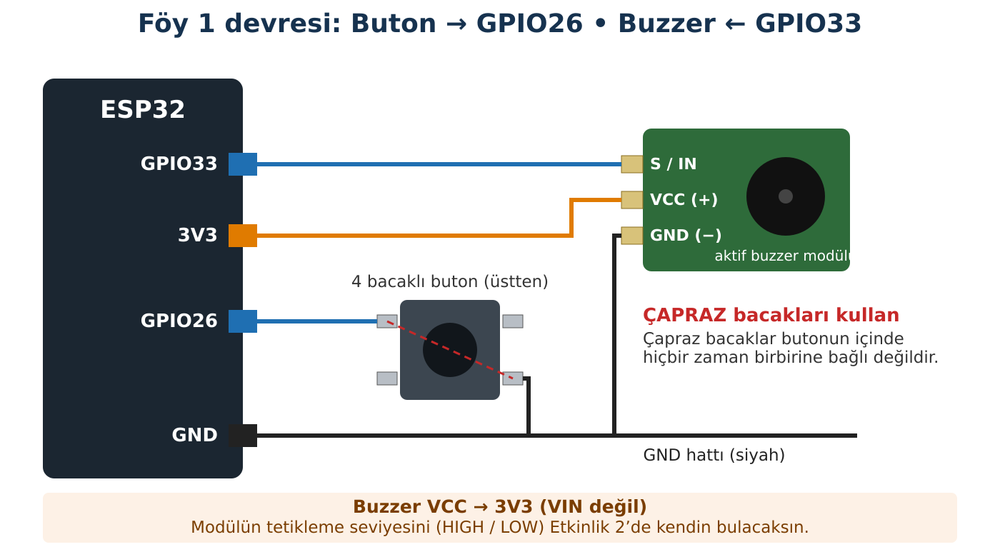

## Hedeflerim

Bu föyün sonunda:

- Bir GPIO pinini giriş ya da çıkış olarak ayarlayabilirim.
- Butona basınca neden **LOW** okunduğunu devre üzerinden açıklayabilirim.
- Buzzer modülümün aktif-HIGH mı aktif-LOW mu olduğunu **deneyle** bulabilirim.
- if/else ile girişe göre çıkışı kontrol eden bir program yazabilirim.
- Buton sıçramasını gözlemleyip basit bir yöntemle giderebilirim.

## Malzemeler

| Malzeme | Adet | Not |
| --- | --- | --- |
| ESP32-WROOM-32 geliştirme kartı (30 pin, Type-C) | 1 |  |
| USB Type-C veri kablosu | 1 |  |
| 4 bacaklı tact buton (6×6 mm) | 1 |  |
| Aktif buzzer modülü (3 pinli: S/IN, VCC, GND) | 1 | Kit ve Sürüm Tablosu'ndaki model |
| Breadboard | 1 |  |
| Jumper kablo | 6 | Mümkünse 1 turuncu, 2 siyah |

## Kavram: Dijital Giriş ve Çıkış

**Dijital çıkışta** ESP32 bir pine HIGH (≈3,3 V) ya da LOW (≈0 V) uygular; bunu Föy 0'da ölçtün. **Dijital girişte** ise tersini yapar: pindeki gerilime bakar ve onu HIGH ya da LOW olarak **okur**.

Sorun şu: Buton serbestken pin hiçbir yere bağlı değildir. Böyle bir pine **boşta pin** denir. Boştaki pin, çevredeki elektriksel gürültüden ve hatta parmağının yaklaşmasından etkilenir; ESP32 bazen HIGH, bazen LOW okur. Bunu önlemek için pini bir dirençle 3,3 V'a bağlarız. Bu dirence **pull-up direnci** denir. ESP32'nin içinde böyle bir direnç hazır bulunur; **INPUT_PULLUP** onu açar.

| Buton | Devrede ne oluyor? | Pinin gerilimi | ESP32 okur |
| --- | --- | --- | --- |
| Serbest | Pin yalnız pull-up direnci üzerinden 3,3 V'a bağlı; akım yolu yok. | ≈ 3,3 V | HIGH |
| Basılı | Buton pini doğrudan GND'ye bağlar; akım direnç üzerinden GND'ye akar. | ≈ 0 V | LOW |

Bu yüzden bu föyde **"LOW = basıldı"** anlamına gelir. Buna **aktif-LOW** mantık denir. İlk bakışta ters görünür ama devreyi düşününce çok mantıklıdır.

:::fen[Fen bağlantısı: Kapalı devre ve Ohm yasası]
Butona basınca devre kapanır: 3,3 V → pull-up direnci → pin → buton → GND. Bütün gerilim direncin üzerine düşer, pinde ≈ 0 V kalır. ESP32'nin iç pull-up direnci yaklaşık **45 kΩ**'dur (üretime göre değişir). Basılıyken akan akımı I = V / R ile hesaplayabilirsin (Kendimi Kontrol, soru 3). Bu kadar küçük bir akım, pull-up direncinin neden büyük seçildiğini de gösterir: amaç akım harcamak değil, pinin "boşta" kalmasını önlemektir.
:::

:::bilgi[Aktif buzzer, pasif buzzer]
**Aktif buzzer**'ın içinde titreşimi üreten bir devre vardır; gerilim verince kendi frekansında öter. **Pasif buzzer** ise hoparlör gibidir; ötmesi için pinin hızla açılıp kapanması (bir frekans) gerekir. Bu föyde **aktif** buzzer kullanıyoruz.

Hazır modüller iki tiptir: **aktif-HIGH** modül pin HIGH olunca, **aktif-LOW** modül pin LOW olunca öter. Hangisine sahip olduğunu Etkinlik 2'de bulacaksın.
:::

## Bağlantı



Çizim bir **şemadır**: ESP32 pinlerinin kart üzerindeki gerçek yerini Föy 0'daki haritadan bul.

| Eleman | Uç | Bağlandığı yer |
| --- | --- | --- |
| Buton | Sol üst bacak | GPIO26 |
| Buton | Sağ alt bacak (çapraz) | GND |
| Buzzer modülü | S / IN | GPIO33 |
| Buzzer modülü | VCC (+) | **3V3** |
| Buzzer modülü | GND (−) | GND |

1. USB kablosunun **çıkık** olduğundan emin ol.
2. Butonu breadboard'un ortasındaki boşluğun **üzerine** yerleştir; bacakların ikisi boşluğun bir tarafında, ikisi diğer tarafında kalsın.
3. Butonun bir bacağını GPIO26'ya, **çapraz** karşısındaki bacağı GND'ye bağla.
4. Buzzer modülünün S/IN ucunu GPIO33'e, VCC'yi **3V3**'e, GND'yi GND'ye bağla.

:::dikkat[Güç kutusu]
**Besleme:** Buzzer modülü ESP32'nin **3V3** pininden beslenir; VIN (5 V) kullanılmaz.

**Neden?** Modülün S/IN ucu doğrudan ESP32 pinine bağlıdır. Modül 3,3 V ile beslenince bu uçta 3,3 V'tan yüksek gerilim oluşamaz. Modül 5 V ile beslenseydi, bazı modül tiplerinde pine 3,3 V'tan yüksek gerilim gelebilir ve buzzer hiç susmayabilirdi.

**Buton:** Butonda harici besleme yok; pin iç pull-up direnciyle 3,3 V'a bağlanır.

**GND:** Buton ve modül aynı GND hattını kullanır.
:::

:::rutin[Bağladın mı?]
USB'yi takmadan önce **R2 Güç Kontrol Rutini**'ni uygula.
:::

## Etkinlik 1 — Buton Pini Ne Okuyor?

### Tahminim

Kodu çalıştırmadan önce aşağıdaki tablonun "Tahminim" sütununu doldur.

```cpp title="Kod 1.1 — Foy1_ButonOku" start=1 dosya=Foy1_ButonOku
// FOY 1 - Etkinlik 1: Buton pini ne okuyor?
const int BUTON_PIN = 26;

void setup() {
  Serial.begin(115200);
  pinMode(BUTON_PIN, INPUT_PULLUP);
}

void loop() {
  int butonDurumu = digitalRead(BUTON_PIN);

  if (butonDurumu == HIGH) {
    Serial.println("GPIO26 = HIGH (1)");
  } else {
    Serial.println("GPIO26 = LOW  (0)");
  }

  delay(300);
}
```

### Kodun Mantığı

- **Satır 6:** Pini giriş yapar ve iç pull-up direncini açar. Bu satır olmasaydı pin boşta kalırdı.
- **Satır 10:** digitalRead() pindeki gerilime bakar; sonucu (HIGH ya da LOW) butonDurumu değişkenine koyar.
- **Satır 12–16:** Okunan değere göre Seri Monitör'e yazar. Bu kodda buzzer yok; önce yalnız **girişin** doğru çalıştığından emin oluyoruz.
- **Satır 18:** Seri Monitör'ün mesajlarla dolmaması için okumalar arasında 0,3 s bekler.

### Gözlem

| Durum | Tahminim (HIGH / LOW) | Seri Monitör'de gördüğüm |
| --- | --- | --- |
| Buton serbest |  |  |
| Butona basılı |  |  |

### Değiştir – Gözle

Satır 6'daki **INPUT_PULLUP** sözcüğünü **INPUT** yap ve kodu yeniden yükle. Butona dokunmadan birkaç saniye izle; sonra parmağını GPIO26 kablosuna yaklaştır.

| Değişiklik | Tahminim | Gözlemim | Açıklamam |
| --- | --- | --- | --- |
| INPUT_PULLUP → INPUT, buton serbest |  |  |  |
| Parmağımı kabloya yaklaştırdım |  |  |  |

:::bilgi
Denemeden sonra satır 6'yı yeniden **INPUT_PULLUP** yapmayı unutma.
:::

## Etkinlik 2 — Buzzer Modülümü Tanıyorum

Modülün pin HIGH olunca mı, LOW olunca mı öttüğünü bilmeden doğru kod yazamayız. Bu kod pini 2 saniye HIGH, 2 saniye LOW yapar. Sen de hangisinde öttüğünü dinle.

```cpp title="Kod 1.2 — Foy1_BuzzerTest" start=1 dosya=Foy1_BuzzerTest
// FOY 1 - Etkinlik 2: Buzzer modulumu taniyorum
const int BUZZER_PIN = 33;

void setup() {
  Serial.begin(115200);
  pinMode(BUZZER_PIN, OUTPUT);
}

void loop() {
  digitalWrite(BUZZER_PIN, HIGH);
  Serial.println("GPIO33 = HIGH  -> Buzzer otuyor mu?");
  delay(2000);

  digitalWrite(BUZZER_PIN, LOW);
  Serial.println("GPIO33 = LOW   -> Buzzer otuyor mu?");
  delay(2000);
}
```

| Seri Monitör mesajı | Buzzer ötüyor mu? |
| --- | --- |
| GPIO33 = HIGH | ☐ Evet   ☐ Hayır |
| GPIO33 = LOW | ☐ Evet   ☐ Hayır |

**Sonuç:** Benim modülüm   ☐ aktif-HIGH (HIGH'ta öter)   ☐ aktif-LOW (LOW'da öter)

:::dikkat[İki durumda da ötmüyorsa]
Bağlantıyı kontrol et (S/IN → GPIO33, VCC → 3V3, GND → GND). Hâlâ ötmüyorsa modülü **5 V'a taşıma**; öğretmenine haber ver.
:::

## Etkinlik 3 — Butona Bas, Sesi Duy

Artık girişi (Etkinlik 1) ve çıkışı (Etkinlik 2) ayrı ayrı tanıyorsun. Şimdi ikisini birleştiriyoruz.

```cpp title="Kod 1.3 — Foy1_ButonBuzzer" start=1 dosya=Foy1_ButonBuzzer
// FOY 1 - Etkinlik 3: Butona bas, sesi duy
const int BUTON_PIN = 26;
const int BUZZER_PIN = 33;

// Etkinlik 2'deki sonucuna gore doldur:
// Aktif-HIGH modul: ACIK = HIGH, KAPALI = LOW
// Aktif-LOW modul : ACIK = LOW,  KAPALI = HIGH
const int BUZZER_ACIK = HIGH;
const int BUZZER_KAPALI = LOW;

void setup() {
  pinMode(BUTON_PIN, INPUT_PULLUP);
  pinMode(BUZZER_PIN, OUTPUT);
  digitalWrite(BUZZER_PIN, BUZZER_KAPALI);   // sessiz basla
}

void loop() {
  int butonDurumu = digitalRead(BUTON_PIN);

  if (butonDurumu == LOW) {                  // butona basildi
    digitalWrite(BUZZER_PIN, BUZZER_ACIK);
  } else {                                   // buton serbest
    digitalWrite(BUZZER_PIN, BUZZER_KAPALI);
  }
}
```

:::rutin[Yüklemeden önce]
**Satır 8 ve 9**'u Etkinlik 2'deki sonucuna göre düzenle. Modülün aktif-LOW ise iki satırdaki HIGH ve LOW'u yer değiştir.
:::

### Kodun Mantığı

- **Satır 8–9:** "Açık" ve "kapalı"nın bu modülde hangi değere karşılık geldiğini tek yerde tanımlar. Modül değişirse yalnız bu iki satır değişir; programın geri kalanı aynı kalır.
- **Satır 14:** Program başlar başlamaz buzzer'ı **kapalı** konuma getirir. Bu satır olmasaydı aktif-LOW bir modül açılışta ötmeye başlayabilirdi.
- **Satır 20:** Etkinlik 1'de öğrendiğin gibi, basılı buton **LOW** okunur.
- **Satır 20–24:** if/else karar verir: basılıysa aç, değilse kapat. loop() bu kararı saniyede binlerce kez tekrar eder.

### Gözlem

| Durum | Tahminim | Gözlemim |
| --- | --- | --- |
| Butona basılmadı |  |  |
| Butona basıldı |  |  |
| Buton 5 saniye basılı tutuldu |  |  |

**Tartış:** Satır 20'deki LOW'u HIGH yaparsan ne olur? Önce tahmin et, sonra dene ve açıkla.

::yaz{satir=3}

## Deney — Kaç Kez Bastım?

Butona bir kez basınca ESP32 kaç "basma" görür? Cevap şaşırtıcı olabilir. Bu kod, butonun **durumunun değiştiği anları** sayar.

```cpp title="Kod 1.4 — Foy1_BasmaSayaci" start=1 dosya=Foy1_BasmaSayaci
// FOY 1 - Deney: Kac kez bastim?
const int BUTON_PIN = 26;

int oncekiDurum = HIGH;   // buton baslangicta serbest
int basmaSayisi = 0;

void setup() {
  Serial.begin(115200);
  pinMode(BUTON_PIN, INPUT_PULLUP);
}

void loop() {
  int simdikiDurum = digitalRead(BUTON_PIN);

  if (simdikiDurum != oncekiDurum) {   // durum degisti mi?
    if (simdikiDurum == LOW) {         // degisim bir "basma" mi?
      basmaSayisi++;
      Serial.print("Basma sayisi: ");
      Serial.println(basmaSayisi);
    }
    // delay(30);   // Deney 2: bu satirin basindaki // isaretini sil
  }

  oncekiDurum = simdikiDurum;
}
```

### Kodun Mantığı

- **Satır 4:** oncekiDurum, bir önceki okumayı **hatırlar**. loop() her döndüğünde yeni okumayı bununla karşılaştırırız.
- **Satır 15:** Yeni okuma öncekinden farklıysa buton ya basılmış ya da bırakılmıştır.
- **Satır 16–17:** Değişim LOW yönündeyse bu bir **basma**dır; sayaç bir artar. Bırakma sayılmaz.
- **Satır 24:** Şimdiki okuma, bir sonraki tur için "önceki" olur.

### Deney 1 — Olduğu gibi

Butona tam **10 kez**, her seferinde net bir şekilde bas. Seri Monitör'deki son sayıyı yaz. Deneyi 3 kez tekrarla (her seferinde EN'e basıp sayacı sıfırla).

### Deney 2 — Bekleme ekli

**Satır 21**'in başındaki // işaretini sil, kodu yeniden yükle ve aynı deneyi tekrarla.

|  | Tahminim | 1. deneme | 2. deneme | 3. deneme |
| --- | --- | --- | --- | --- |
| Deney 1: 10 basışta sayılan |  |  |  |  |
| Deney 2: 10 basışta sayılan |  |  |  |  |

:::fen[Fen bağlantısı: Buton neden "sekiyor"?]
Butonun içindeki metal kontaklar birbirine çarptığında hemen oturmaz; esnek oldukları için çok kısa bir süre birkaç kez değip ayrılırlar. Bu süre genellikle birkaç milisaniyedir; insan fark edemez. Ama ESP32 pini saniyede binlerce kez okuduğu için her sekmeyi ayrı bir basma sanabilir. Buna **buton sıçraması** denir. Durum değiştikten sonra kısa bir süre (burada 30 ms) beklemek sekmelerin bitmesine izin verir.

Butonunda Deney 1'de hiç fazla sayım görmediysen bu da geçerli bir sonuçtur: sıçrama butona ve basış biçimine göre değişir. Sınıftaki diğer grupların sonuçlarıyla karşılaştır.
:::

**Sonuç:** Deney 1 ile Deney 2'nin sonuçları arasında fark var mı? Tek bir cümleyle nedenini açıkla.

::yaz{satir=2}

## Hata Avcısı

| Belirti | Olası neden | Ne yaparım? |
| --- | --- | --- |
| Buzzer butona basılmadan sürekli ötüyor | (a) Buton bacakları aynı çiftte, pin hep GND'de  (b) Modül aktif-LOW ama kod aktif-HIGH'a göre ayarlı | Önce Kod 1.1 ile butonu, sonra Kod 1.2 ile buzzer'ı **ayrı ayrı** test et. Hangisi yanlışsa onu düzelt. |
| Seri Monitör buton serbestken bile LOW gösteriyor | Buton yanlış bacaklardan bağlı ya da pin GND'ye değiyor | Çapraz bacak kuralını kontrol et; butonu breadboard boşluğunun üzerine yerleştir. |
| Seri Monitör rastgele HIGH/LOW gösteriyor | INPUT_PULLUP yok, pin boşta | Kod 1.1 satır 6'yı kontrol et. |
| Buzzer hiç ötmüyor | S/IN, VCC ya da GND bağlantısı; yanlış GPIO | Kod 1.2 ile tek başına test et; bağlantı tablosunu satır satır karşılaştır. |
| Basma sayacı bir basışta 2–3 artıyor | Buton sıçraması | Deney 2'deki beklemeyi ekle. |
| Kod yüklenmiyor | Kart, port, kablo | R1 Yükleme Rutini. |

### Bilerek hatalı kod

Aktif-HIGH buzzer modülü olan bir öğrenci aşağıdaki kodu yükledi. Kod **hatasız derleniyor**, ama butona ne yaparsa yapsın buzzer **hiç ötmüyor**. Kablolar doğru; Kod 1.1 ve Kod 1.2 ayrı ayrı çalışıyor.

```cpp title="Kod 1.5 — Foy1_Hatali" start=1 dosya=Foy1_Hatali
// FOY 1 - Hata Avcisi: Bu kodda bilerek birakilmis bir hata var!
const int BUTON_PIN = 26;
const int BUZZER_PIN = 33;

void setup() {
  pinMode(BUTON_PIN, INPUT_PULLUP);
  pinMode(BUZZER_PIN, OUTPUT);
  digitalWrite(BUZZER_PIN, LOW);
}

void loop() {
  int butonDurumu = digitalRead(BUTON_PIN);

  if (butonDurumu = LOW) {
    digitalWrite(BUZZER_PIN, HIGH);
  } else {
    digitalWrite(BUZZER_PIN, LOW);
  }
}
```

**Hata:** Hangi satırda, hangi karakter yanlış? = ile == arasındaki farkı kullanarak buzzer'ın neden hiç ötmediğini açıkla.

::yaz{satir=3}

:::bilgi[İpucu]
Arduino IDE'de **Dosya → Tercihler → Derleyici uyarıları: Tümü** seçersen derleyici bu satır için bir uyarı verir. Uyarılar, hata olmasalar da okunmaya değerdir.
:::

## Şimdi Sıra Sende

- [ ] **Görev (herkes):** Butona bir kez basıldığında buzzer kısa aralıklarla **üç kez** ötsün, sonra sussun. Önce algoritmayı sözcüklerle yaz, sonra kodla. Hangi kodu temel alacağına da karar ver: Kod 1.3 mü, Kod 1.4 mü?

::yaz[Algoritmam:]{satir=4}

- [ ] **★ Görev — Aç/kapa anahtarı:** Her basışta buzzer'ın durumu değişsin: bir bas → öter, bir daha bas → susar. (İpucu: Kod 1.4'teki "basma anı" nerede yakalanıyor? Orada buzzer'ın durumunu tersine çevir. Deney 2'deki beklemeyi unutma.)

::yaz[Hangi satırları değiştirdim / ekledim?]{satir=3}

- [ ] **★★ Görev — Şifreli kapı:** Butona art arda tam **3 kez** basılınca buzzer 1 saniye ötsün ve sayaç sıfırlansın. Kod 1.4'teki sayacı kullan.

::yaz[Çözümümü nasıl test ettim? (En az iki farklı durum yaz)]{satir=3}

## YZ ile Destek Al

:::yz[Örnek istem]
"ESP32'de INPUT_PULLUP kullanıyorum ve butona basınca LOW okuyorum. Nedenini, bir su borusu benzetmesiyle ve en fazla 6 cümleyle açıkla. Kod yazma. Açıklamanın sonunda anlayıp anlamadığımı kontrol etmek için bana bir soru sor."
:::

### YZ cevabını nasıl doğruladım?

|  |  |
| --- | --- |
| YZ'nin açıklamasındaki ana fikir: |  |
| Bu fikir Etkinlik 1'deki gözlemimle uyuşuyor mu? |  |
| Benzetmenin eksik kaldığı bir yer var mı? |  |

## Kendimi Kontrol Ediyorum

**1.** Buzzer butona basılmadan sürekli ötüyor. Bunun iki farklı nedeni olabilir. Bu föydeki hangi kodları kullanarak hangisi olduğunu bulursun?

::yaz{satir=3}

**2.** Bir arkadaşın satır 6'da INPUT_PULLUP yerine INPUT yazmış. Programı "bazen çalışıyor" diyor. Ona durumu nasıl açıklarsın?

::yaz{satir=3}

**3.** İç pull-up direnci yaklaşık 45 kΩ ise, butona basılıyken bu dirençten geçen akım yaklaşık kaç mA'dir? İşlemini göster.

::yaz{satir=2}

**4.** Kod 1.3'te modül değiştiğinde yalnız satır 8 ve 9'u değiştirmek yetiyor. Bu şekilde yazmanın faydası nedir?

::yaz{satir=2}

**5.** Basma sayacı bir basışta 3 arttı. Nedeni nedir, nasıl çözdün?

::yaz{satir=2}

### Öz değerlendirme

- [ ] Butona basınca neden LOW okunduğunu açıklayabiliyorum.
- [ ] Buzzer modülümün tipini deneyle bulabiliyorum.
- [ ] Girişe göre çıkışı kontrol eden if/else yazabiliyorum.
- [ ] Bir sorunu, parçaları ayrı ayrı test ederek bulabiliyorum.
- [ ] Buton sıçramasını açıklayıp giderebiliyorum.
