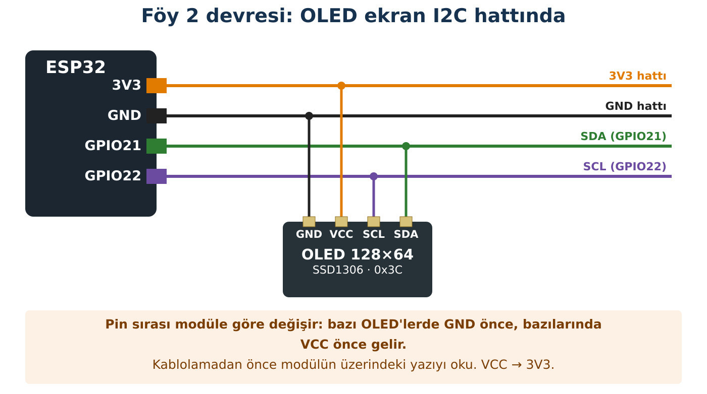

## Hedeflerim

Bu föyün sonunda:

- I2C hattının iki telinin (SDA, SCL) görevini açıklayabilirim.
- I2C tarayıcıyla bir modülün adresini bulabilirim.
- OLED ekranda istediğim yere, istediğim boyutta yazı yazabilirim.
- Ekran belleği ile gerçek ekran arasındaki farkı deneyle gösterebilirim.

## Malzemeler

| Malzeme | Adet | Not |
| --- | --- | --- |
| ESP32 geliştirme kartı + USB veri kablosu | 1 |  |
| OLED ekran 0,96" 128×64, I2C (4 pinli) | 1 | Sürücü çipi: Kit ve Sürüm Tablosu |
| Breadboard | 1 |  |
| Jumper kablo | 4 | Turuncu, siyah, yeşil, mor önerilir |

## Kavram: I2C Nedir?

I2C, birçok modülün yalnız **iki haberleşme teliyle** ESP32'ye bağlanmasını sağlayan bir haberleşme yöntemidir. **SCL** (saat) hattında ESP32 "tık-tık" diye bir ritim üretir; **SDA** (veri) hattında bilgiler bu ritimle bit bit taşınır. Aynı iki tele birden fazla modül bağlanabilir; her modülün bir **adresi** vardır. ESP32 bir adresi çağırdığında yalnız o adresteki modül cevap verir; bir sınıfta yoklama yapmaya benzer.

| Hat | Sınıf pini | Görevi |
| --- | --- | --- |
| SDA | GPIO21 | Veri |
| SCL | GPIO22 | Saat (ritim) |
| VCC | 3V3 | Besleme |
| GND | GND | Ortak toprak |

:::fen[Fen bağlantısı: OLED kendi ışığını üretir]
OLED, **organik ışık yayan diyot** demektir. Her piksel küçük bir ışık kaynağıdır; ekranın arkasında ayrı bir ışık yoktur. Siyah görünen piksel gerçekten **ışık yaymıyordur**. Bu yüzden karanlık odada siyah zemin tamamen kararır ve ekran az enerji harcar.
:::

## Bağlantı



| OLED pini | ESP32 |
| --- | --- |
| VCC | 3V3 |
| GND | GND |
| SDA | GPIO21 |
| SCL | GPIO22 |

:::dikkat[Güç kutusu]
**Besleme:** OLED → **3V3**.

**Dikkat:** OLED modüllerinin bir kısmında pin sırası GND-VCC-SCL-SDA, bir kısmında VCC-GND-SCL-SDA'dır. Çizimi değil, **modülün üzerindeki yazıyı** esas al. VCC ile GND'yi ters bağlamak modülü bozabilir.
:::

:::rutin[Bağladın mı?]
USB'yi takmadan önce **R2 Güç Kontrol Rutini**'ni uygula.
:::

## Etkinlik 1 — Kim Var Orada? (I2C Tarayıcı)

::yaz[Tahminim: Tarayıcı … cihaz bulacak. OLED'in adresi 0x… olabilir (arkasındaki yazıya bak).]{satir=1}

```cpp title="Kod 2.1 — Foy2_I2C_Tarayici" start=1 dosya=Foy2_I2C_Tarayici
// FOY 2 - Kod 2.1: I2C tarayici
#include <Wire.h>

const int SDA_PIN = 21;
const int SCL_PIN = 22;

void setup() {
  Serial.begin(115200);
  Wire.begin(SDA_PIN, SCL_PIN);
  Serial.println("I2C taramasi basliyor...");
}

void loop() {
  int bulunan = 0;

  for (int adres = 1; adres < 127; adres++) {
    Wire.beginTransmission(adres);          // bu adresin "kapisini cal"
    int cevap = Wire.endTransmission();     // 0 = cihaz cevap verdi

    if (cevap == 0) {
      Serial.print("Cihaz bulundu: 0x");
      if (adres < 16) Serial.print("0");
      Serial.println(adres, HEX);
      bulunan++;
    }
  }

  Serial.print("Toplam cihaz: ");
  Serial.println(bulunan);
  Serial.println("--------------------");
  delay(3000);
}
```

### Kodun Mantığı

- **Satır 9:** I2C hattını GPIO21 (SDA) ve GPIO22 (SCL) ile başlatır.
- **Satır 16:** 1'den 126'ya kadar bütün adresleri sırayla dener.
- **Satır 17–18:** Adresin "kapısını çalar". Modül cevap verirse endTransmission() **0** döndürür.
- **Satır 23:** Adresi 16'lık (HEX) sayı olarak yazar. Modül üzerindeki yazılar da genellikle HEX'tir: 0x3C = 60.

|  | Tahminim | Gözlemim |
| --- | --- | --- |
| Bulunan cihaz sayısı |  |  |
| OLED adresi |  |  |

### Değiştir – Gözle

USB'yi çıkar, SDA ve SCL kablolarının **yerini değiştir**, tekrar tak. (Bu deney modüle zarar vermez.) Sonra kabloları düzelt.

| Değişiklik | Tahminim | Gözlemim | Açıklamam |
| --- | --- | --- | --- |
| SDA ↔ SCL yer değiştirdi |  |  |  |

## Etkinlik 2 — Ekrana İlk Yazı

Kütüphane Yöneticisi'nden **Adafruit SSD1306** kütüphanesini kur; "bağımlılıkları da kur" sorusuna **Evet** de (Adafruit GFX ve BusIO gelir).

:::dikkat[Ekranın farklıysa]
Ekranın 1,3" büyüklüğündeyse ya da bu kodla karışık noktalar görüyorsan, modülün sürücü çipi SH1106 olabilir. Kodu değiştirmeden öğretmenine haber ver.
:::

```cpp title="Kod 2.2 — Foy2_OLED_Merhaba" start=1 dosya=Foy2_OLED_Merhaba
// FOY 2 - Kod 2.2: OLED'e ilk yazi
#include <Wire.h>
#include <Adafruit_GFX.h>
#include <Adafruit_SSD1306.h>

const int OLED_ADRES = 0x3C;   // Kod 2.1'de buldugun adresi yaz

Adafruit_SSD1306 ekran(128, 64, &Wire, -1);   // genislik, yukseklik

void setup() {
  Serial.begin(115200);
  Wire.begin(21, 22);

  if (!ekran.begin(SSD1306_SWITCHCAPVCC, OLED_ADRES)) {
    Serial.println("HATA: OLED baslatilamadi. R3 I2C Kontrol Rutini'ni uygula.");
    while (true) delay(100);
  }

  ekran.clearDisplay();                 // ekran bellegini temizle
  ekran.setTextColor(SSD1306_WHITE);

  ekran.setTextSize(1);
  ekran.setCursor(0, 0);
  ekran.println("ROBOT KULUBU");

  ekran.setTextSize(2);
  ekran.setCursor(0, 24);
  ekran.println("ESP32");

  ekran.display();                      // bellegi gercek ekrana gonder
  Serial.println("OLED hazir.");
}

void loop() {
}
```

### Kodun Mantığı

- **Satır 6:** Etkinlik 1'de bulduğun adres buraya yazılır.
- **Satır 8:** 128×64 piksellik bir ekran nesnesi oluşturur; adı **ekran**.
- **Satır 19:** ESP32'nin içindeki **ekran belleğini** temizler. Bu satır ekranı henüz değiştirmez.
- **Satır 27:** Yazının başlayacağı noktayı seçer: x = 0 (sol kenar), y = 24 piksel aşağı. Koordinatlar **sol üst köşeden** başlar.
- **Satır 30:** Bellekte hazırlanan görüntüyü gerçek ekrana gönderir. Bütün çizimler ancak bu satırla görünür.

:::bilgi[Kaç harf sığar?]
Yazı boyutu 1 iken bir harf **6 piksel** genişliğinde, **8 piksel** yüksekliğindedir. Boyut 2 iken her şey iki katıdır.
:::

:::bilgi[OLED'de Türkçe harf]
OLED kütüphanesinin varsayılan yazı tipinde ç, ğ, ı, ö, ş, ü ve İ yoktur; bu harfleri yazarsan ekranda bozuk karakterler görürsün. Ekrana yazacağın metinlerde ASCII karşılıklarını kullan: ç→c, ğ→g, ı→i, İ→I, ö→o, ş→s, ü→u.
:::

| Soru | Hesabım / tahminim | Denediğimde |
| --- | --- | --- |
| Boyut 1'de bir satıra kaç harf sığar? (128 ÷ 6) |  |  |
| Boyut 2'de kaç harf sığar? |  |  |
| setCursor(0, 60) yaparsam ne olur? |  |  |

## Etkinlik 3 — Canlı Sayaç ve Ekran Belleği

```cpp title="Kod 2.3 — Foy2_OLED_Sayac" start=1 dosya=Foy2_OLED_Sayac
// FOY 2 - Kod 2.3: Canli sayac
#include <Wire.h>
#include <Adafruit_GFX.h>
#include <Adafruit_SSD1306.h>

const int OLED_ADRES = 0x3C;
Adafruit_SSD1306 ekran(128, 64, &Wire, -1);

void setup() {
  Serial.begin(115200);
  Wire.begin(21, 22);
  if (!ekran.begin(SSD1306_SWITCHCAPVCC, OLED_ADRES)) {
    Serial.println("HATA: OLED baslatilamadi. R3 I2C Kontrol Rutini'ni uygula.");
    while (true) delay(100);
  }
  ekran.setTextColor(SSD1306_WHITE);
}

void loop() {
  unsigned long saniye = millis() / 1000;

  ekran.clearDisplay();              // Deney: bu satirin basina // koy
  ekran.setTextSize(1);
  ekran.setCursor(0, 0);
  ekran.println("Acik kalma suresi");
  ekran.setTextSize(3);
  ekran.setCursor(0, 24);
  ekran.print(saniye);
  ekran.print(" s");
  ekran.display();

  delay(200);
}
```

### Kodun Mantığı

- **Satır 20:** Föy 0'daki millis() ile açılıştan beri geçen saniyeyi hesaplar.
- **Satır 22:** Her turda belleği temizler, sonra yeni sayıyı çizer.
- **Satır 30:** Yeni görüntüyü ekrana gönderir; saniyede 5 kez tekrarlanır.

### Deney

Satır 22'ün başına // koyarak bu satırı devre dışı bırak ve kodu yükle.

| Değişiklik | Tahminim | Gözlemim | Açıklamam |
| --- | --- | --- | --- |
| clearDisplay() devre dışı |  |  |  |

## Hata Avcısı

| Belirti | Olası neden | Ne yaparım? |
| --- | --- | --- |
| Tarayıcı "Toplam cihaz: 0" diyor | VCC/GND, SDA/SCL yer değiştirmiş, gevşek kablo | R3 I2C Kontrol Rutini. |
| "HATA: OLED baslatilamadi" | Koddaki adres, taranan adresle aynı değil | Koddaki OLED_ADRES sabitini tarayıcının bulduğu adresle değiştir. |
| Ekran karışık noktalarla dolu ya da 2 piksel kaymış | Sürücü çipi SH1106 olabilir | Öğretmene haber ver. |
| Derleme hatası: Adafruit_SSD1306.h bulunamadı | Kütüphane kurulmamış | Etkinlik 2'deki kurulumu yap. |
| Yazının bir kısmı görünmüyor | Yazı ekranın dışına taşıyor | setCursor ve yazı boyutunu hesapla. |

### Bilerek hatalı kod

Kod hatasız derleniyor, Seri Monitör "Yazi ekrana gonderildi." diyor ama **ekran boş**. Tarayıcı OLED'i buluyor.

```cpp title="Kod 2.4 — Foy2_Hatali" start=1 dosya=Foy2_Hatali
// FOY 2 - Hata Avcisi: Bu kodda bilerek birakilmis bir hata var!
#include <Wire.h>
#include <Adafruit_GFX.h>
#include <Adafruit_SSD1306.h>

Adafruit_SSD1306 ekran(128, 64, &Wire, -1);

void setup() {
  Serial.begin(115200);
  Wire.begin(21, 22);
  if (!ekran.begin(SSD1306_SWITCHCAPVCC, 0x3C)) {
    Serial.println("HATA: OLED baslatilamadi.");
    while (true) delay(100);
  }
  ekran.clearDisplay();
  ekran.setTextColor(SSD1306_WHITE);
  ekran.setTextSize(2);
  ekran.setCursor(0, 0);
  ekran.println("MERHABA");
  Serial.println("Yazi ekrana gonderildi.");
}

void loop() {
}
```

**Hata:** Eksik olan ne? Kodun hangi satırından sonra ne eklersin? Kodun Mantığı'ndaki "bellek – ekran" farkını kullanarak açıkla.

::yaz{satir=3}

## Şimdi Sıra Sende

- [ ] **Görev (herkes):** "Robot kulübü kimlik kartı": üst satırda adın (boyut 2), altta grubun (boyut 1).
- [ ] **★ Görev:** Adını ekranda **yatay olarak ortala**. İpucu: yazının piksel genişliği = harf sayısı × 6 × boyut. x = (128 − genişlik) ÷ 2. Adında Türkçe harf varsa yukarıdaki kutudaki gibi ASCII karşılığıyla yaz.

::yaz[Hesabım:]{satir=2}

- [ ] **★★ Görev:** Föy 1'deki buton sayacını ekrana taşı: her basışta ekrandaki sayı artsın ve altında sayıya göre uzayan bir çubuk (ekran.fillRect) çizilsin.

## YZ ile Destek Al

:::yz[Örnek istem]
"I2C tarayıcı kodumda Wire.endTransmission() fonksiyonunun 0 döndürmesi ne anlama geliyor? Bir sınıfta yoklama benzetmesiyle 5 cümlede açıkla. Kod yazma."
:::

### YZ cevabını nasıl doğruladım?

::yaz[YZ'nin açıklamasındaki ana fikir:]{satir=2}

::yaz[Tarayıcı deneyimde bunu nasıl gördüm?]{satir=2}

::yaz[YZ'nin söylediği bir şey gözlemimle çelişti mi?]{satir=2}

## Kendimi Kontrol Ediyorum

**1.** Tarayıcı hiç cihaz bulamadı. Hangi üç şeyi hangi sırayla kontrol edersin?

::yaz{satir=3}

**2.** Aynı SDA/SCL hattına iki modül bağlarsak ESP32 onları nasıl ayırt eder? Aynı adresli iki modül olursa ne olur sence?

::yaz{satir=3}

**3.** clearDisplay() olmadan sayaç neden okunmaz hâle geldi?

::yaz{satir=2}

**4.** Boyut 3'te "ROBOT" yazısı kaç piksel genişliğinde olur? Ekrana sığar mı?

::yaz{satir=2}

### Öz değerlendirme

- [ ] I2C tarayıcıyla bir modülün adresini bulabiliyorum.
- [ ] OLED'de istediğim yere yazı yazabiliyorum.
- [ ] Ekran belleği ile ekran arasındaki farkı açıklayabiliyorum.
- [ ] "Ekran boş" sorununu adım adım çözebiliyorum.
