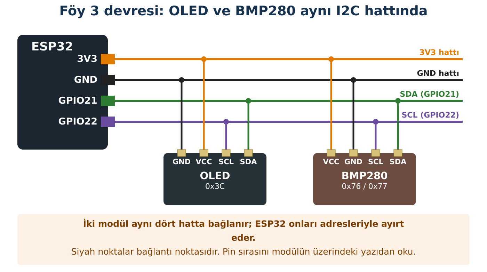

## Hedeflerim

Bu föyün sonunda:

- BMP280'in hangi büyüklükleri ölçtüğünü ve ölçmediğini söyleyebilirim.
- İki modülü aynı I2C hattında çalıştırabilirim.
- Pa ile hPa arasında dönüşüm yapabilirim.
- Ölçüm gürültüsünü gerçek bir değişimden ayırabilirim.

## Malzemeler

| Malzeme | Adet | Not |
| --- | --- | --- |
| ESP32 + USB kablo | 1 |  |
| BMP280 modülü (I2C) | 1 | Çip: Kit ve Sürüm Tablosu |
| OLED ekran (Föy 2) | 1 | Takılı kalır |
| Breadboard, jumper | yeteri kadar |  |

## Kavram: Basınç ve Sıcaklık

**Basınç**, bir yüzeye etki eden kuvvetin o yüzeyin alanına oranıdır: P = F / A. Birimi pascal (Pa): 1 m²'ye 1 N'luk kuvvet. Havanın ağırlığı da üzerimizdeki her yüzeye kuvvet uygular; buna **atmosfer basıncı** denir. Deniz seviyesinde yaklaşık 101 325 Pa'dır. Bu büyük sayı yerine **hektopascal** kullanırız: **1 hPa = 100 Pa**, yani deniz seviyesinde ≈ 1013 hPa.

:::fen[Fen bağlantısı: Yükseldikçe basınç azalır]
Yükseğe çıktıkça üstümüzde kalan hava azalır, basınç düşer. Deniz seviyesine yakın yerlerde yaklaşık **her 8 metrede 1 hPa** azalır.

Hava durumu uygulamaları, farklı şehirleri karşılaştırabilmek için basıncı **deniz seviyesine indirgenmiş** olarak verir. Okulun yüksekteyse senin ölçtüğün değer uygulamadakinden belirgin şekilde düşük çıkar. Bu, sensörün bozuk olduğu anlamına **gelmez**.
:::

:::bilgi[Bilimsel not]
BMP280 **sıcaklık** ve **basınç** ölçer. Nem, yağmur ya da rüzgâr ölçmez. Yüksekliği de doğrudan ölçmez; yalnız basınçtan **tahmin** eder.
:::

## Bağlantı



:::dikkat[Güç kutusu]
**Besleme:** BMP280 → **3V3** (OLED ile aynı hat).

BMP280'in bazı modüllerinde 6 pin bulunur (CSB, SDO). Bunlar boş kalır; SDO'nun durumu adresi belirler (0x76 ya da 0x77).
:::

:::rutin[Bağladın mı?]
USB'yi takmadan önce **R2 Güç Kontrol Rutini**'ni uygula.
:::

## Etkinlik 1 — İki Adres

Föy 2'deki **Kod 2.1** tarayıcıyı yeniden çalıştır.

|  | Tahminim | Gözlemim |
| --- | --- | --- |
| Bulunan cihaz sayısı |  |  |
| OLED adresi |  |  |
| BMP280 adresi |  |  |

## Etkinlik 2 — İlk Ölçüm

Kütüphane Yöneticisi'nden **Adafruit BMP280 Library**'yi kur (bağımlılıklarla).

```cpp title="Kod 3.1 — Foy3_BMP_Seri" start=1 dosya=Foy3_BMP_Seri
// FOY 3 - Kod 3.1: Sicaklik ve basinc olcumu
#include <Wire.h>
#include <Adafruit_BMP280.h>

Adafruit_BMP280 bmp;

void setup() {
  Serial.begin(115200);
  Wire.begin(21, 22);

  bool bulundu = bmp.begin(0x76);            // cogu modul 0x76 kullanir
  if (!bulundu) bulundu = bmp.begin(0x77);   // bazilari 0x77

  if (!bulundu) {
    Serial.println("HATA: BMP280 bulunamadi. R3'u uygula; cip farkli olabilir.");
    while (true) delay(100);
  }
  Serial.println("BMP280 hazir.");
}

void loop() {
  float sicaklik = bmp.readTemperature();    // santigrat derece
  float basincPa = bmp.readPressure();       // pascal (Pa)
  float basincHpa = basincPa / 100.0;        // 1 hPa = 100 Pa

  Serial.print("Sicaklik: ");
  Serial.print(sicaklik, 2);
  Serial.print(" C   Basinc: ");
  Serial.print(basincHpa, 2);
  Serial.println(" hPa");

  delay(2000);
}
```

### Kodun Mantığı

- **Satır 11–12:** Önce 0x76'yı, olmazsa 0x77'yi dener. Böylece iki modül türünde de çalışır.
- **Satır 14:** R4 kuralı: sensör yoksa sessizce durmaz, sebebini yazar.
- **Satır 23–24:** Sensör pascal verir; 100'e bölerek hPa'ya çeviririz.

::yaz[Tahminim: Sınıfta sıcaklık … °C, basınç … hPa ölçülecek.]{satir=1}

## Etkinlik 3 — OLED'de Göster

```cpp title="Kod 3.2 — Foy3_BMP_OLED" start=1 dosya=Foy3_BMP_OLED
// FOY 3 - Kod 3.2: Mini hava istasyonu (OLED)
#include <Wire.h>
#include <Adafruit_GFX.h>
#include <Adafruit_SSD1306.h>
#include <Adafruit_BMP280.h>

Adafruit_SSD1306 ekran(128, 64, &Wire, -1);
Adafruit_BMP280 bmp;

void setup() {
  Serial.begin(115200);
  Wire.begin(21, 22);

  if (!ekran.begin(SSD1306_SWITCHCAPVCC, 0x3C)) {
    Serial.println("HATA: OLED baslatilamadi.");
    while (true) delay(100);
  }
  bool bulundu = bmp.begin(0x76);
  if (!bulundu) bulundu = bmp.begin(0x77);
  if (!bulundu) {
    Serial.println("HATA: BMP280 bulunamadi.");
    while (true) delay(100);
  }
  ekran.setTextColor(SSD1306_WHITE);
}

void loop() {
  float sicaklik = bmp.readTemperature();
  float basinc = bmp.readPressure() / 100.0;

  ekran.clearDisplay();
  ekran.setTextSize(1);
  ekran.setCursor(0, 0);
  ekran.println("MINI HAVA ISTASYONU");

  ekran.setTextSize(2);
  ekran.setCursor(0, 18);
  ekran.print(sicaklik, 1);
  ekran.println(" C");
  ekran.setCursor(0, 42);
  ekran.print(basinc, 0);
  ekran.println(" hPa");
  ekran.display();

  delay(2000);
}
```

### Kodun Mantığı

- **Satır 7–8:** İki modül, aynı Wire (I2C) hattını kullanan iki ayrı nesnedir.
- **Satır 41:** Basıncı ondalıksız gösterir; ekranda yer kazanmak için.

## Deney — Gürültü mü, Gerçek Değişim mi?

Her ölçüm aracının değerleri biraz oynar; buna **gürültü** denir. Gerçek bir değişimi görebilmek için önce gürültünün ne kadar olduğunu bilmeliyiz.

**Adım 1:** Sensöre dokunmadan Seri Monitör'deki (Kod 3.1) 10 ardışık ölçümü yaz. En büyük ile en küçük arasındaki fark, gürültü bandıdır.

| Ölçüm | 1 | 2 | 3 | 4 | 5 | 6 | 7 | 8 | 9 | 10 |
| --- | --- | --- | --- | --- | --- | --- | --- | --- | --- | --- |
| T (°C) |  |  |  |  |  |  |  |  |  |  |
| P (hPa) |  |  |  |  |  |  |  |  |  |  |

|  | En büyük | En küçük | Gürültü bandı (fark) |
| --- | --- | --- | --- |
| Sıcaklık |  |  |  |
| Basınç |  |  |  |

**Adım 2:** Sensörü 30 saniye parmaklarının arasında tut (elektronik parçalara değmeden, modülü kenarından), sonra bırak.

|  | Tahminim | Gözlemim | Gürültü bandından büyük mü? |
| --- | --- | --- | --- |
| Sıcaklık değişimi |  |  |  |
| Basınç değişimi |  |  |  |

**Adım 3:** Telefondaki hava durumu uygulamasındaki basıncı yaz: … hPa. Ölçümünle farkı: … hPa. Bu farkı Fen bağlantısı kutusunu kullanarak açıkla.

## Hata Avcısı

| Belirti | Olası neden | Ne yaparım? |
| --- | --- | --- |
| "HATA: BMP280 bulunamadi" ama tarayıcı 0x76/0x77'de cihaz görüyor | Modül BMP280 değil, BME280 olabilir | Öğretmene haber ver. |
| Tarayıcı yalnız OLED'i görüyor | BMP280 bağlantısı ya da besleme | R3; BMP280'i tek başına tara. |
| Basınç ≈ 101 000 civarı | Birim dönüşümü yapılmamış | 100'e bölmeyi kontrol et. |
| Sıcaklık oda sıcaklığından 2–3 °C yüksek | Sensör ESP32'ye ya da elinize çok yakın | Sensörü kartan uzaklaştır, 2 dk bekle. |

### Bilerek hatalı kod

Kod çalışıyor ama Seri Monitör "Basinc: 101284.5 hPa" gibi değerler yazıyor.

```cpp title="Kod 3.3 — Foy3_Hatali" start=1 dosya=Foy3_Hatali
// FOY 3 - Hata Avcisi: Bu kodda bilerek birakilmis bir hata var!
#include <Wire.h>
#include <Adafruit_BMP280.h>

Adafruit_BMP280 bmp;

void setup() {
  Serial.begin(115200);
  Wire.begin(21, 22);
  if (!bmp.begin(0x76)) {
    Serial.println("HATA: BMP280 bulunamadi.");
    while (true) delay(100);
  }
}

void loop() {
  float basincHpa = bmp.readPressure();
  Serial.print("Basinc: ");
  Serial.print(basincHpa, 1);
  Serial.println(" hPa");
  delay(2000);
}
```

**Hata:** Hangi satırda ne eksik? Bu değer gerçekte hangi birimdedir?

::yaz{satir=2}

## Şimdi Sıra Sende

- [ ] **Görev (herkes):** Sıcaklık 26 °C'yi geçince OLED'in en altına "SICAK" yazsın.
- [ ] **★ Görev:** Program çalıştığı sürece ölçülen **en yüksek** ve **en düşük** sıcaklığı ekranda göster. (İpucu: iki değişken; her ölçümde karşılaştır.)
- [ ] **★★ Görev:** bmp.readAltitude(denizSeviyesiBasinci) fonksiyonuna hava durumu uygulamasındaki basıncı vererek okulun yaklaşık yüksekliğini hesapla. Harita uygulamasındaki yükseklikle karşılaştır; fark neden olabilir?

## YZ ile Destek Al

:::yz[Örnek istem]
"Sınıfta BMP280 ile 985 hPa ölçtüm, hava durumu uygulaması 1016 hPa diyor. Sensörüm bozuk mu? Kod yazma; hangi bilimsel nedenlerle fark olabileceğini açıkla ve benim kontrol edebileceğim iki şey söyle."
:::

### YZ cevabını nasıl doğruladım?

::yaz[YZ'nin gösterdiği ana neden:]{satir=2}

::yaz[Bu nedeni nasıl sınadım?]{satir=2}

::yaz[Sonuç:]{satir=2}

## Kendimi Kontrol Ediyorum

**1.** OLED çalışıyor ama BMP280 "bulunamadi" diyor. Tarayıcı iki cihaz görüyorsa sorun büyük olasılıkla nerededir?

::yaz{satir=2}

**2.** 1013,25 hPa kaç Pa'dır? İşlemini göster.

::yaz{satir=2}

**3.** Deney 1'de sıcaklık 23,41 ile 23,47 arasında oynadı. Bir arkadaşın "sıcaklık 0,06 derece arttı" diyor. Ne cevap verirsin?

::yaz{satir=3}

**4.** Ölçtüğün basınç hava durumu uygulamasından düşükse bunun sensör hatası dışında bir nedeni ne olabilir?

::yaz{satir=2}

### Öz değerlendirme

- [ ] İki modülü aynı I2C hattına bağlayabiliyorum.
- [ ] Pa ile hPa arasında dönüşüm yapabiliyorum.
- [ ] Gürültü bandını ölçüp gerçek değişimle karşılaştırabiliyorum.
- [ ] Deniz seviyesi basıncı farkını açıklayabiliyorum.
