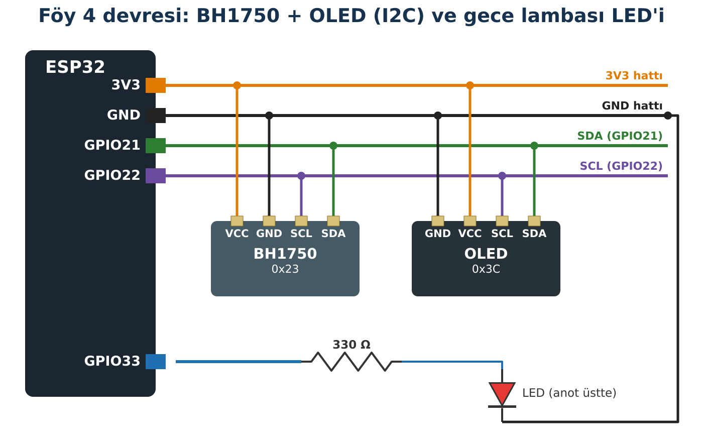

## Hedeflerim

Bu föyün sonunda:

- BH1750'nin ölçtüğü büyüklüğü ve birimini doğru adıyla söyleyebilirim.
- Eşik değerini ölçümlerden yola çıkarak seçebilirim.
- Ölçüme göre karar veren bir gece lambası yapabilirim.
- Aydınlanmanın uzaklıkla nasıl değiştiğini ölçümle inceleyebilirim.

## Malzemeler

| Malzeme | Adet | Not |
| --- | --- | --- |
| ESP32 + USB kablo | 1 |  |
| BH1750 ışık sensörü modülü | 1 |  |
| OLED ekran | 1 |  |
| Kırmızı ya da beyaz LED + 330 Ω | 1+1 | Föy 0'daki devre |
| Cetvel ya da şerit metre | 1 | Deney için |
| Breadboard, jumper | yeteri kadar |  |

## Kavram: Aydınlanma

Bir yüzeye düşen ışığın miktarına **aydınlanma** (aydınlanma şiddeti) denir; birimi **lüks (lx)**'tür. BH1750 kendi küçük yüzeyine düşen ışığı ölçer. Bu, lambanın kendisinin ne kadar güçlü olduğunu (ışık şiddeti) söylemez; yalnız **sensörün bulunduğu yerde** ne kadar ışık olduğunu söyler.

| Ortam | Yaklaşık aydınlanma |
| --- | --- |
| Ay ışığı | ≈ 0,1–1 lx |
| Oturma odası | ≈ 50–200 lx |
| Sınıf (okuma-yazma) | ≈ 300–500 lx |
| Bulutlu gün, dışarı | ≈ 1 000–10 000 lx |
| Doğrudan güneş | ≈ 30 000–100 000 lx |

:::fen[Fen bağlantısı: Uzaklık ve doyma]
Küçük bir ışık kaynağından uzaklaştıkça ışık daha geniş bir alana yayılır. Uzaklık **2 katına** çıkınca aynı ışık **4 kat** alana dağılır; aydınlanma yaklaşık **dörtte birine** iner (**ters kare ilişkisi**). Deneyde bunu sınayacağız.

BH1750 en fazla yaklaşık **54 600 lx** ölçebilir. Daha parlak ışıkta hep aynı en büyük değeri gösterir; buna **doyma** denir. Doğrudan güneşte gördüğün sabit değer gerçek değer değildir.
:::

:::dikkat[Göz güvenliği]
Telefon fenerini ya da LED'i kimsenin gözüne tutma; ışığı yalnız sensöre yönelt.
:::

## Bağlantı



:::dikkat[Güç kutusu]
**Besleme:** BH1750 ve OLED → **3V3**.

**LED:** Föy 0'daki gibi GPIO33 → 330 Ω → LED → GND. Buzzer bu föyde takılı değildir.

BH1750 modülündeki **ADDR** pini boş kalır (adres 0x23). ADDR 3V3'e bağlıysa adres 0x5C olur.
:::

:::rutin[Bağladın mı?]
USB'yi takmadan önce **R2 Güç Kontrol Rutini**'ni uygula.
:::

## Etkinlik 1 — Işığı Ölç

**BH1750** (Christopher Laws) kütüphanesini kur. Tarayıcıyla (Kod 2.1) 0x23 ve 0x3C adreslerini doğrula.

```cpp title="Kod 4.1 — Foy4_BH_Seri" start=1 dosya=Foy4_BH_Seri
// FOY 4 - Kod 4.1: Aydinlanma olcumu
#include <Wire.h>
#include <BH1750.h>

BH1750 isikSensoru;

void setup() {
  Serial.begin(115200);
  Wire.begin(21, 22);

  // Surekli, yuksek cozunurluklu olcum; adres 0x23
  if (!isikSensoru.begin(BH1750::CONTINUOUS_HIGH_RES_MODE, 0x23, &Wire)) {
    Serial.println("HATA: BH1750 bulunamadi. R3'u uygula (adres 0x5C olabilir).");
    while (true) delay(100);
  }
  Serial.println("BH1750 hazir.");
}

void loop() {
  float lux = isikSensoru.readLightLevel();

  Serial.print("Aydinlanma: ");
  Serial.print(lux, 1);
  Serial.println(" lx");

  delay(1000);
}
```

### Kodun Mantığı

- **Satır 12:** Sensörü sürekli ve yüksek çözünürlüklü ölçüm modunda, 0x23 adresinde başlatır.
- **Satır 20:** Son ölçümü lüks olarak verir.

| Durum | Tahminim (lx) | Ölçümüm (lx) |
| --- | --- | --- |
| Normal sınıf ortamı |  |  |
| Sensörün üstünü elimle kapattım |  |  |
| Pencereye doğru çevirdim |  |  |
| Telefon feneri 10 cm uzakta |  |  |

## Etkinlik 2 — Eşiği Ben Belirliyorum

ESP32 "karanlık" kavramını kendiliğinden bilmez. Karanlık ile aydınlığı ayıran sayıyı (eşik değerini) biz, ölçümlere bakarak seçeriz. Etkinlik 1'deki tablona bak: "normal sınıf" ile "elimle kapattım" değerleri arasında bir sayı seç.

::yaz[Karanlık eşiğim: … lx. Neden bu değeri seçtim?]{satir=2}

## Etkinlik 3 — Akıllı Gece Lambası

```cpp title="Kod 4.2 — Foy4_BH_Karar" start=1 dosya=Foy4_BH_Karar
// FOY 4 - Kod 4.2: Akilli gece lambasi
#include <Wire.h>
#include <BH1750.h>
#include <Adafruit_GFX.h>
#include <Adafruit_SSD1306.h>

const int LED_PIN = 33;               // Foy 0'daki LED + 330 ohm devresi
const float KARANLIK_ESIGI = 100.0;   // Etkinlik 2'de SEN belirle

BH1750 isikSensoru;
Adafruit_SSD1306 ekran(128, 64, &Wire, -1);

void setup() {
  Serial.begin(115200);
  Wire.begin(21, 22);
  pinMode(LED_PIN, OUTPUT);

  if (!isikSensoru.begin(BH1750::CONTINUOUS_HIGH_RES_MODE, 0x23, &Wire)) {
    Serial.println("HATA: BH1750 bulunamadi.");
    while (true) delay(100);
  }
  if (!ekran.begin(SSD1306_SWITCHCAPVCC, 0x3C)) {
    Serial.println("HATA: OLED baslatilamadi.");
    while (true) delay(100);
  }
  ekran.setTextColor(SSD1306_WHITE);
}

void loop() {
  float lux = isikSensoru.readLightLevel();

  ekran.clearDisplay();
  ekran.setTextSize(2);
  ekran.setCursor(0, 0);
  ekran.print(lux, 0);
  ekran.println(" lx");

  ekran.setCursor(0, 36);
  if (lux < KARANLIK_ESIGI) {
    ekran.println("KARANLIK");
    digitalWrite(LED_PIN, HIGH);      // gece lambasi yanar
  } else {
    ekran.println("AYDINLIK");
    digitalWrite(LED_PIN, LOW);
  }
  ekran.display();

  Serial.print(lux, 1);
  Serial.println(" lx");
  delay(500);
}
```

:::rutin[Yüklemeden önce]
**Satır 8**'teki 100.0 değerini kendi eşiğinle değiştir.
:::

### Kodun Mantığı

- **Satır 8:** Kararı etkileyen sayı tek yerde tanımlanır.
- **Satır 39:** Ölçüm eşikten küçükse karanlıktır; LED yanar.
- **Satır 48:** Değerleri Seri Monitör'e de yazar; eşiği ayarlarken işine yarar.

| Durum | Tahminim (LED) | Gözlemim (LED ve ekran) |
| --- | --- | --- |
| Normal ortam |  |  |
| Sensörü elimle kapattım |  |  |
| Elimi yavaşça kaldırdım |  |  |

**Tartış:** Elini yavaşça kaldırırken eşik civarında LED titreşti mi? Neden olabilir? (Bu sorunun adını ve çözümünü Föy 10'da öğreneceksin.)

::yaz{satir=2}

## Deney — Uzaklık İki Katına Çıkınca

Odayı mümkün olduğunca karart. Telefon fenerini sensöre doğru, cetvelle ölçerek yerleştir. Her uzaklıkta Seri Monitör'deki değeri yaz. Önce oda ışığını (fener kapalıyken) ölç ve her değerden çıkar.

Oda ışığı (fener kapalı): … lx

| Uzaklık d (cm) | Ölçüm (lx) | Ölçüm − oda ışığı = E | E × d² | Tahminim: E bir öncekinin kaçta biri? |
| --- | --- | --- | --- | --- |
| 10 |  |  |  | — |
| 20 |  |  |  |  |
| 30 |  |  |  |  |
| 40 |  |  |  |  |

**Sonuç:** E × d² sütunu yaklaşık sabit kaldı mı? Kalmadıysa hangi nedenler olabilir? (Fener noktasal bir kaynak mı? Yansıma? Doyma?)

::yaz{satir=3}

## Hata Avcısı

| Belirti | Olası neden | Ne yaparım? |
| --- | --- | --- |
| "HATA: BH1750 bulunamadi" | Adres 0x5C ya da bağlantı | Tarayıcıyla adresi bul; kodda 0x23'ü değiştir. |
| Değer hiç değişmiyor | Sensör yüzeyi kapalı ya da ters | Modülün beyaz kubbeli yüzü ışığa bakmalı. |
| Değer hep ≈ 54 612 | Doyma | Işığı uzaklaştır. |
| LED hiç yanmıyor | LED ters ya da eşik çok düşük | Föy 0 devresini kontrol et; eşiği yükselt. |

### Bilerek hatalı kod

Bu gece lambası **aydınlıkta yanıyor, karanlıkta sönüyor**.

```cpp title="Kod 4.3 — Foy4_Hatali" start=1 dosya=Foy4_Hatali
// FOY 4 - Hata Avcisi: Bu kodda bilerek birakilmis bir hata var!
#include <Wire.h>
#include <BH1750.h>

const int LED_PIN = 33;
const float KARANLIK_ESIGI = 100.0;
BH1750 isikSensoru;

void setup() {
  Serial.begin(115200);
  Wire.begin(21, 22);
  pinMode(LED_PIN, OUTPUT);
  if (!isikSensoru.begin(BH1750::CONTINUOUS_HIGH_RES_MODE, 0x23, &Wire)) {
    Serial.println("HATA: BH1750 bulunamadi.");
    while (true) delay(100);
  }
}

void loop() {
  float lux = isikSensoru.readLightLevel();
  if (lux > KARANLIK_ESIGI) {
    digitalWrite(LED_PIN, HIGH);
  } else {
    digitalWrite(LED_PIN, LOW);
  }
  Serial.println(lux);
  delay(500);
}
```

**Hata:** Hangi satırda hangi karakter yanlış? İki farklı düzeltme yolu yaz.

::yaz{satir=2}

## Şimdi Sıra Sende

- [ ] **Görev (herkes):** Üç bölge: KARANLIK / ORTA / AYDINLIK. Her bölge için iki eşik seç ve ekranda göster.
- [ ] **★ Görev:** Açılışta ilk 10 saniyedeki ölçümlerin ortalamasını al; eşiği bu ortalamanın yarısı olarak kendisi belirlesin (otomatik kalibrasyon).
- [ ] **★★ Görev:** Deneydeki verileri elektronik tabloya gir, E – d grafiğini çiz. Aynı grafiğe E × d² değerlerini de ekle ve yorumla.

## YZ ile Destek Al

:::yz[Örnek istem]
"Işık ölçerken uzaklığı 10 cm'den 20 cm'ye çıkardım, değer 4 kat değil 3 kat azaldı. Hangi deneysel nedenler olabilir? Bana önce sorular sorarak düşünmemi sağla, cevabı hemen verme."
:::

### YZ cevabını nasıl doğruladım?

::yaz[YZ'nin sorduğu en işe yarar soru:]{satir=2}

::yaz[Bu soruyu deneyimle nasıl cevapladım?]{satir=2}

::yaz[Deneyimi nasıl iyileştirirdim?]{satir=2}

## Kendimi Kontrol Ediyorum

**1.** Bir arkadaşın "Kodda eşik 100 lx, o yüzden 100 lx doğru eşiktir" diyor. Katılır mısın? Neden?

::yaz{satir=2}

**2.** Fener noktasal bir kaynak gibi davransaydı, 15 cm'deyken 800 lx ölçen sensör 30 cm'de yaklaşık kaç lx ölçerdi? Gerçek ölçümün bundan farklı çıkmasının bir nedenini de yaz.

::yaz{satir=2}

**3.** Güneşe doğru tutulan sensör hep 54612 lx gösteriyor. Güneş ışığı gerçekten bu kadar mı?

::yaz{satir=2}

**4.** Gece lambası sınıfta sürekli yanıyor. Kodu değiştirmeden önce neyi kontrol edersin?

::yaz{satir=2}

### Öz değerlendirme

- [ ] Aydınlanma ve lüks kavramlarını doğru kullanabiliyorum.
- [ ] Eşik değerini ölçüme dayanarak seçebiliyorum.
- [ ] Ölçüme göre karar veren bir program yazabiliyorum.
- [ ] Ters kare ilişkisini ölçümle sınayabiliyorum.
