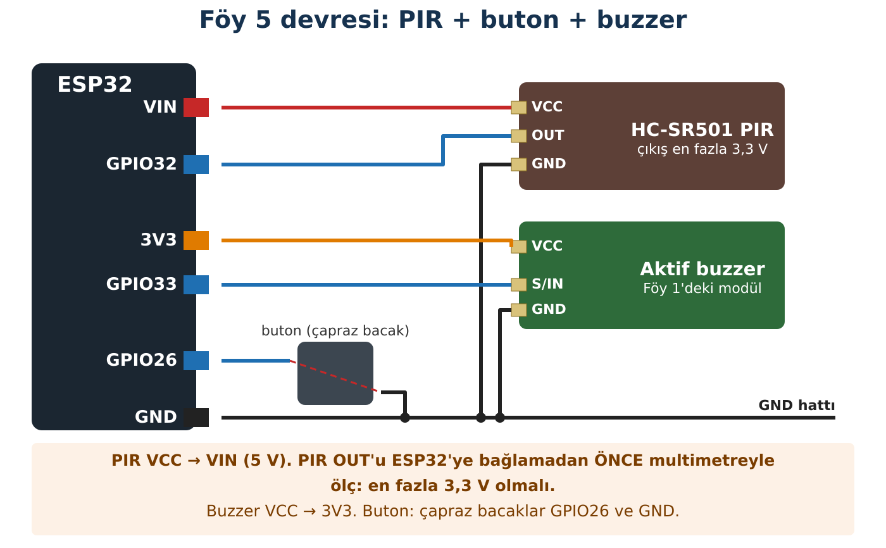

## Hedeflerim

Bu föyün sonunda:

- PIR sensörünün neyi algıladığını bilimsel olarak açıklayabilirim.
- Bir modülün çıkış gerilimini ESP32'ye bağlamadan önce ölçebilirim.
- delay() ile millis() arasındaki farkı deneyle gösterebilirim.
- NORMAL ve ALARM durumları olan bir sistem kurabilirim.

## Malzemeler

| Malzeme | Adet | Not |
| --- | --- | --- |
| ESP32 + USB kablo | 1 |  |
| HC-SR501 PIR sensörü | 1 |  |
| Aktif buzzer modülü (Föy 1) | 1 |  |
| Tact buton (Föy 1) | 1 |  |
| Multimetre | sınıfta 1+ | PIR çıkış ölçümü |
| Breadboard, jumper | yeteri kadar |  |

## Kavram

### PIR ne algılar?

PIR, "Passive InfraRed" yani **pasif kızılötesi** demektir. "Pasif" çünkü sensör hiçbir ışın göndermez; yalnız çevreden gelen **kızılötesi ışınımı** algılar. Sıcak olan her cisim kızılötesi ışınım yayar; insan vücudu da. Sensörün içinde iki algılama bölgesi vardır. Bir insan önünden geçince önce bir bölgeye, sonra diğerine düşen ışınım **değişir**; sensör bu **farkı** fark eder. Bu yüzden PIR **insanı tanımaz**, hareketsiz duran bir insanı da çoğu zaman görmez; yalnız **değişimi** algılar.

:::fen[Fen bağlantısı]
Kızılötesi, gözümüzün göremediği bir ışık türüdür. Normal pencere camı uzak kızılötesini büyük ölçüde geçirmez; bu yüzden PIR camın arkasındaki hareketi genellikle göremez. Kalorifer peteğinin ya da güneşin ısıttığı bir yüzeyin hızlı sıcaklık değişimi ise yanlış alarma neden olabilir.
:::

### delay() ile millis() farkı

**delay(1000)**, ESP32'ye "1 saniye **hiçbir şey yapmadan** bekle" der. Bu sırada butona basarsan ESP32 fark etmez. **millis()** ise saate bakmaktır: "Son değişimden bu yana 1 saniye geçti mi? Geçmediyse başka işlerine devam et." Yemek pişirirken ocağın başında durmak (delay) ile arada saate bakıp başka işler yapmak (millis) arasındaki fark gibidir.

## Bağlantı



:::dikkat[Güç kutusu]
**PIR beslemesi:** VCC → **VIN** (5 V). HC-SR501 kartındaki regülatör yaklaşık 4,5 V altında güvenilir çalışmaz; 3V3'e bağlanmaz.

**PIR çıkışı:** Kart kendi içinde 3,3 V ürettiği için çıkış normalde en fazla 3,3 V'tur. Yine de **ölçmeden bağlama** (aşağıdaki adımlar).

**Buzzer:** VCC → 3V3 (Föy 1). **Buton:** çapraz bacaklar, GPIO26 ve GND.
:::

### PIR çıkışını bağlamadan önce ölç

1. USB çıkıkken PIR'ın VCC'sini VIN'e, GND'sini GND'ye bağla. **OUT ucunu henüz ESP32'ye bağlama.**
2. USB'yi tak. Multimetre DC V kademesinde: kırmızı prob PIR OUT, siyah prob GND.
3. Sensörün önünde elini salla ve en yüksek değeri oku.
4. Değer **3,5 V'tan küçükse** USB'yi çıkar ve OUT'u GPIO32'ye bağla. Büyükse **bağlama**, öğretmenine haber ver.

|  |  |
| --- | --- |
| PIR OUT, hareket yokken (V): |  |
| PIR OUT, hareket varken (V): |  |
| Bağlamak güvenli mi? | ☐ Evet   ☐ Hayır |

:::bilgi[HC-SR501 ayarları]
Kartın üzerinde iki küçük vida (potansiyometre) vardır: biri **algılama uzaklığını**, diğeri çıkışın **ne kadar süre HIGH kalacağını** ayarlar (birkaç saniyeden birkaç dakikaya). Bu föyde süre vidasını **en kısaya** (dönüş yönü modüle göre değişebilir; kartın üzerindeki işarete bak ya da öğretmenine sor) getir. Kart açıldıktan sonra yaklaşık **1 dakika** ısınır; bu sürede yanlış sinyaller normaldir.
:::

:::rutin[Bağladın mı?]
USB'yi takmadan önce **R2 Güç Kontrol Rutini**'ni uygula.
:::

## Etkinlik 1 — PIR Ne Zaman Değişiyor?

```cpp title="Kod 5.1 — Foy5_PIR_Test" start=1 dosya=Foy5_PIR_Test
// FOY 5 - Kod 5.1: PIR ne zaman degisiyor?
const int PIR_PIN = 32;
int oncekiDurum = LOW;

void setup() {
  Serial.begin(115200);
  pinMode(PIR_PIN, INPUT);
  Serial.println("PIR isiniyor: 60 saniye hareket etmeden bekle.");
}

void loop() {
  int durum = digitalRead(PIR_PIN);

  if (durum != oncekiDurum) {          // yalniz degisince yaz (Foy 1)
    Serial.print(millis() / 1000.0, 1);
    Serial.print(" s  PIR: ");
    if (durum == HIGH) {
      Serial.println("HAREKET (HIGH)");
    } else {
      Serial.println("sakin (LOW)");
    }
    oncekiDurum = durum;
  }
}
```

### Kodun Mantığı

- **Satır 14:** Föy 1'deki basma sayacı mantığı: yalnız durum değişince yazar.
- **Satır 15:** Değişimin saniye cinsinden ne zaman olduğunu gösterir; HIGH ne kadar sürdü, hesaplayabilirsin.

| Deney | Tahminim | Gözlemim |
| --- | --- | --- |
| Önünden bir kez geçtim: HIGH kaç saniye sürdü? |  |  |
| Önünde hiç kıpırdamadan durdum |  |  |
| 1 m / 2 m / 3 m'den el salladım |  |  |
| Bir cam / kitap arkasından el salladım |  |  |

## Etkinlik 2 — delay() Butonu Kaçırır mı?

```cpp title="Kod 5.2 — Foy5_Delay_Alarm" start=1 dosya=Foy5_Delay_Alarm
// FOY 5 - Kod 5.2: delay() ile kesik alarm
const int BUTON_PIN = 26;
const int BUZZER_PIN = 33;
const int BUZZER_ACIK = HIGH;     // Foy 1 Etkinlik 2'deki sonucuna gore
const int BUZZER_KAPALI = LOW;

void setup() {
  Serial.begin(115200);
  pinMode(BUTON_PIN, INPUT_PULLUP);
  pinMode(BUZZER_PIN, OUTPUT);
  digitalWrite(BUZZER_PIN, BUZZER_KAPALI);
}

void loop() {
  digitalWrite(BUZZER_PIN, BUZZER_ACIK);
  delay(1000);                          // 1 saniye hicbir sey yapmadan bekle
  digitalWrite(BUZZER_PIN, BUZZER_KAPALI);
  delay(1000);                          // bir saniye daha bekle

  if (digitalRead(BUTON_PIN) == LOW) {
    Serial.println("Butona basildi!");
  }
}
```

**Satır 4–5'u Föy 1'deki modül sonucuna göre düzenle.** Sonra butona **kısa kısa** 10 kez bas ve Seri Monitör'de kaç kez "Butona basildi!" yazdığını say.

## Etkinlik 3 — millis() ile Aynı İş

```cpp title="Kod 5.3 — Foy5_Millis_Alarm" start=1 dosya=Foy5_Millis_Alarm
// FOY 5 - Kod 5.3: millis() ile kesik alarm
const int BUTON_PIN = 26;
const int BUZZER_PIN = 33;
const int BUZZER_ACIK = HIGH;
const int BUZZER_KAPALI = LOW;
const unsigned long ARALIK = 1000;      // ms

unsigned long sonDegisim = 0;           // buzzer en son ne zaman degisti?
bool buzzerAcik = false;

void setup() {
  Serial.begin(115200);
  pinMode(BUTON_PIN, INPUT_PULLUP);
  pinMode(BUZZER_PIN, OUTPUT);
  digitalWrite(BUZZER_PIN, BUZZER_KAPALI);
}

void loop() {
  unsigned long simdi = millis();

  if (simdi - sonDegisim >= ARALIK) {   // 1 saniye doldu mu? (saate bak)
    sonDegisim = simdi;
    buzzerAcik = !buzzerAcik;           // acik ise kapat, kapali ise ac
    if (buzzerAcik) {
      digitalWrite(BUZZER_PIN, BUZZER_ACIK);
    } else {
      digitalWrite(BUZZER_PIN, BUZZER_KAPALI);
    }
  }

  if (digitalRead(BUTON_PIN) == LOW) {  // buton her turda okunur
    Serial.println("Butona basildi!");
  }
}
```

### Kodun Mantığı

- **Satır 8:** Buzzer'ın en son ne zaman değiştiğini hatırlar.
- **Satır 21:** "Son değişimden bu yana 1 saniye geçti mi?" diye saate bakar. Geçmediyse beklemez, sonraki satırlara geçer.
- **Satır 23:** ! işareti "tersi" demektir: açıksa kapalı, kapalıysa açık yapar.
- **Satır 31:** Buton loop'un **her turunda** okunur; saniyede binlerce kez.

| Kod | Tahminim: 10 basıştan kaçı görülür? | Gözlemim |
| --- | --- | --- |
| Kod 5.2 (delay) |  |  |
| Kod 5.3 (millis) |  |  |

## Etkinlik 4 — Alarm Sistemi

Gerçek bir alarm, hareket bitince susmaz; biri gelip **sıfırlayana** kadar öter. Bunun için sistemin iki **durumu** olur: NORMAL ve ALARM.

| Şimdiki durum | Olay | Yeni durum | Buzzer |
| --- | --- | --- | --- |
| NORMAL | PIR HIGH | ALARM | kesik öter |
| ALARM | Butona basıldı | NORMAL | susar |
| ALARM | PIR LOW oldu | ALARM (değişmez) | ötmeye devam |

```cpp title="Kod 5.4 — Foy5_Alarm_Sistemi" start=1 dosya=Foy5_Alarm_Sistemi
// FOY 5 - Kod 5.4: Iki durumlu alarm sistemi
const int PIR_PIN = 32;
const int BUTON_PIN = 26;
const int BUZZER_PIN = 33;
const int BUZZER_ACIK = HIGH;
const int BUZZER_KAPALI = LOW;

const int NORMAL = 0;                   // sistemin olasi durumlari
const int ALARM = 1;
int durum = NORMAL;

unsigned long sonDegisim = 0;
bool buzzerAcik = false;

void buzzerYaz(bool acik) {
  if (acik) {
    digitalWrite(BUZZER_PIN, BUZZER_ACIK);
  } else {
    digitalWrite(BUZZER_PIN, BUZZER_KAPALI);
  }
}

void setup() {
  Serial.begin(115200);
  pinMode(PIR_PIN, INPUT);
  pinMode(BUTON_PIN, INPUT_PULLUP);
  pinMode(BUZZER_PIN, OUTPUT);
  buzzerYaz(false);
  Serial.println("Sistem NORMAL. PIR icin 60 s bekle.");
}

void loop() {
  unsigned long simdi = millis();

  if (durum == NORMAL) {
    if (digitalRead(PIR_PIN) == HIGH) {         // hareket -> ALARM
      durum = ALARM;
      Serial.println("ALARM! Hareket algilandi.");
    }
  } else if (durum == ALARM) {
    if (simdi - sonDegisim >= 300) {            // kesik alarm sesi
      sonDegisim = simdi;
      buzzerAcik = !buzzerAcik;
      buzzerYaz(buzzerAcik);
    }
    if (digitalRead(BUTON_PIN) == LOW) {        // buton -> NORMAL
      durum = NORMAL;
      buzzerAcik = false;
      buzzerYaz(false);
      Serial.println("Alarm sifirlandi. Sistem NORMAL.");
    }
  }
}
```

### Kodun Mantığı

- **Satır 8–10:** Durumlara isim veririz; kod okunur hâle gelir.
- **Satır 15:** Aktif-HIGH/LOW ayrıntısını tek bir fonksiyonda saklar.
- **Satır 35:** NORMAL'de yalnız PIR'a bakılır.
- **Satır 40:** ALARM'da millis() ile kesik ses üretilir ve buton beklenir. PIR'ın LOW olması alarmı durdurmaz; tablodaki 3. satır.
- **Satır 47:** Buton alarmı sıfırlar. PIR hâlâ HIGH ise sistem bir sonraki turda yeniden ALARM'a geçer; son gözlem satırı bunu sınar.

| Deney | Tahminim | Gözlemim |
| --- | --- | --- |
| Önünden geçip uzaklaştım |  |  |
| Butona bastım (PIR LOW iken) |  |  |
| Butona bastım ama hâlâ sensörün önündeyim |  |  |

## Hata Avcısı

| Belirti | Olası neden | Ne yaparım? |
| --- | --- | --- |
| PIR hep HIGH | Isınma süresi; süre vidası uzun; sensör hareketli bir şeye bakıyor | 1 dk bekle; süre vidasını en kısaya al; sensörü duvara çevir. |
| PIR hiç HIGH olmuyor | VIN yerine 3V3'e bağlı; OUT bağlantısı | Güç kutusunu kontrol et; OUT'u ölç. |
| Alarm butonla susmuyor | Buton bağlantısı | Föy 1 Kod 1.1 ile butonu ayrı test et. |
| Buzzer ters çalışıyor | BUZZER_ACIK/KAPALI ayarı | Föy 1 Etkinlik 2 sonucunu kullan. |

### Bilerek hatalı kod

Bu kodun buzzer'ı saniyede bir açıp kapatması gerekiyordu; ama **buzzer hiç değişmiyor**. Kod derleniyor.

```cpp title="Kod 5.5 — Foy5_Hatali" start=1 dosya=Foy5_Hatali
// FOY 5 - Hata Avcisi: Bu kodda bilerek birakilmis bir hata var!
const int BUZZER_PIN = 33;
const unsigned long ARALIK = 1000;
bool buzzerAcik = false;

void setup() {
  pinMode(BUZZER_PIN, OUTPUT);
}

void loop() {
  unsigned long sonDegisim = millis();
  unsigned long simdi = millis();

  if (simdi - sonDegisim >= ARALIK) {
    sonDegisim = simdi;
    buzzerAcik = !buzzerAcik;
    digitalWrite(BUZZER_PIN, buzzerAcik);
  }
}
```

**Hata:** sonDegisim değişkeni nerede tanımlanmış? Her loop turunda ona ne oluyor? Bu yüzden simdi − sonDegisim hep kaç çıkar?

::yaz{satir=3}

## Şimdi Sıra Sende

- [ ] **Görev (herkes):** "Sessiz alarm": ALARM durumunda buzzer yerine Seri Monitör'e her 2 saniyede bir "ALARM SURUYOR" yazsın (millis ile).
- [ ] **★ Görev:** Hareket algılanınca alarm **3 saniye sonra** başlasın; bu 3 saniye içinde butona basılırsa hiç başlamasın (evden çıkarken şifre girme süresi gibi). İpucu: üçüncü bir durum ekle: BEKLEME.
- [ ] **★★ Görev:** Alarmın kaç kez tetiklendiğini say ve Föy 2'deki OLED'de göster.

## YZ ile Destek Al

:::yz[Örnek istem]
"ESP32'de delay() ile millis() arasındaki farkı, mutfakta yemek pişirme benzetmesiyle 6 cümlede açıkla. Kod yazma. Sonunda bana anladığımı kontrol eden bir soru sor."
:::

### YZ cevabını nasıl doğruladım?

::yaz[YZ'nin benzetmesi:]{satir=2}

::yaz[Etkinlik 2–3'teki gözlemimle uyuşuyor mu?]{satir=2}

::yaz[YZ'nin sorusuna cevabım:]{satir=2}

## Kendimi Kontrol Ediyorum

**1.** Bir arkadaşın "PIR ısı kamerasıdır, insanı görür" diyor. Etkinlik 1'deki hangi gözleminle bunu çürütürsün?

::yaz{satir=3}

**2.** PIR OUT ucunu neden ESP32'ye bağlamadan önce ölçtük? Ölçüm 5 V çıksaydı ne olurdu?

::yaz{satir=2}

**3.** Kod 5.2'de butonun bazı basışları neden kaçtı?

::yaz{satir=2}

**4.** Alarm sisteminde PIR LOW olunca alarm neden durmuyor? Bu bir hata mı, tasarım kararı mı?

::yaz{satir=2}

### Öz değerlendirme

- [ ] PIR'ın neyi algıladığını açıklayabiliyorum.
- [ ] Bir modül çıkışını bağlamadan önce ölçebiliyorum.
- [ ] millis() ile bekletmeden zamanlama yapabiliyorum.
- [ ] İki durumlu bir sistem tasarlayabiliyorum.
