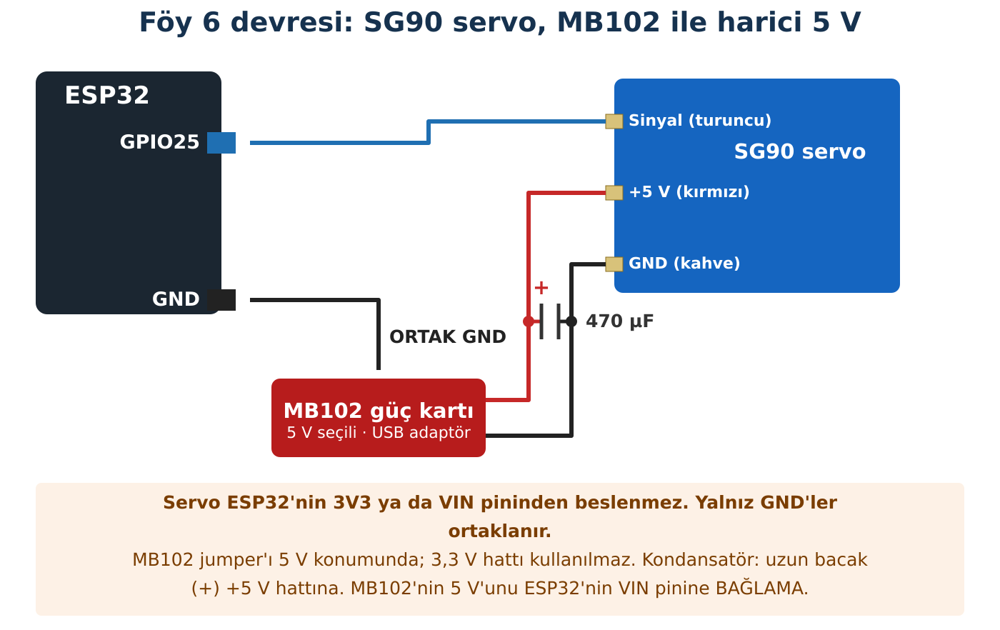

## Hedeflerim

Bu föyün sonunda:

- Servoyu harici besleme ve ortak GND ile güvenli bağlayabilirim.
- Komut verilen açı ile gerçek açıyı ölçerek karşılaştırabilirim.
- ESP32'nin kendi Wi-Fi ağını kurmasını sağlayabilirim.
- Telefondaki bir düğmenin servoyu nasıl döndürdüğünü adım adım anlatabilirim.

## Malzemeler

| Malzeme | Adet | Not |
| --- | --- | --- |
| ESP32 + USB kablo | 1 |  |
| SG90 mikro servo | 1 | Kolu (horn) takılı |
| MB102 breadboard güç kartı | 1 | Jumper 5 V konumunda |
| 5 V USB adaptör + USB kablo | 1 | MB102 girişine uygun |
| 470 µF 16 V kondansatör | 1 | Servo hattı için |
| Kâğıt iletki (açıölçer) | 1 | Deney |
| Akıllı telefon | grup başına 1 |  |
| Jumper kablo | yeteri kadar |  |

## Kavram

### Servo nasıl çalışır?

Servonun içinde küçük bir motor, dişliler, konumunu ölçen bir potansiyometre ve kontrol devresi vardır. ESP32, sinyal kablosundan **her 20 milisaniyede bir** kısa bir darbe gönderir. Darbenin **süresi** istenen açıyı söyler: yaklaşık 0,5 ms bir uç, 2,4 ms diğer uç. Servo kendi konumunu ölçer ve bu açıya gelene kadar döner.

:::dikkat[Mekanik sınır]
Ucuz servolarda 0° ve 180° komutları dişliyi mekanik sınıra dayayabilir: servo vızıldar, ısınır, çok akım çeker. Bu yüzden kitaptaki kodlar **10°–170°** arasında çalışır.
:::

:::fen[Fen bağlantısı: Enerji dönüşümü ve dişli]
Servonun içindeki küçük motor elektrik enerjisini dönme enerjisine çevirir. Motor hızlı ama zayıf döner; dişli kutusu hızı azaltır, dönme kuvvetini (torku) artırır. Dişlide kuvvet kazanırsan hızdan kaybedersin; enerji yoktan var olmaz.

Kol bir engele takılırsa motor dönemez ama akım çekmeye devam eder; bu enerji ısıya dönüşür. Servonun vızıldayıp ısınmasının nedeni budur ve güçlü bir besleme kaynağının neden gerektiğini de açıklar (Föy 8'de akım ölçmeyi öğreneceksin).
:::

### Telefon servoyu nasıl döndürür?

1. ESP32 kendi Wi-Fi ağını kurar (erişim noktası, **AP**).
2. Telefon bu ağa bağlanır. İnternet yoktur; gerek de yoktur.
3. Tarayıcıya ESP32'nin **IP adresi** (192.168.4.1) yazılır; ESP32 bir web sayfası gönderir.
4. Sayfadaki "90°" düğmesi, **/aci?deger=90** adresine bir **HTTP isteği** gönderir.
5. ESP32 isteği okur, servo fonksiyonunu çalıştırır; GPIO25'ten darbe çıkar.

## Bağlantı



:::dikkat[Güç kutusu]
**Servo beslemesi:** **MB102 güç kartı** (5 V) ve 5 V USB adaptör. Servo hareket ederken yüzlerce mA çekebilir; ESP32'nin 3V3 ya da VIN pinine bağlanırsa kart yeniden başlayabilir.

**MB102 ayarı:** Jumper'ı **5 V** konumuna al ve adaptörü USB girişine tak (DC jakına 6,5–12 V verilir; bu föyde kullanma). Kartın **3,3 V** hattı ESP32 pinlerine hiçbir zaman bağlanmaz.

**470 µF kondansatör:** Servonun +5 V ve GND hatları arasına, servoya yakın tak. **Uzun bacak (+) +5 V'a, çizgili bacak (−) GND'ye.** Servo hareket ederken oluşan ani akım dalgalanmasını yumuşatır. Ters takılırsa ısınır, şişer ya da patlayabilir.

**Ortak GND:** MB102'nin GND'si ile ESP32'nin GND'si birleştirilir. Aksi hâlde sinyalin "sıfır noktası" belirsiz kalır.

**Yapma:** MB102'nin 5 V hattını ESP32'nin VIN pinine bağlama. ESP32 USB'den beslenmeye devam eder.

**Sinyal:** GPIO25, 3,3 V. SG90 bu sinyali doğru algılar.
:::

:::rutin[Bağladın mı?]
USB'yi takmadan önce **R2 Güç Kontrol Rutini**'ni uygula.
:::

## Etkinlik 1 — Servo Testi ve Açı Ölçümü

**ESP32Servo** kütüphanesini kur.

```cpp title="Kod 6.1 — Foy6_Servo_Test" start=1 dosya=Foy6_Servo_Test
// FOY 6 - Kod 6.1: Servo testi
#include <ESP32Servo.h>

const int SERVO_PIN = 25;
const int EN_KUCUK_ACI = 10;     // mekanik sinira dayanmamak icin
const int EN_BUYUK_ACI = 170;

Servo servo;

void setup() {
  Serial.begin(115200);
  servo.setPeriodHertz(50);              // her 20 ms'de bir darbe
  servo.attach(SERVO_PIN, 500, 2400);    // darbe genisligi: 500-2400 us
  servo.write(90);
  delay(1000);
}

void loop() {
  int acilar[] = {EN_KUCUK_ACI, 90, EN_BUYUK_ACI, 90};

  for (int i = 0; i < 4; i++) {
    Serial.print("Komut verilen aci: ");
    Serial.println(acilar[i]);
    servo.write(acilar[i]);
    delay(3000);                         // olcmek icin zaman
  }
}
```

### Kodun Mantığı

- **Satır 12:** Saniyede 50 darbe, yani her 20 ms'de bir.
- **Satır 13:** 0° ↔ 500 µs, 180° ↔ 2400 µs darbe olarak eşlenir.
- **Satır 19:** Denenecek açılar bir **dizi**de tutulur; for döngüsü sırayla hepsini dener.

Kâğıt iletkiyi servonun ekseninin altına yerleştir. 90° komutunda kolun gösterdiği yeri **referans** al; diğer açılarda kolun bu referanstan ne kadar döndüğünü ölç.

| Komut (°) | Tahminim: tam bu açıya gelir mi? | Ölçtüğüm açı (°) | Fark (°) |
| --- | --- | --- | --- |
| 10 |  |  |  |
| 90 |  | referans | 0 |
| 170 |  |  |  |

## Etkinlik 2 — ESP32 Kendi Ağını Kuruyor

```cpp title="Kod 6.2 — Foy6_Kendi_Agi" start=1 dosya=Foy6_Kendi_Agi
// FOY 6 - Kod 6.2: ESP32 kendi Wi-Fi agini kuruyor
#include <WiFi.h>

const int GRUP_NO = 1;                 // KENDI GRUP NUMARANI YAZ
const int KANAL = 1;                   // ogretmenin verdigi kanal: 1, 6 ya da 11
const char* PAROLA = "robot123";       // en az 8 karakter

void setup() {
  Serial.begin(115200);
  String agAdi = "ESP32-G" + String(GRUP_NO);

  WiFi.softAP(agAdi.c_str(), PAROLA, KANAL);

  Serial.print("Ag adi: ");
  Serial.println(agAdi);
  Serial.print("IP adresi: ");
  Serial.println(WiFi.softAPIP());
}

void loop() {
}
```

:::rutin[Yüklemeden önce]
**Satır 4:** grup numaranı yaz. **Satır 5:** öğretmeninin verdiği kanalı yaz. Böylece sınıftaki her grubun ağı ayrı olur; telefonun başka grubun kartına bağlanmaz.
:::

:::bilgi["İnternet yok" uyarısı]
Telefon "Bu ağda internet yok" diyebilir; **bağlı kal**. Bazı telefonlar internet olmayan ağdan otomatik ayrılır ya da mobil veriye geçer; bu durumda mobil veriyi kısa süre kapat.
:::

|  |  |
| --- | --- |
| Ağımın adı: |  |
| ESP32'nin IP adresi: |  |

## Etkinlik 3 — Telefondan Servo

```cpp title="Kod 6.3 — Foy6_Web_Servo — 1. bölüm (satır 1–45)" start=1 dosya=Foy6_Web_Servo
// FOY 6 - Kod 6.3: Telefondan servo kontrolu
#include <WiFi.h>
#include <WebServer.h>
#include <ESP32Servo.h>

const int GRUP_NO = 1;
const int KANAL = 1;
const char* PAROLA = "robot123";
const int SERVO_PIN = 25;

Servo servo;
WebServer sunucu(80);
int simdikiAci = 90;

void servoyuGotur(int aci) {
  aci = constrain(aci, 10, 170);          // guvenli aralikta tut
  servo.write(aci);
  simdikiAci = aci;
  Serial.print("Servo: ");
  Serial.println(aci);
}

void anaSayfa() {
  String html = "<!DOCTYPE html><html><head><meta charset='UTF-8'>";
  html += "<meta name='viewport' content='width=device-width, initial-scale=1'>";
  html += "<style>body{font-family:Arial;text-align:center;margin-top:30px}";
  html += "a{display:inline-block;width:80px;padding:16px 0;margin:6px;font-size:20px;";
  html += "background:#1f6fb2;color:white;text-decoration:none;border-radius:10px}</style>";
  html += "</head><body><h2>Grup " + String(GRUP_NO) + " Servo</h2>";
  html += "<p>Şimdiki açı: <b>" + String(simdikiAci) + "°</b></p>";
  html += "<a href='/aci?deger=10'>10°</a>";
  html += "<a href='/aci?deger=90'>90°</a>";
  html += "<a href='/aci?deger=170'>170°</a>";
  html += "</body></html>";
  sunucu.send(200, "text/html; charset=utf-8", html);
}

void aciAyarla() {                        // ornek istek: /aci?deger=90
  if (sunucu.hasArg("deger")) {
    servoyuGotur(sunucu.arg("deger").toInt());
  }
  sunucu.sendHeader("Location", "/");     // ana sayfaya geri don
  sunucu.send(303);
}

```

### Kodun Mantığı (1. bölüm)

- **Satır 15–16:** Gelen açı ne olursa olsun 10–170 aralığına sıkıştırılır; hatalı bir istek servoya zarar veremez.
- **Satır 23:** Telefonun göreceği HTML sayfasını parça parça bir metin olarak oluşturur. **charset=UTF-8** sayesinde ° ve Türkçe harfler doğru görünür.
- **Satır 38:** /aci?deger=90 isteğindeki **deger**'i okur, servoyu döndürür, telefonu ana sayfaya geri gönderir.

```cpp title="Kod 6.3 — Foy6_Web_Servo — 2. bölüm (satır 46–65)" start=46 dosya=Foy6_Web_Servo
void setup() {
  Serial.begin(115200);
  servo.setPeriodHertz(50);
  servo.attach(SERVO_PIN, 500, 2400);
  servoyuGotur(90);

  String agAdi = "ESP32-G" + String(GRUP_NO);
  WiFi.softAP(agAdi.c_str(), PAROLA, KANAL);
  Serial.print(agAdi);
  Serial.print("  IP: ");
  Serial.println(WiFi.softAPIP());

  sunucu.on("/", anaSayfa);
  sunucu.on("/aci", aciAyarla);
  sunucu.begin();
}

void loop() {
  sunucu.handleClient();                  // gelen istekleri dinle
}
```

### Kodun Mantığı (2. bölüm)

- **Satır 59:** Hangi adrese hangi fonksiyonun cevap vereceğini belirler.
- **Satır 64:** Gelen istekleri dinler. Bu satır olmazsa sayfa hiç açılmaz.

## Deney — Kim Kimi Kontrol Ediyor?

| Deney | Tahminim | Gözlemim |
| --- | --- | --- |
| Tarayıcıya 192.168.4.1/aci?deger=45 yazdım |  |  |
| Tarayıcıya .../aci?deger=250 yazdım |  |  |
| Telefonun mobil verisi açık, Wi-Fi ESP32'de |  |  |
| ESP32'yi 10 m uzağa götürdüm |  |  |

## Hata Avcısı

| Belirti | Olası neden | Ne yaparım? |
| --- | --- | --- |
| Servo her harekette ESP32 yeniden başlıyor | Servo ESP32'den besleniyor ya da GND ortak değil | Güç kutusunu kontrol et. |
| Servo çok zayıf ya da hiç hareket etmiyor | MB102'nin jumper ayarı 3,3 V konumunda; kart kapalı ya da adaptör/kablo zayıf | Jumper'ı 5 V yap; MB102'nin güç LED'inin yandığını kontrol et. |
| Servo titriyor, vızıldıyor | Mekanik sınır; zayıf besleme | Açıları 10–170 tut; kaynağı kontrol et. |
| Sayfa açılmıyor | Yanlış ağa bağlı; IP yanlış; mobil veri | Ağ adını ve IP'yi Seri Monitör'den kontrol et. |
| Ağ listesinde başka grupların ağı | Normal | Yalnız kendi GRUP_NO'lu ağına bağlan. |
| ° işareti bozuk görünüyor | charset satırı silinmiş | Kod 6.3'ün anaSayfa kısmını karşılaştır. |

### Bilerek hatalı kod

Telefon ağa bağlanıyor, Seri Monitör IP'yi yazıyor, ama tarayıcıda **sayfa hiç açılmıyor**. Kod 6.3 ile bu kodun yalnız bir farkı var.

```cpp title="Kod 6.4 — Foy6_Hatali" start=1 dosya=Foy6_Hatali
// FOY 6 - Hata Avcisi: Bu kodda bilerek birakilmis bir hata var!
#include <WiFi.h>
#include <WebServer.h>
#include <ESP32Servo.h>

const int GRUP_NO = 1;
const int KANAL = 1;
const char* PAROLA = "robot123";
const int SERVO_PIN = 25;

Servo servo;
WebServer sunucu(80);
int simdikiAci = 90;

void servoyuGotur(int aci) {
  aci = constrain(aci, 10, 170);          // guvenli aralikta tut
  servo.write(aci);
  simdikiAci = aci;
  Serial.print("Servo: ");
  Serial.println(aci);
}

void anaSayfa() {
  String html = "<!DOCTYPE html><html><head><meta charset='UTF-8'>";
  html += "<meta name='viewport' content='width=device-width, initial-scale=1'>";
  html += "<style>body{font-family:Arial;text-align:center;margin-top:30px}";
  html += "a{display:inline-block;width:80px;padding:16px 0;margin:6px;font-size:20px;";
  html += "background:#1f6fb2;color:white;text-decoration:none;border-radius:10px}</style>";
  html += "</head><body><h2>Grup " + String(GRUP_NO) + " Servo</h2>";
  html += "<p>Şimdiki açı: <b>" + String(simdikiAci) + "°</b></p>";
  html += "<a href='/aci?deger=10'>10°</a>";
  html += "<a href='/aci?deger=90'>90°</a>";
  html += "<a href='/aci?deger=170'>170°</a>";
  html += "</body></html>";
  sunucu.send(200, "text/html; charset=utf-8", html);
}

void aciAyarla() {                        // ornek istek: /aci?deger=90
  if (sunucu.hasArg("deger")) {
    servoyuGotur(sunucu.arg("deger").toInt());
  }
  sunucu.sendHeader("Location", "/");     // ana sayfaya geri don
  sunucu.send(303);
}

void setup() {
  Serial.begin(115200);
  servo.setPeriodHertz(50);
  servo.attach(SERVO_PIN, 500, 2400);
  servoyuGotur(90);

  String agAdi = "ESP32-G" + String(GRUP_NO);
  WiFi.softAP(agAdi.c_str(), PAROLA, KANAL);
  Serial.print(agAdi);
  Serial.print("  IP: ");
  Serial.println(WiFi.softAPIP());

  sunucu.on("/", anaSayfa);
  sunucu.on("/aci", aciAyarla);
  sunucu.begin();
}

void loop() {

}
```

**Hata:** Eksik olan satır ne? Bu satırın görevi ne?

::yaz{satir=2}

## Şimdi Sıra Sende

- [ ] **Görev (herkes):** Sayfaya 45° ve 135° düğmeleri ekle.
- [ ] **★ Görev:** "Kapı" arayüzü: "AÇ" (170°) ve "KAPAT" (10°) düğmeleri; sayfada kapının durumu yazsın.
- [ ] **★★ Görev:** Düğmeler yerine kaydırıcı: HTML'deki **&lt;input type="range" min="10" max="170"&gt;** ile açıyı seç, "Gönder" düğmesi /aci?deger=... isteği göndersin. (İpucu: bir &lt;form action="/aci"&gt; içinde input'un adını **deger** yap.)

## YZ ile Destek Al

:::yz[Örnek istem]
"ESP32 web sayfam açılıyor ama SG90 hareket etmiyor. Servo GPIO25'te, MB102 güç kartıyla 5 V kullanıyorum. Yeni kod yazma; güç, ortak GND, sinyal ve yazılım için sıralı bir hata ayıklama listesi hazırla."
:::

### YZ cevabını nasıl doğruladım?

::yaz[YZ'nin önerdiği ilk kontrol:]{satir=2}

::yaz[Denedim mi, sonuç:]{satir=2}

::yaz[Sorun hangi katmandaydı? (güç / bağlantı / ağ / kod)]{satir=2}

## Kendimi Kontrol Ediyorum

**1.** Servoyu neden ESP32'nin 3V3 pininden beslemedik? Ortak GND olmasaydı ne olurdu?

::yaz{satir=3}

**2.** Telefonda "90°" düğmesine basmakla servonun dönmesi arasında gerçekleşen adımları sırayla yaz.

::yaz{satir=3}

**3.** Tarayıcıya deger=250 yazınca servo neden 250°'ye gitmedi?

::yaz{satir=2}

**4.** Açı ölçümünde komut ile gerçek açı arasında fark çıktı. Olası iki neden yaz.

::yaz{satir=2}

### Öz değerlendirme

- [ ] Servoyu harici besleme ve ortak GND ile bağlayabiliyorum.
- [ ] ESP32'nin kendi ağını kurup telefondan bağlanabiliyorum.
- [ ] Bir HTTP isteğinin servoyu nasıl döndürdüğünü açıklayabiliyorum.
- [ ] Sorunun güç, ağ ya da kod katmanında olduğunu ayırabiliyorum.
