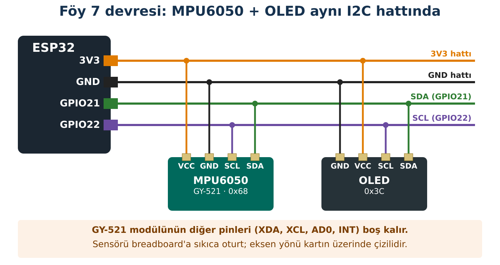

## Hedeflerim

Bu föyün sonunda:

- İvmeölçer ile jiroskopun neyi ölçtüğünü ayırt edebilirim.
- Sensör masada dururken neden 9,8 m/s² gösterdiğini açıklayabilirim.
- Bir sensörün kaydını doğrudan okuyan kodu okuyup açıklayabilirim.
- İvmeden eğim hesaplayıp ekranda gösterebilirim.

## Malzemeler

| Malzeme | Adet | Not |
| --- | --- | --- |
| ESP32 + USB kablo | 1 |  |
| MPU6050 modülü (GY-521) | 1 |  |
| OLED ekran | 1 |  |
| Breadboard, jumper | yeteri kadar |  |

## Kavram

MPU6050'nin içinde iki sensör vardır. **İvmeölçer** X, Y, Z eksenlerinde ivmeyi (m/s²) ölçer. **Jiroskop** her eksen etrafında ne kadar **hızlı döndüğünü** (derece/saniye) ölçer. Hiçbiri doğrudan "açı" ölçmez; açıyı bu verilerden **hesaplarız**.

:::fen[Fen bağlantısı: Masadaki sensör neden 9,8 gösteriyor?]
Masada duran sensörün hızı değişmez, yani ivmesi sıfırdır. Ama ivmeölçer Z ekseninde yaklaşık **+9,8 m/s²** gösterir. Neden?

Çünkü ivmeölçer yerçekimini doğrudan hissetmez; kendisini **taşıyan kuvveti** (burada masanın yukarı doğru tepki kuvvetini) birim kütle başına ölçer. Masa sensörü yukarı ittiği için değer yukarı yönde 9,8'dir. Sensör **serbest düşseydi**, onu taşıyan bir şey olmayacağı için ≈ **0** gösterirdi.

Sensör eğildiğinde bu 9,8'lik değer eksenler arasında paylaşılır. Bu paylaşımdan **eğim** hesaplanır; ama yalnız sensör **durgun ya da yavaş** hareket ediyorsa.
:::

:::bilgi[Kütüphane nedir?]
Önceki föylerde sensörleri hazır kütüphanelerle okuduk. Bu föyde küçük bir kütüphaneyi hazır veriyoruz: **mpu_yardimci.h**. Sen onu yazmayacak, **okuyarak anlayacaksın**; böylece kütüphanenin içinde ne olduğunu görürsün. Kayıtları doğrudan okuduğu için birçok benzer (klon) sensörde de çalışır.
:::

## Bağlantı



:::dikkat[Güç kutusu]
**Besleme:** GY-521 → **3V3**. XDA, XCL, AD0, INT pinleri boş kalır (AD0 boşken adres 0x68).
:::

:::rutin[Bağladın mı?]
USB'yi takmadan önce **R2 Güç Kontrol Rutini**'ni uygula.
:::

## Etkinlik 1 — Küçük Bir Kütüphaneyi Okuyoruz

Kod 7.1 iki dosyadan oluşur. Paylaşım klasöründeki **Foy7_MPU_Ham** klasörünü aç; Arduino IDE'de iki sekme görürsün.

```cpp title="Kod 7.1a — mpu_yardimci.h (hazır dosya, okumak için)" start=1 dosya=Foy7_MPU_Ham parca=mpu_yardimci.h
// mpu_yardimci.h - Foy 7 icin kucuk MPU6050 yardimcisi
// Kutuphane kullanmadan, sensorun kayitlarini (register) dogrudan okur.
#pragma once
#include <Wire.h>

const int MPU_ADRES = 0x68;
const float G = 9.81;            // yercekimi ivmesi, m/s^2

float ax, ay, az;                // ivme, m/s^2
float gx, gy, gz;                // acisal hiz, derece/saniye

void mpuYaz(int kayit, int deger) {
  Wire.beginTransmission(MPU_ADRES);
  Wire.write(kayit);
  Wire.write(deger);
  Wire.endTransmission();
}

int mpuKimlikOku() {             // WHO_AM_I kaydi (0x75)
  Wire.beginTransmission(MPU_ADRES);
  Wire.write(0x75);
  Wire.endTransmission(false);
  Wire.requestFrom(MPU_ADRES, 1);
  return Wire.read();
}

bool mpuBaslat() {
  Wire.beginTransmission(MPU_ADRES);
  if (Wire.endTransmission() != 0) return false;   // cihaz cevap vermedi
  mpuYaz(0x6B, 0);               // uyku modundan uyandir
  return true;
}

int16_t ikiBaytOku() {           // once yuksek, sonra dusuk bayt
  int yuksek = Wire.read();
  int dusuk = Wire.read();
  return (int16_t)((yuksek << 8) | dusuk);
}

void mpuVeriOku() {
  Wire.beginTransmission(MPU_ADRES);
  Wire.write(0x3B);              // ilk olcum kaydi
  Wire.endTransmission(false);
  Wire.requestFrom(MPU_ADRES, 14);   // ivme 6 + sicaklik 2 + jiroskop 6 bayt
  ax = ikiBaytOku() / 16384.0 * G;   // +-2 g araliginda 1 g = 16384
  ay = ikiBaytOku() / 16384.0 * G;
  az = ikiBaytOku() / 16384.0 * G;
  ikiBaytOku();                      // sicaklik (kullanmiyoruz)
  gx = ikiBaytOku() / 131.0;         // +-250 derece/s araliginda 131 = 1 derece/s
  gy = ikiBaytOku() / 131.0;
  gz = ikiBaytOku() / 131.0;
}
```

### Kodun Mantığı (mpu_yardimci.h)

- **Satır 30:** Sensör açıldığında **uyku modundadır**. 0x6B kaydına 0 yazarak uyandırırız.
- **Satır 34:** Her ölçüm 2 bayttır (16 bit). Önce yüksek bayt, sonra düşük bayt okunur ve birleştirilir.
- **Satır 44:** 0x3B kaydından başlayarak 14 bayt ister: 6 ivme, 2 sıcaklık, 6 jiroskop.
- **Satır 45:** Sensörün ham sayısında 16384 = 1 g. Bunu 9,81 ile çarparak m/s²'ye çeviririz.
- **Satır 49:** Jiroskopta 131 = saniyede 1 derece.

```cpp title="Kod 7.1 — Foy7_MPU_Ham (ana dosya)" start=1 dosya=Foy7_MPU_Ham
// FOY 7 - Kod 7.1: MPU6050 ham olcumler
#include "mpu_yardimci.h"

void setup() {
  Serial.begin(115200);
  Wire.begin(21, 22);

  if (!mpuBaslat()) {
    Serial.println("HATA: MPU bulunamadi. R3 I2C Kontrol Rutini'ni uygula.");
    while (true) delay(100);
  }
  Serial.print("Cip kimligi: 0x");
  Serial.println(mpuKimlikOku(), HEX);   // MPU6050 icin 0x68
}

void loop() {
  mpuVeriOku();

  Serial.print("ivme X: ");  Serial.print(ax, 2);
  Serial.print("  Y: ");     Serial.print(ay, 2);
  Serial.print("  Z: ");     Serial.print(az, 2);
  Serial.print(" m/s2   |   donus X: ");  Serial.print(gx, 1);
  Serial.print("  Y: ");     Serial.print(gy, 1);
  Serial.print("  Z: ");     Serial.print(gz, 1);
  Serial.println(" derece/s");

  delay(500);
}
```

:::dikkat[Çip kimliği 0x68 değilse]
Seri Monitör'deki "Cip kimligi" satırı 0x68 değilse sensörün MPU6050 değil, benzer bir çip olabilir. Değerler mantıklıysa devam et; değilse öğretmenine haber ver.
:::

## Etkinlik 2 — Altı Yüz Deneyi

Sensörü breadboard ile birlikte sırayla aşağıdaki konumlara getir ve **hareketsiz** tut. Önce tahmin et: hangi eksen ≈ +9,8, hangisi ≈ −9,8, hangileri ≈ 0?

| Konum | Tahmin X / Y / Z | Ölçüm X | Ölçüm Y | Ölçüm Z |
| --- | --- | --- | --- | --- |
| Düz, yazılar üstte |  |  |  |  |
| Ters çevrilmiş |  |  |  |  |
| Sağ kenarı üzerinde |  |  |  |  |
| Sol kenarı üzerinde |  |  |  |  |
| Ön kenarı üzerinde |  |  |  |  |
| Arka kenarı üzerinde |  |  |  |  |

**Sonuç:** Her konumda √(X² + Y² + Z²) yaklaşık kaç çıkıyor? Bu neden hep aynı?

::yaz{satir=2}

**Jiroskop:** Sensörü masada 10 saniye hareketsiz bırak. Jiroskop değerleri tam 0 mı? Hareketsizken okunan küçük değerlere **ofset** denir. Açıyı jiroskopla hesaplamaya çalışsaydık bu küçük hatalar zamanla birikir; buna **drift** denir.

|  |  |
| --- | --- |
| Hareketsizken jiroskop X / Y / Z (°/s): |  |

## Etkinlik 3 — Elektronik Su Terazisi

Paylaşım klasöründeki **Foy7_Egim_OLED** klasörünü aç (mpu_yardimci.h içinde hazır).

```cpp title="Kod 7.2 — Foy7_Egim_OLED" start=1 dosya=Foy7_Egim_OLED
// FOY 7 - Kod 7.2: Elektronik su terazisi
#include <Adafruit_GFX.h>
#include <Adafruit_SSD1306.h>
#include "mpu_yardimci.h"

Adafruit_SSD1306 ekran(128, 64, &Wire, -1);
const float DUZ_ESIGI = 10.0;     // derece: bu kadar egimi "duz" sayiyoruz

void setup() {
  Serial.begin(115200);
  Wire.begin(21, 22);
  if (!mpuBaslat()) {
    Serial.println("HATA: MPU bulunamadi.");
    while (true) delay(100);
  }
  if (!ekran.begin(SSD1306_SWITCHCAPVCC, 0x3C)) {
    Serial.println("HATA: OLED baslatilamadi.");
    while (true) delay(100);
  }
  ekran.setTextColor(SSD1306_WHITE);
}

void loop() {
  mpuVeriOku();
  float roll  = atan2(ay, az) * 180.0 / PI;                       // yana yatma
  float pitch = atan2(-ax, sqrt(ay * ay + az * az)) * 180.0 / PI; // one-arkaya

  ekran.clearDisplay();
  ekran.setTextSize(1);
  ekran.setCursor(0, 0);
  ekran.print("Roll : ");  ekran.println(roll, 1);
  ekran.print("Pitch: ");  ekran.println(pitch, 1);

  ekran.setTextSize(2);
  ekran.setCursor(0, 24);
  if (roll > DUZ_ESIGI) {
    ekran.println("SAGA");
  } else if (roll < -DUZ_ESIGI) {
    ekran.println("SOLA");
  } else {
    ekran.println("DUZ");
  }

  // su terazisi kabarcigi: roll -45..45 derece -> x = 4..123 piksel
  int x = map(constrain((int)roll, -45, 45), -45, 45, 4, 123);
  ekran.drawRect(0, 52, 128, 12, SSD1306_WHITE);
  ekran.fillCircle(x, 57, 4, SSD1306_WHITE);
  ekran.display();

  delay(100);
}
```

### Kodun Mantığı

- **Satır 25:** Yana yatmayı Y ve Z ivmelerinden hesaplar. atan2, iki kenardan açı bulan trigonometri fonksiyonudur; sonucu dereceye çeviririz.
- **Satır 26:** Öne-arkaya eğimi hesaplar.
- **Satır 36:** ±10°'lik bölgeyi "düz" kabul eder.
- **Satır 45:** −45°…+45° aralığını ekranda 4…123 piksele eşler; kabarcık bu noktaya çizilir.

## Deney — Hızlı Hareket

| Deney | Tahminim | Gözlemim |
| --- | --- | --- |
| Sensörü yavaşça 30° yatırdım |  |  |
| Düz tutarak hızla sağa-sola salladım |  |  |
| Düz tutarak yukarı-aşağı hızla hareket ettirdim |  |  |

**Açıkla:** Sensör hiç eğilmediği hâlde hızlı sallarken ekran neden "SAGA" ya da "SOLA" dedi? Fen bağlantısı kutusunu kullan.

::yaz{satir=3}

## Hata Avcısı

| Belirti | Olası neden | Ne yaparım? |
| --- | --- | --- |
| "HATA: MPU bulunamadi" | Bağlantı; AD0 3V3'e bağlı (adres 0x69) | R3; tarayıcıyla adresi bul. |
| Bütün değerler 0 | Sensör uyandırılmamış | mpuBaslat() çağrılıyor mu? |
| Değerler hep −1 ya da 0,00 dışında anlamsız | Çip farklı | Öğretmenine sor. |
| SAGA/SOLA ters | Sensörün eksen yönü farklı | Modüldeki eksen çizimine bak; yazıları değiştir. |

### Bilerek hatalı kod

Çip kimliği doğru (0x68) okunuyor, ama sensörü nasıl çevirirsen çevir **bütün ivme değerleri 0,00**.

```cpp title="Kod 7.3 — Foy7_Hatali" start=1 dosya=Foy7_Hatali
// FOY 7 - Hata Avcisi: Bu kodda bilerek birakilmis bir hata var!
#include "mpu_yardimci.h"

void setup() {
  Serial.begin(115200);
  Wire.begin(21, 22);
  Serial.print("Cip kimligi: 0x");
  Serial.println(mpuKimlikOku(), HEX);
}

void loop() {
  mpuVeriOku();
  Serial.print("X: "); Serial.print(ax, 2);
  Serial.print("  Y: "); Serial.print(ay, 2);
  Serial.print("  Z: "); Serial.println(az, 2);
  delay(500);
}
```

**Hata:** Kod 7.1'de olup burada olmayan satır hangisi? Neden kimlik okunabildiği hâlde ölçüm yok?

::yaz{satir=3}

## Şimdi Sıra Sende

- [ ] **Görev (herkes):** Su terazisine pitch için ikinci bir (dikey) kabarcık ekle.
- [ ] **★ Görev:** Sarsıntı alarmı: toplam ivme √(ax² + ay² + az²) 9,8'den 5 m/s²'den fazla saparsa ekranda "SARSINTI!" yazsın.
- [ ] **★★ Görev:** Denge oyunu: ekranda bir nokta eğime göre kaysın; ortadaki kareye gelince "BAŞARDIN" yazsın.

## YZ ile Destek Al

:::yz[Örnek istem]
"İvmeölçerim masada dururken Z ekseninde 9,8 m/s² gösteriyor ama sensör hareket etmiyor. Bu nasıl mümkün? Asansör örneğiyle açıkla. Kod yazma."
:::

### YZ cevabını nasıl doğruladım?

::yaz[YZ'nin açıklaması Fen bağlantısı kutusuyla aynı mı?]{satir=2}

::yaz[Asansör örneğini kendi cümlemle:]{satir=2}

::yaz[Altı yüz deneyimden destekleyen bir ölçüm:]{satir=2}

## Kendimi Kontrol Ediyorum

**1.** Sensör serbest düşerken ivmeölçer ne gösterir? Neden?

::yaz{satir=2}

**2.** Jiroskop neden doğrudan açı ölçmez? Drift nedir?

::yaz{satir=2}

**3.** mpu_yardimci.h'de sensörü uyandıran satır hangisi? Bu satır olmasaydı ne olurdu?

::yaz{satir=2}

**4.** Robot hızla dönerken bu föydeki eğim hesabı güvenilir mi? Neden?

::yaz{satir=2}

### Öz değerlendirme

- [ ] İvmeölçer ile jiroskopu ayırt edebiliyorum.
- [ ] Durgun sensörün 9,8 göstermesini açıklayabiliyorum.
- [ ] Kütüphanesiz okuyan bir kodu açıklayabiliyorum.
- [ ] Eğim hesabının ne zaman güvenilir olmadığını söyleyebiliyorum.
