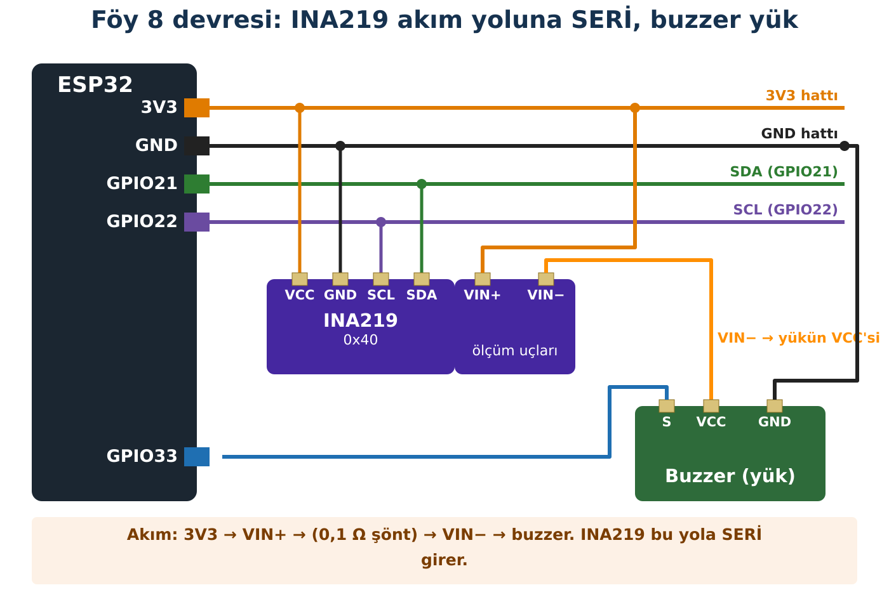

## Hedeflerim

Bu föyün sonunda:

- Akım ölçen bir sensörün neden devreye **seri** bağlandığını açıklayabilirim.
- P = V × I ile gücü hesaplayıp sensörün ölçümüyle karşılaştırabilirim.
- Föy 0'da Ohm yasasıyla hesapladığım akımı ölçerek doğrulayabilirim.
- mA ↔ A ve mW ↔ W dönüşümlerini doğru yapabilirim.

## Malzemeler

| Malzeme | Adet | Not |
| --- | --- | --- |
| ESP32 + USB kablo | 1 |  |
| INA219 modülü | 1 |  |
| Aktif buzzer modülü (Föy 1) | 1 | Yük 1 |
| LED + 330 Ω (Föy 0) | 2 + 2 | Yük 2 ve 3 |
| Breadboard, jumper | yeteri kadar |  |

## Kavram

| Büyüklük | Sembol | Birim | Su borusu benzetmesi |
| --- | --- | --- | --- |
| Gerilim | V | volt (V) | Suyu iten basınç farkı |
| Akım | I | amper (A); 1 A = 1000 mA | Borudan saniyede geçen su |
| Güç | P | watt (W); 1 W = 1000 mW | Suyun saniyede yaptığı iş |

Basit doğru akım devrelerinde **P = V × I**'dır. Volt ile miliamperi çarparsan sonuç **miliwatt** çıkar.

### INA219 nasıl ölçer?

INA219'un ölçüm yolunda çok küçük bir direnç (**şönt**, 0,1 Ω) vardır. Akım bu dirençten geçerken uçlarında küçük bir gerilim oluşur (V = I × R). INA219 bu küçük gerilimi ölçüp akımı hesaplar. Bunun için **akımın tamamı** şöntten geçmelidir; yani INA219 devreye **seri** bağlanır, tıpkı su sayacının borunun **içine** takılması gibi.

:::fen[Fen bağlantısı: Ölçmek ölçüleni etkiler]
Şönt direnci küçük seçilir ki devreye eklenince akımı neredeyse değiştirmesin. 20 mA'lik akımda şönt üzerindeki gerilim yalnız 0,002 V'tur. Her ölçüm aracı ölçtüğü sistemi biraz etkiler; iyi bir ölçüm aracı bu etkiyi en aza indirir.
:::

## Bağlantı



| Bağlantı | Nereden | Nereye |
| --- | --- | --- |
| INA219 VCC, GND, SDA, SCL | ESP32 I2C hattı | 3V3, GND, GPIO21, GPIO22 |
| Ölçüm girişi | 3V3 | INA219 **VIN+** |
| Ölçüm çıkışı | INA219 **VIN−** | Yükün VCC'si (buzzer VCC) |
| Yük GND | Buzzer GND | GND |
| Buzzer sinyali | GPIO33 | Buzzer S/IN |

:::dikkat[Güç kutusu]
Bu föyde yükler **3V3**'ten beslenir; tüm gerilimler 3,3 V ve altındadır. Şebeke gerilimi ve piller bu föyün dışındadır.

VIN+ ve VIN− ters bağlanırsa sensör bozulmaz ama akım **negatif** görünür.
:::

:::rutin[Bağladın mı?]
USB'yi takmadan önce **R2 Güç Kontrol Rutini**'ni uygula.
:::

## Etkinlik 1 — İlk Ölçüm ve Ohm Yasası

**Adafruit INA219** kütüphanesini kur. Önce buzzer yerine **bir LED + 330 Ω**'u yük olarak bağla: VIN− → 330 Ω → LED → GND.

```cpp title="Kod 8.1 — Foy8_INA_Olcum" start=1 dosya=Foy8_INA_Olcum
// FOY 8 - Kod 8.1: Gerilim, akim ve guc olcumu
#include <Wire.h>
#include <Adafruit_INA219.h>

Adafruit_INA219 ina219;          // varsayilan adres 0x40

void setup() {
  Serial.begin(115200);
  Wire.begin(21, 22);
  if (!ina219.begin()) {
    Serial.println("HATA: INA219 bulunamadi. R3 I2C Kontrol Rutini'ni uygula.");
    while (true) delay(100);
  }
  ina219.setCalibration_16V_400mA();   // kucuk akimlar icin daha hassas olcek
  Serial.println("INA219 hazir.");
}

void loop() {
  float gerilimV = ina219.getBusVoltage_V();   // VIN- ile GND arasi
  float akimmA   = ina219.getCurrent_mA();
  float gucmW    = ina219.getPower_mW();

  Serial.print("V = ");  Serial.print(gerilimV, 3);  Serial.print(" V   ");
  Serial.print("I = ");  Serial.print(akimmA, 2);    Serial.print(" mA   ");
  Serial.print("P = ");  Serial.print(gucmW, 1);     Serial.println(" mW");

  delay(1000);
}
```

### Kodun Mantığı

- **Satır 14:** Sensörü küçük akımlar için daha hassas bir ölçeğe ayarlar (en fazla 400 mA).
- **Satır 19:** Yükün gördüğü gerilim (VIN− ile GND arası).
- **Satır 20–21:** Şönt geriliminden hesaplanan akım ve güç.

|  | Föy 0 ★ hesabım | Tahminim | INA219 ölçümü |
| --- | --- | --- | --- |
| 1 LED + 330 Ω akımı (mA) |  |  |  |
| 2 LED, her biri kendi 330 Ω'uyla, paralel (mA) |  |  |  |

## Etkinlik 2 — Buzzer Açık/Kapalı

Yükü buzzer'la değiştir (çizimdeki gibi). **Satır 6–7'u Föy 1 sonucuna göre düzenle.**

```cpp title="Kod 8.2 — Foy8_INA_Buzzer" start=1 dosya=Foy8_INA_Buzzer
// FOY 8 - Kod 8.2: Buzzer acikken ve kapaliyken tuketim
#include <Wire.h>
#include <Adafruit_INA219.h>

const int BUZZER_PIN = 33;
const int BUZZER_ACIK = HIGH;        // Foy 1'deki sonucuna gore
const int BUZZER_KAPALI = LOW;

Adafruit_INA219 ina219;

float ortalamaAkim() {               // 20 olcumun ortalamasi
  float toplam = 0;
  for (int i = 0; i < 20; i++) {
    toplam += ina219.getCurrent_mA();
    delay(10);
  }
  return toplam / 20;
}

void olcVeYaz(const char* durumAdi) {
  float v = ina219.getBusVoltage_V();
  float i = ortalamaAkim();
  Serial.print(durumAdi);
  Serial.print("  V = ");  Serial.print(v, 3);
  Serial.print(" V   I = "); Serial.print(i, 2);
  Serial.print(" mA   P = V x I = "); Serial.print(v * i, 1);
  Serial.println(" mW");
}

void setup() {
  Serial.begin(115200);
  Wire.begin(21, 22);
  pinMode(BUZZER_PIN, OUTPUT);
  digitalWrite(BUZZER_PIN, BUZZER_KAPALI);
  if (!ina219.begin()) {
    Serial.println("HATA: INA219 bulunamadi.");
    while (true) delay(100);
  }
  ina219.setCalibration_16V_400mA();
}

void loop() {
  digitalWrite(BUZZER_PIN, BUZZER_KAPALI);
  delay(1000);                       // degerler otursun
  olcVeYaz("KAPALI");
  delay(2000);

  digitalWrite(BUZZER_PIN, BUZZER_ACIK);
  delay(1000);
  olcVeYaz("ACIK  ");
  delay(2000);
}
```

### Kodun Mantığı

- **Satır 11:** Aktif buzzer'ın içindeki devre akımı hızla değiştirir; tek ölçüm yanıltıcı olabilir. 20 ölçümün **ortalamasını** alırız.
- **Satır 26:** Gücü V × I ile **kendimiz** hesaplarız.
- **Satır 44:** Buzzer açılıp kapandıktan sonra ölçmeden önce kısa bekleriz.

| Durum | Tahminim (mA) | Akım (mA) | P = V × I (mW) |
| --- | --- | --- | --- |
| Buzzer KAPALI |  |  |  |
| Buzzer AÇIK |  |  |  |

**Hesapla:** Buzzer açıkken fazladan harcanan güç kaç mW? Buzzer 1 saat açık kalırsa kaç mWh enerji harcar? (E = P × t)

::yaz{satir=2}

## Hata Avcısı

| Belirti | Olası neden | Ne yaparım? |
| --- | --- | --- |
| Akım 0 mA | Yük VIN−'e değil doğrudan 3V3'e bağlı | Akım yolunu çizimle karşılaştır. |
| Akım negatif | VIN+ / VIN− ters | Uçları değiştir. |
| Gerilim beklenenden çok düşük | Yük çok akım çekiyor ya da kısa devre | USB'yi çıkar, yükü kontrol et. |
| "HATA: INA219 bulunamadi" | I2C bağlantısı; adres farklı | R3. |

### Bilerek hatalı kod

Bu kod LED'in gücünü **"13,2 W"** gibi gösteriyor; bu, bir masa lambası kadar!

```cpp title="Kod 8.3 — Foy8_Hatali" start=1 dosya=Foy8_Hatali
// FOY 8 - Hata Avcisi: Bu kodda bilerek birakilmis bir hata var!
#include <Wire.h>
#include <Adafruit_INA219.h>

Adafruit_INA219 ina219;

void setup() {
  Serial.begin(115200);
  Wire.begin(21, 22);
  if (!ina219.begin()) {
    Serial.println("HATA: INA219 bulunamadi.");
    while (true) delay(100);
  }
  ina219.setCalibration_16V_400mA();
}

void loop() {
  float gerilimV = ina219.getBusVoltage_V();
  float akimmA = ina219.getCurrent_mA();
  float akimA = akimmA * 1000;          // mA -> A donusumu
  float gucW = gerilimV * akimA;

  Serial.print("Guc: ");
  Serial.print(gucW, 3);
  Serial.println(" W");
  delay(1000);
}
```

**Hata:** Hangi satırdaki dönüşüm yanlış? mA'den A'ya geçmek için çarpmak mı, bölmek mi gerekir? Doğru değer yaklaşık kaç W olmalı?

::yaz{satir=3}

## Şimdi Sıra Sende

- [ ] **Görev (herkes):** Güç 30 mW'ı geçince Seri Monitör "YUKSEK GUC" yazsın.
- [ ] **★ Görev:** Enerji sayacı: her saniye P × Δt'yi toplayarak (millis ile) harcanan toplam enerjiyi mWh olarak göster.
- [ ] **★★ Görev:** Değerleri OLED'de göster: üstte V, ortada mA, altta mW, ayrıca akıma göre uzayan bir çubuk.

## YZ ile Destek Al

:::yz[Örnek istem]
"INA219 ile 3,28 V ve 4,1 mA ölçtüm. Gücü kendim hesaplayabilmem için adımları bana soru sorarak yaptır; cevabımı sonra kontrol et."
:::

### YZ cevabını nasıl doğruladım?

::yaz[Hesabım:]{satir=2}

::yaz[YZ'nin kontrol sonucu:]{satir=2}

::yaz[INA219'un kendi güç değeriyle karşılaştırma:]{satir=2}

## Kendimi Kontrol Ediyorum

**1.** INA219'u yükün yanına paralel bağlasaydık ne ölçerdik? Neden seri bağlarız?

::yaz{satir=2}

**2.** 2 LED paralel bağlandığında akım neden yaklaşık iki katına çıktı?

::yaz{satir=2}

**3.** 3,3 V ve 25 mA için gücü mW ve W olarak yaz.

::yaz{satir=2}

**4.** Ölçtüğün LED akımı Föy 0'daki hesabından farklıysa olası nedenleri neler?

::yaz{satir=2}

### Öz değerlendirme

- [ ] Akım ölçen sensörü devreye seri bağlayabiliyorum.
- [ ] P = V × I ile güç hesaplayabiliyorum.
- [ ] Hesap ile ölçümü karşılaştırıp farkı yorumlayabiliyorum.
- [ ] Birim dönüşümü hatalarını fark edebiliyorum.
