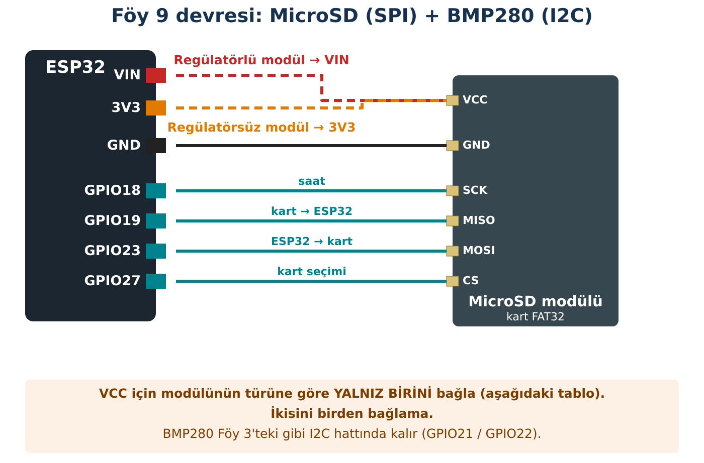

## Hedeflerim

Bu föyün sonunda:

- MicroSD modülünün türüne göre doğru beslemeyi seçebilirim.
- Sensör verisini zaman damgasıyla CSV dosyasına kaydedebilirim.
- Kaydı Türkçe Excel'de doğru açıp grafiğini çizebilirim.
- Hipotez kurup veriye dayanarak sonuç çıkarabilirim.

## Malzemeler

| Malzeme | Adet | Not |
| --- | --- | --- |
| ESP32 + USB kablo | 1 |  |
| MicroSD kart modülü (SPI) | 1 | Türünü öğretmenin belirler |
| MicroSD kart, ≤ 32 GB, FAT32 | 1 | Öğretmen biçimlendirir |
| BMP280 (Föy 3) | 1 |  |
| Kart okuyucu (bilgisayar) | sınıfta 1+ |  |

## Kavram

**SPI**, I2C'ye göre daha hızlı bir haberleşme yöntemidir ve dört hat kullanır: **SCK** (saat), **MOSI** (ESP32'den karta), **MISO** (karttan ESP32'ye), **CS** (kart seçimi). SD kart bu hatlarla ESP32'ye bağlanır.

**CSV**, her satırı bir ölçüm olan düz bir metin tablosudur. İlk satır sütun adlarını içerir. Bu kitapta sütunları **noktalı virgül (;)** ile ayırıyor ve ondalık için **virgül** kullanıyoruz; böylece dosya Türkçe Excel'de doğrudan doğru sütunlara açılır.

| zaman_s | sicaklik_C | basinc_hPa |
| --- | --- | --- |
| 5 | 23,84 | 1008,21 |
| 10 | 23,86 | 1008,19 |
| 15 | 23,85 | 1008,22 |

:::fen[Fen bağlantısı: Örnekleme aralığı]
Ne sıklıkla ölçüm alındığına **örnekleme aralığı** denir. Çok seyrek ölçersen hızlı değişimleri kaçırırsın; çok sık ölçersen dosya büyür ve çoğu satır aynı bilgiyi tekrarlar. Aralık, **neyi araştırdığına** göre seçilir: bir kapının açılmasının etkisi için saniyeler, bir günün sıcaklık değişimi için dakikalar yeterlidir.
:::

:::bilgi[millis() saat değildir]
zaman_s sütunu, kartın **açılışından bu yana** geçen saniyedir; günün saati değildir. Kart yeniden başlarsa sıfırlanır. Bu yüzden kod her açılışta **yeni bir dosya** (veri_1.csv, veri_2.csv …) açar; oturumlar karışmaz.
:::

## Bağlantı



### Önce modülünün türünü belirle

| Modülde ne görüyorsun? | Türü | VCC nereye? |
| --- | --- | --- |
| 3 bacaklı küçük siyah bir regülatör (üzerinde AMS1117 ya da 3.3 yazar) ve 14 bacaklı bir entegre | Regülatörlü | **VIN** (5 V) |
| Regülatör yok; pin yanında "3V3" ya da "3.3V" yazıyor | Regülatörsüz | **3V3** |
| Emin değilim | — | **Bağlama**, öğretmenine sor |

:::dikkat[Güç kutusu]
**VCC:** tabloya göre. Regülatörsüz modülü VIN'e bağlamak kartı ve ESP32'yi bozabilir.

**SPI:** SCK → GPIO18, MISO → GPIO19, MOSI → GPIO23, CS → GPIO27.

**Kart:** USB takılıyken SD kartı takıp çıkarma.
:::

:::rutin[Bağladın mı?]
USB'yi takmadan önce **R2 Güç Kontrol Rutini**'ni uygula.
:::

## Etkinlik 1 — Kart Testi

**Önce tahmin et:** Kodu yüklemeden, aşağıdaki tablonun "Tahminim" sütununu doldur. Sonra yükle ve gözlemini yaz.

```cpp title="Kod 9.1 — Foy9_SD_Test" start=1 dosya=Foy9_SD_Test
// FOY 9 - Kod 9.1: MicroSD testi
#include <SPI.h>
#include <SD.h>

const int SD_CS = 27;

void setup() {
  Serial.begin(115200);
  delay(500);
  SPI.begin(18, 19, 23, SD_CS);          // SCK, MISO, MOSI, CS

  if (!SD.begin(SD_CS, SPI)) {
    Serial.println("HATA: MicroSD baslatilamadi. Kart takili mi? FAT32 mi? Baglanti ve VCC?");
    while (true) delay(100);
  }

  Serial.print("Kart boyutu: ");
  Serial.print(SD.cardSize() / (1024 * 1024));
  Serial.println(" MB");

  File dosya = SD.open("/deneme.txt", FILE_WRITE);   // yaz (varsa ustune)
  if (dosya) {
    dosya.println("Merhaba ESP32!");
    dosya.close();                                    // kaydi bitir
  }

  dosya = SD.open("/deneme.txt");                     // okumak icin ac
  if (dosya) {
    Serial.print("Dosyada yazan: ");
    while (dosya.available()) Serial.write(dosya.read());
    dosya.close();
  } else {
    Serial.println("HATA: deneme.txt acilamadi.");
  }
}

void loop() {
}
```

### Kodun Mantığı

- **Satır 10:** SPI hattını sınıf pinleriyle başlatır.
- **Satır 21:** FILE_WRITE dosyayı **baştan yazar**; içinde ne varsa silinir.
- **Satır 24:** Dosyayı kapatmak kaydı tamamlar.

|  | Tahminim | Gözlemim |
| --- | --- | --- |
| Kart boyutu (MB) |  |  |
| Dosyadan okunan yazı |  |  |

## Etkinlik 2 — Veri Kaydedici

### Tahminim

| Soru | Tahminim |
| --- | --- |
| Kod 9.2 bir dakika çalışınca dosyada kaç **veri satırı** (başlık hariç) olur? (KAYIT_ARALIGI = 5000 ms) |  |
| İlk veri satırındaki zaman_s değeri yaklaşık kaç olur? |  |
| ESP32'yi kapatıp yeniden açarsan kartta kaç dosya olur? Eski kayıt ne olur? |  |

```cpp title="Kod 9.2 — Foy9_CSV_Kaydedici — 1. bölüm (satır 1–29)" start=1 dosya=Foy9_CSV_Kaydedici
// FOY 9 - Kod 9.2: BMP280 veri kaydedici (CSV)
#include <Wire.h>
#include <SPI.h>
#include <SD.h>
#include <Adafruit_BMP280.h>

const int SD_CS = 27;
const unsigned long KAYIT_ARALIGI = 5000;   // ms (ornekleme araligi)

Adafruit_BMP280 bmp;
String dosyaAdi;
unsigned long sonKayit = 0;

void yeniDosyaAdiBul() {                    // veri_1.csv, veri_2.csv ...
  for (int i = 1; i < 1000; i++) {
    String ad = "/veri_" + String(i) + ".csv";
    if (!SD.exists(ad)) {
      dosyaAdi = ad;
      return;
    }
  }
}

String virgullu(float deger, int basamak) { // 23.8 -> 23,8 (Turkce Excel)
  String yazi = String(deger, basamak);
  yazi.replace(".", ",");
  return yazi;
}

```

### Kodun Mantığı (1. bölüm)

- **Satır 8:** Örnekleme aralığı: 5000 ms.
- **Satır 14:** veri_1.csv var mı? Varsa veri_2.csv'ye bakar… İlk boş adı seçer.
- **Satır 24:** 23.84'ü 23,84 yapar (Türkçe Excel için).

```cpp title="Kod 9.2 — Foy9_CSV_Kaydedici — 2. bölüm (satır 30–74)" start=30 dosya=Foy9_CSV_Kaydedici
void setup() {
  Serial.begin(115200);
  Wire.begin(21, 22);
  bool bulundu = bmp.begin(0x76);
  if (!bulundu) bulundu = bmp.begin(0x77);
  if (!bulundu) {
    Serial.println("HATA: BMP280 bulunamadi.");
    while (true) delay(100);
  }
  SPI.begin(18, 19, 23, SD_CS);
  if (!SD.begin(SD_CS, SPI)) {
    Serial.println("HATA: MicroSD baslatilamadi.");
    while (true) delay(100);
  }

  yeniDosyaAdiBul();                        // her acilista yeni dosya
  File dosya = SD.open(dosyaAdi, FILE_WRITE);
  if (!dosya) {
    Serial.println("HATA: dosya olusturulamadi.");
    while (true) delay(100);
  }
  dosya.println("zaman_s;sicaklik_C;basinc_hPa");   // baslik satiri
  dosya.close();
  Serial.print("Kayit dosyasi: ");
  Serial.println(dosyaAdi);
}

void loop() {
  unsigned long simdi = millis();
  if (simdi - sonKayit < KAYIT_ARALIGI) return;   // zamani gelmedi
  sonKayit = simdi;

  String satir = String(simdi / 1000) + ";" +
                 virgullu(bmp.readTemperature(), 2) + ";" +
                 virgullu(bmp.readPressure() / 100.0, 2);

  File dosya = SD.open(dosyaAdi, FILE_APPEND);    // sonuna ekle
  if (dosya) {
    dosya.println(satir);
    dosya.close();
    Serial.println(satir);
  } else {
    Serial.println("HATA: dosyaya yazilamadi!");
  }
}
```

### Kodun Mantığı (2. bölüm)

- **Satır 59:** Föy 5'teki millis() mantığı: zamanı gelmediyse loop'tan hemen çık.
- **Satır 66:** FILE_APPEND, dosyanın **sonuna ekler**; eski satırlar korunur.

### Excel'de açmak

1. USB'yi çıkar, kartı bilgisayara tak.
2. veri_N.csv dosyasını Excel ile aç. Sütunlar ayrı görünmüyorsa: **Veri → Metinden/CSV'den** seç, ayırıcı olarak **noktalı virgül** belirle.
3. zaman_s ve sicaklik_C sütunlarını seçip **Ekle → Dağılım (çizgili)** grafiği oluştur.
4. Google E-Tablolar kullanıyorsan: Dosya → Ayarlar → Yerel ayar **Türkiye** olmalı.

## Mini Araştırma

**Araştırma sorusu:** Sınıfın penceresini 2 dakika açmak iç ortamın sıcaklığını ve basıncını ölçülebilir biçimde değiştirir mi?

::yaz[Hipotezim (ne olacağını ve nedenini düşünüyorum):]{satir=2}

1. Kaydediciyi başlat; pencere **kapalıyken 3 dakika** kaydet (gürültü bandı için).
2. Pencereyi **2 dakika** aç; sensör pencereden 1–2 m uzakta, doğrudan güneş almasın.
3. Pencereyi kapat; **3 dakika** daha kaydet.
4. Zamanları not al: pencere … s'de açıldı, … s'de kapandı.

|  | İlk 3 dk en büyük − en küçük (gürültü bandı) | Pencere açıkken değişim | Gürültü bandından büyük mü? |
| --- | --- | --- | --- |
| Sıcaklık |  |  |  |
| Basınç |  |  |  |

:::bilgi[Sensör de zaman ister]
Sıcaklık sensörü havanın değil kendi gövdesinin sıcaklığını ölçer. Hava değişince gövde hemen değişmez; ısınıp soğuması zaman alır (ısıl gecikme). Bu yüzden pencere açıldıktan bir süre sonra değişim görebilirsin. İlk 3 dakikadaki değişimde yavaş bir kayma (drift) de varsa, bunu gürültüyle karıştırma; bandı yorumlarken kaymayı ayrı not et.
:::

**Sonuç:** Hipotezin doğrulandı mı? Yalnız gürültü bandından büyük değişimleri "gerçek değişim" say. Basınç değişmediyse bunu nasıl açıklarsın?

::yaz{satir=3}

## Kodu Tamamla

Bu kodun **büyük bölümü hazır** (klasör: Foy9_Bosluk). Yalnız numaralı boşlukları (`___1___` gibi) doldur. Önce her boşluğa ne yazacağını **kâğıtta tahmin et**, sonra dosyada yaz, yükle ve çalıştır. Derleyici hata verirse mesaj sana ipucu verir.

```cpp title="Kod 9.4 — Foy9_Bosluk (boşluklu; kodun geri kalanı klasörde hazır)" start=42 dosya=Foy9_Bosluk
void loop() {
  unsigned long simdi = millis();
  if (simdi - sonKayit ___1___ KAYIT_ARALIGI) return;  // zamani gelmediyse cik
  sonKayit = ___2___;

  String satir = String(simdi / ___3___) + ";" + virgullu(bmp.readTemperature(), 2);

  File dosya = SD.open(dosyaAdi, ___4___);  // dosyanin SONUNA ekle
  if (dosya) {
    dosya.println(___5___);
    dosya.___6___();  // kaydi tamamla
    Serial.println(satir);
  } else {
    Serial.println("HATA: dosyaya yazilamadi!");
  }
}
```

| Boşluk | Ne yazacağım? | İpucu |
| --- | --- | --- |
| `___1___` |  | Geçen süre (simdi − sonKayit) aralıktan **küçükse** henüz zamanı gelmemiştir. Hangi karşılaştırma işareti? |
| `___2___` |  | Kaydı yaptık; "son kayıt zamanı" artık ne olmalı? (bir değişkenin adı) |
| `___3___` |  | zaman_s saniye olmalı; millis() milisaniye verir. Kaça bölersin? |
| `___4___` |  | Dosyanın **sonuna** eklemek için: FILE_WRITE mı, FILE_APPEND mi? |
| `___5___` |  | Dosyaya hangi değişkeni yazacaksın? |
| `___6___` |  | Kaydı tamamlayan fonksiyon (parantezsiz yaz). |

**Sorgula:** Boşluk 4'e FILE_WRITE yazsaydın dosyada kaç veri satırı kalırdı? Neden?

::yaz{satir=2}

## Hata Avcısı

| Belirti | Olası neden | Ne yaparım? |
| --- | --- | --- |
| "HATA: MicroSD baslatilamadi" | Kart takılı değil; FAT32 değil; VCC yanlış; SPI kablosu | Kartı kontrol et; modül türünü öğretmenine sor; SPI tablosu. |
| Excel'de her şey tek sütunda | Ayırıcı tanınmadı | Veri → Metinden/CSV'den, ayırıcı ";". |
| Sayılar tarih gibi görünüyor | Ondalık ayarı | Kod 9.2'deki virgullu() kullanılıyor mu? |
| Dosyada zaman 0'dan birkaç kez başlıyor | Eski kod: tek dosya | Kod 9.2 her açılışta yeni dosya açar. |

### Bilerek hatalı kod

Bu kaydedici 10 dakika çalıştı; ama bilgisayarda dosyayı açınca **yalnız tek satır** var.

```cpp title="Kod 9.3 — Foy9_Hatali" start=1 dosya=Foy9_Hatali
// FOY 9 - Hata Avcisi: Bu kodda bilerek birakilmis bir hata var!
#include <Wire.h>
#include <SPI.h>
#include <SD.h>
#include <Adafruit_BMP280.h>

Adafruit_BMP280 bmp;

void setup() {
  Serial.begin(115200);
  Wire.begin(21, 22);
  if (!bmp.begin(0x76)) {
    Serial.println("HATA: BMP280 bulunamadi.");
    while (true) delay(100);
  }
  SPI.begin(18, 19, 23, 27);
  if (!SD.begin(27, SPI)) {
    Serial.println("HATA: MicroSD baslatilamadi.");
    while (true) delay(100);
  }
}

void loop() {
  File dosya = SD.open("/veri.csv", FILE_WRITE);
  if (dosya) {
    dosya.print(millis() / 1000);
    dosya.print(";");
    dosya.println(bmp.readTemperature(), 2);
    dosya.close();
  }
  delay(5000);
}
```

**Hata:** Hangi satırdaki hangi sözcük yanlış? Etkinlik 1'deki Kodun Mantığı'nı kullan.

::yaz{satir=2}

## Şimdi Sıra Sende

- [ ] **Görev (herkes):** BH1750 ekle ve lux sütununu kaydet (başlık satırını da güncelle).
- [ ] **★ Görev:** Butona basınca kayıt dursun/başlasın; Seri Monitör'de durum yazsın.
- [ ] **★★ Görev:** 2 saatlik bir kayıt için örnekleme aralığı seç ve gerekçelendir; kaç satır oluşacağını hesapla.

## YZ ile Destek Al

:::yz[Örnek istem]
"Sınıfımın sıcaklığını 2 saat kaydedeceğim. 1 s, 10 s, 1 dk ve 5 dk örnekleme aralıklarının artılarını ve eksilerini bir tablo olarak karşılaştır. Kod yazma; seçimi bana bırak."
:::

### YZ cevabını nasıl doğruladım?

::yaz[Seçtiğim aralık ve nedeni:]{satir=2}

::yaz[YZ'nin tablosunda katılmadığım bir nokta:]{satir=2}

::yaz[Seçimimi hangi veriyle sınayabilirim?]{satir=2}

## Kendimi Kontrol Ediyorum

**1.** FILE_WRITE ile FILE_APPEND arasındaki fark nedir? Kaydedicide hangisini kullanmalıyız?

::yaz{satir=2}

**2.** Kart yeniden başlarsa zaman_s neden sıfırlanır? Kod 9.2 bu sorunu nasıl yönetiyor?

::yaz{satir=2}

**3.** Mini araştırmada basınç 0,05 hPa değişti; gürültü bandın 0,08 hPa. Ne sonuç çıkarırsın?

::yaz{satir=2}

**4.** Regülatörsüz bir SD modülünü VIN'e bağlamak neden risklidir?

::yaz{satir=2}

### Öz değerlendirme

- [ ] SD modülünün beslemesini doğru seçebiliyorum.
- [ ] Sensör verisini CSV olarak kaydedebiliyorum.
- [ ] CSV dosyasını açıp grafik çizebiliyorum.
- [ ] Veriye dayanarak hipotezimi değerlendirebiliyorum.
