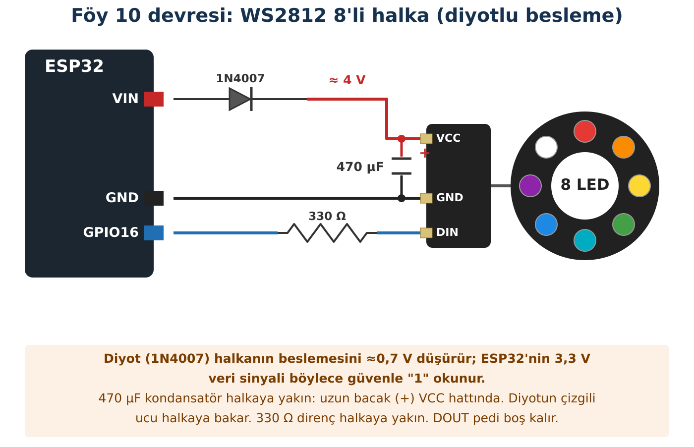

## Hedeflerim

Bu föyün sonunda:

- WS2812'yi güvenli ve doğru seviyede bağlayabilirim.
- Kırmızı, yeşil ve mavi ışığın karışımını tahmin edip gözlemleyebilirim.
- Birden fazla sensöre göre öncelikli karar verebilirim.
- Histerezisin karar titremesini nasıl önlediğini açıklayabilirim.

## Malzemeler

| Malzeme | Adet | Not |
| --- | --- | --- |
| ESP32 + USB kablo | 1 |  |
| WS2812 8'li NeoPixel halka | 1 | Pinleri öğretmen lehimler |
| 1N4007 diyot | 1 | Besleme için |
| 470 µF 16 V kondansatör | 1 | Besleme hattı |
| 330 Ω direnç | 1 | Veri hattı |
| BH1750, BMP280, HC-SR501 | birer | Föy 3, 4, 5 |
| Breadboard, jumper | yeteri kadar |  |

## Kavram

WS2812'nin içinde kırmızı, yeşil ve mavi üç küçük LED ile bunları süren bir yonga vardır. ESP32 tek bir veri hattından, çok hızlı bir sinyalle her pikselin üç renginin parlaklığını (0–255) gönderir. Bu yüzden onlarca piksel tek bir pinle yönetilebilir. Senin halkanda 8 LED art arda bağlıdır: veri önce ilk LED'e girer, o kendi rengini alır, kalanını sonrakine aktarır (DIN → DOUT).

:::fen[Fen bağlantısı: Işıkta renk karışımı]
Boyalar karışınca renk koyulaşır; **ışıklar** karışınca ise **aydınlanır**. Kırmızı, yeşil ve mavi ışık farklı oranlarda üst üste gelince gözümüz başka renkler algılar; buna **ek (toplamalı) renk karışımı** denir. Telefon ve bilgisayar ekranları da bu ilkeyle çalışır.
:::

### Seviye uyumu neden önemli?

5 V ile beslenen bir WS2812, veri hattındaki sinyali "1" sayabilmek için beslemesinin yaklaşık %70'ini ister: 5 V × 0,7 = 3,5 V. ESP32'nin sinyali ise en fazla 3,3 V'tur; sınırda kalır ve ilk LED bazen yanlış renk gösterir. Çözümümüz: halkayı bir **diyot** üzerinden beslemek. Diyot yaklaşık 0,7 V "yer"; halka ≈ 4,3 V ile beslenir ve eşik 4,3 × 0,7 ≈ 3,0 V'a iner. ESP32'nin 3,3 V'u artık güvenle "1" sayılır. (Föy 0'da VIN'i ölçmüştün: USB'den gelen gerilim çoğu zaman 5 V'tan biraz düşüktür; bu yüzden buradaki sayılar yaklaşıktır, sonuç değişmez.)

## Bağlantı



:::dikkat[Güç kutusu]
**Halka beslemesi:** VIN → **1N4007** (çizgili uç halkaya) → halkanın **VCC (5 V)** pedi. Diyotu ters takarsan halka yanmaz ama bir şey bozulmaz.

**Kondansatör:** **470 µF 16 V** kondansatörü halkanın VCC ve GND pedleri arasına, halkaya yakın tak. **Uzun bacak (+) VCC'ye, çizgili bacak (−) GND'ye.** Ters takılırsa kondansatör ısınır, şişer ya da patlayabilir.

**Veri:** GPIO16 → **330 Ω** → halkanın **DIN** pedi. DOUT pedi boş kalır. Direnç halkaya yakın olsun.

**Parlaklık ve akım:** Parlaklık en fazla **40** (kodda). 8 LED beyaz yanarken yaklaşık 75 mA çeker; parlaklığı artırmak akımı ve ısıyı artırır. Parlak ışığa doğrudan bakma.

**Lehim:** Halkanın pedlerine pin header'ı öğretmen lehimler; öğrenci lehim yapmaz.
:::

:::bilgi[Sensörler]
BH1750 ve BMP280 Föy 3–4'teki gibi I2C hattında, PIR Föy 5'teki gibi GPIO32'de kalır.
:::

:::rutin[Bağladın mı?]
USB'yi takmadan önce **R2 Güç Kontrol Rutini**'ni uygula.
:::

## Etkinlik 1 — Renkleri Karıştır

**Adafruit NeoPixel** kütüphanesini kur.

```cpp title="Kod 10.1 — Foy10_Renk_Karisimi" start=1 dosya=Foy10_Renk_Karisimi
// FOY 10 - Kod 10.1: Isik renklerini karistir (8 LED'li halka)
#include <Adafruit_NeoPixel.h>

const int PIXEL_PIN = 16;
const int PIXEL_SAYISI = 8;          // halkadaki LED sayisi
Adafruit_NeoPixel halka(PIXEL_SAYISI, PIXEL_PIN, NEO_GRB + NEO_KHZ800);

void renkGoster(const char* ad, int k, int y, int m) {
  Serial.print(ad);
  Serial.print("  (K=");  Serial.print(k);
  Serial.print(" Y=");    Serial.print(y);
  Serial.print(" M=");    Serial.print(m);
  Serial.println(")");
  halka.fill(halka.Color(k, y, m));   // kirmizi, yesil, mavi: 8 LED'in hepsi
  halka.show();
  delay(3000);
}

void setup() {
  Serial.begin(115200);
  halka.begin();
  halka.setBrightness(40);          // 0-255: goz ve akim icin dusuk tut
}

void loop() {
  renkGoster("1: Kirmizi", 255, 0, 0);
  renkGoster("2: Yesil", 0, 255, 0);
  renkGoster("3: Mavi", 0, 0, 255);
  renkGoster("4: Kirmizi + Yesil", 255, 255, 0);
  renkGoster("5: Yesil + Mavi", 0, 255, 255);
  renkGoster("6: Kirmizi + Mavi", 255, 0, 255);
  renkGoster("7: Uc renk birden", 255, 255, 255);
  renkGoster("8: Hepsi kapali", 0, 0, 0);
}
```

### Kodun Mantığı

- **Satır 6:** 8 LED'li halka, GPIO16, renk sırası GRB (çoğu WS2812).
- **Satır 14:** halka.Color(k, y, m) kırmızı, yeşil, mavi değerlerinden (0–255) bir renk oluşturur; fill() bu rengi halkadaki **8 LED'in hepsine** verir.
- **Satır 15:** Hazırlanan rengi halkaya gönderir (OLED'deki display() gibi).
- **Satır 22:** Bütün renkleri 40/255 oranında kısar.

| Adım | Karışım | Tahminim | Gözlemim |
| --- | --- | --- | --- |
| 4 | Kırmızı + Yeşil |  |  |
| 5 | Yeşil + Mavi |  |  |
| 6 | Kırmızı + Mavi |  |  |
| 7 | Üçü birden |  |  |

:::dikkat[Kırmızı ile yeşil yer değiştiriyorsa]
Adım 1'de halka yeşil yanıyorsa modülün renk sırası farklıdır. Satır 6'teki NEO_GRB'yi NEO_RGB yap.
:::

## Etkinlik 2 — Durum Panosu

Pano dört durumdan birini gösterir. Aynı anda birden fazla koşul doğru olabilir; bu yüzden bir **öncelik sırası** gerekir: ilk doğru olan kazanır.

| Öncelik | Koşul | Durum | Renk |
| --- | --- | --- | --- |
| 1 | PIR hareket algıladı | ALARM | Kırmızı |
| 2 | Ortam karanlık | KARANLIK | Mavi |
| 3 | Sıcaklık &gt; 28 °C | SICAK | Turuncu |
| 4 | Hiçbiri | NORMAL | Yeşil |

:::bilgi[Renk bir kod]
Buradaki renkler bir ölçüm sonucu değil, bizim seçtiğimiz **durum kodlarıdır**. İyi bir renk kodu sezgiye uyar: tehlike için kırmızı, "her şey yolunda" için yeşil.
:::

### Tahminim

Pano kodunu yüklemeden önce, öncelik tablosuna bakarak her senaryoda **hangi rengin yanacağını** tahmin et. Sonra senaryoları sırayla kur ve gözlemini yaz.

| Senaryo | Tahminim (durum / renk) | Gözlemim |
| --- | --- | --- |
| Sınıf ışığı, oda sıcaklığı, hareket yok |  |  |
| Sensörün üstünü elinle kapat (karanlık), hareket yok |  |  |
| Sensör karanlık ve sen PIR'ın önünden geçiyorsun |  |  |
| BMP280'i avucunda ısıt (sıcaklık 28 °C'yi geçsin), hareket yok |  |  |
| BMP280 sıcak ve PIR hareket görüyor |  |  |

### Histerezis

Föy 4'te ışık eşiğin çevresinde oynarken lambanın titrediğini gördün. Çözüm, **iki eşik** kullanmaktır: 80 lx'in altına inince "karanlık" olur, ama "aydınlık"a dönmek için 120 lx'in **üstüne** çıkmak gerekir. Aradaki bölgede sistem **son durumunu korur**. Buna **histerezis** denir; kalorifer termostatları da böyle çalışır.

```cpp title="Kod 10.2 — Foy10_Durum_Panosu — 1. bölüm (satır 1–42)" start=1 dosya=Foy10_Durum_Panosu
// FOY 10 - Kod 10.2: Akilli durum panosu
#include <Wire.h>
#include <BH1750.h>
#include <Adafruit_BMP280.h>
#include <Adafruit_NeoPixel.h>

const int PIR_PIN = 32;
const int PIXEL_PIN = 16;
const int PIXEL_SAYISI = 8;           // 8 LED'li halka
const float KARANLIK_GIRIS = 80.0;    // lux bunun altina inerse KARANLIK
const float KARANLIK_CIKIS = 120.0;   // lux bunun ustune cikarsa AYDINLIK
const float SICAK_ESIGI = 28.0;       // santigrat derece

BH1750 isikSensoru;
Adafruit_BMP280 bmp;
Adafruit_NeoPixel halka(PIXEL_SAYISI, PIXEL_PIN, NEO_GRB + NEO_KHZ800);
bool karanlik = false;                // histerezis icin hatirlanan durum

void renkYak(int k, int y, int m) {
  halka.fill(halka.Color(k, y, m));        // 8 LED'in hepsi
  halka.show();
}

void setup() {
  Serial.begin(115200);
  Wire.begin(21, 22);
  pinMode(PIR_PIN, INPUT);
  halka.begin();
  halka.setBrightness(40);

  if (!isikSensoru.begin(BH1750::CONTINUOUS_HIGH_RES_MODE, 0x23, &Wire)) {
    Serial.println("HATA: BH1750 bulunamadi.");
    while (true) delay(100);
  }
  bool bulundu = bmp.begin(0x76);
  if (!bulundu) bulundu = bmp.begin(0x77);
  if (!bulundu) {
    Serial.println("HATA: BMP280 bulunamadi.");
    while (true) delay(100);
  }
}

```

### Kodun Mantığı (1. bölüm)

- **Satır 17:** Histerezis için sistemin bir önceki kararını **hatırlar**.

```cpp title="Kod 10.2 — Foy10_Durum_Panosu — 2. bölüm (satır 43–69)" start=43 dosya=Foy10_Durum_Panosu
void loop() {
  float lux = isikSensoru.readLightLevel();
  float sicaklik = bmp.readTemperature();
  int hareket = digitalRead(PIR_PIN);

  // Histerezis: durum yalniz sinirlar asilinca degisir
  if (!karanlik && lux < KARANLIK_GIRIS) karanlik = true;
  if (karanlik && lux > KARANLIK_CIKIS) karanlik = false;

  // Oncelik: ilk dogru kosul kazanir
  const char* durumAdi;
  if (hareket == HIGH) {
    renkYak(255, 0, 0);    durumAdi = "ALARM";      // kirmizi
  } else if (karanlik) {
    renkYak(0, 0, 255);    durumAdi = "KARANLIK";   // mavi
  } else if (sicaklik > SICAK_ESIGI) {
    renkYak(255, 80, 0);   durumAdi = "SICAK";      // turuncu
  } else {
    renkYak(0, 255, 0);    durumAdi = "NORMAL";     // yesil
  }

  Serial.print(lux, 0);        Serial.print(" lx   ");
  Serial.print(sicaklik, 1);   Serial.print(" C   PIR=");
  Serial.print(hareket);       Serial.print("   -> ");
  Serial.println(durumAdi);
  delay(500);
}
```

### Kodun Mantığı (2. bölüm)

- **Satır 49–50:** Durum yalnız sınırlardan biri aşılınca değişir; 80–120 arasında hiçbir şey değişmez.
- **Satır 54–60:** else if zinciri öncelik tablosunu uygular.

## Deney — Titreme Var mı?

Sensörü elinle yavaşça kapatıp aç; ışığı 80–120 lx civarında tutmaya çalış. Sonra kodda KARANLIK_CIKIS'ı 80 yaparak (histerezisi kaldırarak) tekrarla.

| Ayar | Tahminim | Gözlemim (renk titriyor mu?) |
| --- | --- | --- |
| 80 / 120 (histerezis var) |  |  |
| 80 / 80 (histerezis yok) |  |  |

:::bilgi[% işlemi: kalan]
a % b, a'nın b'ye bölümünden **kalanı** verir: 7 % 8 = 7, ama 8 % 8 = 0. Halkada son LED'den (7) sonra yeniden ilk LED'e (0) dönmek için **(sira + 1) % 8** kullanırız.
:::

## Kodu Tamamla

Bu kodun **büyük bölümü hazır** (klasör: Foy10_Bosluk). Yalnız numaralı boşlukları (`___1___` gibi) doldur. Önce her boşluğa ne yazacağını **kâğıtta tahmin et**, sonra dosyada yaz, yükle ve çalıştır. Derleyici hata verirse mesaj sana ipucu verir.

```cpp title="Kod 10.4 — Foy10_Bosluk (boşluklu; kodun geri kalanı klasörde hazır)" start=29 dosya=Foy10_Bosluk
void loop() {
  float lux = isikSensoru.readLightLevel();

  if (!karanlik && lux < ___1___) karanlik = true;  // karanliga gir
  if (karanlik && lux > ___2___) karanlik = ___3___;  // aydinliga don

  if (millis() - sonAdim >= 100) {  // her 100 ms'de bir adim
    sonAdim = millis();
    halka.clear();
    if (karanlik) {
      halka.setPixelColor(___4___, halka.Color(0, 0, 255));  // mavi ISIK
      sira = (sira + 1) % ___5___;  // sonraki LED
    } else {
      halka.fill(halka.Color(0, 255, 0));  // hepsi yesil
    }
    halka.show();
  }
}
```

| Boşluk | Ne yazacağım? | İpucu |
| --- | --- | --- |
| `___1___` |  | Karanlığa **girmek** için hangi sabit? (sabitin adını yaz) |
| `___2___` |  | Aydınlığa **dönmek** için hangi sabit? Neden iki farklı eşik var? (histerezis) |
| `___3___` |  | Artık karanlık değil: true mu, false mu? |
| `___4___` |  | Hangi LED yanacak? Yanan LED'in numarasını tutan değişkenin adı. |
| `___5___` |  | Halkada kaç LED var? (sabitin adını yaz) |

**Sorgula:** Kodda % `___5___` olmasaydı sira 8 olunca ne olurdu? Halkada 8 numaralı LED var mı?

::yaz{satir=2}

## Hata Avcısı

| Belirti | Olası neden | Ne yaparım? |
| --- | --- | --- |
| Halka hiç yanmıyor | Diyot ters; VCC/DIN karışık; DOUT'a bağlı | Çizimi kontrol et; ok yönü DIN → DOUT. |
| Yalnız bir LED yanıyor | PIXEL_SAYISI 1 kalmış ya da kod yalnız ilk LED ayarlıyor | Kodda PIXEL_SAYISI = 8 ve fill() kullanıldığını kontrol et. |
| Rastgele renkler | Seviye sorunu; GND ortak değil; direnç yok | Diyotlu besleme ve 330 Ω. |
| Hep kırmızı | PIR hâlâ HIGH (ısınma / süre vidası) | Föy 5; 1 dk bekle. |
| Kırmızı ile yeşil ters | Renk sırası | NEO_GRB ↔ NEO_RGB. |

### Bilerek hatalı kod

Sıcak bir öğleden sonra sınıfa biri giriyor ama pano **kırmızı değil turuncu** yanıyor. Kod 10.2'den tek farkı öncelik sırası.

```cpp title="Kod 10.3 — Foy10_Hatali" start=1 dosya=Foy10_Hatali
// FOY 10 - Hata Avcisi: Bu kodda bilerek birakilmis bir hata var!
#include <Wire.h>
#include <BH1750.h>
#include <Adafruit_BMP280.h>
#include <Adafruit_NeoPixel.h>

const int PIR_PIN = 32;
const int PIXEL_PIN = 16;
const int PIXEL_SAYISI = 8;           // 8 LED'li halka
const float KARANLIK_GIRIS = 80.0;    // lux bunun altina inerse KARANLIK
const float KARANLIK_CIKIS = 120.0;   // lux bunun ustune cikarsa AYDINLIK
const float SICAK_ESIGI = 28.0;       // santigrat derece

BH1750 isikSensoru;
Adafruit_BMP280 bmp;
Adafruit_NeoPixel halka(PIXEL_SAYISI, PIXEL_PIN, NEO_GRB + NEO_KHZ800);
bool karanlik = false;                // histerezis icin hatirlanan durum

void renkYak(int k, int y, int m) {
  halka.fill(halka.Color(k, y, m));        // 8 LED'in hepsi
  halka.show();
}

void setup() {
  Serial.begin(115200);
  Wire.begin(21, 22);
  pinMode(PIR_PIN, INPUT);
  halka.begin();
  halka.setBrightness(40);

  if (!isikSensoru.begin(BH1750::CONTINUOUS_HIGH_RES_MODE, 0x23, &Wire)) {
    Serial.println("HATA: BH1750 bulunamadi.");
    while (true) delay(100);
  }
  bool bulundu = bmp.begin(0x76);
  if (!bulundu) bulundu = bmp.begin(0x77);
  if (!bulundu) {
    Serial.println("HATA: BMP280 bulunamadi.");
    while (true) delay(100);
  }
}

void loop() {
  float lux = isikSensoru.readLightLevel();
  float sicaklik = bmp.readTemperature();
  int hareket = digitalRead(PIR_PIN);

  // Histerezis: durum yalniz sinirlar asilinca degisir
  if (!karanlik && lux < KARANLIK_GIRIS) karanlik = true;
  if (karanlik && lux > KARANLIK_CIKIS) karanlik = false;

  // Oncelik: ilk dogru kosul kazanir
  const char* durumAdi;
  if (sicaklik > SICAK_ESIGI) {
    renkYak(255, 80, 0);   durumAdi = "SICAK";      // turuncu
  } else if (hareket == HIGH) {
    renkYak(255, 0, 0);    durumAdi = "ALARM";      // kirmizi
  } else if (karanlik) {
    renkYak(0, 0, 255);    durumAdi = "KARANLIK";   // mavi
  } else {
    renkYak(0, 255, 0);    durumAdi = "NORMAL";     // yesil
  }

  Serial.print(lux, 0);        Serial.print(" lx   ");
  Serial.print(sicaklik, 1);   Serial.print(" C   PIR=");
  Serial.print(hareket);       Serial.print("   -> ");
  Serial.println(durumAdi);
  delay(500);
}
```

**Hata:** Hangi koşul yanlış sırada? Bir alarm sisteminde bu neden tehlikeli?

::yaz{satir=2}

## Şimdi Sıra Sende

- [ ] **Görev (herkes):** SICAK durumu için eşiği sınıfına göre seç ve gerekçelendir.
- [ ] **★ Görev:** ALARM'da halka yanıp sönsün ya da tek bir kırmızı LED halkada dönsün (millis ile, Föy 5). İpucu: setPixelColor(i, renk) halkadaki i. LED'i ayarlar (i = 0–7); halka.clear() hepsini söndürür; halka.show() ile gönder.
- [ ] **★★ Görev:** Föy 8'deki INA219'u halkanın besleme yoluna (diyotla halka VCC'si arasına, seri) koy; parlaklık 10, 40, 80 (80'i geçme) ve renkler kırmızı/beyaz için akımı ölçüp tabloya yaz. Hangi renk en çok akım çekiyor, neden?

## YZ ile Destek Al

:::yz[Örnek istem]
"Işık sensörüne göre karar veren sistemimde eşik civarında durum sürekli değişiyor. Histerezisi bir termostat örneğiyle açıkla ve bana kendi eşiklerimi nasıl seçeceğimi soran üç soru sor. Kod yazma."
:::

### YZ cevabını nasıl doğruladım?

::yaz[Seçtiğim giriş / çıkış eşikleri:]{satir=2}

::yaz[Neden bu aralığı seçtim (ölçümlerime dayanarak)?]{satir=2}

::yaz[Deneyde titreme bitti mi?]{satir=2}

## Kendimi Kontrol Ediyorum

**1.** WS2812'yi neden diyot üzerinden besledik? Hesabını yaz.

::yaz{satir=2}

**2.** Kırmızı ve yeşil ışık karışınca neden sarı görürüz, ama kırmızı ve yeşil boya karışınca kahverengiye yakın bir renk oluşur?

::yaz{satir=3}

**3.** Histerezis olmadan ışık 99–101 lx arasında oynarsa ne olur?

::yaz{satir=2}

**4.** Öncelik sırasını değiştirmek bir güvenlik sistemi için neden önemli bir karardır?

::yaz{satir=2}

### Öz değerlendirme

- [ ] WS2812'yi güvenli ve doğru seviyede bağlayabiliyorum.
- [ ] Işık renklerinin karışımını açıklayabiliyorum.
- [ ] Öncelikli karar zinciri yazabiliyorum.
- [ ] Histerezisle titremeyi önleyebiliyorum.
