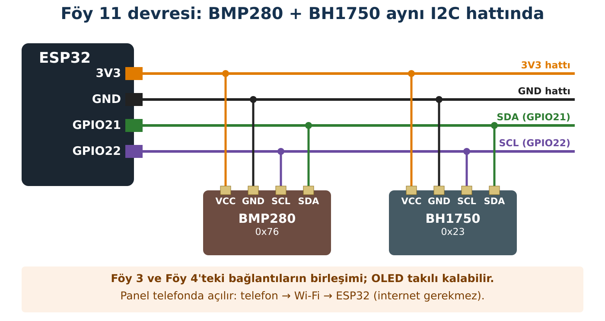

## Hedeflerim

Bu föyün sonunda:

- ESP32'nin veriyi JSON olarak sunmasını sağlayabilirim.
- Web sayfasının veriyi nasıl düzenli çektiğini açıklayabilirim.
- Bir sorunun sensör, ESP32, ağ ya da sayfa katmanında olduğunu ayırabilirim.
- Bağlantı koptuğunda kullanıcıyı uyaran bir arayüzün önemini açıklayabilirim.

## Malzemeler

| Malzeme | Adet | Not |
| --- | --- | --- |
| ESP32 + USB kablo | 1 |  |
| BMP280, BH1750 | birer | Föy 3, 4 |
| Akıllı telefon | grup başına 1 |  |

## Kavram: Panel Nasıl Çalışır?

| Katman | Görevi | Nasıl test ederim? |
| --- | --- | --- |
| 1. Sensör | Ölçer | Seri Monitör uyarıları; I2C tarayıcı |
| 2. ESP32 | /veri adresinde JSON sunar | Tarayıcıda 192.168.4.1/veri |
| 3. Ağ | Telefonu ESP32'ye bağlar | Ağ adı, IP, mobil veri |
| 4. Sayfa | JSON'u her 2 s'de çeker, gösterir | Sayfadaki durum satırı |

**JSON**, veriyi hem insanın hem programın okuyabileceği biçimde yazmanın yoludur: {"sicaklik":24.31,"basinc":1008.2,"lux":312.5}. Sayfadaki JavaScript bu metni okur ve kutulara yerleştirir. Sensör okunamazsa değer **null** olur; sayfa bunu "hata" olarak gösterir. Uydurma bir sayı göstermez.

:::fen[Fen bağlantısı: Ölçüm yok ile sıfır farklıdır]
Bir sensör okunamadığında ekrana 0 yazmak kolaydır ama yanlıştır: 0 °C gerçek bir ölçüm sonucudur, **null** ise "ölçüm yapılamadı" demektir. Bilimsel veri kaydında eksik değer ile sıfır karıştırılmaz.

Örnek: ölçümler 20 °C, 22 °C ve okunamayan bir değer olsun. Okunamayanı 0 sayarsan ortalama (20 + 22 + 0) ÷ 3 = 14 °C çıkar; eksik bırakırsan (20 + 22) ÷ 2 = 21 °C. Panelin "hata" göstermesi bu yüzden dürüstlüktür.
:::

:::bilgi[Neden iki dosya?]
Ana kod (Kod 11.1) sensörleri okur ve istekleri karşılar. Telefonda görünen sayfa ayrı bir sekmede (sayfa.h) durur. Böylece C++ ile HTML/JavaScript birbirine karışmaz.
:::

## Bağlantı



:::dikkat[Güç kutusu]
BMP280 ve BH1750 → 3V3, aynı I2C hattı. Başka besleme yok.
:::

:::rutin[Bağladın mı?]
USB'yi takmadan önce **R2 Güç Kontrol Rutini**'ni uygula.
:::

## Etkinlik 1 — Önce Veri

Paylaşım klasöründeki **Foy11_Veri_JSON** klasörünü aç. GRUP_NO ve KANAL'ı düzenle, yükle.

### Tahminim

| Soru | Tahminim |
| --- | --- |
| Tarayıcıya **192.168.4.1/veri** yazınca sayfa mı, yoksa düz bir metin mi görürsün? Metin nasıl görünür? |  |
| Metinde hangi üç alan (anahtar) olur? |  |
| BH1750 bağlı değilse lux alanının değeri ne olur: 0, boş, yoksa **null**? |  |

```cpp title="Kod 11.1 — Foy11_Veri_JSON (ana dosya)" start=1 dosya=Foy11_Veri_JSON
// FOY 11 - Kod 11.1: Sensor verisini agdan sunan ESP32
#include <Wire.h>
#include <WiFi.h>
#include <WebServer.h>
#include <Adafruit_BMP280.h>
#include <BH1750.h>
#include "sayfa.h"                     // Kod 11.2: panel sayfasi

const int GRUP_NO = 1;                 // KENDI GRUP NUMARANI YAZ
const int KANAL = 1;                   // ogretmenin verdigi kanal
const char* PAROLA = "robot123";

Adafruit_BMP280 bmp;
BH1750 isikSensoru;
WebServer sunucu(80);
bool bmpHazir = false;                 // sensorler bulundu mu?
bool isikHazir = false;

String sayiVeyaNull(bool hazir, float deger, int basamak) {
  if (!hazir || isnan(deger)) return "null";   // okunamadi
  return String(deger, basamak);
}

void veriGonder() {                    // /veri adresi
  float lux = isikSensoru.readLightLevel();           // hata olursa negatif
  String json = "{";
  json += "\"sicaklik\":" + sayiVeyaNull(bmpHazir, bmp.readTemperature(), 2) + ",";
  json += "\"basinc\":" + sayiVeyaNull(bmpHazir, bmp.readPressure() / 100.0, 2) + ",";
  json += "\"lux\":" + sayiVeyaNull(isikHazir && lux >= 0, lux, 1);
  json += "}";
  sunucu.send(200, "application/json", json);
}

void anaSayfa() {                      // / adresi
  sunucu.send(200, "text/html; charset=utf-8", SAYFA);
}

void setup() {
  Serial.begin(115200);
  Wire.begin(21, 22);
  bmpHazir = bmp.begin(0x76);
  if (!bmpHazir) bmpHazir = bmp.begin(0x77);
  if (!bmpHazir) Serial.println("UYARI: BMP280 bulunamadi; panelde 'hata' gorunecek.");
  isikHazir = isikSensoru.begin(BH1750::CONTINUOUS_HIGH_RES_MODE, 0x23, &Wire);
  if (!isikHazir) Serial.println("UYARI: BH1750 bulunamadi; panelde 'hata' gorunecek.");

  String agAdi = "ESP32-G" + String(GRUP_NO);
  WiFi.softAP(agAdi.c_str(), PAROLA, KANAL);
  Serial.print(agAdi);
  Serial.print("  IP: ");
  Serial.println(WiFi.softAPIP());

  sunucu.on("/", anaSayfa);
  sunucu.on("/veri", veriGonder);
  sunucu.begin();
}

void loop() {
  sunucu.handleClient();
}
```

### Kodun Mantığı

- **Satır 16:** Sensör bulunamasa bile ESP32 çalışmaya devam eder; ama hangi sensörün hazır olduğunu hatırlar.
- **Satır 19:** Değer okunamıyorsa sayı yerine **null** yazar.
- **Satır 24:** JSON metnini parça parça oluşturur. Her değerden sonra virgül, sonda kapanış parantezi.
- **Satır 54:** /veri adresine veri, / adresine sayfa cevap verir.

Telefonu ağa bağla ve tarayıcıya önce **192.168.4.1/veri** yaz. Sayfayı yenile: değerler değişiyor mu?

|  |  |
| --- | --- |
| /veri adresinde gördüğüm metin: |  |
| Yenileyince ne değişti? |  |

## Etkinlik 2 — Panel

```cpp title="Kod 11.2 — sayfa.h (panel sayfası)" start=1 dosya=Foy11_Veri_JSON parca=sayfa.h
// sayfa.h - Kod 11.2: telefonda gorunen panel (HTML + CSS + JavaScript)
#pragma once

const char SAYFA[] = R"rawliteral(
<!DOCTYPE html><html lang="tr"><head><meta charset="UTF-8">
<meta name="viewport" content="width=device-width, initial-scale=1">
<title>ESP32 Çevre Paneli</title>
<style>
body{font-family:Arial,sans-serif;text-align:center;background:#f4f6f8;margin:0;padding:16px}
.kart{background:#fff;margin:12px auto;padding:14px;max-width:320px;border-radius:12px}
.deger{font-size:32px;font-weight:bold}
#durum{font-size:14px;color:#555}
</style></head><body>
<h2>ESP32 Çevre Paneli</h2>
<div class="kart">Sıcaklık<br><span id="sicaklik" class="deger">--</span> °C</div>
<div class="kart">Basınç<br><span id="basinc" class="deger">--</span> hPa</div>
<div class="kart">Aydınlanma<br><span id="lux" class="deger">--</span> lx</div>
<p id="durum">Bağlanıyor...</p>
<script>
function yaz(id, deger, basamak) {
  document.getElementById(id).textContent =
    (deger === null) ? "hata" : deger.toFixed(basamak);
}
async function guncelle() {
  try {
    const cevap = await fetch('/veri');
    const veri = await cevap.json();
    yaz('sicaklik', veri.sicaklik, 1);
    yaz('basinc', veri.basinc, 1);
    yaz('lux', veri.lux, 0);
    document.getElementById('durum').textContent =
      'Son güncelleme: ' + new Date().toLocaleTimeString('tr-TR');
  } catch (hata) {
    document.getElementById('durum').textContent =
      'BAĞLANTI YOK: ESP32 ağına bağlı mısın?';
  }
}
guncelle();
setInterval(guncelle, 2000);
</script></body></html>
)rawliteral";
```

### Kodun Mantığı

- **Satır 4:** Sayfanın tamamı tek bir metin olarak ESP32'nin belleğinde durur.
- **Satır 5:** Türkçe harflerin ve ° işaretinin doğru görünmesini sağlar.
- **Satır 24:** /veri'yi ister, gelen JSON'u okur, kutulara yazar.
- **Satır 33:** İstek başarısız olursa (ağ koptu, ESP32 kapandı) "BAĞLANTI YOK" yazar; eski değerlerin güncel sanılmasını önler.
- **Satır 39:** Güncellemeyi her 2000 ms'de tekrarlar.

Tarayıcıya **192.168.4.1** yaz.

## Deney

| Deney | Tahminim | Gözlemim |
| --- | --- | --- |
| BH1750'nin üstünü elimle kapattım |  |  |
| ESP32'nin USB'sini 10 s çıkarıp taktım |  |  |
| BMP280'in SDA kablosunu çıkardım (USB takılı değilken), sonra yeniden başlattım |  |  |
| setInterval süresini 500 ve 5000 yaptım |  |  |

## Kodu Tamamla

Bu kodun **büyük bölümü hazır** (klasör: Foy11_Bosluk). Yalnız numaralı boşlukları (`___1___` gibi) doldur. Önce her boşluğa ne yazacağını **kâğıtta tahmin et**, sonra dosyada yaz, yükle ve çalıştır. Derleyici hata verirse mesaj sana ipucu verir.

```cpp title="Kod 11.3 — Foy11_Bosluk (boşluklu; kodun geri kalanı klasörde hazır)" start=15 dosya=Foy11_Bosluk
void veriGonder() {
  float lux = isikSensoru.readLightLevel();
  String json = "{";
  json += "\"lux\":" + String(lux, 1) + ___1___;  // iki alan arasina ne konur?
  json += "\"saniye\":" + String(millis() / ___2___);  // milisaniyeyi saniyeye cevir
  json += ___3___;  // JSON'u kapatan karakter
  sunucu.send(200, "___4___", json);  // icerik turu
}

void setup() {
  Serial.begin(115200);
  Wire.begin(21, 22);
  isikSensoru.begin(BH1750::CONTINUOUS_HIGH_RES_MODE, 0x23, &Wire);

  String agAdi = "ESP32-G" + String(GRUP_NO);
  WiFi.softAP(agAdi.c_str(), PAROLA, KANAL);
  Serial.print(agAdi);
  Serial.print("  IP: ");
  Serial.println(WiFi.softAPIP());

  sunucu.on("/veri", ___5___);  // bu adrese hangi fonksiyon cevap versin?
  sunucu.begin();
}

void loop() {
  sunucu.___6___();  // gelen istekleri dinle
}
```

| Boşluk | Ne yazacağım? | İpucu |
| --- | --- | --- |
| `___1___` |  | İki JSON alanını ayıran karakter. Tırnak işaretleriyle birlikte yaz. |
| `___2___` |  | millis() milisaniye verir; saniyeye çevirmek için böl. |
| `___3___` |  | JSON'u kapatan karakter; tırnakla birlikte yaz. |
| `___4___` |  | Tarayıcıya verinin türünü söyler: JSON için içerik türü. |
| `___5___` |  | /veri adresine cevap verecek fonksiyonun adı (parantezsiz). |
| `___6___` |  | Gelen istekleri dinleyen fonksiyon (parantezsiz). |

**Sorgula:** Boşluk 1'i boş bırakırsan /veri adresinde ne görürsün? JavaScript bu metni okuyabilir mi?

::yaz{satir=2}

## Hata Avcısı

| Belirti | Hangi katman? | Ne yaparım? |
| --- | --- | --- |
| /veri açılmıyor | Ağ ya da ESP32 | Ağ adı, IP, Seri Monitör. |
| /veri açılıyor, panel "Bağlanıyor..."da kalıyor | Sayfa (JSON bozuk) | /veri metnini dikkatle oku: virgül, tırnak, parantez. |
| Panelde "hata" | Sensör | Seri Monitör uyarısı; R3. |
| "BAĞLANTI YOK" | Ağ | Telefon hâlâ ESP32 ağında mı? |
| Başka grubun verisi | Ağ | GRUP_NO ve bağlandığın ağ adı. |

### Bilerek hatalı kod

Paylaşım klasöründeki **Foy11_Hatali** yükleniyor, telefon bağlanıyor, ama panel hep **"Bağlanıyor..."** ya da **"BAĞLANTI YOK"** gösteriyor. Kod 11.1'den **tek bir karakter** farkı var. Tarayıcıda /veri adresini aç ve JSON'u incele.

**Hata:** /veri'de gördüğün metinde ne eksik? Kodda hangi satırı düzeltirsin? JSON neden bu kadar katı kurallıdır?

::yaz{satir=3}

## Şimdi Sıra Sende

- [ ] **Görev (herkes):** Panele bir "Durum" kartı ekle: lux 100'ün altındaysa "Karanlık", değilse "Aydınlık" yazsın (JavaScript'te if). İpucu: if (veri.lux &lt; 100) { ... } else { ... } ve bir kutunun yazısını değiştirmek için document.getElementById('lux').textContent = 'Karanlık'; gibi bir satır kullanılır.
- [ ] **★ Görev:** Sıcaklık 28'i geçerse sıcaklık kartının arka planı turuncu olsun (element.style.background). İpucu: document.getElementById('sicaklik').parentElement.style.background = 'orange'; satırı sıcaklık kartını turuncu yapar; eski rengi 'white' ile geri al.
- [ ] **★★ Görev:** Föy 6'daki servo kontrolünü bu panele ekle: /aci?deger=... adresini ve servoyuGotur() fonksiyonunu taşı. Servonun harici beslemesini unutma.

## YZ ile Destek Al

:::yz[Örnek istem]
“ESP32 panelimde /veri adresi {"sicaklik":24.3 "basinc":1008.2} döndürüyor ve sayfa çalışmıyor. Hatayı bulmam için bana ipuçları ver ama düzeltilmiş hâlini yazma.”
:::

### YZ cevabını nasıl doğruladım?

::yaz[YZ'nin ipucu:]{satir=2}

::yaz[Bulduğum hata:]{satir=2}

::yaz[Nasıl test ettim?]{satir=2}

:::dikkat[Gizlilik]
Ağ parolanı, okul ağı bilgilerini ya da kişisel bilgilerini YZ'ye yazma.
:::

## Kendimi Kontrol Ediyorum

**1.** Panel çalışmıyor. Dört katmanı hangi sırayla test edersin? Her birinde neye bakarsın?

::yaz{satir=3}

**2.** Sensör okunamadığında 0 göndermek yerine neden null gönderiyoruz?

::yaz{satir=2}

**3.** catch bölümü olmasaydı ESP32 kapandığında panel ne gösterirdi? Bu neden tehlikeli olabilir?

::yaz{satir=2}

**4.** Güncelleme aralığını 100 ms yapmak iyi bir fikir mi? Neden?

::yaz{satir=2}

### Öz değerlendirme

- [ ] ESP32'nin JSON sunmasını sağlayabiliyorum.
- [ ] Sayfanın veriyi düzenli çekmesini açıklayabiliyorum.
- [ ] Sorunu doğru katmana yerleştirebiliyorum.
- [ ] Hata durumunu kullanıcıya dürüstçe gösterebiliyorum.
