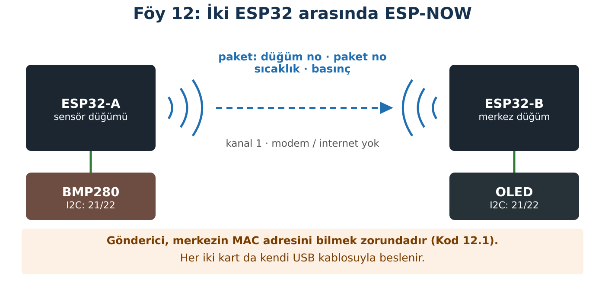

## Hedeflerim

Bu föyün sonunda:

- Bir ESP32'nin MAC adresini bulup gönderici koduna ekleyebilirim.
- Gönderici ile alıcının veri paketinin neden aynı olması gerektiğini açıklayabilirim.
- Paket kaybını paket numarasıyla ölçebilirim.
- Bağlantı koptuğunda eski verinin güncel sanılmasını önleyebilirim.

## Malzemeler

| Malzeme | Adet | Not |
| --- | --- | --- |
| ESP32 + USB kablo | 2 | İki grup birleşebilir |
| BMP280 | 1 | Gönderici |
| OLED | 1 | Alıcı |
| Breadboard, jumper | yeteri kadar |  |

## Kavram

**ESP-NOW**, ESP32'lerin modem ya da internet olmadan, doğrudan birbirine kısa mesajlar göndermesini sağlar. Her ESP32'nin fabrikada verilen, dünyada tek olan bir **MAC adresi** vardır; gönderici paketi bu adrese yollar. İki kart aynı Wi-Fi **kanalında** olmalıdır.

Gönderilen paket bir **struct**'tır: sırası ve türleri belli alanlardan oluşan bir kutu. Alıcı gelen baytları **aynı kalıba** yerleştirir. Kalıplar farklıysa baytlar yanlış kutulara düşer.

:::fen[Fen bağlantısı: Radyo dalgaları]
ESP-NOW, 2,4 GHz'lik radyo dalgalarıyla çalışır. Bu dalgalar duvarlardan, özellikle metal ve suyla dolu engellerden (insan vücudu dahil) geçerken zayıflar. Uzaklık ve engel arttıkça bazı paketler kaybolur. Paketlere sıra numarası verirsek kaybı **ölçebiliriz**.
:::

## Bağlantı



:::dikkat[Güç kutusu]
ESP32-A: BMP280, Föy 3'teki gibi. ESP32-B: OLED, Föy 2'deki gibi. Her kart kendi USB'siyle beslenir; kartlar arasında kablo yoktur.
:::

:::rutin[Bağladın mı?]
USB'yi takmadan önce **R2 Güç Kontrol Rutini**'ni uygula.
:::

## Etkinlik 1 — Merkezin Adresi

Kod 12.1'i **alıcı** olacak karta (ESP32-B) yükle.

```cpp title="Kod 12.1 — Foy12_MAC" start=1 dosya=Foy12_MAC
// FOY 12 - Kod 12.1: Kartimin MAC adresi
#include <WiFi.h>
#include <esp_mac.h>

void setup() {
  Serial.begin(115200);
  delay(1000);
  uint8_t mac[6];
  esp_read_mac(mac, ESP_MAC_WIFI_STA);   // Wi-Fi arayuzunun adresi

  Serial.print("MAC adresim: ");
  for (int i = 0; i < 6; i++) {
    if (mac[i] < 16) Serial.print("0");
    Serial.print(mac[i], HEX);
    if (i < 5) Serial.print(":");
  }
  Serial.println();

  Serial.print("Gonderici koduna kopyala: {");   // yazim hatasi olmasin
  for (int i = 0; i < 6; i++) {
    Serial.print("0x");
    if (mac[i] < 16) Serial.print("0");
    Serial.print(mac[i], HEX);
    if (i < 5) Serial.print(", ");
  }
  Serial.println("}");
}

void loop() {
}
```

|  |  |
| --- | --- |
| Merkezin MAC adresi: |  |
| Koda kopyalanacak satır: | { … , … , … , … , … , … } |

## Etkinlik 2 — Gönderici

### Tahminim

| Soru | Tahminim |
| --- | --- |
| Merkez **kapalıyken** gönderici Seri Monitör'e "gonderim sirasina alindi" mı yazar, "GONDERILEMEDI" mi? |  |
| Paket numarası kaçtan başlar ve her seferinde kaç artar? |  |

:::rutin[Yüklemeden önce]
**Satır 10:** Kod 12.1'in çıktısını buraya yapıştır. Sınıf finalinde **Satır 9**'teki düğüm numarası her gönderici için farklı olur.
:::

```cpp title="Kod 12.2 — Foy12_Gonderici (ESP32-A) — 1. bölüm (satır 1–51)" start=1 dosya=Foy12_Gonderici
// FOY 12 - Kod 12.2: Sensor dugumu (gonderici)
#include <WiFi.h>
#include <esp_now.h>
#include <esp_wifi.h>
#include <Wire.h>
#include <Adafruit_BMP280.h>

const int WIFI_KANAL = 1;
const int DUGUM_NO = 1;                  // bu dugumun numarasi
uint8_t merkezAdres[] = {0x24, 0x6F, 0x28, 0xAB, 0x4C, 0x90};  // Kod 12.1 ciktisini yapistir

typedef struct {                         // alicidakiyle AYNI olmali
  uint8_t dugumNo;
  uint32_t paketNo;
  float sicaklik;
  float basinc;
} SensorVerisi;

SensorVerisi veri;
Adafruit_BMP280 bmp;

void setup() {
  Serial.begin(115200);
  Wire.begin(21, 22);
  bool bulundu = bmp.begin(0x76);
  if (!bulundu) bulundu = bmp.begin(0x77);
  if (!bulundu) {
    Serial.println("HATA: BMP280 bulunamadi.");
    while (true) delay(100);
  }

  WiFi.mode(WIFI_STA);
  esp_wifi_set_channel(WIFI_KANAL, WIFI_SECOND_CHAN_NONE);
  if (esp_now_init() != ESP_OK) {
    Serial.println("HATA: ESP-NOW baslatilamadi.");
    while (true) delay(100);
  }

  esp_now_peer_info_t merkez = {};
  memcpy(merkez.peer_addr, merkezAdres, 6);
  merkez.channel = WIFI_KANAL;
  merkez.ifidx = WIFI_IF_STA;
  merkez.encrypt = false;
  if (esp_now_add_peer(&merkez) != ESP_OK) {
    Serial.println("HATA: Merkez eklenemedi. MAC adresini kontrol et.");
    while (true) delay(100);
  }
  veri.dugumNo = DUGUM_NO;
  veri.paketNo = 0;
}

```

### Kodun Mantığı (1. bölüm)

- **Satır 12:** Paketin kalıbı: düğüm no, paket no, sıcaklık, basınç.
- **Satır 33:** Kanalı sabitler; alıcıyla aynı olmalı.
- **Satır 44:** Merkezi "tanıdık" (eş) olarak ekler.

```cpp title="Kod 12.2 — Foy12_Gonderici (ESP32-A) — 2. bölüm (satır 52–66)" start=52 dosya=Foy12_Gonderici
void loop() {
  veri.paketNo++;
  veri.sicaklik = bmp.readTemperature();
  veri.basinc = bmp.readPressure() / 100.0;

  esp_err_t sonuc = esp_now_send(merkezAdres, (uint8_t*)&veri, sizeof(veri));
  Serial.print("Paket ");
  Serial.print(veri.paketNo);
  if (sonuc == ESP_OK) {
    Serial.println(" gonderim sirasina alindi.");
  } else {
    Serial.println(" GONDERILEMEDI.");
  }
  delay(2000);
}
```

### Kodun Mantığı (2. bölüm)

- **Satır 53:** Her pakete bir sonraki numarayı verir.
- **Satır 60:** ESP_OK, paketin **gönderim sırasına alındığını** söyler; ulaştığını değil. Ulaşıp ulaşmadığını alıcıdaki paket numaralarından anlarız.

## Etkinlik 3 — Merkez

### Tahminim

| Soru | Tahminim |
| --- | --- |
| Merkez çalışırken göndericiyi kapatıp yeniden açarsan **Kayıp** sayacı artar mı? Neden? |  |
| Gönderici kapalı kalırsa merkez ekranında kaç saniye sonra ne yazar? |  |

```cpp title="Kod 12.3 — Foy12_Alici (ESP32-B) — 1. bölüm (satır 1–56)" start=1 dosya=Foy12_Alici
// FOY 12 - Kod 12.3: Merkez dugum (alici + OLED)
#include <WiFi.h>
#include <esp_now.h>
#include <esp_wifi.h>
#include <Wire.h>
#include <Adafruit_GFX.h>
#include <Adafruit_SSD1306.h>

const int WIFI_KANAL = 1;
const unsigned long ZAMAN_ASIMI = 5000;  // ms: bu kadar paket gelmezse uyar

typedef struct {                         // gondericiyle AYNI olmali
  uint8_t dugumNo;
  uint32_t paketNo;
  float sicaklik;
  float basinc;
} SensorVerisi;

Adafruit_SSD1306 ekran(128, 64, &Wire, -1);
SensorVerisi gelen;                      // geri cagirma burayi doldurur
volatile bool yeniVeri = false;
portMUX_TYPE kilit = portMUX_INITIALIZER_UNLOCKED;

unsigned long sonPaketZamani = 0;
uint32_t sonPaketNo = 0;
uint32_t alinan = 0;
uint32_t kayip = 0;

// Paket gelince Wi-Fi tarafindan cagrilir: kisa tut, yalniz kopyala
void veriGeldi(const esp_now_recv_info_t *bilgi, const uint8_t *paket, int uzunluk) {
  if (uzunluk != sizeof(SensorVerisi)) return;   // boyut uymuyorsa alma
  portENTER_CRITICAL(&kilit);
  memcpy(&gelen, paket, sizeof(gelen));
  yeniVeri = true;
  portEXIT_CRITICAL(&kilit);
}

void setup() {
  Serial.begin(115200);
  Wire.begin(21, 22);
  if (!ekran.begin(SSD1306_SWITCHCAPVCC, 0x3C)) {
    Serial.println("HATA: OLED baslatilamadi.");
    while (true) delay(100);
  }
  ekran.setTextColor(SSD1306_WHITE);

  WiFi.mode(WIFI_STA);
  esp_wifi_set_channel(WIFI_KANAL, WIFI_SECOND_CHAN_NONE);
  if (esp_now_init() != ESP_OK) {
    Serial.println("HATA: ESP-NOW baslatilamadi.");
    while (true) delay(100);
  }
  esp_now_register_recv_cb(veriGeldi);
  Serial.println("Merkez hazir, paket bekleniyor.");
}

```

### Kodun Mantığı (1. bölüm)

- **Satır 30:** Paket gelince Wi-Fi tarafından **kendiliğinden** çağrılır (geri çağırma). İçinde uzun iş yapılmaz; yalnız kopyalanır ve bayrak kaldırılır.
- **Satır 31:** Boyutu tutmayan paketi almaz.

```cpp title="Kod 12.3 — Foy12_Alici (ESP32-B) — 2. bölüm (satır 57–103)" start=57 dosya=Foy12_Alici
void loop() {
  if (yeniVeri) {
    SensorVerisi v;
    portENTER_CRITICAL(&kilit);          // kopyalarken araya paket girmesin
    v = gelen;
    yeniVeri = false;
    portEXIT_CRITICAL(&kilit);

    if (sonPaketNo != 0 && v.paketNo > sonPaketNo + 1) {
      kayip += v.paketNo - sonPaketNo - 1;          // atlanan numaralar
    }
    sonPaketNo = v.paketNo;
    alinan++;
    sonPaketZamani = millis();

    Serial.print("Dugum "); Serial.print(v.dugumNo);
    Serial.print("  paket "); Serial.print(v.paketNo);
    Serial.print("  T="); Serial.print(v.sicaklik, 1);
    Serial.print(" C  P="); Serial.print(v.basinc, 1);
    Serial.print(" hPa  kayip="); Serial.println(kayip);

    ekran.clearDisplay();
    ekran.setTextSize(1);
    ekran.setCursor(0, 0);
    ekran.print("Dugum ");  ekran.print(v.dugumNo);
    ekran.print("  #");     ekran.println(v.paketNo);
    ekran.setTextSize(2);
    ekran.setCursor(0, 14);
    ekran.print(v.sicaklik, 1);  ekran.println(" C");
    ekran.setTextSize(1);
    ekran.setCursor(0, 38);
    ekran.print(v.basinc, 1);    ekran.println(" hPa");
    ekran.print("Alinan "); ekran.print(alinan);
    ekran.print(" Kayip "); ekran.println(kayip);
    ekran.display();
  }

  if (alinan > 0 && millis() - sonPaketZamani > ZAMAN_ASIMI) {
    ekran.clearDisplay();
    ekran.setTextSize(2);
    ekran.setCursor(0, 20);
    ekran.println("BAGLANTI");
    ekran.println("YOK");
    ekran.display();
    delay(200);
  }
}
```

### Kodun Mantığı (2. bölüm)

- **Satır 60:** Kopyalarken araya yeni paket girip verinin yarısı eski, yarısı yeni olmasın diye kısa bir kilit kullanılır.
- **Satır 66:** 5'ten sonra 8 geldiyse 6 ve 7 kaybolmuştur: 8 − 5 − 1 = 2.
- **Satır 94:** 5 s paket gelmezse ekranda "BAGLANTI YOK" yazar; eski değer güncel sanılmaz.

## Deney — Paket Kaybı

Her konumda **30 paket** (≈ 1 dakika) bekle; alınan ve kayıp sayılarını not al. Kayıp oranı = kayıp ÷ (alınan + kayıp) × 100.

| Konum | Tahminim (%) | Alınan | Kayıp | Kayıp oranı (%) |
| --- | --- | --- | --- | --- |
| Aynı masa, 1 m |  |  |  |  |
| Sınıfın öbür ucu |  |  |  |  |
| Arada bir duvar |  |  |  |  |
| Arada 3 kişi duruyor |  |  |  |  |
| Gönderici kapatıldı |  | — | — | ekranda ne var? |

## Kodu Tamamla

Bu kodun **büyük bölümü hazır** (klasör: Foy12_Bosluk). Yalnız numaralı boşlukları (`___1___` gibi) doldur. Önce her boşluğa ne yazacağını **kâğıtta tahmin et**, sonra dosyada yaz, yükle ve çalıştır. Derleyici hata verirse mesaj sana ipucu verir.

```cpp title="Kod 12.5 — Foy12_Bosluk (boşluklu; kodun geri kalanı klasörde hazır)" start=21 dosya=Foy12_Bosluk
void veriGeldi(const esp_now_recv_info_t *bilgi, const uint8_t *paket, int uzunluk) {
  if (uzunluk != ___1___) return;  // boyut uymuyorsa paketi alma
  memcpy(&gelen, paket, sizeof(gelen));
  yeniVeri = true;
}

void setup() {
  Serial.begin(115200);
  WiFi.mode(WIFI_STA);
  esp_wifi_set_channel(WIFI_KANAL, WIFI_SECOND_CHAN_NONE);
  if (esp_now_init() != ___2___) {  // basarili baslatma sonucu
    Serial.println("HATA: ESP-NOW baslatilamadi.");
    while (true) delay(100);
  }
  esp_now_register_recv_cb(___3___);  // paket gelince cagrilacak fonksiyon
  Serial.println("Alici hazir.");
}

void loop() {
  if (yeniVeri) {
    yeniVeri = false;
    if (sonPaketNo != 0 && gelen.paketNo > sonPaketNo + ___4___) {
      kayip += gelen.paketNo - sonPaketNo - ___5___;  // atlanan paket sayisi
    }
    sonPaketNo = gelen.___6___;
    Serial.print("paket ");
    Serial.print(gelen.paketNo);
    Serial.print("  kayip ");
    Serial.println(kayip);
  }
}
```

| Boşluk | Ne yazacağım? | İpucu |
| --- | --- | --- |
| `___1___` |  | Gelen paketin uzunluğu, struct'ın boyuna eşit olmalı. Boyutu veren işlem: sizeof(...) |
| `___2___` |  | esp_now_init() başarılı olursa ne döndürür? |
| `___3___` |  | Paket gelince kendiliğinden çağrılacak fonksiyonun adı (parantezsiz). |
| `___4___` |  | Beklenen sıradaki paket sonPaketNo + 1'dir. Fark bundan büyükse paket atlanmıştır. |
| `___5___` |  | Atlanan paket sayısı = paketNo − sonPaketNo − ? |
| `___6___` |  | Son gelen paketin numarasını tutan struct alanı. |

**Sorgula:** Paket numaraları 5, 6, 9, 10 geldi. Kayıp sayacı kaç olur? İşlemini yaz.

::yaz{satir=2}

## Hata Avcısı

| Belirti | Olası neden | Ne yaparım? |
| --- | --- | --- |
| Derleme hatası: esp_now_recv_info_t | Eski kart paketi (2.x) | Kit ve Sürüm Tablosu'ndaki sürümü kur. |
| "Merkez eklenemedi" | MAC yanlış yazılmış | Kod 12.1 çıktısını yeniden kopyala. |
| Hiç paket gelmiyor | MAC yanlış; kanallar farklı | MAC ve WIFI_KANAL. |
| Değerler anlamsız (ör. 1008 °C) | İki taraftaki struct farklı | İki kodun typedef bölümünü satır satır karşılaştır. |

### Bilerek hatalı kod

Merkez paketleri alıyor, paket numaraları doğru; ama ekranda sıcaklık **1008,3 °C**, basınç **23,9 hPa** görünüyor. Gönderici Kod 12.2'den tek bir yerde farklı.

```cpp title="Kod 12.4 — Foy12_Hatali (gönderici)" start=1 dosya=Foy12_Hatali
// FOY 12 - Hata Avcisi: Bu kodda bilerek birakilmis bir hata var!
#include <WiFi.h>
#include <esp_now.h>
#include <esp_wifi.h>
#include <Wire.h>
#include <Adafruit_BMP280.h>

const int WIFI_KANAL = 1;
const int DUGUM_NO = 1;                  // bu dugumun numarasi
uint8_t merkezAdres[] = {0x24, 0x6F, 0x28, 0xAB, 0x4C, 0x90};  // Kod 12.1 ciktisini yapistir

typedef struct {                         // alicidakiyle AYNI olmali
  uint8_t dugumNo;
  uint32_t paketNo;
  float basinc;
  float sicaklik;
} SensorVerisi;

SensorVerisi veri;
Adafruit_BMP280 bmp;

void setup() {
  Serial.begin(115200);
  Wire.begin(21, 22);
  bool bulundu = bmp.begin(0x76);
  if (!bulundu) bulundu = bmp.begin(0x77);
  if (!bulundu) {
    Serial.println("HATA: BMP280 bulunamadi.");
    while (true) delay(100);
  }

  WiFi.mode(WIFI_STA);
  esp_wifi_set_channel(WIFI_KANAL, WIFI_SECOND_CHAN_NONE);
  if (esp_now_init() != ESP_OK) {
    Serial.println("HATA: ESP-NOW baslatilamadi.");
    while (true) delay(100);
  }

  esp_now_peer_info_t merkez = {};
  memcpy(merkez.peer_addr, merkezAdres, 6);
  merkez.channel = WIFI_KANAL;
  merkez.ifidx = WIFI_IF_STA;
  merkez.encrypt = false;
  if (esp_now_add_peer(&merkez) != ESP_OK) {
    Serial.println("HATA: Merkez eklenemedi. MAC adresini kontrol et.");
    while (true) delay(100);
  }
  veri.dugumNo = DUGUM_NO;
  veri.paketNo = 0;
}

void loop() {
  veri.paketNo++;
  veri.sicaklik = bmp.readTemperature();
  veri.basinc = bmp.readPressure() / 100.0;

  esp_err_t sonuc = esp_now_send(merkezAdres, (uint8_t*)&veri, sizeof(veri));
  Serial.print("Paket ");
  Serial.print(veri.paketNo);
  if (sonuc == ESP_OK) {
    Serial.println(" gonderim sirasina alindi.");
  } else {
    Serial.println(" GONDERILEMEDI.");
  }
  delay(2000);
}
```

**Hata:** Hangi bölümde ne değişmiş? Alıcı baytları neden yanlış yere koydu?

::yaz{satir=3}

## Sınıf Finali

Bir merkez ve dört sensör düğümü. Her düğümün DUGUM_NO'su farklı (1–4); hepsi merkezin MAC adresine gönderir.

## Şimdi Sıra Sende

- [ ] **Görev (herkes):** Kendi düğümünü merkeze bağla ve merkez ekranında düğüm numaranı gör.
- [ ] **★ Görev (merkez grubu):** Kayıp sayacı şu an tek bir düğüm için doğru çalışır. Dört düğüm için her düğümün son paket numarasını ayrı tutan bir **dizi** kullan.
- [ ] **★★ Görev (merkez grubu):** Ekranda dört düğümün son sıcaklıklarını alt alta göster; 5 s'dir veri gelmeyen düğümün yanına "--" yaz.

## YZ ile Destek Al

:::yz[Örnek istem]
"ESP-NOW ile 1 merkez ve 4 sensör düğümü kuruyorum. Her düğümün paket kaybını ayrı ayrı nasıl izleyebileceğimi, kod yazmadan, adım adım bir algoritma olarak anlat."
:::

### YZ cevabını nasıl doğruladım?

::yaz[YZ'nin algoritmasındaki ana fikir:]{satir=2}

::yaz[Kendi kodumda bunu nasıl uyguladım?]{satir=2}

::yaz[Test sonucum:]{satir=2}

## Kendimi Kontrol Ediyorum

**1.** Gönderici ESP_OK aldı. Bu, paketin merkeze ulaştığını gösterir mi? Ulaştığını nasıl anlarız?

::yaz{satir=2}

**2.** Merkez 12, 13, 17, 18 numaralı paketleri aldı. Kaç paket kayboldu?

::yaz{satir=2}

**3.** Zaman aşımı olmasaydı gönderici kapandığında merkez ekranı ne gösterirdi? Bu bir sera ya da alarm sisteminde neden sorun olur?

::yaz{satir=3}

**4.** Geri çağırma fonksiyonunun içinde neden ekrana yazmıyoruz?

::yaz{satir=2}

### Öz değerlendirme

- [ ] MAC adresini bulup koda doğru ekleyebiliyorum.
- [ ] Veri paketinin iki tarafta aynı olmasının önemini açıklayabiliyorum.
- [ ] Paket kaybını ölçüp oran hesaplayabiliyorum.
- [ ] Zaman aşımıyla bağlantı kopmasını gösterebiliyorum.
