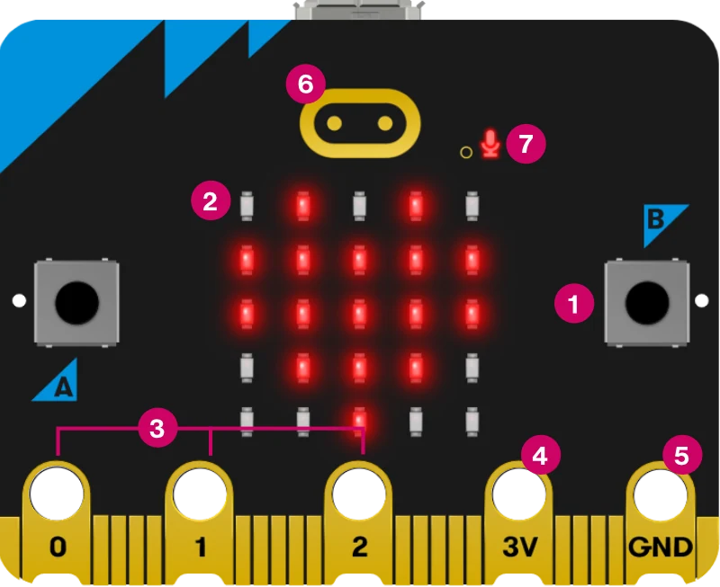
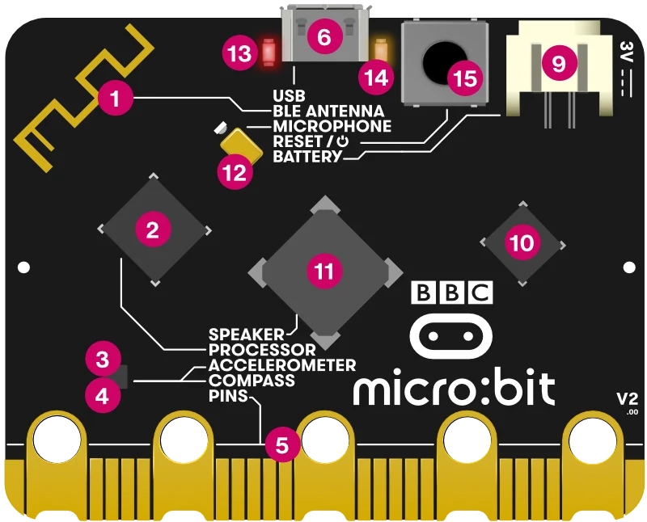

Kartı eline al. Ön ve arka yüzü ayrı ayrı incele; numaralar her yüzde yeniden başlar.

## Ön yüzde bul

1. **1 · A ve B düğmeleri:** komut başlatır.
2. **2 · 5 × 5 LED ekranı:** yazı ve şekil gösterir.
3. **3 · P0, P1, P2:** dış parçalar için bağlantı uçları.
4. **4 · 3V, 5 · GND:** küçük devreye güç ve dönüş yolu.
5. **6 · Dokunmatik logo:** bir başka giriş.
6. **7 · Ses deliği ve ışığı:** mikrofon çalışırken ışık yanar.

## Arka yüzde bul

1. **6 · USB girişi:** kodu karta aktarırsın. Bu, arka yüzün 6 numarasıdır.
2. **11 · Hoparlör:** sesi dışarı verir.
3. **12 · Mikrofon:** sesi algılar.

Alt kenardaki altın bağlantıları harici parça projelerinde öğreneceksin.

:::bilgi[Bul]
Kendi kartında A düğmesini, LED ekranını ve USB girişini göster.
:::

:::bilgi[Düşün]
Mikrofon ile hoparlörün görevleri nasıl farklı?
:::

Kart görselleri: Micro:bit Educational Foundation, “Features: Overview”, CC BY-SA 4.0. Kitap bağımsızdır; Vakıf tarafından onaylanmamıştır.
