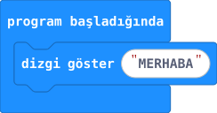
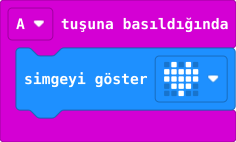
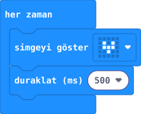
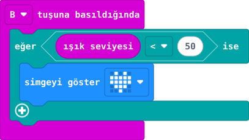

Blokları birleştirerek micro:bit’e ne yapacağını söylersin.

:::bilgi[Önce tahmin et]
“A tuşuna basıldığında” bloğu ne zaman çalışır?
:::

## 1 · Başlangıç

Program her başladığında (kart açıldığında, sıfırlandığında veya yeni kod yüklendiğinde) **bir kez** çalışır. İlk hazırlıkları buraya koyarsın.

## 2 · Olay

Bir şey olduğunda çalışır. Bu örnekte A’ya basmak kalbi gösterir.

## 3 · Döngü

İçindeki işi **yeniden yeniden** yapar. Bekleme bloğu hızı ayarlar.

## 4 · Koşul

“Eğer … ise” diye karar verir. Koşul doğruysa içindeki blok çalışır.

:::bilgi[Düşün]
“Her zaman” içinde neden bekleme bloğu koyarız?
:::

:::bilgi[İlk adım]
[1. projede](proje:1) A tuşuyla kendi adını ekranda göstereceksin.
:::
