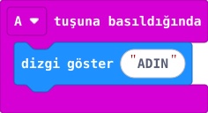

## Önce tahmin et

:::tahmin
A düğmesine iki kez basarsan adın kaç kez görünür?
:::

::yaz[Tahminim]{satir=1}

## Yap

1. [makecode.microbit.org](https://makecode.microbit.org/) adresini aç. **Yeni Proje** seç.
2. **Giriş (Input)** bölümünden **“A tuşuna basıldığında”** bloğunu çalışma alanına taşı.
3. **Temel (Basic)** bölümünden **“dizgi göster”** bloğunu A bloğunun içine yerleştir.
4. Bloktaki **“Hello!”** yazısını kendi adınla değiştir.
5. Simülatörde A’ya iki kez bas. Sonucu gözle.

## Kartında dene

**1.** micro:bit’i veri USB kablosuyla bilgisayara bağla.

**2.** **İndir (Download)** düğmesine bas. Bağlanma penceresi açılırsa kartını seçip **Bağlan** de; aktarım tamamlanana kadar bekle.

**3.** Kartında A’ya iki kez bas. Adının kaç kez aktığını say.

::jest[Bas → oku]{tuslar="A"}

:::olmadiysa
İnen **.hex** dosyasını **MICROBIT** sürücüsüne sürükle. Kart görünmüyorsa yalnız şarj eden kablo yerine veri USB kablosu dene.
:::

## Anlat

::yaz[**Gözlemim:** İki basışta adım \_\_\_\_ kez göründü.]{satir=2}

::yaz[**Neden?** A düğmesi kodu ne zaman çalıştırıyor?]{satir=2}

## Tek şeyi değiştir

Adın yerine kısa bir sözcük yaz. A’ya yeniden bas. Yazının akışında ne değişti?

::yaz[Ne değişti?]{satir=2}
