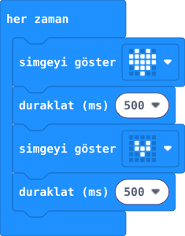

## Önce tahmin et

:::tahmin
Kalpler yalnız bir kez mi, sürekli mi değişecek?
:::

::yaz[Tahminim]{satir=1}

## Yap

1. MakeCode’da **Yeni Proje** aç. Hazır gelen **“her zaman”** bloğunu kullan.
2. **Temel** bölümünden iki **“simgeyi göster”** bloğunu bunun içine koy: önce büyük, sonra küçük kalp seç.
3. Her kalbin altına birer **“duraklat (ms) 500”** bloğu ekle. 500 ms yarım saniyedir.
4. Simülatörde kalplerin sırasını izle.

## Kartında dene

**1.** Kartı veri USB kablosuyla bağla; **İndir** ile kodu aktar.

**2.** İki kalbin hangi sırayla göründüğünü izle.

::jest[Büyük → küçük → tekrar]{tuslar="♥"}

:::olmadiysa
İki simgeyi ve iki bekleme bloğunu **“her zaman”** bloğunun içinde gördüğünden emin ol.
:::

## Anlat

::yaz[**Gözlemim:** Önce \_\_\_\_\_\_\_\_\_\_ kalp göründü.]{satir=2}

::yaz[**Neden?** Kalpler neden yeniden görünüyor?]{satir=2}

## Tek şeyi değiştir

İki beklemeyi de **1000 ms** yap. Kalbin ritmi nasıl değişti?

::yaz[Ne değişti?]{satir=2}
