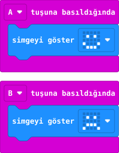

## Önce tahmin et

:::tahmin
Önce A’ya, sonra B’ye basarsan ekranda en son hangi yüz kalır?
:::

::yaz[Tahminim]{satir=1}

## Yap

1. MakeCode’da **Yeni Proje** aç. **Giriş** bölümünden iki **“tuşuna basıldığında”** bloğu al.
2. İlk blokta **A**, ikinci blokta **B** seç.
3. Her bloğun içine birer **“simgeyi göster”** bloğu koy. A için mutlu, B için üzgün yüz seç.
4. Simülatörde A’ya, sonra B’ye bas.

## Kartında dene

**1.** Kodu kartına aktar.

**2.** A’ya bas; çıkan yüzü incele. Sonra B’ye bas.

::jest[Mutlu → üzgün]{tuslar="A,B"}

:::olmadiysa
İki olay bloğunun da çalışma alanında ve her birinin içinde bir simge bloğu olduğuna bak.
:::

## Anlat

::yaz[**Gözlemim:** B’den sonra ekranda \_\_\_\_\_\_\_\_\_\_ yüz kaldı.]{satir=2}

::yaz[**Neden?** Hangi düğme hangi kodu çalıştırdı?]{satir=2}

## Tek şeyi değiştir

B’nin yüzünü başka bir simgeyle değiştir. A’ya basınca ne oldu?

::yaz[Ne değişti?]{satir=2}
