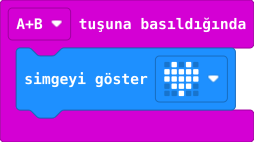

## Önce tahmin et

:::tahmin
Yalnız A’ya basarsan yıldız görünür mü?
:::

::yaz[Tahminim]{satir=1}

## Yap

1. MakeCode’da **Yeni Proje** aç.
2. **Giriş** bölümünden **“tuşuna basıldığında”** bloğunu al; açılır menüde **A+B** seç.
3. İçine **“simgeyi göster”** bloğu koy ve yıldızı seç.
4. Simülatörde önce A’ya tek başına, sonra **A+B** düğmelerine birlikte bas.

## Kartında dene

**1.** Kodu kartına aktar.

**2.** Önce A’ya tek bas; sonra iki düğmeye aynı anda bas.

::jest[Birlikte → ★]{tuslar="A,B"}

:::olmadiysa
Olay bloğunun menüsünde **A+B** seçildiğini kontrol et.
:::

## Anlat

::yaz[**Gözlemim:** Yalnız A’ya basınca \_\_\_\_\_\_\_\_\_\_.]{satir=2}

::yaz[**Neden?** Yıldızın görünmesi için hangi düğmeler gerekli?]{satir=2}

## Tek şeyi değiştir

Yıldız yerine kalp seç. A+B’ye basınca ne değişti?

::yaz[Ne değişti?]{satir=2}
