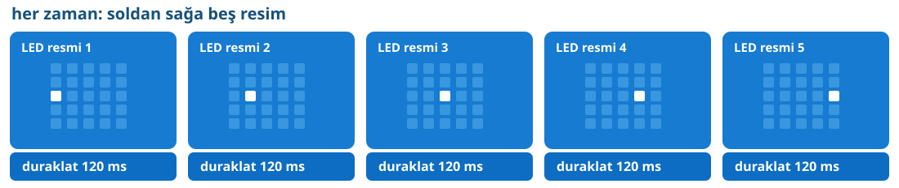

## Önce tahmin et

:::tahmin
Yan yana beş LED sırayla yanarsa nokta kayıyor gibi görünür mü?
:::

::yaz[Tahminim]{satir=1}

## Yap

1. Yeni projede hazır gelen **“her zaman”** bloğunu kullan.
2. İçine beş **“led’leri göster”** bloğu ekle. Orta sırada soldan sağa ilerleyen beş komşu LED’i sırayla, her resimde yalnız birini yak.
3. Her resmin altına **“duraklat (ms) 120”** ekle.
4. Simülatörde ışık noktasını izle.

## Kartında dene

Kodu kartına aktar. Nokta soldan sağa gidip başa dönüyor gibi görünüyor mu?

:::olmadiysa
Her resimde yalnız bir LED yak; beş beklemeyi **“her zaman”** içinde tut. Nokta zıplıyor gibiyse 80–150 ms dene.
:::

## Anlat

::yaz[**Gözlemim:** Nokta bana \_\_\_\_\_\_\_\_\_\_ gibi göründü.]{satir=2}

::yaz[**Neden?** Ekranda gerçekten kayan bir LED mi var, yoksa beş resim mi değişiyor?]{satir=2}

## Tek şeyi değiştir

Beş beklemeyi **600 ms** yap. Hareket görünümü nasıl değişti? Sonra 120 ms’ye dön.

::yaz[Ne değişti?]{satir=2}
