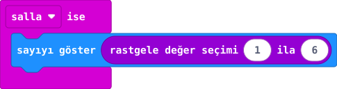

## Önce tahmin et

:::tahmin
İki sallamada aynı sayı gelebilir mi?
:::

::yaz[Tahminim]{satir=1}

## Yap

1. Yeni projede **Giriş** bölümünden **“salla ise”** bloğunu al.
2. İçine **Temel** bölümündeki **“sayıyı göster”** bloğunu yerleştir.
3. **Matematik** bölümünden **“rastgele değer seçimi 1 ila 6”** bloğunu sayı yerine tak.
4. Simülatörde sallama düğmesini birkaç kez kullan; sayıları kaydet.

## Kartında dene

**1.** Kodu kartına aktar.

**2.** Kartı USB kablosunu germeden kısa ve hızlı biçimde salla. Üç sonucu sırayla not et.

::yaz[Kartta gördüğüm sayılar]{satir=1}

:::olmadiysa
Kartı salladığında olayın başladığını ve rastgele bloğun **“sayıyı göster”** içinde olduğunu kontrol et.
:::

## Anlat

::yaz[**Gözlemim:** Gördüğüm sayılardan biri: \_\_\_\_\_\_\_\_.]{satir=2}

::yaz[**Neden?** Aynı sayı yeniden gelirse kod bozulmuş olur mu?]{satir=2}

## Tek şeyi değiştir

Üst sınırı **6** yerine **3** yap. Şimdi hangi sayılar gelebilir?

::yaz[Ne değişti?]{satir=2}
