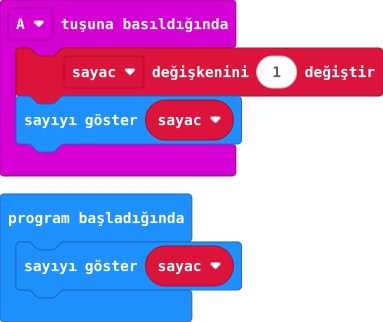

## Önce tahmin et

:::tahmin
Başlangıçta 0 görürsen A’ya üç kez basınca hangi sayı görünür?
:::

::yaz[Tahminim]{satir=1}

## Yap

1. Yeni projede **Değişkenler** bölümünden **sayac** adlı değişkeni oluştur. Değişken, sayıyı saklayan bir kutu gibidir.
2. Yeni değişken ilk başta **0** değerindedir. **“program başladığında”** alanında **“sayıyı göster”** bloğuna **sayac** değişkenini tak.
3. **Giriş** bölümünden **“A tuşuna basıldığında”** bloğunu al. İçine **“sayac değişkenini 1 değiştir”**, ardından **“sayıyı göster sayac”** koy.
4. Simülatörde A’ya üç kez bas ve sayıları sırayla izle.

## Kartında dene

Kodu karta aktar. Önce ekrana bak, sonra A’ya üç kez bas.

::sira[0 → 1 → 2 → 3]

:::olmadiysa
“sayıyı göster” içine sabit sayı yerine **sayac** değişkenini koyduğunu kontrol et.
:::

## Anlat

::yaz[**Gözlemim:** Üç basıştan sonra ekranda \_\_\_\_\_\_ göründü.]{satir=2}

::yaz[**Neden?** Hangi blok önce sayıyı değiştiriyor?]{satir=2}

## Tek şeyi değiştir

**1 değiştir** değerini **2** yap. Üç basışın sayıları ne oldu?

::yaz[Ne değişti?]{satir=2}
