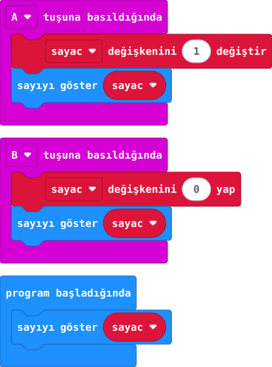

## Önce tahmin et

:::tahmin
A’ya iki kez, sonra B’ye basarsan ekranda ne görürsün?
:::

::yaz[Tahminim]{satir=1}

## Yap

1. **Basış sayacı** projesini aç. **1 değiştir** değerini [önceki projedeki](proje:7) denemede değiştirdiysen yeniden **1** yap.
2. Yeni bir **“B tuşuna basıldığında”** bloğu ekle.
3. B bloğunun içine **“sayac değişkenini 0 yap”** ve **“sayıyı göster sayac”** bloklarını sırayla koy.
4. Simülatörde A, A, B ve tekrar A’ya bas. Ekranı her adımda oku.

## Kartında dene

Kodu karta aktar. A’ya iki kez, B’ye bir kez, sonra A’ya bir kez bas.

::sira[1 → 2 → (B) → 0 → (A) → 1]

:::olmadiysa
B olayında **sayac = 0** ve hemen ardından sayıyı gösterme blokları var mı?
:::

## Anlat

::yaz[**Gözlemim:** B’ye bastığımda \_\_\_\_\_\_ göründü.]{satir=2}

::yaz[**Neden?** B’den sonraki A basışı neden 1 gösterdi?]{satir=2}

## Tek şeyi değiştir

B’nin **0 yap** değerini **5** yap. Ardından A’ya basınca kaç göründü?

::yaz[Ne değişti?]{satir=2}
