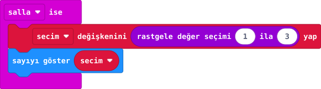
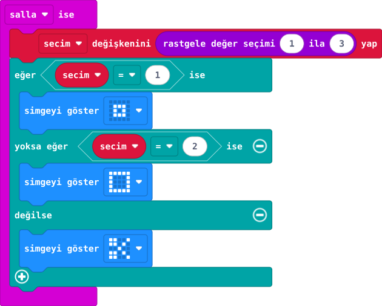

## 1. kısım — Rastgele seçimi hazırla

Oyunun ilk parçasını kur: kart sallanınca 1, 2 ya da 3 seçsin. Sonraki kısımda sayıları simgelere dönüştüreceksin.

::kunye{sure="10" fikir="seçimi saklama" malzeme="micro:bit V2 + veri USB kablosu"}

### Önce tahmin et

:::tahmin
İki sallamada aynı sayı seçilebilir mi?
:::

::yaz[Tahminim]{satir=1}

### Yap

1. Yeni projede **secim** adlı değişkeni oluştur.
2. **“salla ise”** bloğuna **“secim değişkenini ... yap”** bloğunu ekle.
3. Değeri, **“rastgele değer seçimi 1 ila 3”** bloğuyla doldur.
4. Altına **“sayıyı göster secim”** ekle. Simülatörde birkaç kez salla.

### Kartında dene

Kodu karta aktar. Kartı kısa ve hızlı biçimde üç kez salla; her sayıyı not et.

::yaz[Kartta gördüğüm sayılar]{satir=1}

:::olmadiysa
Rastgele bloğun **1 ila 3** seçtiğini ve **secim** bloğunun içinde olduğunu kontrol et.
:::

### Anlat

::yaz[**Gözlemim:** Gördüğüm sayılar: \_\_\_\_, \_\_\_\_, \_\_\_\_.]{satir=2}

::yaz[**Neden?** Seçilen sayı hangi değişkende saklanıyor?]{satir=2}

### Tek şeyi değiştir

Üst sınırı geçici olarak **2** yap. Hangi sayılar gelebilir? Sonra **3**'e dön.

::yaz[Ne değişti?]{satir=2}

## 2. kısım — Sayıdan simgeye

Sallanınca seçilen sayı taş, kâğıt veya makas simgesine dönüşsün.

::kunye{sure="10" fikir="koşulla seçim" malzeme="micro:bit V2 + veri USB kablosu"}

### Önce tahmin et

:::tahmin
Seçilen sayı 3 olursa ilk iki koşul doğru çıkar mı?
:::

::yaz[Tahminim]{satir=1}

### Yap

1. Önceki projeyi aç; **“sayıyı göster”** bloğunu kaldır.
2. **Mantık** bölümünden **“eğer / yoksa eğer / değilse”** kur. İlk iki koşul **secim = 1** ve **secim = 2** olsun.
3. Kollara sırayla **küçük kare**, **büyük kare** ve **makas** simgelerini koy. Simülatörde salla.

:::bilgi[Sayı → oyun işareti]
- 1 → küçük kare: taş
- 2 → büyük kare: kâğıt
- 3 → makas simgesi
:::

### Anlat

::yaz[**Gözlemim:** Gördüğüm simgeler: \_\_\_\_\_\_\_\_\_\_, \_\_\_\_\_\_\_\_\_\_, \_\_\_\_\_\_\_\_\_\_.]{satir=2}

::yaz[**Neden?** Seçim 3 olduğunda hangi bölüm çalışır?]{satir=2}

### Oyunu tamamla

Bir arkadaşınla iki kartı karşılaştır: taş makası, makas kâğıdı, kâğıt taşı yener. Aynı simge gelirse berabere. Sonra taş simgesini değiştirip hangi seçimin etkilendiğini izle.

::yaz[Notum]{satir=2}
